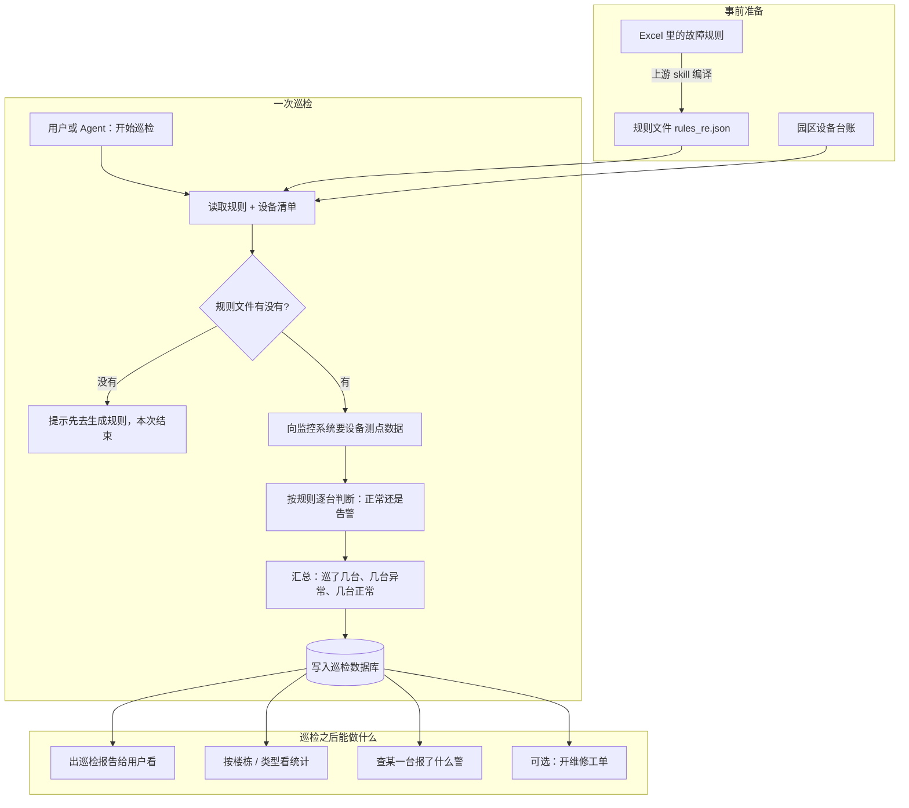
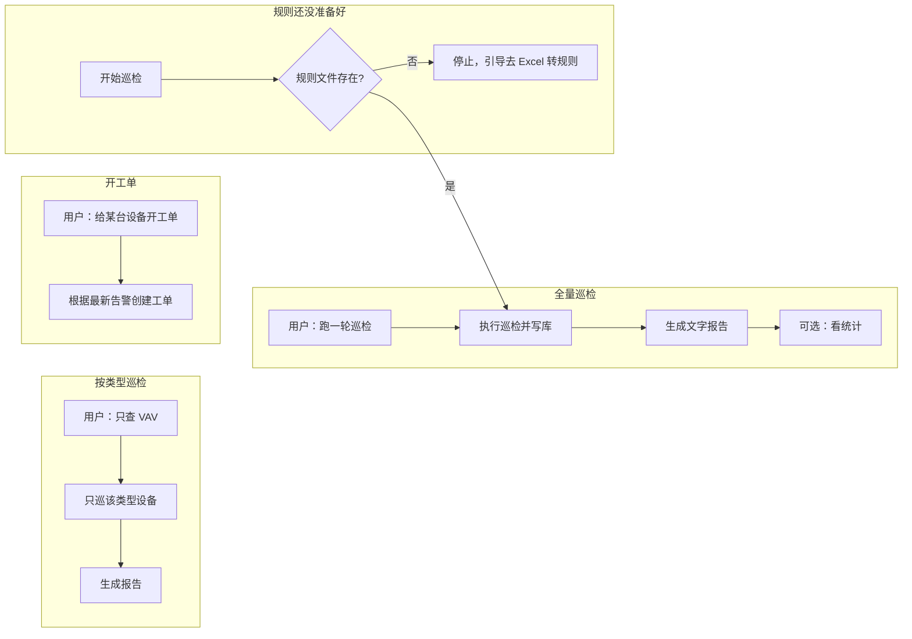
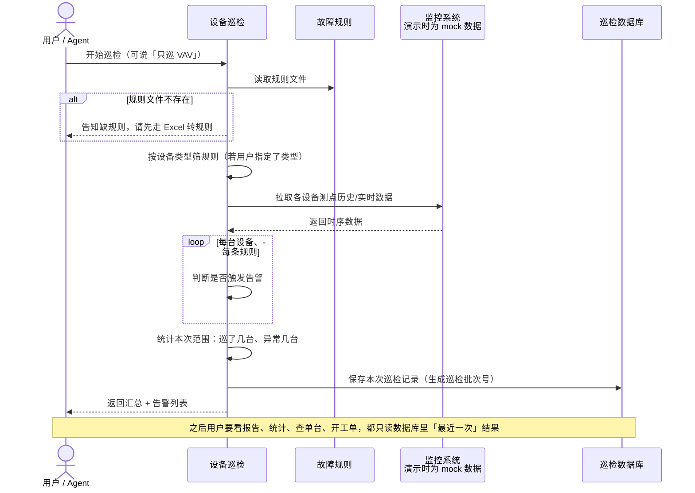
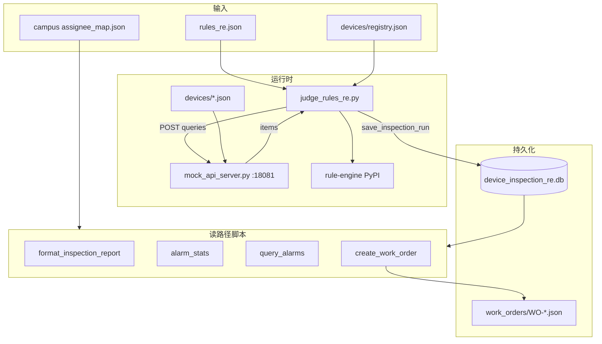

# device-inspection-re Skill 实现设计文档（v1.1）

## 文档信息

| 项目 | 内容 |
|---|---|
| Story 编号 | 待开发者补充 |
| Story 名称 | 设备巡检（rules_re.json / rule-engine）写库、报告与工单 |
| 负责人 | 待开发者补充 |
| 创建日期 | 2026-06-17 |
| 版本 | v1.2 (业务流图 + 开发附录) |
| 代码路径 | `.campusclaw/skills/device-inspection-re/` |
| 上游 Skill | `excel-antlr-to-rules-json` → `rules_re.json` |
| 下游 Skill | `campus-device-ops`（只读同一 DB，ADR-0006） |

> 三 skill 协作总览见 [openclaw-device-skills.md](../../../docs/designs/openclaw-device-skills.md)。  
> 决策记录见 [ADR-0006](../../../docs/decisions/0006-shared-inspection-sqlite-db.html)。

---

## 1. Story 背景

### 1.1 需求来源

园区机电设备（VAV、新风机、送排风、冷水机等）的故障规则已由业务维护在 Excel，并经 **excel-antlr-to-rules-json** 编译为 `rules_re.json`。本 skill 负责在 Agent 对话场景中：

1. 拉取设备时序数据（生产对接 BMS/IoT；demo 对接 `:18081/fetch` mock）；
2. 用 PyPI **rule-engine** 对每条规则求值；
3. 将告警持久化到 **device_inspection_re.db**（唯一写库方）；
4. 向用户展示巡检报告、聚合统计，并可选生成维修工单 JSON。

### 1.2 需求背景/价值/详情

**背景：** 旧版 `device-inspection` skill 使用另一套 judge 与规则格式，与 Excel 编译链路脱节；且若 campus 侧维护独立 DB，runId 与告警无法与运维 skill 对齐。

**用户 / Agent 典型场景：**

| 场景 | 用户说法 | Skill 行为 |
|------|----------|------------|
| 全量巡检 | 「跑一轮巡检」 | `judge_rules_re.py --json` → 写库 → 可选报告 |
| 分类型巡检 | 「只查 VAV」 | `--device-type VAV` → 只判 VAV 规则；范围台数=registry 中 VAV 台数 |
| 看报告 | 「巡检结果怎么样」 | `format_inspection_report.py --markdown` |
| 看统计 | 「按楼栋统计故障」 | `alarm_stats.py --json` |
| 查单设备 | 「VAV_003 怎么了」 | `query_alarms.py --device-id VAV_003` |
| 开工单 | 「给 EF_001 开工单」 | `create_work_order.py` |
| 规则缺失 | 无 rules_re.json | exit 1 + `rules_not_found` + **终止 skill** |

**价值摘要：**

| 能力 | 实现要点 |
|------|----------|
| 规则驱动巡检 | 只消费 `rules_re.json`，`trigger.rule_engine` 禁止手写 |
| 写库 + 读库一体 | 本 skill 内完成巡检展示，无需切 skill |
| 分类型与范围统计 | `deviceTypeFilter` 入库；`inspectionSummary` 区分「此次范围」与全园区 |
| 设备 ID 规范化 | registry canonical ID（`VAV_001`）+ legacy 别名映射 |
| 可演示 | mock 时序 + SQLite；fresh clone 可跑 |

### 1.3 关联需求

| 关联 | 关系 | 路径 / 说明 |
|---|---|---|
| excel-antlr-to-rules-json | 上游 | 产出 `rules_re.json` |
| campus-device-ops | 下游只读 | 共享 DB；同步脚本见 `SYNCED_SCRIPTS.md` |
| [ADR-0006](../../../docs/decisions/0006-shared-inspection-sqlite-db.html) | 架构决策 | 单写多读 SQLite |
| `templates/schema.mysql.sql` | 生产 DDL 参考 | MySQL 8.0+ |
| `templates/schema.sql` | 生产 DDL 参考 | PostgreSQL |
| demo seed | 规则 | `.campusclaw/rules/rules_re.json` |

---

## 2. Story 分析

### 2.1 Story 上下文

#### 2.1.1 业务流程图（大白话）

> 下图给产品、评审、运维看：**谁干什么、数据往哪流**。脚本名、类名不在图里，对照见 §2.1.2 目录、§2.2 功能表、附录 A。



**读图要点：**

| 环节 | 大白话 |
|------|--------|
| 事前 | 规则来自 Excel 编译；台账知道园区有哪些设备 |
| 巡检 | 拉数据 → 对规则 → 出汇总 → **只有这一步会写数据库** |
| 之后 | 报告、统计、查单台、开工单都是**读**同一份库里的最新结果 |
| 演示环境 | 「监控系统」用本机 mock 接口 + 夹具数据代替真 BMS |

#### 2.1.2 目录结构

```text
device-inspection-re/
├── SKILL.md                          # Agent 操作手册（中文）
├── requirements.txt                  # rule-engine>=4.5.0
├── mock_api_server.py                # :18081/fetch 时序 mock
├── mock_fixtures/
│   ├── .gitignore                    # *.db, state/, work_orders/, ...
│   ├── devices/
│   │   ├── registry.json             # 设备台账（seed，12 台 demo）
│   │   ├── VAV_001.json …            # 每设备时序夹具（seed）
│   │   └── README.md
│   ├── scenario_overrides.json       # healthyRuleIds 等
│   ├── device_inspection_re.db       # 运行时（gitignore）
│   ├── work_orders/                  # 运行时（gitignore）
│   └── state/mock_api_server.pid     # mock 停服 PID（gitignore）
├── scripts/
│   ├── judge_rules_re.py             # ★ 主入口：巡检 + 写库
│   ├── db_store.py                   # ★ 持久化（唯一 DDL/写入）
│   ├── device_registry.py            # 设备 ID 解析与富化
│   ├── fixture_store.py              # 时序夹具读写
│   ├── rules_re_paths.py             # rules 路径 + rules_not_found
│   ├── inspection_scope.py           # 范围台数统计（与 campus 同步）
│   ├── format_inspection_report.py   # 报告（本 skill 独有）
│   ├── query_alarms.py               # 告警查询
│   ├── alarm_stats.py                # 告警统计
│   ├── create_work_order.py          # 创建工单
│   ├── close_work_order.py           # 关闭工单
│   ├── consolidate_device_fixtures.py
│   └── _common.py                    # registry/assignee 缓存
└── templates/
    ├── agent-guide.md                # Agent 展示约束
    ├── schema.sql                    # PostgreSQL 参考
    └── schema.mysql.sql              # MySQL 8.0+ 参考
```

### 2.2 功能点分解

| 序号 | 功能点 | 主模块 | 优先级 | 备注 |
|---|---|---|---|---|
| F1 | 规则文件定位与缺失终止 | `rules_re_paths.py` | P0 | `stop_skill` |
| F2 | 规则加载与合并 | `judge_rules_re._load_rules_doc` | P0 | version=1 |
| F3 | 分设备类型过滤 | `filter_rules_by_device_types` | P0 | `--device-type` |
| F4 | 取数 query 构建 | `judge_rules_re.main` | P0 | meta + window + points |
| F5 | 时序 HTTP 取数 | `_call_mock_api` | P0 | 可换生产 URL |
| F6 | 规则编译与求值 | `judge_rule` | P0 | last_point / ratio_true |
| F7 | prev() 支持 | `_PREV_RE` → `__prev_*__` | P0 | 与 excel 编译对齐 |
| F8 | 告警富化 | `enrich_alert_dict` | P0 | registry 字段 |
| F9 | 巡检 run 持久化 | `save_inspection_run` | P0 | 唯一写库 |
| F10 | 范围统计 | `inspection_scope` | P0 | inspected/fault/healthy |
| F11 | 巡检报告 | `format_inspection_report` | P1 | Markdown/JSON |
| F12 | 告警查询/统计 | `query_alarms`, `alarm_stats` | P1 | 默认 latest |
| F13 | 维修工单 | `create_work_order`, `close_work_order` | P2 | JSON 文件 |
| F14 | Mock 自动启停 | `_try_start_mock_api_server` | P2 | PID + 端口检测 |
| F15 | 夹具合并工具 | `consolidate_device_fixtures` | P3 | 维护 seed |

---

## 3. 实现设计

### 3.1 功能实现思路

#### 3.1.1 巡检主流程（10 步）

1. **解析 CLI** — `--rules`、`--device-type`、`--end-ts`、`--json`、`--no-save-db`、`--include-healthy`、`--list-device-types`。
2. **定位 rules** — `resolve_rules_re_path()`；失败 → `RulesNotFoundError` → JSON `{ error: rules_not_found, action: stop_skill }`。
3. **加载 rules** — 主文件 + 可选 `--rules-extra` 合并（同 id 后者覆盖）。
4. **过滤 deviceType** — 若指定 `--device-type`，只保留 `meta.deviceType` 匹配的规则；无匹配则 `JudgeError`。
5. **预编译 rule_engine** — 每条规则的 `trigger.rule_engine` 编译为 `rule_engine.Rule`；`$prev(x)` 预处理为 `__prev_x__`。
6. **构建 queries[]** — 每条有效规则一条 query（见 §3.4.2）；合并 expression 中出现的符号到 `points`。
7. **POST 取数** — `DEVICE_INSPECTION_RE_API_URL`（默认 `http://127.0.0.1:18081/fetch`）；连接失败时尝试自动启动 mock。
8. **逐 item 判规则** — 对 API 返回的每个 `{ requestId, deviceId, data[] }` 调用 `judge_rule()`。
9. **组装 inspection 结果** — `fault_devices`、`alerts_by_device`、`inspectionSummary`；可选 `healthy_devices`。
10. **写库** — `save_inspection_run()` 生成 `runId=insp_YYYYMMDD_HHMMSS`（UTC）；stderr 打印 db 路径。

#### 3.1.2 读路径原则

- 所有读脚本默认 **`runId=latest`**（`resolve_run_id`）。
- `query_alarms` / `alarm_stats` / `format_inspection_report` 均通过 `db_store` 读同一 SQLite 文件。
- 与 campus-device-ops 的读逻辑在 `SYNCED_SCRIPTS.md` 所列文件中保持同步；**DDL 与 save 仅存在于本 skill 的 db_store**。

#### 3.1.3 Agent 推荐流程（用户视角）



对应脚本见 §2.2；缺规则时**不要**继续出报告、统计或工单。

### 3.2 功能实现设计

#### 3.2.1 一次巡检怎么走（时序，大白话）



#### 3.2.2 规则求值算法（`judge_rule`）

规则 `effective.metric` 决定求值模式：

| metric | 行为 | 典型 Excel「有效数据」 |
|--------|------|------------------------|
| `last_point` | 仅对窗口内**最后一个采样点**求值；需至少 1 点 | `无需设置` |
| `ratio_true`（默认） | 滚动窗口 `[now - durationSeconds, now]` 内逐点求值，计算命中比例 | `30min内，90%` |

**ratio_true 判定：**

```
ratio = hits / total   （total 为窗口内有效采样点数）
matched = (total >= minSamples) AND (ratio >= threshold)
```

**last_point 判定：**

```
matched = compiled.matches(facts_of_last_point)
ratio = 1.0 if matched else 0.0
```

**`$prev(point)` 处理：**

- 编译前：正则 `$?prev\s*\(\s*(\w+)\s*\)` → `__prev_\1__`
- 求值时：当前点 facts 合并上一点同名字段为 `__prev_<name>__`
- 窗口内第一个点若表达式含 prev，**跳过**该点（无有效 prev）

**返回值 `JudgeResult`：**

| 字段 | 含义 |
|------|------|
| rule_id / rule_name | 规则标识 |
| matched | 是否告警 |
| ratio_true | 命中比例或 last_point 0/1 |
| samples | 参与统计点数 |
| threshold / min_samples | 来自 effective |

#### 3.2.3 设备 ID 解析（`device_registry.py`）

registry 每条设备记录支持：

| 字段 | 用途 |
|------|------|
| `deviceId` | Canonical ID，ASCII，如 `VAV_001` |
| `legacyIds[]` | 旧 mock / 中文别名 → 映射到 canonical |
| `legacyComponents[]` | 元器件别名 |
| `deviceType` + `component` | 与规则 meta 对齐 |

**解析顺序（`resolve_device`）：**

1. `raw_device_id` 命中 `by_id`（含 legacyIds）
2. 否则 `(deviceType, component)` 命中 `by_type_component`
3. 否则 fallback：`raw` 或 `{deviceType}_{component}` 伪 ID

告警入库前 `enrich_alert_dict()` 写入：`device_name`、`building`、`floor`、`room`、`device_type`、`component`。

#### 3.2.4 范围统计（`inspection_scope.py`）

**核心语义：** 「此次巡检范围」= registry 中符合 `deviceTypeFilter` 的设备集合；**不是**「本次 POST 返回了时序的设备数」。

| 输出字段 | 计算 |
|----------|------|
| `inspectedDeviceCount` | scope 内 registry 设备总数 |
| `faultDeviceCount` | scope 内出现在 `fault_devices` 的数量 |
| `healthyDeviceCount` | inspected − fault |
| `healthScore` | `"healthy/inspected"` 字符串 |
| `healthPercentage` | healthy / inspected × 100 |
| `scopeLabel` | filter 拼接或 `"全部设备"` |

**示例：** `--device-type VAV` 且 registry 有 3 台 VAV → `inspectedDeviceCount=3`，即使只有 2 台有告警。

#### 3.2.5 Mock 时序服务生命周期

| 步骤 | 行为 |
|------|------|
| 默认 | `DEVICE_INSPECTION_RE_MOCK_RELOAD=1` 时，巡检前 `_stop_mock_api_server()` |
| 停服 | 读 `state/mock_api_server.pid`；仅 kill cmdline 含 `mock_api_server.py` 的进程 |
| 端口 | Windows: `netstat -ano`；Unix: `lsof -ti tcp:18081` |
| 启动 | subprocess `mock_api_server.py`；等待端口监听 ≤3s；写 PID 文件 |
| 取数失败 | `_call_mock_api` 首次失败会 retry _after 自动启动 |

### 3.3 GUI 前端设计

本 skill 无独立 Web UI。用户可见输出：

| 形式 | 产出脚本 | 消费者 |
|------|----------|--------|
| JSON | `--json` 各脚本 | Agent / 集成方 |
| Markdown 表格 | `format_inspection_report --markdown` | Agent 原样展示 |
| 纯文本表格 | `judge_rules_re` 无 `--json` | 终端 |

**展示约束（`templates/agent-guide.md` + SKILL.md）：**

- 摘要必须含：范围标签、总台数、故障台数、正常台数、告警条数
- 只展示**故障设备**明细（除非 `--include-healthy`）
- 空「原因分析」「专家建议」显示 `—`
- 禁止免责声明；设备列用 canonical ID

### 3.4 接口描述

#### 3.4.1 CLI 脚本完整说明

##### `judge_rules_re.py`（主入口）

| 参数 | 说明 |
|------|------|
| `--rules PATH` | 显式 rules 路径；默认搜索链 |
| `--rules-extra PATH` | 可多次；合并规则 |
| `--end-ts VALUE` | Unix 秒或 ISO8601；默认 UTC now |
| `--device-type TYPE` | 可多次或逗号分隔；过滤 meta.deviceType |
| `--list-device-types` | 列出 rules 中 deviceType 后退出 |
| `--include-healthy` | 输出 `healthy_devices` |
| `--json` | JSON stdout |
| `--no-save-db` | 仅判规则不写库 |

**成功 JSON 顶层字段：**

| 字段 | 类型 | 说明 |
|------|------|------|
| `fault_devices` | string[] | 有告警的 canonical deviceId |
| `alerts_by_device` | map | deviceId → alert 对象数组 |
| `end_ts` | number | 巡检结束 epoch |
| `deviceTypeFilter` | string[] \| null | 分类型过滤 |
| `rulesJudged` | int | 本次参与判定规则数 |
| `rulesTotal` | int | 合并后规则总数 |
| `inspectionSummary` | object | 范围统计（见 §3.2.4） |
| `runId` | string | 写库后才有 |
| `healthy_devices` | string[] | `--include-healthy` 时 |

**alert 对象（写库前）：**

| 字段 | 说明 |
|------|------|
| device_id, rule_id, rule_name | 标识 |
| message | `告警：{name}（rule_id=…）` |
| reason_analysis, expert_advice | 来自 rules 中文列 |
| device_name, building, floor, room | registry 富化 |
| device_type, component | meta / registry |

##### `format_inspection_report.py`

| 参数 | 说明 |
|------|------|
| `--run-id` | 默认 latest |
| `--markdown` / `--json` | 输出格式 |
| `--include-healthy` | 报告含 healthyDevices 段 |

输出 `summary` 含 `byBuilding`、`byLevel`、`byAssigneeNamed` 等。

##### `query_alarms.py`

| 参数 | 说明 |
|------|------|
| `--run-id` | 默认 latest |
| `--building` / `--device-id` / `--rule-id` / `--device-type` | 过滤 |
| `--list-runs` | 列出历史 run |

##### `alarm_stats.py`

输出与 `compute_alarm_stats_from_db()` 一致，含 `inspectionSummary` 嵌套。

##### `create_work_order.py` / `close_work_order.py`

- 工单 ID：`WO-YYYYMMDD-NNN`（当日序号三位）
- Schema：`campus-device-ops/templates/work-order.schema.json`
- 落盘：默认 `mock_fixtures/work_orders/`（可通过 env 覆盖）

#### 3.4.2 时序取数 HTTP（`:18081/fetch`）

**实现：** `mock_api_server.py`  
**默认：** `http://127.0.0.1:18081/fetch`  
**环境变量：** `DEVICE_INSPECTION_RE_API_URL`、`DEVICE_INSPECTION_RE_MOCK_PORT`

**Request（POST JSON）：**

```json
{
  "endTs": 1777306508.0,
  "queries": [
    {
      "requestId": "dev_rule_a1029126",
      "ruleName": "排风机故障",
      "deviceType": "送排风",
      "component": "排风机",
      "points": ["FaultAlarm"],
      "windowSeconds": 60
    }
  ]
}
```

也支持单条 `"query": { ... }`。

**query 构建规则（judge 侧）：**

- 跳过：`deviceType` / `component` / `points` / `windowSeconds` 任一无效的规则
- `points` = meta.points ∪ rule_engine 表达式中的标识符符号
- `requestId` = rule.id

**Response 200：**

```json
{
  "version": 1,
  "items": [
    {
      "deviceId": "EF_001",
      "requestId": "dev_rule_a1029126",
      "deviceType": "送排风",
      "component": "排风机",
      "points": ["FaultAlarm"],
      "data": [
        { "ts": 1777306448.0, "points": { "FaultAlarm": 1.0 } }
      ]
    }
  ]
}
```

**data 行格式：**

- 必须有 `ts`（epoch 或 ISO8601）
- 点位在 `points` 对象内，或 flatten 在 row 顶层（除 ts/deviceType/component）

**Mock 取数优先级（`fixture_store`）：**

1. `mock_fixtures/devices/{canonicalId}.json` — 支持 `ruleSeries[requestId]` 专用序列
2.  legacy 根目录 `{requestId}.json`
3.  `_synthetic_series` — 按 endTs 小时 salt 的 SHA1 决定约 10% fault

生产对接：保持 **request/response 字段兼容**，替换 `mock_api_server` 为真实 BMS 网关即可。

#### 3.4.3 rules_re.json 契约

**顶层：**

```json
{ "version": 1, "rules": [ /* rule[] */ ] }
```

**单条 rule（逻辑字段）：**

| 字段 | 必填 | 说明 |
|------|------|------|
| `id` | 是 | 全局唯一；对应 query.requestId |
| `name` | 是 | 故障名称 |
| `meta.deviceType` | 是 | 如 `VAV`、`送排风` |
| `meta.component` | 是 | 如 `风阀`、`排风机` |
| `meta.points` | 是 | 英文点位 key 数组 |
| `window.durationSeconds` | 是 | 滚动窗口秒数 |
| `trigger.rule_engine` | 是 | **仅编译器生成** |
| `effective.metric` | 否 | `last_point` 或 `ratio_true` |
| `effective.threshold` | ratio 时 | 0~1 |
| `effective.minSamples` | 否 | 默认 1 |
| `原因分析` / `专家处理建议` | 否 | 中文；进 alert 与工单 |

**rules 搜索路径（优先级）：**

1. `DEVICE_INSPECTION_RE_RULES_PATH` / `CAMPUS_OPS_RULES_PATH`
2. `.campusclaw/rules/rules_re.json`
3. `~/.openclaw/workspace/rules/rules_re.json`
4. `.campusclaw/rule-engines-pack/02-rule-engine-pypi/rules/rules_re.json`

#### 3.4.4 错误码与退出行为

| 条件 | exit | 输出 |
|------|------|------|
| rules 未找到 | 1 | `rules_not_found` + `action: stop_skill` |
| JudgeError | 1 | stderr 中文提示 + `--json` 时无结构化体 |
| 规则语法错误 | 1 | `rule_engine syntax error` |
| device-type 无匹配 | 1 | 列出 known types |
| API / data 格式错误 | 1 | 连接或数据校验失败 |

`emit_rules_not_found` JSON 示例：

```json
{
  "error": "rules_not_found",
  "message": "...",
  "searchedPaths": ["..."],
  "action": "stop_skill",
  "userHint": "未找到规则文件 rules_re.json..."
}
```

### 3.5 数据库及持久化设计

#### 3.5.1 存储选型

| 环境 | 后端 | 路径 / 连接 |
|------|------|-------------|
| Demo（默认） | SQLite 3 | `mock_fixtures/device_inspection_re.db` |
| 生产（规划） | MySQL 8.0+ | `templates/schema.mysql.sql` |
| 生产（参考） | PostgreSQL | `templates/schema.sql` |

**环境变量：** `DEVICE_INSPECTION_RE_DB_PATH`（与 campus 共用 `CAMPUS_OPS_DB_PATH`）

**写库 API：** 仅 `db_store.save_inspection_run()`。  
**Schema 迁移：** 仅 `db_store.init_schema()` + SQLite `ALTER TABLE` 增量列。

#### 3.5.2 表结构（逻辑模型）

##### inspection_runs

| 列 | SQLite | MySQL | 说明 |
|----|--------|-------|------|
| run_id | TEXT PK | VARCHAR(64) PK | `insp_YYYYMMDD_HHMMSS` |
| rules_path | TEXT | TEXT | 绝对路径 |
| rules_kind | TEXT | VARCHAR(32) | 默认 `rules_re.json` |
| end_ts | REAL | DOUBLE | 巡检 endTs |
| fault_device_count | INTEGER | INT | len(fault_devices) |
| total_alert_count | INTEGER | INT | 告警行总数 |
| created_at | TEXT ISO | DATETIME(3) | UTC 写入时刻 |
| scope_device_types | TEXT JSON | TEXT | NULL=全量；`["VAV"]` |

##### inspection_alarms

| 列 | 说明 |
|----|------|
| id | 自增 PK |
| run_id | FK → inspection_runs，ON DELETE CASCADE |
| device_id | canonical ID |
| rule_id, rule_name | 规则 |
| message | 告警摘要 |
| reason_analysis, expert_advice | 中文文本 |
| device_type, component | 规则 meta |
| device_name, building, floor, room | registry 快照 |

**索引：** run_id、device_id、rule_id、device_type、building、(run_id, device_id)。

#### 3.5.3 读 API（db_store 对外函数）

| 函数 | 用途 |
|------|------|
| `save_inspection_run(...)` | 写 run + 批量 alarms |
| `resolve_run_id(run_id)` | `latest` → 最新 run_id |
| `get_latest_run_id()` | 无 run 时 None |
| `list_inspection_runs(limit)` | 历史列表 |
| `query_alarms(...)` | 过滤查询 |
| `load_inspection_doc(run_id)` | 还原 inspection 结构 |
| `compute_alarm_stats_from_db(run_id)` | 聚合 + inspectionSummary |
| `build_device_alarm_summary(run_id)` | 报告用设备汇总 |

#### 3.5.4 工单持久化（非 DB）

| 项目 | 说明 |
|------|------|
| 路径 | `mock_fixtures/work_orders/WO-*.json` |
| env | `DEVICE_INSPECTION_RE_WORK_ORDERS_DIR` |
| ID 规则 | `WO-YYYYMMDD-NNN` |
| git | **排除**（运行时产物） |

#### 3.5.5 设备台账（seed）

**路径：** `mock_fixtures/devices/registry.json`

| 字段 | 说明 |
|------|------|
| version | 1 |
| campus | 园区名 |
| devices[] | 12 台 demo（VAV×3、新风机、AHU、EF、SF、冷水系统×4 等） |

**env：** `DEVICE_INSPECTION_RE_REGISTRY_PATH`

负责人 overlay 来自 **campus-device-ops** 的 `assignee_map.json`（`_common.load_assignee_map`），非本 skill 维护。

---

## 4. DFX 设计

### 4.1 性能设计

| 维度 | 现状 | 说明 |
|------|------|------|
| 判规则复杂度 | O(规则数 × 窗口点数) | 单进程 Python |
| 取数 | 单次 POST 批量 queries | 生产可按设备分片 |
| DB 写入 | 单事务 INSERT run + N alarms | SQLite 单写 |
| 夹具体积 | 部分设备 JSON 较大（EF/SF） | clone 与 IO 需注意 |
| 并发 | 不支持多写 | 生产换 MySQL + 事务 |

### 4.2 兼容性设计

| 项 | 策略 |
|----|------|
| OS | Windows / macOS / Linux；mock 停服分平台 |
| 编码 | UTF-8 读写；`configure_stdio_utf8()` |
| 设备 ID | ASCII canonical + legacy 映射 |
| rules 合并 | `--rules-extra` 同 id 覆盖 |
| OpenClaw | env pin 见 campus `openclaw_env.py` |

### 4.3 可维护性设计

**与 campus-device-ops 同步（同 commit 修改）：**

| device-inspection-re | campus-device-ops |
|----------------------|-------------------|
| `scripts/db_store.py` | 读路径副本（无 save/DDL） |
| `scripts/query_alarms.py` | 同左 |
| `scripts/alarm_stats.py` | 同左 |
| `scripts/_common.py` | 同左 |
| `scripts/rules_re_paths.py` | 同左 |
| `scripts/inspection_scope.py` | 同左 |
| `scripts/create_work_order.py` | 同左 |
| `scripts/close_work_order.py` | 同左 |

**本 skill 独有（不同步）：** `judge_rules_re.py`、`format_inspection_report.py`、`fixture_store.py`、`device_registry.py`、`mock_api_server.py`、`consolidate_device_fixtures.py`。

### 4.4 全球化设计

- 规则与告警内容含中文（原因分析、专家建议）。
- CLI 人类可读输出含中文；结构化 JSON 字段名英文 camelCase / snake_case 混用（历史：`device_id` 写库 snake，`deviceId` 读库 camel）。
- 日志：无 SLF4J；诊断信息走 stderr（如 `saved inspection runId=...`）。

### 4.5 产品资料设计

| 资料 | 路径 |
|------|------|
| Agent 操作 | `SKILL.md` |
| 展示约束 | `templates/agent-guide.md` |
| 夹具说明 | `mock_fixtures/devices/README.md` |
| 协作 ADR | `docs/decisions/0006-*.html` |
| 本设计文档 | `.campusclaw/docs/designs/device-inspection-re.md` |

---

## 5. 安全 Checklist

| 序号 | 检查项 | 是否涉及 | 说明 |
|---|---|---|---|
| 5.1 | 认证机制 | 不涉及（mock） | `:18081` 无鉴权；生产需网关 |
| 5.4 | SQL 注入 | 是 | `db_store` 使用 `?` 参数化 |
| 5.7 | 命令注入 | 是 | subprocess 启停 mock；`taskkill`/`kill` 限定 PID |
| 5.8 | 输入校验 | 是 | rules version、API data 结构、registry 类型 |
| 5.9 | 敏感数据 | 部分 | 告警/规则含业务描述；DB 本地文件 |
| 5.11 | 路径遍历 | 低 | rules/fixtures 路径来自 env 或固定搜索链 |

---

## 6. Story 转测 Checklist

| 序号 | 检查项 | 是否完成 | 说明 |
|---|---|---|---|
| 6.1 | 串讲与反串讲 | 否 | 待执行 |
| 6.2 | 设计文档 | 是 | 本文档 v1.1 |
| 6.3 | CodeChecker | 不适用 | Python skill |
| 6.5 | 接口归档 | 部分 | `:18081` 契约见 §3.4.2；无 OpenAPI 文件 |
| 6.6 | 自测 | 部分 | 见下表 |

**推荐验收命令：**

```bash
cd .campusclaw/skills/device-inspection-re

# 1. 全量巡检 + 写库
python scripts/judge_rules_re.py --json

# 2. 分类型（期望 inspectedDeviceCount=3 for VAV）
python scripts/judge_rules_re.py --device-type VAV --json

# 3. 规则缺失（临时移走 rules）
# 期望 exit 1 + rules_not_found

# 4. 报告与统计
python scripts/format_inspection_report.py --markdown
python scripts/alarm_stats.py --json

# 5. 端到端（含 campus 读库）
python ../campus-device-ops/scripts/verify_openclaw_pipeline.py
```

| 用例 | 期望 |
|------|------|
| VAV 分类型 | `inspectedDeviceCount=3`，`deviceTypeFilter=["VAV"]` |
| rules 缺失 | `error=rules_not_found`，`action=stop_skill` |
| latest 查询 | `query_alarms` 与刚写入 run 一致 |
| macOS 停 mock | 连续两遍 pipeline 不端口冲突（reviewer） |

---

## 7. Story 讨论与决策记录

| 日期 | 议题 | 决策 | 状态 |
|---|---|---|---|
| 2026-06-10 | 谁写 inspection DB | 仅 device-inspection-re（ADR-0006） | 已接受 |
| 2026-06-10 | campus 侧 DDL | campus db_store 禁止 init_schema | 已实现 |
| 2026-06-11 | 分类型巡检 | `--device-type` + `scope_device_types` 列 | 已实现 |
| 2026-06-11 | 范围台数语义 | registry 范围计台，非 POST 返回 item 数 | 已实现 |
| 2026-06-11 | rules 缺失 | stop_skill，不继续 report/工单 | 已实现 |
| 2026-06-11 | 设备 ID | ASCII canonical + legacyIds | 已实现 |
| 2026-06-11 | mock 停服 | PID 文件 + 仅杀 mock_api_server.py | 已实现 |
| 2026-06-17 | 设计文档 v1.1 | 按 AR 七章扩写 device-inspection-re | 本文档 |

---

## 附录 A：环境变量一览

| 变量 | 默认 | 用途 |
|------|------|------|
| `DEVICE_INSPECTION_RE_RULES_PATH` | （搜索链） | rules 文件 |
| `DEVICE_INSPECTION_RE_DB_PATH` | `mock_fixtures/.../device_inspection_re.db` | SQLite |
| `DEVICE_INSPECTION_RE_API_URL` | `http://127.0.0.1:18081/fetch` | 时序 API |
| `DEVICE_INSPECTION_RE_MOCK_PORT` | `18081` | mock 端口 |
| `DEVICE_INSPECTION_RE_MOCK_RELOAD` | `1` | 巡检前重启 mock |
| `DEVICE_INSPECTION_RE_FIXTURES_DIR` | skill `mock_fixtures/` | 夹具根 |
| `DEVICE_INSPECTION_RE_REGISTRY_PATH` | `devices/registry.json` | 台账 |
| `DEVICE_INSPECTION_RE_WORK_ORDERS_DIR` | `mock_fixtures/work_orders` | 工单目录 |
| `CAMPUS_DEVICE_OPS_SKILL_ROOT` |  sibling 或 OpenClaw | assignee overlay |
| `CAMPUS_OPS_RULES_PATH` | 别名 | rules 搜索 |
| `CAMPUS_OPS_DB_PATH` | 别名 | DB 路径 |

---

## 附录 B：与 campus-device-ops 边界

| 能力 | device-inspection-re | campus-device-ops |
|------|---------------------|-------------------|
| 写 inspection DB | ✅ | ❌ |
| DDL / migration | ✅ | ❌ |
| 执行 judge | ✅ 原生 | 委托 `run_inspection.py` |
| 巡检报告 | ✅ `format_inspection_report` | ❌ |
| 推送 digest | ❌ | ✅ |
| QA context | ❌ | ✅ |
| Mock 运维 API :18082 | ❌ | ✅ |
| 设备 assignee overlay | 读 campus 文件 | 拥有 assignee_map |

---

## 附录 C：模块与代码对照图（开发用）

> 给开发对照实现用；评审看 §2.1.1、§3.2.1 即可。


