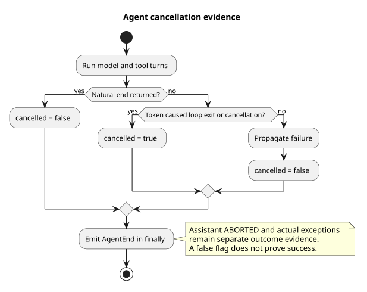

# Agent 实际取消退出证据

> 版本：1.0.0 · 日期：2026-09-08 · 状态：内核已实现，Runtime v2 消费方独立接入

工具确认期间取消时，Agent 可以在没有新的 Assistant ABORTED 消息的情况下退出。
`AgentEndEvent.cancelled` 补充这条退出证据；迟到的取消不能把已经自然完成的回答改判为中断。

## 源码依据

Java 变更前基线为 `58dd747a`，实现提交为 `8bed9b10`，集成自子任务 `0e2f98a6` 与
`da092cd1` 的最终代码。以下路径相对于实现仓根目录。

| 路径与符号 | 观察与决定 |
|---|---|
| `modules/agent-core/src/main/java/com/campusclaw/agent/loop/AgentLoop.java#runInternal/#runTurns` | 原循环吞掉已取消 token 对应的 CancellationException 并返回历史；新增标志区分取消退出与自然结束，finally 统一发布 AgentEnd。 |
| `modules/agent-core/src/main/java/com/campusclaw/agent/tool/ToolExecutionPipeline.java#execute/#applyBeforeHook` | before hook 异常会转换为失败结果；现在先复核取消，再决定是否返回该结果，避免确认取消后追加虚假的工具失败消息。 |
| `modules/agent-core/src/main/java/com/campusclaw/agent/event/AgentEndEvent.java` | 当前调用方继续使用单参数构造器；新增 boolean 默认 false，JSON 中 false 不输出，缺字段时按 false 读取。 |
| `modules/agent-core/src/main/java/com/campusclaw/agent/Agent.java#applyEventToState` | 既有消费者按类型读取消息，不依赖 record 解构或 HTTP 字段；循环仍负责发出最终事件。 |
| `modules/agent-core/src/test/java/com/campusclaw/agent/AgentLoopIntegrationTest.java` | 用真实循环验证确认等待取消无 ToolResult、取消证据为 true，以及迟到取消仍保留自然结束。 |

pi 基线为 `4af9d21d3b4d664e4a29fcabfec85171077248e3`，
`packages/agent/src/agent-loop.ts#runLoop` 根据 Assistant error/aborted 结束循环，
`#prepareToolCall` 在 before hook 后检查 AbortSignal。pi 的 agent_end 只携带消息；本次新增
Java 标志是架构变更，并非复刻一个已经存在的 pi 字段。Java 在确认取消后不追加失败 ToolResult，
是为了满足 Events v2 已关闭确认段的产品约束；pi 可以为 aborted 工具返回错误结果。

规范设计来自 `pi-mono-java-design@2ee2a3211da68ad87b0d9cab353e691b00bdaebd` 的
`01-总体架构/01-CampusClaw多Agent运行时/chat-events-v2-design.md`：接纳中断不证明执行已经停止，
必须保留实际 done、failed 或 terminated 结局。

## 退出与消费边界

[PlantUML 源码](diagram.puml#L1)

- 循环因取消 token 不再进入下一轮，或捕获对应的 CancellationException，发出 cancelled=true。
- 已自然结束的循环发出 cancelled=false；即使最后一条消息回调触发取消，也不能覆盖其结果。
- 模型流中取消仍可能通过 Assistant 的 ABORTED 表达。cancelled=false 仅表示没有这条补充证据，
  不能单独推导执行成功；消费者仍需结合 Assistant 结束原因和实际异常。
- 没有取消 token 的 CancellationException 继续向调用方抛出，不能误标成用户中断。

本片只改变内核事件和工具阶段取消检查，不新增 HTTP 路由，也不提前切换现有 Runtime。
Runtime v2 协调器在后续交付中消费该标志并原子提交终态；该未来消费不属于本片完成范围。
保留 Agent 内部 steer/follow-up 原语，其 HTTP 退役在独立切片处理。

## 验证与取舍

独立分支运行 `AgentLoopIntegrationTest`、`AgentEventTest`、`ToolExecutionPipelineTest`，
共 47 项通过，零失败、零跳过。覆盖实际取消、自然完成竞争、当前事件 JSON 规则和既有工具执行。
方法职责提取保留原异常及 finally 边界，Java 结构检查确认方法均不超过 50 个非空物理行。
五组公司镜像按命名空间转换逐字核对；没有新增 Maven 依赖、配置、线程或数据库对象。
本机无法解析 `NativeParent:26.0.0-SNAPSHOT`，公司编译未验证；按普通本地生成模式同步镜像。

相比仅查看最后一条 Assistant 消息，补充标志能表达无新模型消息的取消；相比直接读取中断请求
标志，它不会把迟到请求误判为已经成功取消。该标志不保证强制杀死任意工具，取消仍是协作式的。

## 版本历史

| 版本 | 日期 | 说明 |
|---|---|---|
| 1.0.0 | 2026-09-08 | 记录内核实际取消证据、自然结局保护、工具检查顺序及独立 Runtime 消费边界。 |
