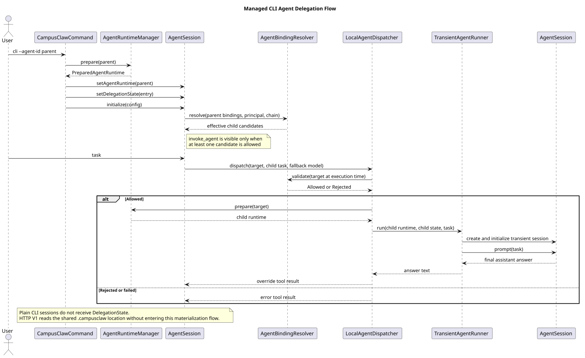

# Agent 委派执行链路设计

> 文档版本：2.0.0
>
> 更新日期：2026-08-19
>
> 状态：已实现；入口限定为显式托管 CLI `--agent-id`

对应决策记录：[ADR-0012：Agent 委派静态校验与授权端口](../decisions/0012-agent-delegation-static-validation.html)、[ADR-0014：父 Agent 调用子 Agent 的瞬态执行链路](../decisions/0014-agent-delegation-transient-execution.html)。

## 1. 源码基线与证据

本次冲突整合分析的源码基线：

- HTTP V1 分支基线：`1fae0a70ac0fd8c64d40d0c7dde0518f1cd9f28b`
- 合入的 `origin/main` 基线：`5f4d81752acacaa219a92aa0b0b6a93427802e17`

主要源码证据：

- `modules/coding-agent-cli/src/main/java/com/campusclaw/codingagent/cli/CampusClawCommand.java`：`runAgentMode()`、`createAgentSession()`、`configureDelegation()`
- `modules/coding-agent-cli/src/main/java/com/campusclaw/codingagent/session/AgentSession.java`：`configureRuntimeTools()`、`handleDelegationToolCall()`
- `modules/coding-agent-cli/src/main/java/com/campusclaw/codingagent/runtime/AgentBindingResolver.java`：`resolve()`、`validate()`
- `modules/coding-agent-cli/src/main/java/com/campusclaw/codingagent/runtime/LocalAgentDispatcher.java`：`resolveCandidates()`、`dispatch()`
- `modules/coding-agent-cli/src/main/java/com/campusclaw/codingagent/runtime/TransientAgentRunner.java`：`run()`、`createSession()`
- `modules/coding-agent-cli/src/main/java/com/campusclaw/codingagent/runtimeapi/runtime/RuntimeSessionEngineRegistry.java`：HTTP V1 的独立执行引擎

`origin/main` 的观察行为是把委派状态装配到旧 `ServerMode/SessionPool`。HTTP V1 分支已经删除该入口，并明确把公共 HTTP 的只读 `.campusagent` 与 CLI 的 CampusMate `.campusclaw` 物化链分离。合并后的架构变更是：保留委派能力及全部校验规则，把入口迁移到显式 `cli --agent-id`；普通 CLI 和 HTTP V1 均不隐式启用委派。

## 2. 能力边界

| 入口 | 委派能力 | 原因 |
|---|---|---|
| `cli --agent-id <id>` | 有条件启用 | 已准备 `PreparedAgentRuntime`，可读取 `bindingAgents`，并可通过同一 `AgentRuntimeManager` 准备子 Agent |
| 未传 `--agent-id` 的 CLI | 不启用 | 普通会话没有可信的父 Agent 绑定快照 |
| Spring Boot HTTP V1 | 当前不启用 | HTTP 使用 Manager 预置的只读 `.campusagent`，不调用 CLI 专用 `.campusclaw` 物化器 |

这是有意的产品与架构边界。HTTP Session 不会为了发现子 Agent 而隐式访问 CampusMate；若未来需要 HTTP 委派，必须先统一两套目录契约、身份来源和事件持久化语义。

## 3. 组件职责

| 组件 | 职责 |
|---|---|
| `AgentBindingResolver` | 从父快照的直接 `bindingAgents` 计算候选，并在每次执行前重新校验 |
| `DelegationContext` | 固化深度、祖先链、父子关系等结构不变量，硬限制最大深度为 2 |
| `AgentAuthorizationPolicy` | 提供 `(principal, agentId)` 鉴权端口；当前默认实现为 `PERMIT_ALL` |
| `LocalChildAgentMetadataSource` | 本地 `.campusclaw/agentId.json` 优先，远端只读回退；全部失败时 fail closed |
| `InvokeAgentTool` | 无状态控制工具；工具本体只返回确认，真实副作用由 Session after-tool-call 钩子执行 |
| `LocalAgentDispatcher` | 重新校验、构造可信上下文、准备目标运行时并调度瞬态执行 |
| `TransientAgentRunner` | 每次调用创建独立子 `AgentSession`，执行任务后提取最终 Assistant 文本 |
| `DelegationState` / `DelegationWiring` | 在父子会话间传递调用链状态及创建子会话所需协作者 |

## 4. 执行流程



[PlantUML 源文件](agent-delegation/diagram.puml#L1)

观察到的执行顺序：

1. 用户显式执行 `cli --agent-id <parent>`，CLI 准备父 Agent 的 `.campusclaw` 快照。
2. `CampusClawCommand` 创建 `AgentSession`，注入 `PreparedAgentRuntime`，并在 `LocalAgentDispatcher` Bean 可用时安装入口 `DelegationState`。
3. `AgentSession` 仅在 resolver 返回至少一个有效直接子 Agent、且本地 `ToolSelection` 允许时暴露 `invoke_agent`。
4. 模型调用 `invoke_agent(agentId, task)`；after-tool-call 钩子把调用交给 dispatcher。
5. dispatcher 在执行时再次校验绑定、祖先链、深度、enabled、版本钉和授权，然后才调用 `AgentRuntimeManager.prepare(target)`。
6. `TransientAgentRunner` 创建全新的子 `AgentSession`。子默认模型优先，父模型仅作回退；子任务作为完整用户输入执行。
7. 子会话最后一条非空 Assistant 文本覆盖父侧工具结果；拒绝或失败转成 `isError=true` 的工具结果，父循环继续处理。

## 5. 校验规则

有效子 Agent 集合为：

```text
effectiveChildAgents = parent.bindingAgents
                      intersect enabledAgents
                      intersect principalAuthorizedAgents
                      minus ancestryAgents
```

执行前校验顺序为：直接绑定、自绑定、祖先链、深度上限、子元数据、enabled、版本钉、授权。

- 候选只能来自父快照中的直接绑定，不能枚举全局 Agent 目录。
- 深度上限为 2；深度 2 的子会话不会再暴露 `invoke_agent`。
- 绑定声明版本时，子元数据版本必须完全一致；未知版本按不兼容处理。
- 子元数据无法从本地或远端取得时返回 `UNKNOWN_CHILD`，不会乐观放行。
- resolver 生成工具描述时的候选结果不被执行链信任；dispatcher 每跳重新校验。

## 6. 会话和并发语义

- 子 Agent 是瞬态会话，不进入常驻 worker 池，不与父或其他子会话共享 `AgentState`、消息历史或 SkillRegistry。
- 同一条委派链共享 dispatcher、运行时管理器、调用主体和 `conversationId`；CLI 入口当前使用降级值 `local`。
- `AgentRuntimeManager.prepare()` 仍按 Agent ID 串行冷启动，不同目标 Agent 可以并行准备。
- 当前父侧同步等待 `childSession.prompt(task).join()`；异步 PendingDelegation 和正式审计事件流尚未实现。
- 当前 `PermitAllAgentAuthorizationPolicy` 只保留鉴权扩展端口，真正的租户/用户级授权尚未接入。

## 7. 异常语义

- 无效参数：返回 `invoke_agent requires an agentId/task` 的错误工具结果。
- 静态校验拒绝：返回 `Agent delegation rejected: <reason> (<detail>)`。
- 子执行失败或以 `StopReason.ERROR` 结束：返回带目标 Agent 的失败信息。
- 子未产生非空 Assistant 文本：按执行失败处理。
- 任意上述失败都不会直接中断父 Agent 循环，模型可以改写任务或选择其他候选。

## 8. 测试范围

现有测试覆盖：

- `AgentBindingResolverTest`：候选过滤、全部拒绝原因、版本钉、授权和重复绑定；
- `DelegationContextTest`：深度、祖先链、自绑定与构造不变量；
- `LocalChildAgentMetadataSourceTest`：本地优先、远端回退和双失败 fail closed；
- `LocalAgentDispatcherTest`：入口派发、未绑定拒绝和第三跳拒绝；
- `TransientAgentRunnerTest`：最终回答提取及子执行错误传播；
- `AgentSessionTest$Delegation`：候选门控、工具描述和子回答覆盖。

本次冲突整合额外验证显式 CLI 入口可以正常构建并装配上述 Spring Bean。真实 CampusMate 与真实模型的端到端委派不属于本地自动测试环境，不能因单元测试通过而宣称已验证。

## 9. 版本历史

| 版本 | 日期 | 说明 |
|---|---|---|
| 2.0.0 | 2026-08-19 | 合并 HTTP V1 架构：删除旧 ServerMode/SessionPool 接线，把委派入口迁移到显式托管 CLI；补充源码证据和 PlantUML。 |
| 1.x | 2026-08-18 | 委派组件初版，入口接在线程内旧 ServerMode/SessionPool。 |
