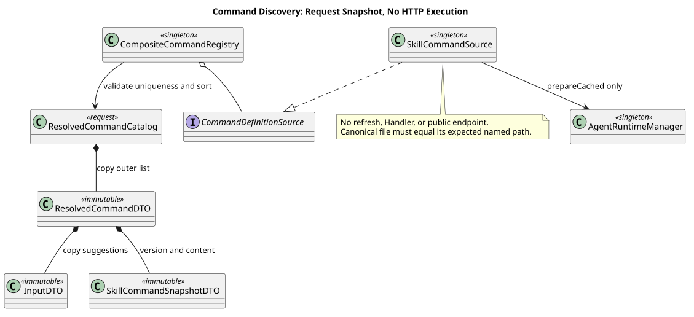
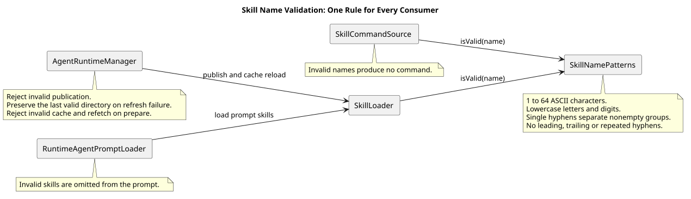

# Agent 与 Skill 受管运行目录

> 文档版本：3.6.2
>
> 状态：Implemented
>
> 更新日期：2026-09-07
> 规范性工具契约：[CampusClaw 受管 Agent 工具系统 v2](tool-system-v2.md)

## 1. 源码基线

- 变更前观察基线（CampusClaw）：`56be8eee59415a5f86658d6635a7b7e8891263d3`
- 本次审查实现提交：`0ab5db29cd9f4262a24b3ffef4cf009177f25c3e`
- Agent 根目录包含性加固分析基线：`c9d858bc8261bf07f5585f545b53495bf2226a56`
- Agent 根目录身份审查实现提交：`90e78251885814a34b8e054ea7f44f86baecbb1b`
- Agent 根目录配置路径前置校验分析基线：`687f6a28ea2b88480fe38dc367652c66a43ff678`
- Agent 根目录配置路径前置校验实现提交：`8921a493185e86f4773843241016627b05a8ce59`
- Agent 路径操作逐点校验分析基线：`2dfec2c5ff4768e12c0d50fdec76ad539654dc4e`；
  `modules/coding-agent-cli/src/main/java/com/campusclaw/codingagent/runtime/AgentRuntimeManager.java`，
  符号 `requireAgentRoot`（413–435 行）与 `validatePath(Path)`（437–448 行）。
- 设计仓：`c2a495838134aa5e8bc535b906e7534b34779279`
- 受管目录证据：
  `modules/coding-agent-cli/src/main/java/com/campusclaw/codingagent/runtime/AgentRuntimeManager.java`，
  符号 `prepare`/`refresh`/`requireSessionLoadable`；
  `modules/coding-agent-cli/src/main/java/com/campusclaw/codingagent/runtime/MateServiceClient.java`，
  符号 `querySkillInfo`/`getAgentRuntime`。
- 公开错误证据：
  `modules/agent-core/src/main/java/com/campusclaw/agent/tool/ToolExecutionPipeline.java`，
  符号 `failureResult`；
  `modules/coding-agent-cli/src/main/java/com/campusclaw/codingagent/runtimeapi/event/RuntimeEntryCodec.java`，
  符号 `toolResultEntry`/`toSseData`/`toHistoryEvent`；
  `modules/cron/src/main/java/com/campusclaw/cron/engine/CronJobExecutor.java`，符号 `stableCodeOf`；
  `frontend/src/projectors/runtimeEventProjector.ts`，符号 `projectToolEvent`。

基线源码观察到 CLI 生成运行目录与 HTTP 只读目录采用不同文件名，并在 Skill
`references/tools.json` 保存远端工具快照。本次把两条链收敛为服务端三入口共同使用的一个
受管目录；这是架构改造。远端工具不落盘，由 Mate 工具在 Session 内实时发现。

## 2. 目录契约

```text
agent/{agentId}/.campusclaw/
├── agent.json
├── settings.json
├── SYSTEM.md
├── agents/{agentName}.json
└── skills/{skillName}/
    ├── skill.json
    ├── SKILL.md
    ├── references/
    └── templates/
```

根 `agent.json` 是当前 Agent 身份；`agents/{agentName}.json` 是一个直接绑定 Child 的轻量
身份与固定版本；`skill.json` 保存 `schemaVersion=1`、`id`、`name`、`version`。名称必须与
路径精确一致且大小写折叠后唯一。目录拒绝符号链接和任何 `tools.json`。

## 3. prepare 与 refresh


[PlantUML 源码](tool-system-v2/diagram.puml#L1)

`prepare(agentId)` 先加载完整本地缓存；只有缺失或不完整时访问 Mate。querySkillInfo 的
Skill 响应结果取自 `result` 字段，解析时要求该字段为 JSON 对象；其 `content` 字段是完整
SKILL.md 内容，原文写入 `skills/{name}/SKILL.md`，不从元数据生成。发布前校验 SKILL.md：
非空且不超过 1 MiB、frontmatter `name` 与响应 name 及 `skill.json`/目录名一致、
`description` 必填，并用会话同一套 `SkillLoader` 复核可加载；校验失败不发布、保留旧缓存。
缓存命中读取复用同一校验入口（字节上限 + `SkillLoader` 完整规则 + 名称与 `skill.json`/
目录名一致），磁盘内容损坏、超大或超长时判缓存不完整并重新拉取，而不是带着缺陷命中缓存。
CampusMate 响应解析不按 `resCode` 预判结果，只校验 `result` 形状；空响应体、非法 JSON、
根节点非对象、`result` 缺失/类型不符统一抛带稳定错误码（`AgentRuntimeErrorCode`）的
`AgentRuntimeException`。Session HTTP 边界经 `FileAgentDirectoryResolver` 映射为
`AGENT_NOT_AVAILABLE`。工具失败 Entry 只持久化 `error_code`，SSE 和历史查询按请求
locale 输出 `errorCode` 及 MessageSource 生成的 `errorMessage`；前端失败投影优先展示该
`errorMessage`，兼容旧事件缺失该字段时回退到 `content`。Cron 新运行记录只持久化稳定
错误码，旧 JSONL 的 `error` 字段仅作为兼容读取。内部英文诊断仅作为 cause 与日志。
远端内容先写入同级 staging 目录，通过 Agent、Skill、Child、文件类型、资源名、ID/版本和
边界校验后原子发布。发布失败清理 staging 并保留旧目录。

`refresh(agentId)` 是管理面显式操作，总是重建目录；它不由模型工具或配置热更新触发。
HTTP Session 创建、Cron 触发和 Child Execution 均调用 prepare，因此冷目录可以自动创建，
完整热目录不产生远端访问。

## 4. Session 消费

`AgentSessionFactory` 从 `PreparedAgentRuntime` 取得 SYSTEM、Skill 名称到 ID 映射、直接 Child
映射和 bindingModels，并按 `RUNTIME`、`CRON`、`CHILD_AGENT` profile 组装工具。Skill 文档
用于提示词资源，Skill ID 只在 `ListMateTools(skillName)` 与 Call miss 的完整发现中使用。

目录缓存和 Session 生命周期分离：refresh 只影响随后创建的 Session，不修改正在执行的
Session 快照。工具配置也只在应用启动时解析，不由 refresh 变更。

## 5. 安全边界与设计决策

分析基线中的 `AgentRuntimeManager#requireAgentRoot` 已在路径拼接前用
`ResourceIdentifierPatterns.AGENT_ID_PATTERN` 限制 `agentId` 为固定格式单路径段，但使用
`toAbsolutePath().normalize()` 只完成词法路径归一化，不会解析文件系统中的符号链接，也没有
验证最终路径仍属于 Agent 根目录。现有正则使常规调用不能提供 `..` 或绝对路径；缺少的是
canonical path 与路径操作自身的 fail-closed 后置条件。

审查实现提交 `90e78251885814a34b8e054ea7f44f86baecbb1b` 中，`requireAgentRoot` 已分别
canonicalize 配置根目录和 Agent 候选目录，并用 `startsWith` 拒绝根目录外的目标。但该包含性
判断仍会接受根目录内的符号链接别名，例如 `agent-A -> agent-B` 或 `agent-A -> agents-root`。
方法返回 canonical 目标后，`createStagingDirectory` 与 `publish` 只能看到普通目标目录，无法再
识别原始链接；`refresh(agent-A)` 因而可能修改另一个 Agent 的缓存，且按 `agent-A` 获取的锁
不能保护 `agent-B` 的并发操作。这是审查实现中观察到的安全缺口，不是目标行为。

目标实现把该变化分类为**安全加固**：保留入口格式校验，分别用 `File#getCanonicalPath()` 获取
配置根目录和 Agent 候选目录的 canonical path，先用 `Path.startsWith(canonicalAgentsRoot)`
验证包含关系，再要求 canonical 候选精确等于 `canonicalAgentsRoot.resolve(agentId)`，保持请求
ID 与磁盘目录的一一对应；验证失败时，在任何缓存读取、目录创建或 Mate 访问发生前抛出
`IllegalArgumentException`。选择该分层校验是为了让路径安全不只依赖当前 ID 正则，同时阻止
Agent 目录通过符号链接逃出根目录或别名到根目录内的其他资源。决策及备选方案见
[ADR-0044](../decisions/0044-validate-managed-agent-root-containment.html)。

配置路径前置校验分析基线 `687f6a28ea2b88480fe38dc367652c66a43ff678` 中，
`requireAgentRoot` 会直接把 `properties.agentsRoot()` 交给 `getCanonicalPath()`，缺少公司安全告警
要求的显式路径合法性判定。实现提交 `8921a493185e86f4773843241016627b05a8ce59` 在任何 canonical
解析前先调用 `validatePath(properties.agentsRoot())`；空路径、包含 `.` 或 `..` 路径段以及归一化
结果与原路径不同的配置均抛出 `IllegalArgumentException`。这是**安全加固**：合法配置行为不变，
配置路径词法合法性、canonical 路径解析、根目录包含关系和 Agent 目录身份成为依次执行的独立
防线。

逐点校验分析基线 `2dfec2c5ff4768e12c0d50fdec76ad539654dc4e` 已校验配置根路径，
但 `resolve(agentId)` 的实参和 `expectedAgentRoot.toFile()` 的接收对象仍缺少各自的显式
`validatePath` 前置判定，用户于 2026-09-04 反馈这两处仍触发公司 Path Manipulation 告警。
3.6.1 按该反馈补齐**安全加固**：在 `resolve(agentId)` 前调用 `validatePath(agentId)`，
在 `toFile()` 前调用 `validatePath(expectedAgentRoot)`；任一失败均立即抛出
`IllegalArgumentException`。新增私有 String 重载解析路径后复用已有 Path 校验，
不可解析的字符串返回 false。已有 ID 格式、canonical 包含性和目录身份检查继续生效。
该修复落实 [ADR-0044](../decisions/0044-validate-managed-agent-root-containment.html) 的显式路径
校验要求，使告警位置的输入与校验对象直接对应；它不代表分析基线已经具备这些调用。
本地以 `AgentRuntimeManagerTest` 验证合法目录创建、缓存与刷新、三个入口拒绝非法 ID、
非法配置路径和三类符号链接。公司扫描器需另行复扫，本地回归不能证明告警已经消除。

- `agentId` 必须符合领域 ID 格式且只解析为 `agents-root` 下的单目录；
- `properties.agentsRoot()` 必须先通过 `validatePath` 词法合法性校验，再进入 canonical 路径解析；
- `resolve(agentId)` 前必须通过 `validatePath(agentId)`，拼接结果在 `toFile()` 前必须通过
  `validatePath(expectedAgentRoot)`；
- Agent 根目录和候选目录必须使用 canonical path，禁止以 absolute path 代替；
- canonical Agent 根路径必须显式通过 canonical `agents-root` 包含性校验；
- canonical Agent 根路径必须与 `canonical agents-root/agentId` 精确一致，禁止根目录内别名；
- 本地缓存树任何符号链接都会使其无效；
- 资源名不允许路径分隔、`.`、`..` 或 NUL；
- Agent/Skill/Child 的名称、ID、版本和绑定坐标必须一致；
- staging 校验通过前不替换可用目录，失败不发布半成品；
- `Read`、`Find`、`Grep`、`Ls` 的边界是完整 `agent/{agentId}`，不只是 `.campusclaw`。

## 6. CampusMate 共享配置

受管目录客户端从 `campusmate.endpoints.agent-runtime-path-template` 和共享的
`skill-info-path-template` 获取 operation path；不再持有独立 `campusmate.runtime.base-url`。
Model、受管 Runtime 与 Tool 统一使用必填 `campusmate.base-url`。Runtime 自有的 agents root、
超时和响应大小限制仍在 `campusmate.runtime`，没有被错误提升为共享参数。

完整配置图、源码证据和迁移规则见
[CampusMate 客户端共享配置设计](campusmate-shared-config.md)。该架构改造不改变受管目录的
prepare、refresh、原子发布或 HTTP 契约。

### 6.1 命令发现前置层（PR #210，未发布 HTTP）

复核基线 `d60c74b38b9e1e961c4fcd2abff180146bbf395c`：
`modules/coding-agent-cli/src/main/java/com/campusclaw/codingagent/runtimeapi/command/`
中的 `CompositeCommandRegistry.resolve` 已做到每个来源只解析一次，但 `ResolvedCommand.Input`
仍直接引用调用方的 suggestions 列表；record 本身不保证集合深度不可变。
同基线 `SkillCommandSource.hasSkillMarkdown` 只检查 canonical 包含性，未限制目录别名；
`skill/SkillNamePatterns` 已区分兼容与严格规则，但长度常量仍分散在 Skill 类型。

本 PR 修复目标：发现数据只使用只读 `ResolvedCommandDTO` 与 `SkillCommandSnapshotDTO`；
InputDTO 对建议列表做防御性复制，Source 提供非 null 空列表，Catalog 复制外层列表。
不在 DTO 中增加业务校验；注册表负责重名检测，Source 负责可用性与文件检查。
删除无消费者的可变展示 DTO，公开响应 VO 留待 HTTP PR。
PR #210 当时让 SkillNamePatterns 集中维护两套正则字符串、编译模式和最大长度，Loader
继续使用兼容规则。该名称兼容策略已由下文 6.2 的统一校验决策废止。
Skill 文件的 canonical 路径必须位于 Agent 根目录，且等于该根下预期的命名文件，
拒绝根外、兄弟 Skill 和根目录别名；沿用 [ADR-0044](../decisions/0044-validate-managed-agent-root-containment.html)
的包含性加身份校验原则，不改变受管目录发布流程。



[PlantUML 源码](command-discovery/diagram.puml#L1)

PR #210 的只读发现层不提供 Handler、Controller 或命令执行。历史设计
[PR #4](https://github.com/superheromeZzh/pi-mono-java-design/pull/4) 已合入；其“Skill 执行延期”
以及之后的同事分工均已被替代（superseded）。当前设计 main `fd8604956632c880264434791465d1f59917038d`
的通用模块 §1/§5 与 Skill 专题 §1/§4 明确：Builtin、Skill 和共享 HTTP 由用户统一负责，
Skill 真实执行纳入整体实施验收。发现骨架不等于已发布执行能力；各实现 PR 继续串行交付。
不得复用旧的请求级 Command SSE 或 Name 边车方案，也不混入尚未整体确认的 Events V2 候选迁移。

验证包括稳定排序、重名拒绝、同一来源仅调用一次、建议列表不可修改、版本快照、
不刷新 Agent、三类符号链接别名；当时还测试旧格式 Skill 仍能 prepare，该测试预期已由 6.2
替换为拒绝非法名称；同时运行 SkillLoader 回归。
模块侧新增代码不超过 850 行，镜像同步后低于 1800 行软上限，最终以 PR 新增行数门禁为准。

### 6.2 Skill 名称统一校验

变更前源码基线：`2c2092f2fa764a7aa7b47da841299f8866d7a151`。以下路径相对于仓库根目录，
表中符号描述该基线的实际行为：

| 源码路径 | 符号与观察行为 |
|---|---|
| `modules/coding-agent-cli/src/main/java/com/campusclaw/codingagent/skill/SkillNamePatterns.java` | `LEGACY_REGEX` 只限制字符种类；`STRICT_REGEX` 还禁止首尾及连续连字符。 |
| `modules/coding-agent-cli/src/main/java/com/campusclaw/codingagent/skill/SkillLoader.java` | `validateName` 使用 `LEGACY`，因此 `-pdf`、`pdf-`、`pdf--tools` 会通过加载校验。 |
| `modules/coding-agent-cli/src/main/java/com/campusclaw/codingagent/runtime/AgentRuntimeManager.java` | `writeSkills` 与 `loadSkill` 都通过 `requireSessionLoadable` 调用 `SkillLoader.loadFromFile`，宽松规则作用于发布与缓存读取。 |
| `modules/coding-agent-cli/src/main/java/com/campusclaw/codingagent/runtimeapi/agent/RuntimeAgentPromptLoader.java` | `loadSkill` 调用同一 Loader；未禁用模型调用时，基线会把上述 Skill 纳入可见摘要。 |
| `modules/coding-agent-cli/src/main/java/com/campusclaw/codingagent/runtimeapi/service/command/SkillCommandSource.java` | `resolved` 使用 `isStrictValid`，上述名称不会出现在命令发现结果。 |

宽松正则最早可追溯至提交 `6335f6fbb4de2ec4eedb338c1de73ea24e3c8a07` 的
`modules/coding-agent-cli/src/main/java/com/mariozechner/pi/codingagent/skill/Skill.java:NAME_PATTERN`。
提交 `d60c74b38b9e1e961c4fcd2abff180146bbf395c` 将其迁入 `SkillNamePatterns.LEGACY`。
这些代码以及人为构造的兼容测试，只能证明原实现放行过非法名称，不能证明存在受支持的历史数据迁移需求。

**目标决策与理由（产品约束）：** 根据 2026-09-04 用户明确纠正，非法名称不提供兼容加载。
名称为 1 至 64 个 ASCII 小写字母、数字及分隔连字符；禁止首尾连字符、连续连字符和其他字符。
本次实现以 `common.constant.ClawConstants.Skill` 为 Skill 领域共享常量及正则的唯一定义位置，
名称规则由 `NAME_REGEX`、`NAME_PATTERN`、`MAX_NAME_LENGTH` 和 `isValidName` 表达。
`ClawConstants.Skill` 及其名称符号属于本次修复，类不存在于上述变更前基线；名称长度上限仍为 64。
Loader 与命令发现使用同一判定，删除 LEGACY/STRICT 分支和旧方法，不提供别名或自动改名。
该约束消除“可以加载却不能发现为命令”的名称规则差异，保持 Skill 名称与绑定、目录身份一致。
决策和备选方案见 [ADR-0050](../decisions/0050-unify-skill-name-validation.md)。



[PlantUML 源码](skill-name-validation/diagram.puml#L1)

| 入口 | 非法名称处理 |
|---|---|
| `SkillLoader.loadFromFile` | 原始 name 必须是非空字符串，符合统一严格规则且与文件夹逐字符一致；否则抛 `SkillLoadException`，不回退、裁剪或强制转换。 |
| 受管目录首次 `prepare` / `refresh` | 发布前复核失败，抛出 `AgentRuntimeException`；首次不发布目录，刷新保留原有效目录。 |
| `prepareCached` / `prepare` 缓存命中 | 非法名称使缓存无效；前者返回空且不访问 Mate，后者重新拉取；远端仍非法则失败。 |
| 提示词加载 / 目录扫描 | 沿用现有非法文件处理方式，跳过该 Skill，不加入提示词或加载结果。 |
| 命令发现 | 沿用现有过滤方式，不生成非法名称的命令。 |

领域归属复核基线：`cf4f929af2d407d3673bfabac0c311831fb570c7`。该版已统一名称判定，
但 `common/identifier/ResourceIdentifierPatterns.java` 中的 `SKILL_ID_REGEX` 与
`SKILL_ID_PATTERN` 仍与 `skill/SkillNamePatterns.java` 分散维护；仅消除重复字面量未完成领域归属要求。
上述路径均相对于 `modules/coding-agent-cli/src/main/java/com/campusclaw/codingagent/`。
本次按已有 AGENTS.md 规则作**架构归属调整**：将 ID 正则迁至 `ClawConstants.Skill.ID_REGEX` 和
`ID_PATTERN`，与名称规则同类维护，删除旧名称规则类及通用类中的 Skill 定义，不保留转发别名。
`runtime/AgentRuntimeManager.java` 的 `requireValidSkill`、`validCachedSkill`、`requireValidSkillReference`，
`runtime/MateServiceClient.java` 的 `querySkillInfo`，以及 `common/client/HttpMateToolClient.java`
的 `listSkillTools` 都改为复用该 ID 模式。ID 格式仍为 `skill-` 加 32 位十六进制字符，保留十六进制大小写规则。
名称与 ID 是不同字段，分别使用对应的模式，但定义归属统一。

共享常量复核基线：`c0e2915230e73f626a5ede99f0fc3b3412bbff0b`。该版 `skill/SkillPatterns.java`
已集中正则，但 `skill/Skill.java` 仍声明 `MAX_DESCRIPTION_LENGTH` 和 `MAX_FILE_BYTES`；
`skill/SkillLoader.java`、`runtime/AgentRuntimeManager.java`、`runtimeapi/agent/RuntimeAgentPromptLoader.java`
及 `runtimeapi/service/command/SkillCommandSource.java` 还分别持有目录名、文件名或命令前缀。
已有规则约束所有共享常量，仅集中正则仍未满足要求。3.5.2 将领域类更名为 `SkillConstants`，
统一名称上限 64、描述上限 1024、文件上限 1 MiB、`skills` 目录名、`SKILL.md` 与 `skill.json`
文件名及 `skill:` 命令前缀。上述消费者直接引用常量，`Skill` 仅承载数据，不保留转发字段或旧类。
这是**架构归属调整**，各常量值和已有校验触发位置保持不变。

产品共享常量复核基线：`ee3fdb4893228045f06b9b1d1b3b3bb505812c73`。3.6.0 按用户确认，
将上述 SkillConstants 的全部定义迁入新底层 common 模块的 `ClawConstants.Skill`；Runtime 文件约定
迁入 `ClawConstants.Runtime`，并删除旧类和字段。新包与 ai、codingagent 同级，定义文件为
`modules/common/src/main/java/com/campusclaw/common/constant/ClawConstants.java`。这替代旧的按领域
分文件规则，严格名称行为继续有效；见[共享常量设计](shared-constants.md)和
[ADR-0051](../decisions/0051-centralize-shared-claw-constants.md)。

合法名称、64 字符边界、固定 ID/版本、目录安全校验和 HTTP 结构均保持原行为。已有非法缓存不再命中，
需要上游提供合法且与文件、元数据一致的名称；不通过去掉或折叠连字符来改变资源身份。
判定仍复用预编译 Pattern，不增加网络或数据库操作；缓存无效后的拉取沿用既有 prepare 流程。

历史测试覆盖三类连字符错误的文件加载、首次发布失败、刷新保留旧目录、缓存拒绝并重建、
提示词排除以及存在实际 SKILL.md 文件时的命令过滤，并保留合法名称、空值和长度边界验证。
原有“兼容加载成功”测试已删除。ID 定义迁移复用 MateServiceClientTest、HttpMateToolClientTest
及 Runtime 回归，验证合法请求路径和非法 ID 在出站请求前被拒绝；验证结果记录在本次 Draft PR 中。

### 6.3 原始名称与目录身份补齐（3.6.2）

复核源码基线为 `7b3769a5eabe2d131af3023631d7ad24e6d9a9e1`。该基线的
`modules/coding-agent-cli/src/main/java/com/campusclaw/codingagent/skill/SkillLoader.java:parseSkillFile`
仍对缺少 name 回退父目录，并使用 `String.valueOf` 接受 null、数字和布尔值，未比较目录名。
旧 `SkillLoaderTest.defaultsNameToParentDirectoryName` 固定了这一错误预期；此前“目录名称回退”
验证记录仅代表历史行为，不是被批准的兼容策略。已合入设计 fd86049 的
`04-命令与技能/02-技能命令/README.md` §3 与通用模块 §3.1 明确禁止这些行为。

本次落实已有**产品约束与安全加固**：共享 Loader 先判断原始非空 String，再复用
`ClawConstants.Skill` 校验，最后要求与父目录名逐字符一致。保留单文件异常与批量跳过语义，
不引入第二个 Validator、正则或自动改名。受管绑定一致性仍由 `AgentRuntimeManager.requireSessionLoadable`
检查；`writeSkills/loadSkill` 都调用它，发布失败不替换目录，缓存失败不返回半完整快照。
`RuntimeAgentPromptLoader.loadSkill` 捕获加载异常后跳过；`SkillCommandSource.list` 只消费
`prepareCached` 的完整快照，因此非法缓存不产生发现结果。上述消费者均在同一源码基线可核实。

pi `4af9d21d3b4d664e4a29fcabfec85171077248e3` 的
`packages/coding-agent/src/core/skills.ts:validateName/loadSkillFromFile` 会回退文件夹名，
名称错误只给 warning，描述有效时仍加载。Java 有意不采用该容忍策略；严格拒绝是目标约束，
不是对 pi 既有行为的描述。决策、影响与选项见
[ADR-0056](../decisions/0056-enforce-declared-skill-name.html)。

`SkillNameContractTest` 使用相同样例检查加载、扫描、提示词、prepare/refresh、重启缓存读取和
命令发现：缺少/null/非字符串、目录不一致、空白与换行、非法字符/连字符、65 字符均拒绝；
1/64 字符和带引号的 `null`/`true`/`123` 保留合法字符串身份。断言失败刷新保留旧文件与发现结果，
损坏缓存只读发现无 Mate 调用，后续 prepare 才重建。它不代替未来 Skill 执行或共享 HTTP 验收。

## 7. 版本历史

| 版本 | 日期 | 说明 |
|---|---|---|
| 3.6.2 | 2026-09-07 | 补齐原始字符串类型、显式名称与目录同名校验，撤销目录回退测试预期；统一实施责任并保留历史证据。 |
| 3.6.1 | 2026-09-04 | 为 resolve 的 agentId 实参和 toFile 的 expectedAgentRoot 接收对象补齐显式 validatePath 前置校验。 |
| 3.6.0 | 2026-09-04 | 将 Skill 与 Runtime 共享定义迁入底层 common 的 ClawConstants 领域分组。 |
| 3.5.2 | 2026-09-04 | 以 SkillConstants 统一正则、长度和大小限制、目录与文件名、命令前缀；Skill 仅承载数据。 |
| 3.5.1 | 2026-09-04 | 按 Skill 领域归属统一 ID 与名称正则到 SkillPatterns，迁移所有消费者，删除旧定义和类。 |
| 3.5.0 | 2026-09-04 | 废止非法 Skill 名称兼容；统一加载与命令发现校验，补充发布、缓存和提示词拒绝回归。 |
| 3.4.3 | 2026-09-04 | 记录 PR #210 发现层修复：深度不可变 DTO、名称规则单一来源、文件 canonical 身份校验；HTTP 与 Skill 执行尚未发布。 |
| 3.4.2 | 2026-09-03 | `requireAgentRoot` 在 canonical 解析前显式调用 `validatePath` 校验 `properties.agentsRoot()`，非法配置立即抛出异常。 |
| 3.4.1 | 2026-09-03 | canonical Agent 路径除通过根目录包含性校验外，还必须与请求 ID 的预期目录精确一致，拒绝指向其他 Agent 或根目录的符号链接别名。 |
| 3.4.0 | 2026-09-03 | `requireAgentRoot` 使用 canonical path 并校验根目录包含关系，形成格式校验、符号链接解析与路径后置校验。 |
| 3.3.1 | 2026-08-26 | 前端工具失败投影消费本地化 errorMessage，并为旧事件保留 content 回退。 |
| 3.3.0 | 2026-08-26 | 工具失败事件按请求语言生成公开错误文案；Cron 使用通用稳定错误码并兼容旧运行日志；SKILL.md 字节上限收敛为单一定义。 |
| 3.2.0 | 2026-08-26 | querySkillInfo 的 Skill 响应结果取自 `result`，`result.content` 原文写入 `SKILL.md`；发布前校验 frontmatter `name`/`description` 并用 `SkillLoader` 复核；移除 resCode 预判与 `success-code` 配置，响应解析失败携带稳定错误码。 |
| 3.1.0 | 2026-08-26 | Runtime 复用 CampusMate 单一 base URL、共享 Agent/Skill Endpoint，并保留本地参数边界。 |
| 3.0.0 | 2026-08-24 | 删除 CLI 双契约和 tools.json，统一服务三入口目录、缓存优先 prepare 与管理面原子 refresh |
| 2.x | 2026-08-21 以前 | 历史 CLI 运行目录生成与 HTTP 只读目录设计，已由 ADR-0022 取代 |
