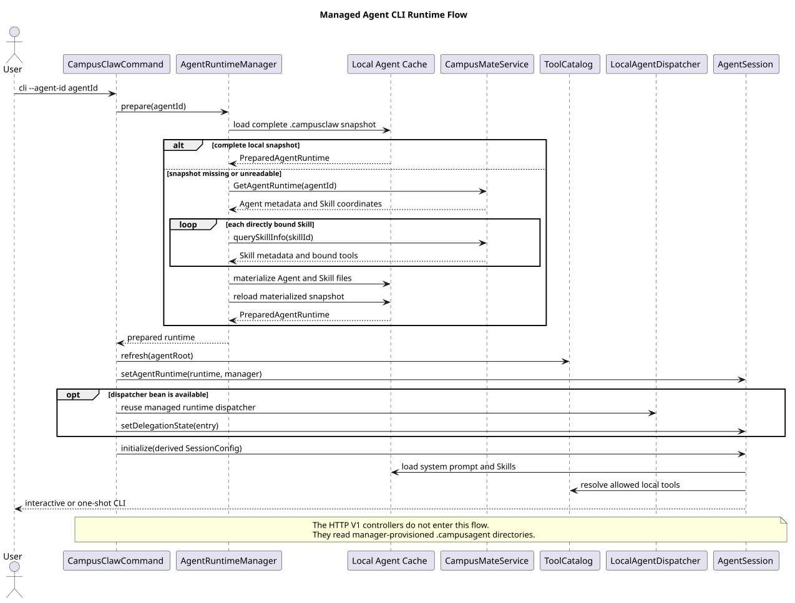

# Agent 与 Skill 本地优先运行时设计

> 文档版本：2.4.0
>
> 更新日期：2026-08-21
>
> 状态：已实现；仅适用于显式 CLI `--agent-id` 路径

## 1. 源码基线

本次整合分析了两个源码基线：

- HTTP V1 分支基线：`1fae0a70ac0fd8c64d40d0c7dde0518f1cd9f28b`
- 合入的 `origin/main` 基线：`7811dc335fcb0125a1ecbddd63cd77baf120f21d`
- 本次出站配置治理基线：`1e9d4ee2e14717764f8403c20375c55512cbd97b`

主要源码证据：

- `modules/coding-agent-cli/src/main/java/com/campusclaw/codingagent/cli/CampusClawCommand.java`：`--agent-id`、`call()`、`createAgentSession()`、`configureDelegation()`
- `modules/coding-agent-cli/src/main/java/com/campusclaw/codingagent/runtime/AgentRuntimeManager.java`：`prepare()`、`prepareCached()`、`materialize()`
- `modules/coding-agent-cli/src/main/java/com/campusclaw/codingagent/runtime/MateServiceClient.java`：构造器 `@Value` 路径模板、`getAgentRuntime()` 与 `querySkillInfo()`
- `modules/coding-agent-cli/src/main/java/com/campusclaw/codingagent/session/AgentSession.java`：`setAgentRuntime()`、`setDelegationState()`、`initialize()` 和 Skill/子 Agent 激活
- `modules/coding-agent-cli/src/main/java/com/campusclaw/codingagent/tool/catalog/DefaultToolCatalog.java`：本地可执行工具目录
- `modules/coding-agent-cli/src/main/java/com/campusclaw/codingagent/runtimeapi/agent/FileAgentDirectoryResolver.java`：HTTP V1 的只读 Agent 目录解析

该能力是 CampusMate/CampusClaw 产品集成，不以 pi 的托管 Agent 接口为设计基线。pi 的 Agent、Session、Skill 加载机制仍是本地执行基础，但不存在与 CampusMate 物化协议一一对应的实现。

配置治理基线中，`MateServiceClient` 的两个出站路径模板仍是 Java 静态常量。目标设计将它们移入应用配置并通过构造器参数上的 `@Value` 注入；这是架构配置治理。当前分支已实现该目标，公开入站 HTTP 契约路径不受影响。

## 2. 当前边界

仓库现在有两条有意分离的 Agent 消费链路。两者默认都使用
`agent/{agent_id}/.campusclaw/`，但并不因目录名相同而隐式共享物化、刷新和文件兼容语义：

| 入口 | 目录契约 | 是否调用 CampusMate | 作用 |
|---|---|---|---|
| 正常 Spring Boot HTTP V1 | `agent/{agent_id}/.campusclaw` | 否 | 读取由 Manager 预先提供的 `settings.json` / `SYSTEM.md` / `skills/`，创建和执行 Runtime Session |
| 显式 `cli --agent-id <id>` | `campusmate.runtime.agents-root/{agentId}/.campusclaw` | 本地缓存缺失或不可读时调用 | 为本地 CLI 准备托管 Agent、Skill 与工具快照 |
| 未传 `--agent-id` 的 CLI | 原有用户/项目目录 | 否 | 保持普通非托管 CLI 行为 |

这是架构变更后的明确边界：旧 `ServerMode`、`SessionPool`、`ChatHandler` 和公开 WebSocket 接口已经删除。Managed Agent 物化器不再由 HTTP Controller、REST Chat 或 WebSocket 调用。

HTTP V1 与 CLI 当前共用 `.campusclaw` 目录位置，但文件契约仍不同：HTTP 读取
`settings.json` 和 `SYSTEM.md`，CLI 物化器写入 `setting.json`、`systemPrompt.md` 和
`agentId.json`。这是本次只调整目录而不扩大文件 Schema 的有意边界。Manager 必须保证
HTTP 所需文件是完整快照；HTTP 请求不会因文件缺失而隐式触发 CampusMate 物化。

## 3. CLI 托管 Agent 流程



[PlantUML 源文件](agent-skill-runtime/diagram.puml#L1)

观察到的执行顺序如下：

1. 用户显式传入 `--agent-id`。
2. `CampusClawCommand` 从 Spring 容器取得 `AgentRuntimeManager`，调用 `prepare(agentId)`。
3. Manager 先按单路径段正则校验 Agent ID，再读取本地 `.campusclaw` 快照。
4. 快照完整时直接返回，不访问 CampusMateService。
5. 快照缺失或无法加载时，调用 GetAgentRuntime，并针对每个直接绑定 Skill 调用 querySkillInfo。
6. Manager 原地物化 Agent 元数据、模型设置、系统提示词、Skill 文件和 `references/tools.json`，随后重新加载为不可变 `PreparedAgentRuntime`。
7. CLI 以 Agent 根目录刷新 `ToolCatalog`，把 prepared runtime 注入 `AgentSession`；当 dispatcher 可用时同时安装委派状态，再用派生的 `SessionConfig` 初始化交互或单次执行。
8. 父快照存在有效直接 `bindingAgents` 时，会话按 [Agent 委派设计](agent-delegation.md) 有条件暴露 `invoke_agent`；普通 CLI 和 HTTP V1 不进入该链路。

## 4. 本地目录与数据来源

CLI 托管 Agent 当前物化：

```text
{agents-root}/{agentId}/.campusclaw/
├── agentId.json
├── setting.json
├── systemPrompt.md
└── skills/
    └── {skillName}/
        ├── SKILL.md
        ├── references/
        │   ├── tools.json
        │   └── {referenceName}.{fileType}
        └── templates/
            └── {templateName}.{fileType}
```

字段来源：

| 本地内容 | 远端来源 | 当前解释 |
|---|---|---|
| `agentId.json` | GetAgentRuntime 完整结果 | 本地缓存的 Agent 元数据 |
| `setting.json.defaultModel` | `bindingModels` 首个非空值 | 供目录消费者读取的模型快照；当前 CLI Session 直接从 `agentId.json.bindingModels` 解析默认模型 |
| `setting.json.enabledModels` | `bindingModels` | 供目录消费者读取的模型快照；当前 Manager 不用该文件判定可见模型 |
| `systemPrompt.md` | `systemPrompt` | 托管 Agent 系统提示词；与 CLI 自定义提示词拼接 |
| `SKILL.md` | querySkillInfo 的 name、description、useCases | 当前接口无真实 Skill 正文，因此生成基础内容 |
| `references/tools.json` | querySkillInfo 的全部 `bindingTools` | 只保存 `tool_id`、name、description；不按 permission 过滤 |
| references/templates | querySkillInfo 对应字段 | 按远端名称与 fileType 写入文本文件 |

querySkillInfo 的 `bindingSkills` 当前只进入响应对象，不递归查询、不写入本地文件，也不会把依赖自动暴露给模型。

## 5. Skill 与工具装配

托管 CLI 会话只加载当前 Agent 根目录内的 Skill，不加载用户级 Skill。初始模型上下文只暴露 Skill 的 name 和 description。

工具来源分为两层：

```text
baseTools = 本地 ToolCatalog
            ∩ CLI include/exclude/noTools 策略
            ∩ Agent permission=allow 工具
            + 本地策略可见的 activate_skill

activeSkillTools = baseTools
                   + (本地 ToolCatalog
                      ∩ CLI 工具策略
                      ∩ references/tools.json 的工具名)
```

`activate_skill(skillName)` 是本地无状态控制工具。真正的会话状态变更由 `AgentSession` 的 after-tool-call handler 完成：读取本地 Skill 内容、解析全部本地工具，并在下一次模型调用前更新 `AgentState.tools`。本次用户执行完成后恢复 `baseTools`。

`SkillLoader`、`SkillExpander` 与 `SkillManager` 直接读取本地文件；运行时不再创建
`SandboxSkillParser`，也不读取 `SKILL_SANDBOX_PARSING`。这是 Sandbox 清理后的现行实现，
不表示本地 Skill 内容获得了额外隔离能力。

远端只提供工具元数据和授权输入；可执行实现必须已经存在于当前 Pod 的 `ToolCatalog`，运行时不会从声明动态创建进程工具。

## 6. 缓存与并发语义

- Agent ID 使用 `^[A-Za-z0-9][A-Za-z0-9._-]{0,127}$`，防止通过路径分隔符越出 `agents-root`。
- `prepare()` 按 Agent ID 使用独立锁串行冷启动；不同 Agent 之间可以并行。
- 本地快照至少要求 `agentId.json`、`systemPrompt.md`、`skills/` 和与声明数量一致的可解析 `SKILL.md`。
- 无法加载的快照会重新请求并原地覆盖，而不是报配置漂移。
- 重物化前会清空受管 `skills/`，避免解绑后的旧 Skill 目录残留。
- `prepareCached()` 只读本地缓存，不调用远端；当前 CLI 主流程使用 `prepare()`。

## 7. 已接受的限制

以下是观察到的现状，不应误写成已经实现的防护：

- 未校验缓存路径中的符号链接逃逸。
- 未对本地 SKILL.md、references、templates 和 tools.json 做防篡改比对。
- 未限制远端绑定数量、资源数量、单文件与累计字节数。
- 未对白名单 fileType、资源名称和重复目标路径做完整校验。
- 物化不是临时目录加原子发布；中断后的半成品由下一次 `prepare()` 自愈覆盖。
- 只取 querySkillInfo 结果的第一项；除空结果外，未完整校验响应数量及绑定 id/version 一致性。
- `AgentRuntimeManager` 的按 Agent 锁表当前不会淘汰，极端多 Agent ID 进程可能持续增长。
- 本地命中没有 revision、TTL 或失效通知，远端绑定变化不会自动刷新。

安全加固恢复清单见 [ADR-0013](../decisions/0013-defer-snapshot-hardening.html) 和 [DEF-008](../DEFERRED.md)。

## 8. 配置

```yaml
campusmate:
  runtime:
    base-url: ${CAMPUSMATE_RUNTIME_BASE_URL:http://campusmate-service:8080}
    agents-root: ${CAMPUSCLAW_AGENTS_ROOT:agent}
    connect-timeout: PT10S
    request-timeout: PT30S
    success-code: ${CAMPUSMATE_SUCCESS_CODE:0}
    max-response-bytes: ${CAMPUSMATE_MAX_RESPONSE_BYTES:4194304}
    agent-runtime-path-template: ${CAMPUSMATE_AGENT_RUNTIME_PATH_TEMPLATE:/mate-service/v1/agents/%s/runtime}
    skill-info-query-path-template: ${CAMPUSMATE_SKILL_INFO_QUERY_PATH_TEMPLATE:/mate-service/v1/skill/query/%s}
```

该配置只控制 CLI 托管 Agent 物化。HTTP V1 仍使用独立配置键
`campusclaw.runtime.agent-directory.root`；两个配置的默认值都为 `agent`，但只有 CLI 配置会触发远程物化。

两个路径模板属于 CampusMate 下游出站接口配置，由 `MateServiceClient` 构造器参数上的 `@Value` 注入。外网模块在 `application.yml` 中维护，`mate-campusclaw` 镜像按其现有格式在 `application.properties` 中维护同名键。Java 字段使用 `agentRuntimePathTemplate` 和 `skillInfoQueryPathTemplate`，不再隐藏为静态路径常量。

## 9. 测试范围

现有测试覆盖：

- 本地完整快照命中时不访问 CampusMateService；
- 缺失快照时获取 Agent 与直接绑定 Skill 并完成物化；
- 非法 Agent ID 和超大 HTTP 响应被拒绝；
- `bindingSkills` 单对象/数组和 `result` 包装兼容；
- Skill 工具写入、托管 Skill 隔离、`activate_skill` 激活及执行结束恢复；
- `ToolCatalog` 的 Spring/Extension 发现、工具筛选和刷新；
- `--agent-id` CLI 与 Spring Bean 装配；
- 子 Agent 候选过滤、每跳校验、深度上限和瞬态会话回答回填。

未覆盖的加固项与第 7 节一致，不得因单测通过而宣称已实现。

## 10. 版本历史

| 版本 | 日期 | 说明 |
|---|---|---|
| 2.4.0 | 2026-08-21 | 将 Agent Runtime 与 Skill Info 出站路径模板移入应用配置，通过 `@Value` 注入，并同步 PlantUML 与配置覆盖测试。 |
| 2.3.0 | 2026-08-19 | 合入最新主干 Agent 委派与 HTTP V1 目录行为，并确认 Skill 只使用本地直接解析链路。 |
| 2.2.0 | 2026-08-19 | 将 HTTP V1 目录改为 `agent/{agent_id}/.campusclaw/`；明确 HTTP 与 CLI 共用目录位置但仍保持独立文件契约和远程物化语义。 |
| 2.1.0 | 2026-08-19 | 合入 Agent 委派能力并把旧 ServerMode 接线迁移到显式托管 CLI；HTTP V1 仍保持独立目录与执行链。 |
| 2.0.0 | 2026-08-19 | 合并 HTTP V1 后收口为 CLI 专用托管 Agent 物化；删除旧 REST/WebSocket/SessionPool 描述；按实际代码重写缓存与安全语义；改用 PlantUML。 |
| 1.x | 2026-08-18 以前 | 历史设计同时描述 CLI、旧 REST、ServerMode 和 WebSocket，已废弃。 |
