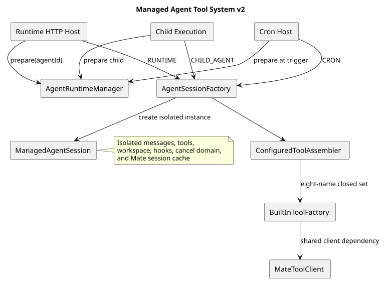

# Agent 与 Skill 受管运行目录

> 文档版本：3.3.0
>
> 状态：Implemented
>
> 更新日期：2026-08-26
> 规范性工具契约：[CampusClaw 受管 Agent 工具系统 v2](tool-system-v2.md)

## 1. 源码基线

- 变更前观察基线（CampusClaw）：`56be8eee59415a5f86658d6635a7b7e8891263d3`
- 本次审查实现提交：`92e45b4cbd45208991b87498c194b932d3dc07a5`
- 设计仓：`c2a495838134aa5e8bc535b906e7534b34779279`
- 受管目录证据：
  `modules/coding-agent-cli/src/main/java/com/campusclaw/codingagent/runtime/AgentRuntimeManager.java`，
  符号 `prepare`/`refresh`/`requireSessionLoadable`；
  `modules/coding-agent-cli/src/main/java/com/campusclaw/codingagent/runtime/MateServiceClient.java`，
  符号 `querySkillInfo`/`getAgentRuntime`。
- 公开错误证据：
  `modules/agent-core/src/main/java/com/campusclaw/agent/tool/ToolExecutionPipeline.java`，
  符号 `failureResult`；
  `modules/coding-agent-cli/src/main/java/com/campusclaw/codingagent/runtimeapi/event/RuntimeEntryCodec.java`，
  符号 `toolResultEntry`/`toSseData`/`toHistoryEvent`；
  `modules/cron/src/main/java/com/campusclaw/cron/engine/CronJobExecutor.java`，符号 `stableCodeOf`。

基线源码观察到 CLI 生成运行目录与 HTTP 只读目录采用不同文件名，并在 Skill
`references/tools.json` 保存远端工具快照。本次把两条链收敛为服务端三入口共同使用的一个
受管目录；这是架构改造。远端工具不落盘，由 Mate 工具在 Session 内实时发现。

## 2. 目录契约

```text
agent/{agentId}/.campusclaw/
├── agent.json
├── settings.json
├── SYSTEM.md
├── agents/{agentName}.json
└── skills/{skillName}/
    ├── skill.json
    ├── SKILL.md
    ├── references/
    └── templates/
```

根 `agent.json` 是当前 Agent 身份；`agents/{agentName}.json` 是一个直接绑定 Child 的轻量
身份与固定版本；`skill.json` 保存 `schemaVersion=1`、`id`、`name`、`version`。名称必须与
路径精确一致且大小写折叠后唯一。目录拒绝符号链接和任何 `tools.json`。

## 3. prepare 与 refresh



[PlantUML 源码](tool-system-v2/diagram.puml#L1)

`prepare(agentId)` 先加载完整本地缓存；只有缺失或不完整时访问 Mate。querySkillInfo 的
Skill 响应结果取自 `result` 字段，解析时要求该字段为 JSON 对象；其 `content` 字段是完整
SKILL.md 内容，原文写入 `skills/{name}/SKILL.md`，不从元数据生成。发布前校验 SKILL.md：
非空且不超过 1 MiB、frontmatter `name` 与响应 name 及 `skill.json`/目录名一致、
`description` 必填，并用会话同一套 `SkillLoader` 复核可加载；校验失败不发布、保留旧缓存。
缓存命中读取复用同一校验入口（字节上限 + `SkillLoader` 完整规则 + 名称与 `skill.json`/
目录名一致），磁盘内容损坏、超大或超长时判缓存不完整并重新拉取，而不是带着缺陷命中缓存。
CampusMate 响应解析不按 `resCode` 预判结果，只校验 `result` 形状；空响应体、非法 JSON、
根节点非对象、`result` 缺失/类型不符统一抛带稳定错误码（`AgentRuntimeErrorCode`）的
`AgentRuntimeException`。Session HTTP 边界经 `FileAgentDirectoryResolver` 映射为
`AGENT_NOT_AVAILABLE`。工具失败 Entry 只持久化 `error_code`，SSE 和历史查询按请求
locale 输出 `errorCode` 及 MessageSource 生成的 `errorMessage`；Cron 新运行记录只持久化稳定
错误码，旧 JSONL 的 `error` 字段仅作为兼容读取。内部英文诊断仅作为 cause 与日志。
远端内容先写入同级 staging 目录，通过 Agent、Skill、Child、文件类型、资源名、ID/版本和
边界校验后原子发布。发布失败清理 staging 并保留旧目录。

`refresh(agentId)` 是管理面显式操作，总是重建目录；它不由模型工具或配置热更新触发。
HTTP Session 创建、Cron 触发和 Child Execution 均调用 prepare，因此冷目录可以自动创建，
完整热目录不产生远端访问。

## 4. Session 消费

`AgentSessionFactory` 从 `PreparedAgentRuntime` 取得 SYSTEM、Skill 名称到 ID 映射、直接 Child
映射和 bindingModels，并按 `RUNTIME`、`CRON`、`CHILD_AGENT` profile 组装工具。Skill 文档
用于提示词资源，Skill ID 只在 `ListMateTools(skillName)` 与 Call miss 的完整发现中使用。

目录缓存和 Session 生命周期分离：refresh 只影响随后创建的 Session，不修改正在执行的
Session 快照。工具配置也只在应用启动时解析，不由 refresh 变更。

## 5. 安全边界

- `agentId` 必须符合领域 ID 格式且只解析为 `agents-root` 下的单目录；
- 本地缓存树任何符号链接都会使其无效；
- 资源名不允许路径分隔、`.`、`..` 或 NUL；
- Agent/Skill/Child 的名称、ID、版本和绑定坐标必须一致；
- staging 校验通过前不替换可用目录，失败不发布半成品；
- `Read`、`Find`、`Grep`、`Ls` 的边界是完整 `agent/{agentId}`，不只是 `.campusclaw`。

## 6. CampusMate 共享配置

受管目录客户端从 `campusmate.endpoints.agent-runtime-path-template` 和共享的
`skill-info-path-template` 获取 operation path；不再持有独立 `campusmate.runtime.base-url`。
Model、受管 Runtime 与 Tool 统一使用必填 `campusmate.base-url`。Runtime 自有的 agents root、
超时和响应大小限制仍在 `campusmate.runtime`，没有被错误提升为共享参数。

完整配置图、源码证据和迁移规则见
[CampusMate 客户端共享配置设计](campusmate-shared-config.md)。该架构改造不改变受管目录的
prepare、refresh、原子发布或 HTTP 契约。

## 7. 版本历史

| 版本 | 日期 | 说明 |
|---|---|---|
| 3.3.0 | 2026-08-26 | 工具失败事件按请求语言生成公开错误文案；Cron 使用通用稳定错误码并兼容旧运行日志；SKILL.md 字节上限收敛为单一定义。 |
| 3.2.0 | 2026-08-26 | querySkillInfo 的 Skill 响应结果取自 `result`，`result.content` 原文写入 `SKILL.md`；发布前校验 frontmatter `name`/`description` 并用 `SkillLoader` 复核；移除 resCode 预判与 `success-code` 配置，响应解析失败携带稳定错误码。 |
| 3.1.0 | 2026-08-26 | Runtime 复用 CampusMate 单一 base URL、共享 Agent/Skill Endpoint，并保留本地参数边界。 |
| 3.0.0 | 2026-08-24 | 删除 CLI 双契约和 tools.json，统一服务三入口目录、缓存优先 prepare 与管理面原子 refresh |
| 2.x | 2026-08-21 以前 | 历史 CLI 运行目录生成与 HTTP 只读目录设计，已由 ADR-0022 取代 |
