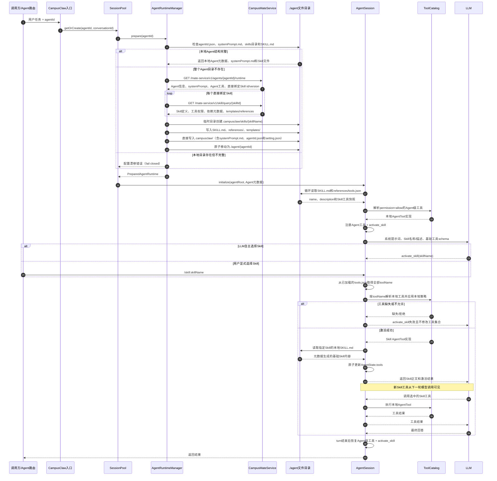

# Agent 与 Skill 本地优先运行时设计

> 本文记录 CampusClaw 的 Agent 目录发现、CampusMate 冷启动物化、Skill 选择、本地工具快照和动态工具装配流程。

## 1. Context：背景、目标与边界

CampusMateService 保存 Agent、Skill 绑定和工具权限，CampusClaw 执行 Agent 并从本地目录加载 Skill。过去由部署脚本静态复制目录，运行时启停和实际可执行内容彼此割裂。本设计把“选定 Agent 后如何发现 Skill、按需查询工具并执行”收敛到 CampusClaw 运行时，同时保持已经确定的本地优先规则。

对应决策记录：[ADR-0011：Agent 与 Skill 运行时解析](../decisions/0011-agent-skill-runtime-resolution.html)。

CampusClaw 负责决定运行哪个 Agent。选定 `agentId` 后，CampusClaw 优先使用本地目录；本地快照无法加载时调用 CampusMateService 重新物化覆盖（自愈语义）。快照防篡改与防漂移校验暂缓，见 [ADR-0013](../decisions/0013-defer-snapshot-hardening.html) 与 [DEF-008](../DEFERRED.md)：

```text
./agent/{agentId}/.campusclaw/agentId.json
./agent/{agentId}/.campusclaw/setting.json
./agent/{agentId}/.campusclaw/systemPrompt.md
./agent/{agentId}/.campusclaw/skills/{skillName}/SKILL.md
./agent/{agentId}/.campusclaw/skills/{skillName}/references/*
./agent/{agentId}/.campusclaw/skills/{skillName}/references/tools.json
./agent/{agentId}/.campusclaw/skills/{skillName}/templates/*
```

`setting.json` 记录模型选择信息，由 GetAgentRuntime 的 `bindingModels` 列表派生：首个非空白模型作为 `defaultModel`，全列表作为 `enabledModels`；`agentId` 与 `agentVersion` 来自响应同名属性（`agentVersion` 为纯数字时写成数字，否则保留字符串）。该文件随物化写入；当前版本的本地加载不强制校验其存在（暂缓项，见 DEF-008）。

Agent 可由以下入口指定：

- CLI：`--agent-id <agentId>`
- REST：`POST /api/chat` 请求体中的 `agent_id`
- WebSocket：`/api/ws/chat?agent_id=<agentId>`

未指定 `agentId` 时保持原有非托管 Agent 行为。

## 2. 关键定义与组件职责

- **托管 Agent**：通过 `agentId` 选择、目录位于 `agents-root/{agentId}`、元数据来自 CampusMateService 的 Agent。
- **Skill 发现**：只读取 `SKILL.md` frontmatter，把 `name`、`description` 暴露给模型，不等同于激活 Skill。
- **Skill 激活**：选定 Skill 后读取本地生成的 `SKILL.md` 和已加载的工具快照，并更新下一轮 LLM 可见工具集合。
- **本地工具实现**：CampusMateService 返回工具元数据，实际执行对象始终来自当前 CampusClaw Pod 的 `ToolCatalog`。

| 组件 | 职责 |
|---|---|
| `AgentRuntimeManager` | 校验 `agentId`、本地优先加载、解析直接绑定 Skill、冷启动物化 Agent 目录和 `systemPrompt.md`、加载本地 Agent 系统提示词和模型配置、生成并加载 Skill 工具快照 |
| `MateServiceClient` | 调用 GetAgentRuntime 和 querySkillInfo，校验业务响应及 Agent/Skill 版本坐标 |
| `AgentSession` | 同时加载当前托管 Agent 的 Skill 和 `references/tools.json`、构建模型上下文、从统一发现链路选取 `activate_skill` 控制工具、动态更新工具集合 |
| `SessionPool` | 按 `(agentId, conversationId)` 隔离会话和持久化目录 |
| `ToolCatalog` | 提供 CampusClaw Pod 内真实可执行的 `AgentTool` 实现：仅索引 Spring 注册的 `AgentTool` 与 in-tree extension 贡献（严格 ADD、首注册者得、无 replace/wrap/disable），配合 include/exclude、`noTools` 的 `ToolSelection` 应用本地工具策略；不扫描用户/项目目录、不接入 MCP、不从声明动态创建工具（ADR-0011） |

## 3. 架构与数据流

入口先确定 `agentId`，`SessionPool` 再调用 `AgentRuntimeManager.prepare(agentId)`。Manager 返回不可变的 `PreparedAgentRuntime`，会话以 Agent 根目录作为 `cwd`，因此现有 SkillLoader 可直接读取 `.campusclaw/skills`。LLM 只能通过顺序执行的 `activate_skill` 激活 Skill；工具激活成功后，`AgentLoop` 在下一轮从共享 AgentState 重新生成工具 schema。

会话键为 `(agentId, conversationId)`，相同 conversationId 在不同 Agent 下不会复用状态或持久化文件。
会话列表和删除接口也接受 `agent_id`，分别定位该 Agent 的持久化 cwd 和内存会话键。

## 4. 契约改动

### 4.1 获取 Agent 运行信息

```http
GET /mate-service/v1/agents/{agentId}/runtime
```

响应使用附件中的 GetAgentRuntime 字段。实现将 `bindingSkills` 同时兼容单对象和数组，因为附件定义为单对象，而运行流程需要处理 `skill-1...n`。

GetAgentRuntime 的 `bindingSkills` 只提供当前 Agent **直接绑定** Skill 的 `id`、`version` 坐标，不作为完整 Skill 定义使用。

### 4.2 获取直接绑定 Skill 的定义

```http
GET /mate-service/v1/skill/query/{skillId}
```

CampusClaw 对 GetAgentRuntime 返回的每个直接绑定 `(skillId, version)` 各调用一次 querySkillInfo。响应必须成功且唯一，并且返回的 `id`、`version` 必须与绑定坐标精确一致。CampusClaw 使用返回的 name、description、useCases、bindingTools、bindingSkills、templates 和 references 构造本地 Skill 快照。

querySkillInfo 中的 `bindingSkills` 仅作为该 Skill 的依赖元数据保存。本流程不递归查询这些依赖，不为其创建目录，也不把它们自动暴露为当前 Agent 可选择的 Skill。

### 4.3 Skill 工具本地快照

querySkillInfo 返回的 `bindingTools` 是 Skill 工具的唯一远端来源。CampusClaw 在冷启动物化 Skill 时，将全部工具写入：

```text
./agent/{agentId}/.campusclaw/skills/{skillName}/references/tools.json
```

文件格式为：

```json
{
  "tools": [
    {
      "tool_id": "xxx",
      "name": "xxx",
      "description": "xxx"
    }
  ]
}
```

`tools.json` 不按 `permission` 过滤，也不保存 `permission` 字段；每个 `bindingTools` 条目都映射为 `tool_id`、`name`、`description`。Skill 激活阶段直接读取该文件，不再调用 querySkillTools，也不再与 SKILL.md 做一致性比对（暂缓项，见 DEF-008 ③）。

Skill 不落任何独立元数据 JSON（无 `skill.json`），也不持久化 Skill id：`SKILL.md` 的 front-matter 头部（`name`、`description`）是 Skill 身份的唯一持久化来源，本地缓存加载时解析该头部重建名称与描述。Agent 运行过程不需要 Skill id——`skills/` 目录下存在以 Skill 名称命名的子目录即证明 Agent 绑定了这些 Skill；`agentId.json` 的 `bindingSkills` 引用仅在物化阶段用于 querySkillInfo。缓存完整性只校验「可解析 SKILL.md 的子目录数量与声明绑定数一致」，不一致时重新物化并清空重建整个 `skills/` 目录（CampusMate 为权威源，覆写过时绑定）。

### 4.4 CampusClaw 入口

- CLI 新增 `--agent-id`。
- REST `POST /api/chat` 新增可选字段 `agent_id`。
- WebSocket 握手新增可选查询参数 `agent_id`。
- REST `GET/DELETE /api/conversations` 新增可选查询参数 `agent_id`。
- 新增配置前缀 `campusmate.runtime`，用于 CampusMate 地址、Agent 根目录、业务成功码和超时。

## 5. 设计决策与运行规则

### 5.1 Agent 本地发现与冷启动

1. 解析 `./agent/{agentId}` 路径（agentId 仅要求非空，穿越防护暂缓，见 DEF-008 ①）。
2. 本地存在 `agentId.json`、`systemPrompt.md`、`skills/` 目录，且每个子目录的 `SKILL.md` 头部（name/description）可解析、数量与 `bindingSkills` 声明一致时，直接加载本地缓存，不调用 CampusMateService。
3. 本地快照缺失或无法加载（含物化中断的半成品）时调用 GetAgentRuntime，取得 Agent 信息与直接绑定 Skill 的 `(id, version)` 列表；对每个绑定调用 querySkillInfo（返回为空报错，其余形状校验暂缓）。`systemPrompt.md` 是本地会话系统提示词来源，允许用户本地修改。
4. 物化先清空重建 `skills/` 目录（权威覆写，过期绑定的 Skill 目录不会残留），再写入：基础 `SKILL.md`（name/description frontmatter）、`references/`、`templates/`、`references/tools.json`（全部 `bindingTools`）、`systemPrompt.md`、`agentId.json`、`setting.json`（原子发布与资源白名单暂缓）。

### 5.2 Skill 发现

托管 Agent 只扫描自身的 `.campusclaw/skills`，不会加载 `~/.campusclaw/agent/skills`，防止其他 Agent 或用户级 Skill 泄漏。加载每个 `SKILL.md` 时同时加载并缓存同一 Skill 的 `references/tools.json`。初始系统提示词只包含各 Skill 的 `name`、`description`，不暴露文件位置。

### 5.3 Skill 与工具激活

初始工具集合为：

```text
baseTools = 本地工具策略 ∩ permission=allow 的 Agent 级工具
            + 本地工具策略可见的控制工具（如 activate_skill，不受远端 allow 列表约束）
```

`activate_skill` 是无状态的 Spring `@Component`（`codingagent/tool/skill`），经 `SpringAgentToolSource → ToolCatalog` 统一发现，随 include/exclude、`noTools` 与热刷新一起管理；非托管会话将其过滤掉。LLM 根据 Skill 头信息调用 `activate_skill(skillName)`。显式 `/skill:skillName` 也先执行相同的查询与激活流程。CampusClaw 随后：

1. 无状态控制工具只校验参数并返回确认文本；真正的激活副作用由会话级 after-tool-call handler 执行——handler 挂在 `Agent.setAfterToolCall` 上，识别 `activate_skill` 调用后完成下述步骤，并用 Skill 指令覆盖工具结果内容。

1. 确认 Skill 已绑定当前 Agent、已在本地 Registry 注册，并且会话初始化时已经加载对应 `tools.json`。
2. 从会话中的 Skill 工具快照取得全部 `toolName`；激活阶段不访问 CampusMateService。
3. 将工具名与本地 `ToolCatalog` 和 CLI 工具策略求交集；任何应加载但本地不存在的工具都会使本次激活整体失败。
4. 读取本地生成的 `SKILL.md` 内容并作为 `activate_skill` 结果返回。当前接口没有真实 Skill 指令正文，因此这里只包含由元数据生成的基础内容。
5. 一次性把 Skill 工具加入 `AgentState.tools`。`AgentLoop` 在下一轮模型调用时重新生成工具 schema，因此无需改动 AgentLoop。
6. 当前 Agent turn 完成后恢复 `baseTools`。

同一条 assistant 消息不能先调用 `activate_skill`，又立即调用刚加入的工具；新工具从下一轮 LLM 调用开始可见。

## 6. 顺序图



## 7. 边界情况与 DFX

- **安全**：`agentId`、`conversationId`、Skill name 和资源文件名都采用受限单路径段格式；资源 `fileType` 仅允许 `md|txt`；非法值、路径穿越、重复目标文件和 Agent 缓存路径中的符号链接直接拒绝。绑定 Skill 数、资源文件数、单文件和累计字节数均有上限；本地 `SKILL.md` 与资源文件必须和 `skill.json` 快照完全一致。Skill 工具元数据按 ID/名称校验，实际工具仍须同时存在于 CLI 可见范围和 Spring ToolCatalog 中。Agent 级基础工具继续应用 Agent 权限与禁止列表，Skill 级工具则按 `tools.json` 的完整列表解析；运行时缓存物化和会话持久化属于 CampusClaw 内部写入，不是 LLM 工具。
- **一致性**：冷启动先验证 GetAgentRuntime 的直接绑定坐标与每个 querySkillInfo 响应的 id/version，再在临时目录写全并原子移动；既有半成品 fail closed，不做原地拼接。激活只有在本地 Skill 内容和全部本地工具解析成功后才一次性更新工具集合。
- **并发**：同一 session 同时只允许一个 prompt 持有可变上下文。工具热重载在 turn 执行期间延迟，空闲时按各 Agent 的 cwd 刷新解析；两个生产 ToolSource（Spring/Extension）均不随 cwd 变化，刷新只保证快照上下文一致。
- **故障隔离**：CampusMate 超时、非 2xx、业务失败码、querySkillInfo 返回零条/多条/版本不匹配、资源非法或本地工具缺失均 fail closed；失败不会发布半成品目录，也不会改变当前工具集合。
- **性能**：完整本地目录不产生 GetAgentRuntime 网络请求；Skill 激活不产生远程请求。会话复用已加载的 frontmatter 和本地工具快照。
- **可观测性**：工具重载响应包含 `deferredSessions` 和 `failedSessions`；接口异常保留操作名、HTTP/业务错误信息，目录漂移会明确失败。

## 8. 当前接口限制

当前实现严格适配已给出的接口，但契约本身还有以下限制：

- querySkillInfo 提供 references/templates 文本内容，但仍没有真实 `SKILL.md` 指令正文。冷启动只能根据 Skill 元数据生成包含 frontmatter、description 和 useCases 的基础 `SKILL.md`；若要恢复完整 Skill 工作流指令，CampusMateService 仍需补充正文或制品包。
- GetAgentRuntime 的直接绑定和 querySkillInfo 都没有明确的 Skill `enabled/status` 字段。本实现只能把 GetAgentRuntime 的直接 `bindingSkills` 视为当前有效 Skill。
- querySkillInfo 的 `bindingSkills` 只保存为依赖元数据；本流程不递归解析依赖。如果未来需要执行依赖 Skill，必须另行定义依赖的授权、可见性和版本闭包规则。
- 本地目录完整后不再请求 GetAgentRuntime，因而启停/解绑不会自动刷新本地缓存。需要后续增加 revision、TTL、显式刷新或失效推送。
- `tools.json` 是冷启动时生成的 Skill 工具元数据快照，本地缓存有效期间不会重新查询 CampusMateService；工具绑定变化仍依赖 revision、TTL、显式刷新或失效推送。
- Agent 级 `ask` 权限需要主 Agent 的用户审批协议；在该协议接入前默认拒绝。Skill 级 `permission` 不参与 `tools.json` 的生成或加载。

## 9. 代码改动点（实现映射）

本节把时序图中的每个运行时动作映射到实际代码，便于后续维护和接口演进。

| 设计动作 | 主要代码 | 实现内容 |
|---|---|---|
| 接收已选定的 Agent | `CampusClawCommand`、`ChatHandler`、`ServerMode`、`ChatWebSocketHandler` | CLI、REST、WebSocket 都传递 `agentId`；未指定时保留原有非托管 Agent 流程。 |
| 按 Agent 隔离会话 | `SessionPool` | 使用 `(agentId, conversationId)` 作为会话键；Agent 的 cwd、历史文件、删除和重命名操作均按 Agent 隔离。会话创建在 map 锁外执行（含远程 prepare），同一会话并发创建经 in-flight future 去重；`GET /api/conversations` 只读解析 cwd（`prepareCached`，不触发远程拉取与目录物化，未缓存回退 base cwd）。 |
| 本地优先准备 Runtime | `AgentRuntimeManager.prepare` | 入口先按 OpenAPI 同款段格式正则校验 `agentId`（穿越值直接拒绝，ADR-0013 ①兜底）；再校验 `./agent/{agentId}` 的完整缓存，完整时不访问 CampusMate，半成品重新物化。准备按 agentId 串行（不同 Agent 互不阻塞）。 |
| 获取 Agent 与 Skill 定义 | `MateServiceClient`、`AgentRuntimeManager` | 调用 `GetAgentRuntime` 获取 Agent 元数据和直接绑定的 `(skillId, version)`，再逐个调用 `querySkillInfo` 获取完整 Skill 快照。 |
| 物化本地目录 | `AgentRuntimeManager` | 直接写入 `agentId.json`、`setting.json`、`systemPrompt.md`、`skill.json`、`SKILL.md`、`references/tools.json`、其他 references 和 templates；无法加载的存量快照被重新物化覆盖。 |
| 校验缓存一致性 | `AgentRuntimeManager` | 校验 `systemPrompt.md` 存在且是普通文件，并校验绑定 id/version、目录集合、Skill 名称、SKILL.md 全文、tools.json、资源内容、符号链接、路径和大小限制；拒绝额外未绑定 Skill。 |
| 创建不可变运行时快照 | `PreparedAgentRuntime` | 保存 Agent 元数据、Agent 根目录和直接绑定 Skill 元数据，供单个会话使用，不让会话重新猜测绑定关系。 |
| 发现 Skill | `AgentSession`、`SkillLoader`、`SkillPromptFormatter` | 同时加载当前 Agent 的 `SKILL.md` 和 `references/tools.json`，向模型暴露 `name/description`，不暴露文件路径，也不扫描用户级 Skill。 |
| 让模型选择 Skill | `ActivateSkillTool`、`AgentSession` | 注册结构化 `activate_skill(skillName)`；显式 `/skill:name` 也进入同一激活流程。 |
| 加载 Skill 工具 | `AgentRuntimeManager`、`AgentSession`、`ToolCatalog` | 从 `references/tools.json` 加载全部 Skill 工具名，校验其与 `skill.json` 一致，再解析本地可执行工具；激活时不访问 CampusMateService。 |
| 使工具在下一轮可见 | `AgentSession`、`AgentLoop` | 激活成功后更新 `AgentState.tools`；`AgentLoop` 下一轮重新生成工具 schema，turn 结束恢复基础工具集合。 |
| 删除不需要的执行层 | `ToolCatalog`、普通 Tool Bean、部署配置 | 保留静态 Spring ToolCatalog，删除 Docker sandbox、Hybrid Tool、动态 Process Tool、DinD 部署和相关脚本；Agent 级基础工具保留禁止列表，Skill 级工具按完整 `tools.json` 加载。 |
| 保持双实现一致 | `modules/coding-agent-cli`、`mate-campusclaw` | 两套 CampusClaw 实现同步包含 Runtime Client、Runtime Manager、Session 隔离、Skill 激活和安全校验。 |

### 9.1 运行时工具集合

代码中的工具边界可以概括为：

```text
baseTools = 本地ToolCatalog
            ∩ CLI/settings工具范围
            ∩ Agent permission=allow
            - 托管Agent禁止工具
            + activate_skill

activeSkillTools = baseTools
                   + (本地ToolCatalog
                      ∩ CLI/settings工具范围
                      ∩ references/tools.json中的工具名)
```

`activate_skill` 是唯一的运行时控制工具；`tools.json` 保存全部 Skill 工具元数据，Skill 的业务工具仍必须先在本地 `ToolCatalog` 中存在。

### 9.2 与当前接口的边界

当前实现已经完成 Skill 加载、发现、激活和工具装配，但以下能力需要 CampusMateService 后续补充契约：

- `querySkillInfo` 需要提供真实 `SKILL.md` 正文或制品包，否则当前只能根据 description/useCases 生成基础正文。
- `GetAgentRuntime` 需要提供 revision、TTL 或 enabled/status，才能让本地缓存感知 Skill 启停和解绑。
- Agent/Skill Runtime 需要 revision 或失效通知，才能在 `tools.json` 生成后感知工具绑定变化。
- 如果要支持 Skill 依赖的递归加载，需要明确依赖的可见性、版本闭包和工具授权规则。

## 10. 配置

```yaml
campusmate:
  runtime:
    base-url: ${CAMPUSMATE_RUNTIME_BASE_URL:http://campusmate-service:8080}
    agents-root: ${CAMPUSCLAW_AGENTS_ROOT:agent}
    connect-timeout: PT10S
    request-timeout: PT30S
    success-code: ${CAMPUSMATE_SUCCESS_CODE:0}
```

## 11. 测试与验证范围

- GetAgentRuntime 同时兼容直接响应和 `result` 包装，`bindingSkills` 同时兼容单对象与数组，并只解释为直接绑定 Skill 的 id/version 坐标。
- 冷启动对每个直接绑定 Skill 调用一次 querySkillInfo；零条、多条、重复 id/name 或绑定版本不匹配时 fail closed。
- 完整本地目录命中时不访问 CampusMateService。
- 冷启动把 GetAgentRuntime 的 `systemPrompt` 写入 `.campusclaw/systemPrompt.md`，并创建 Agent 元数据、Skill 元数据快照、基础 SKILL.md、references/tools.json 及 querySkillInfo 返回的 references/templates 文本文件。
- 本地 `systemPrompt.md` 缺失、存在额外未绑定 Skill、SKILL.md、tools.json 或资源遭修改、资源缺失或超出数量/大小上限时 fail closed；修改本地 `systemPrompt.md` 后，新建会话直接使用本地内容，不调用 CampusMateService。
- `../` 等非法 Agent ID、非法 Skill/资源名、非 `md|txt` fileType、非法 conversation ID 和缓存路径中的符号链接被拒绝。
- querySkillInfo 的依赖 `bindingSkills` 被保存但不会触发递归请求或自动成为 Agent 可见 Skill。
- 已存在但不完整的 Agent 目录 fail closed，不产生混合版本。
- tools.json 写入 querySkillInfo 返回的全部 Skill 工具，不按 `permission` 或工具名称过滤。
- 加载 Skill 时同步加载 tools.json；激活 Skill 时不调用 querySkillTools。
- 托管 Agent 不加载全局用户 Skill。
- `activate_skill` 成功后下一轮工具集合包含 Skill 工具；失败时不改变原工具集合。
- 相同 conversationId 在不同 agentId 下不会复用同一个 Session。
