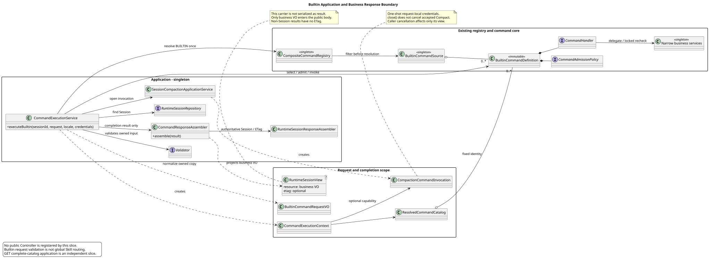

# Builtin 执行应用与业务响应

版本：1.0.0 · 日期：2026-09-07 · 状态：内部 Builtin 应用接入，公共 HTTP 未发布。

## 1. 范围与理由

在七个 Contributor/Handler、窄服务、Compact 调用能力和业务投影已经合入后，
增加一个完整的 Builtin 应用执行通路：输入校验与归一、Session 查询、一次来源解析、
精确 Definition 选择、预览准入、Handler 调用、错误翻译和业务 VO/ETag 组装。
它不依赖另一独立切片的完整 GET Catalog 应用或其新 SPI，不堆叠未合入代码。

`executeBuiltin` 只消费**已选定 Builtin 类别**的请求；它不是共享 HTTP 的全局命名分类器。
不发布 Controller，不把 Builtin 名称校验用于全局拒绝 `skill:*`，不为 Skill 安装伪 Handler。
Skill 请求联合类型、成功协议和私有快照保留仍由各自已确认契约与后续评审约束。
设计仓只读，本实现不替用户新增产品规则。

## 2. 固定证据

实现基线：`pi-mono-java@53496bbec9d8368b19e3b9a03030eed7ce15c182`（#238/#239 均已合入）。
只读设计：`pi-mono-java-design@88f4df16bc24bbfcd28e1ec374feb2de0db8be3b`，
Slash 1.6.0 §3/4、Builtin 2.9.0 §8、Runtime 操作 `13-execute-session-command.json`。
以下 Java 路径前缀为 `modules/coding-agent-cli/src/main/java/com/campusclaw/codingagent/`。

| 来源 | 路径 / 符号 | 观察与本次实现理由 |
|---|---|---|
| Java main | `runtimeapi/service/command/CompositeCommandRegistry.java:resolve(session, kind)` | 已有解析前来源过滤、单次 Catalog 和 Definition 索引；POST Builtin 直接复用，不调用 Skill Source |
| Java main | `runtimeapi/command/builtin/BuiltinCommandDefinition.java:admission/handler`、`runtimeapi/command/catalog/ResolvedCommandCatalog.java:findDefinition` | 定义身份与执行策略已经固定；应用只精确选择，不按名称 switch |
| Java main | `runtimeapi/service/command/CommandResponseAssembler.java:session/models/help/skills` | 已有业务白名单投影，尚无总分派；本次只在这里增加按内部结果类型分派与 Compact 投影 |
| Java main | `runtimeapi/session/RuntimeSessionResponseAssembler.java:getView`、`runtimeapi/session/RuntimeSessionView.java` | 已有同一 Session DTO 生成业务 VO 与 ETag 的通路；复用载体，不新增公开回执，非 Session 业务结果没有 ETag |
| Java main | `runtimeapi/service/command/CompactionCommandInvocation.java:invoke/close` | 一次性凭据交接、隔离结果和关闭不取消已经存在；本次应用使用本地 try-with-resources，不向单例保存请求 |
| Java main | `runtimeapi/vo/ChangeModelRequestVO.java:readModelId/rejectUnknownField`、`runtimeapi/vo/UserEventRequestVO.java:readOptionalText` | 既有 VO 使用严格 JSON 字符串读取及未知字段拒绝；本次 Builtin VO 保留此方式，必填/格式/长度仍用标准 Jakarta 注解 |
| pi `4af9d21d3b4d664e4a29fcabfec85171077248e3` | `packages/coding-agent/src/core/agent-session.ts:_tryExecuteExtensionCommand`（1289 起） | 按名称取 Handler、构造上下文并等待调用；它处理本地 Slash 文本，不定义 Java HTTP、ETag 或数据库锁 |
| 本 PR 新增 | `runtimeapi/service/command/CommandExecutionService.java:executeBuiltin/normalize/requireAdmission` | 连接既有协作者；输入复制后只在本次处理内使用，响应来自 Handler 的权威结果而非旧 Catalog |

普通 JSON、显式 Builtin 输入和禁止回执属于**产品约束**；请求级解析、业务投影复用和异步完成视图属于**架构选择**；
错误去 cause、未知结果拒绝、凭据不进入日志/响应，以及 JSON 不宽松转换属于**安全加固**。
它们不是 pi 已有 HTTP 行为；以上 main 观察与本次新增明确分开。

## 3. 类图与职责

[PlantUML 源码](diagram.puml#L1)

1. 共享入口未来先识别请求类别，再把 Builtin 请求交给 `executeBuiltin`；本 PR 不实现该入口。
2. Service 复制调用方 VO，只把省略/null 的 arguments 归一为 `""`。不修改原对象，不全局 strip 参数。
   必填、名称格式及长度、UTF-16 参数长度由 VO 上的 Jakarta 注解声明，并由 Service 实际验证副本，直接调用/Builder 同样生效。
3. 查询存在的 Session，然后 `resolve(session, BUILTIN)` 一次，按精确名称取得同一 Catalog 内 Definition。
   不存在为 COMMAND_NOT_FOUND；异常的仅展示 Builtin 定义为内部执行失败，而不是临时装一个抛错 Handler。
4. 准入策略以本次 Session 观察值及是否有参数检查；各命令窄服务仍负责参数语义，数据库/Runtime 锁内复核不变。
5. 建立一次性 invocation 与 Context，调用选定 Handler。同步成功、同步失败或返回异步句柄均关闭本次 invocation。
   关闭只清除尚未交接的凭据；已接受 Compact 的凭据仍由其 Holder 持有到执行结束。
6. 结果完成后由唯一 `CommandResponseAssembler.assemble` 选择业务 VO。同步异常、异步异常、空/未知结果统一进入错误翻译。
   对调用方只暴露派生完成视图，取消观察不会取消已接受执行。

名称沿用 `ClawConstants.Skill` 中已经共享的严格名称语法及 64 字符上限，不引入同值转发别名；
参数长度复用 `ClawConstants.RuntimeApi.MAX_MESSAGE_CHARACTERS`。这些引用只约束显式 Builtin VO，不承担类别识别。
JSON 只接受 name/arguments 的字符串或 null，再由 Jakarta 判断 name 必填；拒绝数字/布尔/数组/对象宽松转换和未知字段。
此处 JSON 绑定异常还不是 HTTP 错误响应，最终 Web 仍须映射为 INVALID_COMMAND_REQUEST。

## 4. 响应、错误与生命周期

完整 Session 路径复用既有 `RuntimeSessionView<GetSessionResponseVO>` 与 `getView`；其他结果复用同一 Service 返回载体，
resource 为已有业务 VO，etag 为 null。该载体**不作为 ResultBean.result 序列化**，未来 Controller 只包装 resource 并按需输出 ETag。
没有新公共包装字段或 DTO 泄漏；Model 查询、Help、Skills、Compact 均无 ETag。
查询/修改返回的权威 DTO 决定完整资源与 ETag，投影不查询 Repository，也不从旧 Catalog 拼字段。

错误保留操作 13 的稳定码白名单；AGENT_MODEL_NOT_CONFIGURED 翻译为 MODEL_NOT_AVAILABLE，
其他内部/PUT 专属错误、未知策略码、未知 DTO 和第三方异常均归 COMMAND_EXECUTION_FAILED。
不更改现有 PUT 的条件版本或错误规则。日志只有稳定错误码，没有请求字段、凭据、异常正文或 cause。

所有 Spring 单例只持有 final 协作者。本次输入副本、Catalog、Context、invocation 和完成视图均为局部对象。
没有 ThreadLocal、新线程池、通用事件、Name 边车、队列、数据库表、升级脚本或 Maven 依赖。
Header 捕获/拒绝 If-Match 和 Idempotency-Key、真实 HTTP 状态/ResultBean/Content-Language/Cache-Control、
虚拟请求线程等待以及真实客户端断线和跨进程验收，仍由最终 HTTP 切片负责。

## 5. 验证与交付

新测试覆盖严格 JSON、宽松 Mapper 下仍拒绝未知字段、名称/UTF-16 边界、Builder/缺省归一与不修改原 VO；
一次 Catalog/Definition 身份、来源过滤、准入前拒绝、同步/异步稳定错误及去 cause、空/未知结果、
请求作用域清理、取消观察隔离、两个在途请求乱序完成、权威 Session/ETag 同源，以及七个真实 Contributor 的应用接通。
七 Contributor 测试的窄业务数据和 Runtime 外部执行由 mock 控制，不把它称作真实数据库或 HTTP 验收。
既有 Spring 包扫描同时验证新 Service 的 Validator 与命令协作者装配。

最终验证数字、代码提交与门禁结果在 PR 交付记录中固定。每个 PR 模块新增上限850、镜像后软上限1800/硬上限2000，
使用独立已合入 main 起点，后合方正常同步最新 main；不 force-push。
公司 NativeParent 不可解析时显式同步镜像并校验一致性，公司侧编译仍标注未验证。
实现决策见 [ADR-0065](../../decisions/0065-connect-builtin-command-application.html)。

## 版本历史

| 版本 | 日期 | 变更 |
|---|---|---|
| 1.0.0 | 2026-09-07 | 接通显式 Builtin 应用与结果分派，保留共享 HTTP/Skill 待决边界。 |
