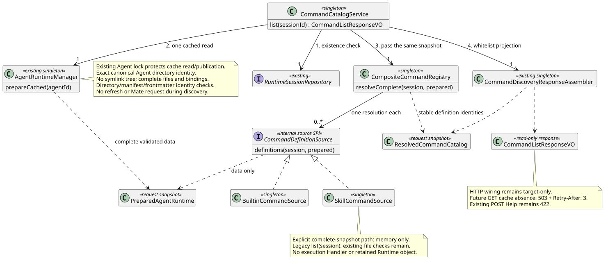

# 完整缓存与同源 Command Catalog 应用

> 版本：1.0.0 · 日期：2026-09-07 · 状态：共享发现应用切片；未发布 HTTP

## 1. Context 与范围

本片从 `origin/main@56d9e389a730a9e9658ebcf7a1189db0937722b1` 独立开发，复用已合入
#238 的轻量响应投影，不堆叠 Compact #239。#239 实际合入后正常快进同步至
`53496bbec9d8368b19e3b9a03030eed7ce15c182`，并使用七个真实 Contributor 重跑验证。
遵循用户授权的并行开发、独立审查、串行合并。
设计仓只读固定为 `88f4df16bc24bbfcd28e1ec374feb2de0db8be3b`：Slash 1.6.0 §3.1、
Builtin 2.9.0 与 Runtime 操作 12。本文仅记录实现决策和证据，不修改设计仓或代决 Skill 执行契约。

目标是消除共享发现中“检查完整缓存一次、Skill Source 再读一次”的混版窗口。
新增 `CommandCatalogService`，先读持久化 Session，再取得一份完整 Agent 缓存，传给所有来源并投影。
缺失缓存不能返回 Builtin 部分成功；完整空 Skill 绑定则成功。运行状态不绕过完整性前置。
不注册 Controller、不改 Runtime 执行/凭据/事务、不调用模型或远端刷新。

## 2. 源码证据与关键定义

下表均分析 Java `53496bbe`（与起始基线相同的缓存/来源代码）；路径根为
`modules/coding-agent-cli/src/main/java/com/campusclaw/codingagent/`。

| 路径 / 符号 | 已观察行为 | 实现决策与理由 |
|---|---|---|
| `runtimeapi/session/RuntimeSessionService.java:get` | 通过 Repository.find 检查存在性再组装 Session | Catalog 沿同一查询边界先检查存在性，不虚构新租户或授权协议 |
| `runtime/AgentRuntimeManager.java:prepareCached/withAgentLock` | 在既有 Agent 锁内读取完整快照，不调用 Mate | 应用仅调用一次，返回对象贯穿完整来源解析，不重复查询 |
| 同文件 `requireAgentRoot` | 规范 Agent 路径必须等于请求 Agent 的精确目录，不能仅满足根目录包含关系 | 保留 Agent 根目录、兄弟目录与越界链接的拒绝边界 |
| 同文件 `loadSnapshot/containsForbiddenEntry` | 检查目录安全、整棵树无符号链接和禁用文件，读取身份/设置/系统文案/绑定 | 缺失或损坏整体失败，不能把部分可读内容当作完整清单 |
| 同文件 `loadSkill/requireSessionLoadable/readRequiredFile` | manifest 名称等于目录名，严格 frontmatter/字节上限与文件规则，读入 Skill 文案 | 已捕获数据可以纯内存解析；发布后再查当前文件会混合两个时间点 |
| `runtime/PreparedAgentRuntime.java` | 不可变技能列表和元数据，仅代表一次本地快照 | 复用该既有数据对象，不创建新的持久化版本或保留机制 |
| `runtimeapi/service/command/SkillCommandSource.java:list/hasSkillMarkdown` | 自行 prepareCached；之后又观察当前磁盘 | 旧独立入口不变；新增显式完整快照路径不再观察目录，也不再读取 Manager |
| `runtimeapi/service/command/CompositeCommandRegistry.java:resolve` | 来源过滤在解析之前；一个 Catalog 固定 Definition 身份、状态与元数据 | 增加 resolveComplete，全部来源共用入参；原 Builtin-only 快路径不读 Skill |
| `runtimeapi/service/command/CommandDiscoveryResponseAssembler.java:assemble` | 已合入的过滤、固定顺序及轻量 VO 白名单 | 直接复用，不复制字段规则，不将内部快照公开 |

本次以 Java 既有缓存/发布机制与已确认 GET 设计为主基线，不重新选择 pi 行为。
“无完整缓存不返回部分清单”为**产品约束**；显式快照传递为**架构变更**；
目录身份、禁止链接与公开白名单为继续保持的**安全边界**，不是新增 Skill 执行协议。

## 3. 架构与生命周期

[PlantUML 源码](diagram.puml#L1)

1. CommandCatalogService 读取一次 Repository.find；Session 不存在立即失败，不调用 Manager 或来源。
2. prepareCached 在既有 Manager 的 Agent 锁内读取并校验完整缓存；锁不覆盖响应投影或执行容量。
3. resolveComplete 校验 prepared.agentId 与 metadata.id 均等于 Session.agentId，再调用所有来源。
   不能把另一个 Agent 的快照拼入当前 Session。该内部入口要求入参已通过 Manager 校验，不接受 HTTP 反序列化对象。
4. CommandDefinitionSource 增加 `definitions(session, prepared)`：Agent 数据来源必须覆写并消费这份快照。
   固定 Builtin 来源复用原 Definition，不触发 Handler；Skill 来源只把快照内容转为 DisplayCommandDefinition。
5. 形成唯一不可变 Catalog，复用已有响应组装器输出 VO；不保存 PreparedAgentRuntime、路径或文案到单例。

SPI 依赖方向是**来源解析接口 → 既有只读 Runtime 数据快照**，不是 Core 执行 → Runtime Manager。
接口不依赖 Manager Bean、Holder、凭据、Repository 或控制队列；PreparedAgentRuntime 本身只作为本次内部输入。
Manager 不反向依赖 Command SPI，没有新环。不给 Skill 安装占位 Handler，也不改执行 Context。
DTO 中既有 Skill 私有文案字段沿原发现快照保留，但不会进入公开 VO；未增加保存时间、数据库或历史恢复规则。

## 4. 决策与安全等价性

见 [ADR-0064](../../decisions/0064-complete-command-catalog.html)。

新路径不调用 hasSkillMarkdown，不是裸删安全检查：检查在 Manager 读取完整快照时已经完成，
共享入口仍必须经过它，且不通过自建文件解析器替代。旧 `list(session)` 保留原校验与既有回归测试。
新路径的安全证明覆盖真实 Manager 的文件链接、Skill/Runtime 目录链接、Agent 根目录别名、
兄弟 Agent 别名、越界别名、目录名不匹配、无效 frontmatter 和关键文件缺失。
这些错误整体为 AGENT_NOT_AVAILABLE，不降级为部分 Builtin。

一份快照返回后，其他请求可发布新版本；本次继续使用捕获的不可变数据，不重新读取现有路径。
目录检查证明的是该次 Manager 读取的完整性，不是跨进程防篡改租约，也不授予后续执行权。
POST 仍需独立解析并在各自事务/操作锁内重检；本片不改变任意外部进程并发写文件的既有边界。

## 5. 边界情况与性能（DFX）

- 完整空绑定与无缓存不同；idle/running 均先检查完整性，再由既有准入 DTO 与投影处理可见性。
- prepareCached 的规范路径失败转为 AGENT_NOT_AVAILABLE；不泄漏文件路径或异常文本到业务错误码。
- 同步后的主分支已有七个真实 Builtin；本片直接复用 Contributor 和已合入投影，不补占位 Handler。
- 只读缓存、来源快照与响应均属于请求；Spring 单例只保存固定依赖，没有请求字段、凭据或跨请求 Catalog 缓存。
- 相较“检查后再读取”减少一次完整磁盘读取；后续解析 O(b+s)，排序沿现有 O((b+s) log(b+s))。
  不新增线程、运行容量、锁类型、SQL、依赖或升级脚本。

## 6. HTTP 交付边界

Service 返回未包装 CommandListResponseVO；Controller、ResultBean、输入校验与响应 Header 仍留 Web 切片。
本片内部使用既有 RuntimeApiException/AGENT_NOT_AVAILABLE，不全局改变该错误的既有 422 状态。
最终 GET 必须按 operation 映射为 503 并附 Retry-After: 3；POST Help 保留 422。
不能把当前 Service 异常测试当作实际 GET HTTP 503 验收。

执行类型分派、Compact 执行接入、Skill 成功协议/私有快照保留与公共 Events 中断不在本片。
最终 HTTP 的七个 Builtin/Skill 集成与跨进程验收仍需后续完成。

## 7. 测试与验证

新增测试覆盖 Session 存在性优先、idle/running 缺失缓存、完整空绑定、当前绑定与隐藏投影、
一次 Manager 调用、无 Mate 副作用、发布 A→B 并移除 A 文件后仍使用 A、十类真实文件安全失败、
跨 Agent 拒绝、完整入口单次来源解析和 Definition 身份、来源类型/重名检查，以及 POST Help 422 保持。
既有 Builtin-only、Skill 路径安全、缓存并发发布与完整性测试继续作为回归。

JDK 21 `./mvnw -q spotless:apply checkstyle:check verify` 通过：388 个测试类、1759 个测试，
0 失败/错误/跳过；其中本片新增 26 个测试。测试质量脚本检查为 0 错误/警告；
用户指定路径不存在，使用已归档的同名脚本（不把路径替代说明省略）。
12 个变更 Java 文件的版权、AST 方法/构造器长度和数据对象布局机械检查无发现、无未验证项。
本主题 PlantUML ASCII/生成/SVG XML/重复生成一致性、6 个链接/锚点、
无 Mermaid、ADR 1280px/360px 渲染与人工视觉检查、`git diff --check` 通过。
默认 `scripts/sync-campusclaw.sh` 因无法解析 `com.huawei.hicampus:NativeParent:26.0.0-SNAPSHOT` 失败；
显式 `--no-verify` 同步完成，6 对 Java 源/镜像除包名转换外逐字节相同。
公司镜像编译仍未验证，镜像一致性不替代编译；正式提交行数门禁结果记录在 PR。
没有数据库变更，本片不重跑 openGauss；本地文件/Service 测试不等于完整 HTTP/跨进程验收。

## 8. 版本历史

| 版本 | 日期 | 变更 |
|---|---|---|
| 1.0.0 | 2026-09-07 | 独立完整缓存与同源 Catalog 应用；保留目录安全与 Builtin-only 路径，不发布 HTTP。 |
