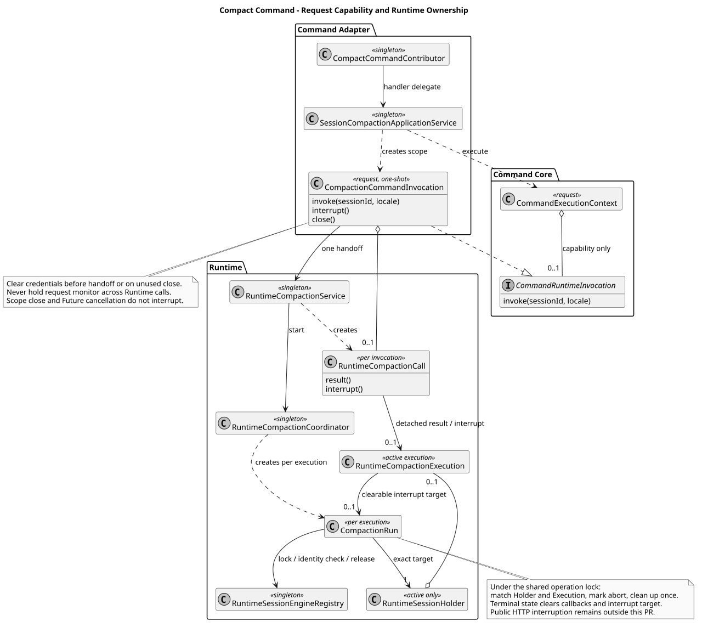

# Compact 命令适配与请求作用域

版本：1.0.0 · 日期：2026-09-07 · 状态：内部命令已接入，公共 Command HTTP 尚未发布。

## 1. Context 与边界

在已合入的 [Runtime 接入服务](compact-runtime-integration.md) 上补 Compact Contributor、Handler、窄适配和本次调用能力。
只接受 idle、空参数，不接 Steer/FollowUp，不修改 POST Events SSE，不恢复旧 Abort 204。
公开结果目标仍仅 `compacted`；内部 `sourceEventSeq` 留给应用投影，不生成公开 commandId 或命令生命周期。
设计仓只读；共享业务 VO/发现投影由另一条独立工作树开发，最终 HTTP 和 Skill 待决部分不在本切片。

## 2. 源码证据与关键定义

Java 分析基线：`ca2600da15dfaf8dda1f16b9d2f3d130b5d9ace5`（#235/#236/#237 已合入）。
用户确认设计：`pi-mono-java-design@88f4df16bc24bbfcd28e1ec374feb2de0db8be3b`，
`04-命令与技能/01-内置命令/README.md` 2.9.0 §7/8、Slash 1.6.0 §3/4、Runtime 操作 13。
Java 路径以下统一以 `modules/coding-agent-cli/src/main/java/com/campusclaw/codingagent/` 为前缀。

| 来源 | 路径与符号 | 观察 / 本次实现与理由 |
|---|---|---|
| Java 基线 | `runtimeapi/command/execution/CommandExecutionContext.java` | 只有 Locale/Catalog；不持有凭据。本次增可选调用能力，已有只读调用者无需构造空凭据 |
| Java 基线 | `runtimeapi/compaction/RuntimeCompactionService.java:compact/prepare/acceptAndStart` | 已有锁内状态复核、空历史 no-op、容量和数据库准入。本次 `start` 返回结果与精确中断能力，原 compact API 委派且兼容 |
| Java 基线 | `runtimeapi/compaction/RuntimeCompactionCoordinator.java:CompactionRun.finishLocked` | 清理后完成独立 Future，断开迟到回调；本次中断复用同一收尾，不新增控制存储 |
| Java 基线 | `runtimeapi/runtime/RuntimeSessionEngineRegistry.java:complete/withOperationLock`、`session/ManagedAgentSession.java:close/abort` | 匹配身份释放容量；close 取消底层压缩并清队列，不要求模型合作完成 |
| 本 PR 新增 | `runtimeapi/service/command/CompactionCommandInvocation.java:invoke/close/interrupt` | 请求级一次性交接，清除本地凭据引用；close 与显式 interrupt 分离，避免断线取消和请求锁/操作锁反转 |
| 本 PR 新增 | `runtimeapi/service/command/SessionCompactionApplicationService.java:execute`、`contributor/CompactCommandContributor.java:definition` | 空参校验、预览准入及 Handler 委派，稳定错误翻译；无中央名称分派 |
| pi `4af9d21d3b4d664e4a29fcabfec85171077248e3` | `packages/coding-agent/src/core/agent-session.ts:compact`（1864–2011）、`abortCompaction`（2017 起） | 使用本次 AbortController 取消压缩，不续跑被打断的 turn；没有 Java 数据库锁、共享容量或普通 JSON HTTP |

idle-only、空参和禁止队列是 Java **产品约束**；请求级能力与隔离完成视图是 **架构差异**；
不向上下文暴露凭据、旧能力不能中断后继执行、异常不携带敏感 cause 是 **安全加固**，不是 pi 既有 HTTP 行为。

## 3. 架构与数据流



[PlantUML 源码](builtin-command-compact/diagram.puml#L1)

应用边界完成授权与 Header 捕获后，按以下内部用法装配；该示例不代表公共路由已发布：

```java
try (var invocation = compactionService.openInvocation(credentials)) {
    var context = new CommandExecutionContext(locale, catalog, invocation);
    // 已选定 Definition 的 Handler 执行；等待期间调用方取消不传播。
    var completion = definition.handler().execute(context, arguments);
}
```

`openInvocation` 每次创建独立对象；单例只保存 final Runtime 协作者。空参校验失败或其他命令未调用能力时，
try-with-resources 清除尚未使用的凭据。首次 invoke 先认领并清空凭据字段，再交给 Runtime 的本次 Holder；
成功、同步失败、空历史和并发重入均不能再调用一次。Locale 与 Session 标识由同一个 Context 提供。
请求监视器只保护认领/句柄读写，不跨 Runtime 调用持有，避免与操作锁中完成回调发生锁顺序反转。

Core 仅知道 `CommandRuntimeInvocation`，没有 Mate Header、Holder、Repository 或 Spring 请求状态。
真实 DTO 复用 `RuntimeCompactionResultDTO implements CommandResultDTO`，不复制一套结果字段。
Handler 只作窄服务方法引用，清单解析没有触发压缩或凭据准备。

## 4. 决策与边界

见 [ADR-0062](../decisions/0062-bind-compact-command-invocation.html)。

- null/缺省 arguments 与空字符串允许；任何非空值（包括空白、自定义摘要指令）拒绝。Help 的空白归一不套到 Compact。
- Definition 的 idle 准入是预览；Runtime 仍在既有操作锁及数据库事务中重新检查，不信任 Catalog 的旧状态。
- 空有效历史返回 false，没有可中断目标，不创建 Holder、占容量、写 Entry 或状态。
- 非空真实压缩返回 `RuntimeCompactionCall`；其权威结果不受调用方派生 Future 的取消或伪造完成影响。
- `close()` 只销毁尚未交接的请求凭据，不取消接受后的压缩。Future 的派生取消也不触发 `interrupt()`。
- 显式内部中断能力绑定本次 Execution；操作锁内同时检查 finished、注册表 Holder 身份及 active Execution 身份。
  接受中断即设置 abort 标记并走一次性收尾，无需等待不合作模型；终态清空中断目标，迟到中断/事件不能作用于下一次执行。
- 公共 Events `user.interrupt` 的身份、响应及外部协议不在本 PR 定义；本次仅提供可供后续适配的内部能力。
- 适配层剥离底层异常 cause，只保留允许的稳定错误码；未配置的当前模型翻译 MODEL_NOT_AVAILABLE，其他未知失败归 COMMAND_EXECUTION_FAILED。
  不记录参数、凭据、第三方异常正文/堆栈；失败后不自动重试。

## 5. DFX 与契约影响

没有新数据库对象、升级脚本、线程池、队列或 Maven 依赖。每次请求增加一个一次性作用域及短生命周期完成视图；
沿用 30 分钟执行预算和共享容量。请求凭据交接后仅由本次 Managed Holder 的既有工具上下文使用，终态断开调用目标。
结果待完成期间保留的调用能力不含凭据副本；原 `RuntimeCompactionService.compact` 的消费者保持原完成/取消行为。
Session/Events 权威领域持久化、PUT If-Match、Name 与 Usage 行为不变。HTTP 真实断线、ResultBean/Header/VO 字段与跨 JVM 公共路由验收仍留后续。

## 6. 测试与验证

新增命令测试覆盖 null/空/非法参数、idle/running 描述、一次性凭据、独立请求、未使用关闭、关闭/取消不传播、
同步/异步错误白名单、敏感 cause 清除、Spring 构造器装配及请求监视器不跨 Runtime 调用。
真实 Registry/Coordinator 测试覆盖精确中断、后继 Holder 隔离、不合作模型、操作锁竞争与各终态解绑。
真实 openGauss 新增三种 Handler → Runtime 链路：空历史六类持久化状态不变、成功 Entry/独立结果、显式中断清理。
数据库和已有生命周期回归组合执行；测试不调用真实模型或外部 Mate，不把重建 Spring 上下文称为新 JVM HTTP 验收。

本切片最终执行 `./mvnw -q spotless:apply checkstyle:check verify`，1715 项常规测试全部通过；
另跑 Repository、LifetimeUsage、CompactionAdmission、CompactionService 四组真实 openGauss 测试，57 项全部通过。
四个新增或修改测试文件的质量检查为 0 errors / 0 warnings。原 checker 路径是失效符号链接，
实际从本机原有 `java-ut-coverage-loop.skill` 归档读取同名脚本执行，未安装或改写技能。
28 个 Java 文件通过版权、方法长度及适用的 DTO 布局机械检查；两个纯 record（各含镜像）另行人工确认。
14 对模块/镜像文件按包名转换逐字一致。公司 NativeParent 解析失败，显式使用同步脚本 `--no-verify` 完成镜像；
公司侧编译仍未验证，不能用开源 verify 代替。图使用 PlantUML 生成，ASCII/XML/重生成一致性、
8 个链接与锚点、ADR 宽窄屏及图视觉检查、`git diff --check` 均通过。

## 7. 交付及版本历史

用户最新决定为独立工作树并行开发、独立复审、串行合并，替代旧串行开发指导；本分支与共享投影分支均从 ca2600da 创建，不堆叠。
模块新增上限850、镜像后软上限1800/硬上限2000，删除不抵扣。后合方普通 merge 最新 main 并验证包扫描夹具等交叉影响。
本切片不发布 Command HTTP，也不由 GET Skill 示例推断未确认的 Skill 执行契约。设计仓未改。

| 版本 | 日期 | 变更 |
|---|---|---|
| 1.0.0 | 2026-09-07 | 接入 Compact Definition/窄服务、一次性请求能力与精确内部中断，保留无路由交付边界。 |
