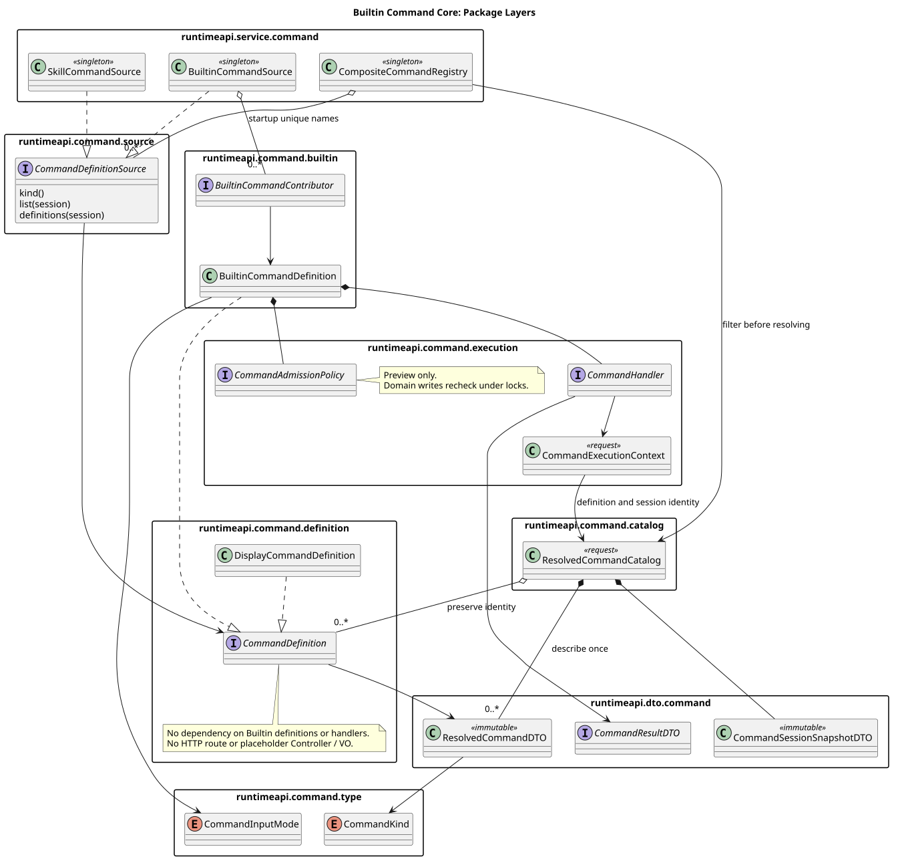

# Builtin Command 分层核心

> 版本：1.1.1 · 日期：2026-09-07 · 状态：核心切片已实现，尚无 Command HTTP 路由

## 1. Context

七个 Builtin 按独立 Contributor、Handler 和窄服务逐批交付。核心切片（PR #218）只交付
共用核心，不注册占位命令，也不提前发布 GET/POST。Builtin、Skill 与共享 HTTP
由用户统一负责设计、实现和集成，Skill 执行属于整体实施与验收范围。

当前依据为设计仓 main `fd8604956632c880264434791465d1f59917038d` 的
`04-命令与技能/00-Slash-Command通用模块/README.md` §1/§5 及 Skill 专题 §1/§4。
原设计 PR #4 的“Skill 执行延期”和后来的“同事并行负责”均已被替代（superseded），
仅保留为历史记录。Builtin 过滤只是来源视图，不是产品命令白名单。
最终共享 HTTP 命名、请求类型和发现清单统一对齐后发布，不用 Builtin 正则封锁 `skill:*`。

## 2. 源码证据与关键定义

| 基线 | 路径与符号 | 已观察行为 |
|---|---|---|
| Java 合并基线 a8192e047f4061bd385297d3dc6c4358362d0d49 | modules/coding-agent-cli/src/main/java/com/campusclaw/codingagent/runtimeapi/command/CompositeCommandRegistry.java · resolve | PR #210 已合并；聚合所有来源并返回只读描述符清单，尚无来源前置过滤 |
| 同一 Java 基线 | 同包 SkillCommandSource.java · list；ResolvedCommandDTO.java | Skill 从完整缓存生成发现 DTO，未提供执行 Handler；内部数据不是响应 VO |
| 本 PR 核心实现 8a402bc794f33e12c756b32b9b7274ad0c289b45 | 同包 BuiltinCommandSource.java · 构造器；BuiltinCommandDefinition.java · describe | 启动时聚合定义并查重；固定元数据、纯准入策略和 Handler 生成请求描述符 |
| 同一核心实现 | 同包 CompositeCommandRegistry.java · resolve；ResolvedCommandCatalog.java · findDefinition；CommandExecutionContext.java | 调用来源前过滤、描述符只解析一次、原定义身份与 Session 观察值固定在 Catalog |
| pi 4af9d21d3b4d664e4a29fcabfec85171077248e3 | packages/coding-agent/src/core/agent-session.ts:1289 · _tryExecuteExtensionCommand | 按名称解析命令并调用 handler(args, ctx)，属于本地扩展命令，不是 Java HTTP Builtin 的实现 |
| 历史设计输入 eec7baf1d52f9f982f7ab4836600cfa2386b3e7c（设计仓） | 04-命令与技能/00-Slash-Command通用模块/README.md；04-命令与技能/01-内置命令/README.md | 七个 Builtin、单次 Catalog 与串行切片；当时的 Skill 分工已被 §1 当前决定替代 |

Java 新类型不能归因于合并前基线。pi 只提供 Handler 与上下文分离的行为参考；
Spring 来源装配、DTO/VO 和企业 HTTP 均为 Java 架构决策。

上述 Java 路径属于各自历史提交。包结构评审基线为
`11b21f95a0d621c48f0cc1d1b826bc5ee72e2507`：19 个命令类型仍混放于 `runtimeapi.command`。
整改实现为 `15aa0bf17b3444af6724cf5557c89ef76d72e13c`，当前相对路径见下表。
本次属于 Java 包依赖架构修正，不改变发现、准入或执行行为，也不推导为 pi 的包结构要求。

## 3. 架构与数据流

[PlantUML 源码](builtin-command-core/diagram.puml#L1)

### 3.1 包归属与依赖方向

下表包名均以 `com.campusclaw.codingagent.runtimeapi` 为前缀；源码根目录为
`modules/coding-agent-cli/src/main/java/com/campusclaw/codingagent/runtimeapi/`。
`campusclaw` 同步相同目录结构，仅替换公司包名前缀。

| 包 | 所属类型 | 允许的命令内部依赖 |
|---|---|---|
| `service.command` | BuiltinCommandSource、SkillCommandSource、CompositeCommandRegistry | 核心 SPI 与 DTO；仅本层装配 Spring 服务和外部 Runtime 协作者 |
| `dto.command` | BuiltinCommandMetadataDTO、CommandSessionSnapshotDTO、CommandResultDTO、ResolvedCommandDTO、SkillCommandSnapshotDTO | `command.type`；Session 复制复用既有 RuntimeSessionDTO，不依赖 Service 或 Handler |
| `command.type` | CommandKind、CommandInputMode | 无命令层反向依赖 |
| `command.definition` | CommandDefinition、DisplayCommandDefinition | DTO；不依赖 Builtin、Handler 或 Catalog |
| `command.catalog` | ResolvedCommandCatalog | 通用定义与 DTO；不依赖具体 Builtin 定义 |
| `command.execution` | CommandHandler、CommandAdmissionPolicy、CommandExecutionContext | Catalog 与 DTO；不依赖 Spring 或注册服务 |
| `command.builtin` | BuiltinCommandDefinition、BuiltinCommandContributor | 通用定义、执行 SPI、类型与 DTO |
| `command.source` | CommandDefinitionSource | 通用定义、类型与 DTO；不依赖具体来源服务 |

关键调用依赖为 `builtin → execution → catalog → definition → dto → type`，
Source SPI 依赖通用定义，Spring 服务依赖这些核心抽象。通用定义与 Builtin 定义分包，
避免 Catalog 保存定义索引时反向依赖持有 Handler 的 Builtin 包；命令相关包之间无环。
Catalog 构造器仅因注册服务跨包创建快照而改为 public；排序、查重与单次解析仍由 Registry
负责，构造器不新增业务校验。三个测试类同步归入 `runtimeapi.service.command`，以公开核心
接口验证协作，不依赖旧包的可见性。未新增 Controller、VO 或兼容旧包的占位类型。

### 3.2 运行机制（保持不变）

- 单例 BuiltinCommandSource 在构造时调用各 Contributor 一次，拒绝同名定义并复制集合。
  核心 PR 允许零 Contributor；后续七个具体命令逐个落地，不安装假 Handler。
- CommandDefinition 只定义 describe；DisplayCommandDefinition 包装现有 Skill 发现 DTO。
  接口不 sealed，Skill 真实执行可增加专用定义，无需继承 Builtin。
- CommandDefinitionSource 新增 kind；默认 definitions 用展示定义适配现有 list。
  Builtin 覆盖 definitions 返回启动期定义。来源必须显式声明类型，不能默认假定 Skill。
- resolve(session, BUILTIN) 先检查来源类型，再解析所选来源；resolve(session) 保留全来源视图。
  来源声明与描述符 kind 不一致时失败，不接受伪装来源。
- Registry 每个定义只调用一次 describe，再将排序描述符与原定义索引一起固定。
  list/find 只读描述符；findDefinition 返回同一 Handler 所属的定义，不重新访问 Source。
- CommandExecutionContext 从 Catalog 读取同一 Session 快照及清单，并持有 Locale。
  Catalog 用于定义身份、准入与分派，不是 Help 内容来源；Help 窄服务读取完整 Agent 元数据。
  Context 不保存可变 RuntimeSessionDTO、Repository、Holder 或 Mate 凭据。

## 4. 设计决策

[ADR-0049](../decisions/0049-builtin-command-json-execution.html) 记录选项与取舍。

响应 [PR #218 包结构评论](https://github.com/superheromeZzh/pi-mono-java/pull/218#discussion_r3930555908)，
层级必须落实到 package 与 imports，而非只在类名或逻辑类图上区分；不扩展为全仓 MVC 重构。

准入策略仅返回观察时的不可用原因，null 表示可用；带参数与无参数分别计算。
NONE 输入模式固定不可带参，原因是 COMMAND_ARGUMENTS_NOT_SUPPORTED。
它是展示原因，不是新增 HTTP 错误码。Handler/应用层仍负责参数校验；
Name、Model、Thinking、Compact 的权威写入必须在窄服务所属锁或事务内重新检查。

Handler 返回 CompletionStage&lt;? extends CommandResultDTO&gt;。未来应用层只把内部结果转换为
独立只读响应 VO，Web 再包装 ResultBean；核心没有 Controller 或结果类型分派。
本 PR 不承诺 CompletionStage 的取消隔离已实现，Compact 生命周期 PR 必须单独提供
不传播客户端取消的终态句柄。

固定元数据只读，列表均复制；placeholder 允许 null，保持已确认的无输入提示契约。
Controller 和七个具体 Handler/DTO/VO、数据库变更、Compact 生命周期均未在本 PR 发布。

## 5. 边界情况与 DFX

- 启动期同名 Contributor、请求期跨来源同名和类型不一致均直接失败。
- Skill 来源缺失、错误或开销不会影响只选择 Builtin 的请求；无刷新、模型或数据库调用。
- 调用方之后修改 RuntimeSessionDTO 不改变已解析清单；下次请求重新观察最新值。
- 七个命令的排序成本为 O(n log n)，定义精确查找使用只读 Map；不新增线程和持久化。
- Spring 单例只保存固定协作者；准入策略和 Handler 必须无请求字段，不能闭包捕获凭据。
- 不引入 commandId、通用生命周期存储或 Name 历史；既有消息 SSE 不变。

## 6. 统一实施衔接

| 实施切片 | 交付职责 | 依赖与后续边界 |
|---|---|---|
| 共享核心 | kind、definitions、固定 Catalog、Builtin Contributor/Handler/准入 | 发现定义不代替 Skill 真实执行与失败恢复 |
| Skill 执行 | 在 SKILL 来源上补齐真实可执行定义；未确认契约继续统一评审 | 不使用伪 Handler，不强制继承 Builtin |
| 最终 HTTP 集成 | 用户统一对齐命名、请求类型、清单与分派，补跨类型验收 | 不直接套用 Builtin-only 请求校验封锁 Skill |

旧 list(Session) 发现接口与无过滤 resolve(Session) 保留。下游实现 Source 时需补 kind()；
无需重写现有 Skill 读取或路径安全逻辑。

这是同一负责人下的职责拆分，不是人员分工。按依赖串行提交，前一 PR 合并后再从最新 main
创建下一切片；公共路由仍待完整集成。实现主线 `7b3769a5eabe2d131af3023631d7ad24e6d9a9e1`
已有核心、Help/Status/Skills、Name/Model/Thinking 及 Compact 6a；本记录不宣称剩余执行能力已发布。

## 7. 测试与验证

- 九项核心测试：七名排序/来源隔离、Spring 重名失败/空核心启动、Skill 共存、
  单次解析与 Handler 身份、Session 复制、不可变集合及跨来源一致性，以及新增的真实组件扫描与装配。
- 三个命令测试类共 22 项通过；清理旧包编译产物后执行模块及依赖 clean test：
  1344 项，0 失败、0 错误、0 跳过。
- 核对 19 个类型的内部 import 依赖无环；去除包与 import 差异后，生产类型实现保持一致，
  唯一可见性调整为 Catalog 构造器。未残留旧包声明。
- Spotless、Checkstyle 与 git diff --check 通过。
- 指定质量脚本安装目录缺失，使用本机 java-ut-coverage-loop.skill 中同一原始脚本：
  三个命令测试文件 0 errors；新测试 0 warnings，两个既有测试类保留 11 条命名建议。
- sync-campusclaw.sh 正常验证入口因缺失 NativeParent:26.0.0-SNAPSHOT 失败；
  显式 --no-verify 同步镜像，不伪造公司 Parent，不声称公司镜像编译通过。
- 新增代码门禁：模块侧 792 行；完整 PR 1623/2000，低于 1800 行软上限。
  完整 PR 按门禁脚本的 Git 重命名检测计数，不将跨包迁移手工豁免。
- PlantUML 生成、ASCII、SVG XML/同步及链接检查在发布前执行。

## 8. 版本历史

| 版本 | 日期 | 变更 |
|---|---|---|
| 1.1.1 | 2026-09-07 | 按已合入 fd86049 明确统一实施责任；替代旧延期/同事分工，纠正 Context 与图中的 Help 清单说明。 |
| 1.1.0 | 2026-09-04 | 按 #218 评论拆分 DTO、Spring Service 与核心职责包；明确无环依赖，补组件扫描回归，同步镜像和当前源码路径。 |
| 1.0.0 | 2026-09-04 | 核心切片、来源隔离、单次 Catalog 与 Skill 并行开发边界；未发布 HTTP。 |
