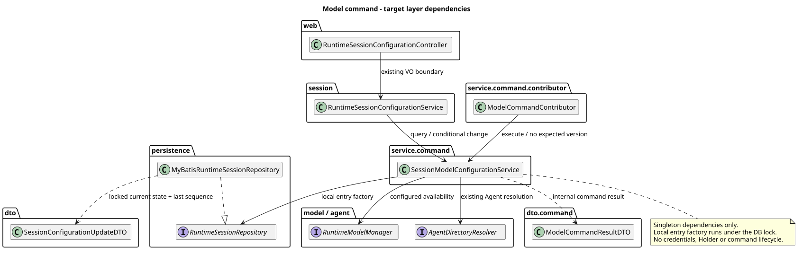
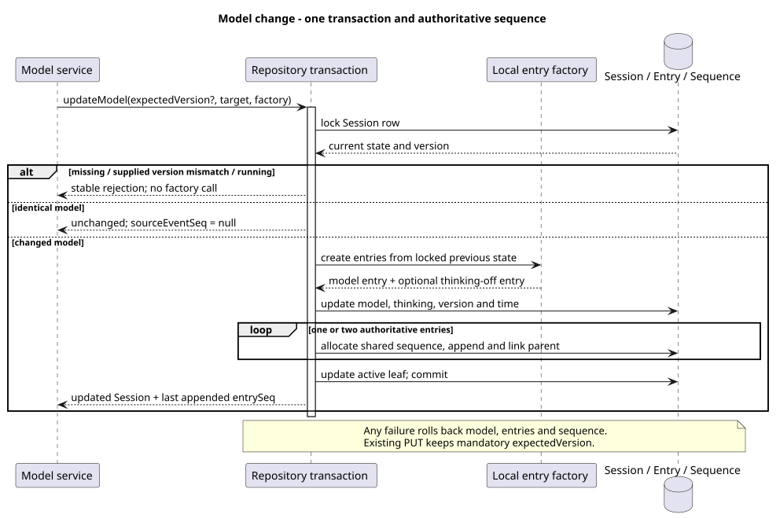

# Builtin Command：Model 实现切片

> 版本：1.0.0 · 日期：2026-09-06 · 状态：内部执行与既有 PUT 复用已实现；Command HTTP 待统一发布

## 1. Context 与范围

PR #224 已于 2026-09-06 合并。从最新 `origin/main@c70f02bc9deabae9b442406d98806a33a6602fdb`
创建独立 worktree 和 `codex/builtin-command-model`，不堆叠 Name 分支。本切片实现代码为
`16ee86ab1dcacd7e76a8c66ade99f52ddd8e3573`。

沿用已确认 Model 设计，不修改 pi-mono-java-design，不发布 Command 路由，不实现 Thinking/Compact Handler。
Builtin 与 Skill 的设计、实现及集成由用户统一负责，Skill 与共享 HTTP 对齐仍属于最终统一验收。
当前为首版；本次不改 SQL，也不增加升级脚本。Help 保持 Agent 使用指南行为。

## 2. 源码证据与关键定义

Java 相对路径根为 `modules/coding-agent-cli/src/main/java/com/campusclaw/codingagent/runtimeapi/`。
变更前和已实现符号分别归属于上述 main 与实现提交，不用 main 引用本次新增类型。

| 证据 | 路径与符号 | 观察行为或已确认决定 |
|---|---|---|
| Java 变更前 | `session/RuntimeSessionConfigurationService.java:changeModel/requireMutableSession/modelChangeEntries` | PUT 先校验强 ETag，再解析模型并预先生成 Entry；Repository 再比较相同资源版本 |
| Java 变更前 | `persistence/MyBatisRuntimeSessionRepository.java:updateModel/rejectConfigurationUpdate` | 锁内按版本、idle、同模型顺序检查；更新模型时可自动关闭 Thinking；事件与配置同事务 |
| Java 本次 | `service/command/SessionModelConfigurationService.java:query/execute/change/update/modelChangeEntries` | 共享目录查询与模型切换；Command 不带版本，事件工厂读取锁内旧值 |
| Java 本次 | `service/command/contributor/ModelCommandContributor.java:definition` | OPTIONAL 元数据、独立准入、真实 Handler；发现阶段不查目录、模型或数据库 |
| Java 本次 | `dto/SessionConfigurationUpdateDTO.java`、`dto/command/ModelCommandResultDTO.java` | 原配置结果归入 DTO 层；可空 sourceEventSeq 来自本次实际追加的最后 Entry |
| Java 调用者 | `session/RuntimeSessionModelReconciler.java:reconcile` | 保留 mandatory expectedVersion，预先构造的 agentRefresh 事件仍由锁内 CAS 保护，事件理由及投影不变 |
| 已确认设计 | `pi-mono-java-design@41304c1f3df0e8eca53141312724d7a684a1d07f` · `04-命令与技能/01-内置命令/README.md:6. Model / Thinking`、`01-总体架构/01-CampusClaw多Agent运行时/接口契约/操作/13-execute-session-command.json` | 命令查询/同值无事件，运行中仅查询，PUT 条件更新不变，sourceEventSeq 为最后权威领域 Entry |
| pi 观察 | `pi@4af9d21d3b4d664e4a29fcabfec85171077248e3` · `packages/coding-agent/src/core/agent-session.ts:setModel/setThinkingLevel`（1598、1716） | 校验凭据后更新模型，按能力调整思考级别；模型选择追加历史，Thinking 实际变化才追加 |
| pi 观察 | 同提交 `packages/coding-agent/src/core/session-manager.ts:appendModelChange`（1083） | 模型 Entry 以当前 leaf 为父节点追加；不是 HTTP 数据库事务或公共序号契约 |

Java 的 boolean Thinking、idle 写入限制和同模型不写 Entry 是**产品约束**；
数据库锁内重读、可选 expectedVersion 和统一配置结果 DTO 是**架构变化**，不声称为 pi 已有行为。
错误不暴露原始数据库异常和请求内容是现有安全边界的延续。

## 3. 架构与数据流

[PlantUML 源码](builtin-command-model/diagram.puml#L1)

- Contributor 固定依赖窄服务，使用本次 Catalog 的 Session ID 调用 Handler；无中央命令名 switch。
- 查询重新读取持久化 Session，再复用已有 Agent 目录和模型目录服务；保留配置模型顺序、空目录为 []。
- Command 的 null/空字符串为查询；其他字符串作为精确模型标识交给现有模型服务，不解析 provider 分段、不接受模糊匹配。
- 既有 `RuntimeSessionConfigurationService` 仍负责请求 VO、If-Match、DTO→VO 和 PUT 错误翻译。
  新窄服务不接收 Header 或 VO。Thinking 窄服务提取仍属于下一切片。
- 配置结果从 persistence 迁入 dto 并加 DTO 后缀，所有消费者和镜像同步，不保留旧类或转发别名。
  数据 record 不执行参数或业务校验；Model 结果仅防御复制列表。
- 单例只保存固定协作者；局部事件工厂不执行远端调用、不捕获凭据，不引入 Holder、线程、容量或命令生命周期存储。

[PlantUML 源码](builtin-command-model/diagram.puml#L58)

## 4. 决策、并发与边界

详见 [ADR-0053](../decisions/0053-builtin-model-locked-configuration.html)。编号在同步最新 main 后分配。

1. Repository 统一接受可空 Long expectedVersion：null 仅供 Command；现有 PUT 和运行前模型校准继续传实际版本。
   锁内先检查存在性、可选版本和 idle，再判断同值；running 即使请求相同模型也拒绝修改。
2. 不复用锁前旧 Session 生成 Command 事件。模型与 Thinking 的 previous 值、是否需要第二条事件，
   均由通过准入后的锁内 Session 决定。并发无版本修改串行执行，不因版本推进而错误返回 412。
3. 同值不调用事件工厂、不生成 Entry ID、不分配序号、不更新 timestamp/version/Thinking。
   模型真实切换只追加 session.model.changed，必要时随后追加 session.thinking.changed。
4. sourceEventSeq 从 Repository 实际分配的最后一条 Entry 读取，不使用资源版本或 GET 历史末序号。
   查询与同值为 null；最终响应 VO 再按确认契约省略此字段。共享配置结果也能携带既有 Thinking PUT 的实际事件序号。
5. 既有 Model PUT 仍先检查 If-Match，再模型解析，最后锁内 CAS；缺失为 428、过期为 412；
   成功经原组装器返回 Session VO 和新强 ETag。Model/Thinking 的现有领域事件名称、parent 链和 HTTP 字段不变。
6. 同一事务更新模型/Thinking、追加 Entry、推进 Sequence 与 active leaf；后续 Entry 失败整体回滚。
   不增加通用 command.started/completed/failed、commandId 或 Name 历史。
7. Command 依赖的稳定 Runtime 错误原样保留，非业务异常转换为 COMMAND_EXECUTION_FAILED，补齐中英文资源。
   PUT 仍保持 SESSION_MODEL_UPDATE_FAILED。最终 Command HTTP 的授权、参数长度、未知字段、Header 和 DTO→VO 尚未发布。

## 5. DFX 与契约影响

查询成本沿用既有模型目录查询；写入复用一个 Session 行锁和至多两条领域 Entry，不新增线程/队列。
目录与模型可用性解析在锁外完成；锁内工厂只构造本地 DTO/JSON。数据库竞争覆盖同进程及跨进程调用，
但本切片并发测试使用单 JVM 的独立事务连接，不冒充最终多 JVM HTTP 验收。

无公共 JSON 字段、URL、前端类型或 POST Events SSE 变更；已有配置 Controller 不依赖内部 DTO。
实际内部可发现 Builtin 增至五个：help、model、name、skills、status；完整七个仍按串行计划交付。

## 6. 测试与验证

- 模块及依赖 1519 项测试通过；完整 `./mvnw -q verify`、Spotless/Checkstyle、`git diff --check` 通过。
- 新增 Model 组合测试 21 项：运行中查询、空列表、精确标识、依赖错误、同值、锁前后状态变化、
  锁内最新 previous 值、自动关闭/保留 Thinking、最后序号、旧 PUT 版本保护、Spring 装配及真实 Handler。
- 独立 openGauss 7.0.0-RC3 容器执行首版全量安装 SQL；Repository 21 项通过，含本次新增的同模型/异模型并发、
  最新 previous 值与父链、sourceEventSeq、事件失败回滚及序号回滚；既有条件更新竞争回归保留。
- 指定质量脚本路径不存在，运行本机归档副本；新 Model 测试无问题，全部改动测试合计 0 errors、21 项旧命名 warnings。
- Java AST 检查覆盖修改类全部方法/构造器、版权与新增 public 类型；机械检查无 finding，
  record 排版脚本标为需人工检查，已逐个核对 DTO 和既有 TestResultDTO。独立覆盖记录不进入产品工作树。
- `scripts/sync-campusclaw.sh` 默认校验因公司 NativeParent:26.0.0-SNAPSHOT 无法解析失败；
  显式 --no-verify 已同步，**公司镜像编译未验证**，不绕过 push hook。
- 模块侧新增 701/850 行，镜像后 PR 非文档新增 1402/2000 行，低于 1800 软上限。
- PlantUML/SVG 的 ASCII、XML、可重复生成、Markdown 路径/源码锚点及 ADR 桌面/360px 无 JavaScript 渲染检查通过。
- 下一 Thinking 切片必须等本 PR 合并，再从最新 origin/main 创建独立分支。

## 7. 版本历史

| 版本 | 日期 | 变更 |
|---|---|---|
| 1.0.0 | 2026-09-06 | Model Contributor/窄服务、可选版本与锁内事件工厂、权威序号、既有 PUT 复用与并发验证。 |
