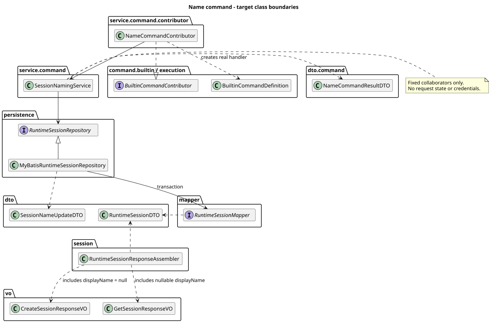
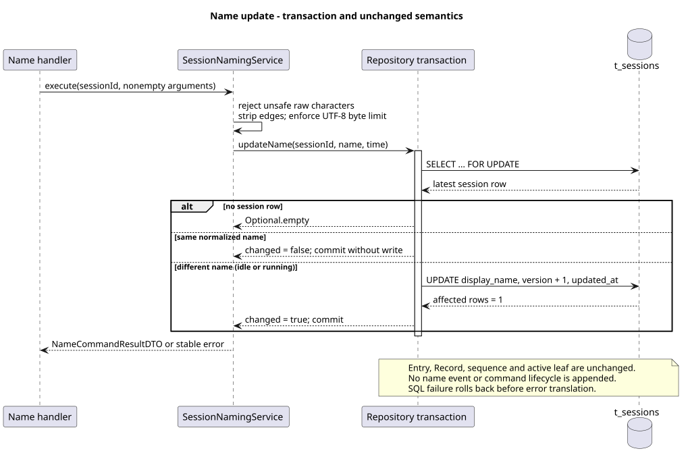

# Builtin Command：Name 实现切片

> 版本：1.1.0 · 日期：2026-09-07 · 状态：Name 内部执行与创建/GET Session 名称已实现；Command HTTP 待统一发布

设计仓 `88f4df16bc24bbfcd28e1ec374feb2de0db8be3b` Builtin 2.9.0 已 supersede 旧 Name 专属响应方向：
查询、修改和同值均返回完整 Session 与同源 ETag。当前结果通道及新验证见
[权威 Session 修复](builtin-session-snapshot.md)和 [ADR-0060](../decisions/0060-builtin-authoritative-session-result.html)；历史提交及测试数字保留原适用范围。

## 1. Context

这是串行计划的第 3 个实现切片。PR #222 合并后，从最新
`origin/main@dfb90cac4e233e09a0b8f047f7e9f4682f5ad238` 创建独立分支
`codex/builtin-command-name`。只增加 Name，不提前实现 Model、Thinking、Compact 或统一 Command 路由。

用户于 2026-09-05 明确当前是首版，没有已发布的数据库版本需要兼容，因此只更新全量安装 SQL，
不增加升级脚本。此记录仅维护实现仓证据，**未修改 pi-mono-java-design**。
Help 保持 PR #222 的 Agent 使用指南行为。按最新已确认设计，Builtin 与 Skill Command 由用户统一负责
设计、实现和集成；Skill 执行及共享 HTTP 对齐纳入统一验收。Name 仍保持独立切片范围，不提前发布 Command 路由。

## 2. 源码证据与关键定义

Java 变更前基线为上述 main；本切片实现提交为
`fe50e8d1bbd45c87b300bba71612b80350c3c1a6`。下表 Java 路径根目录为
`modules/coding-agent-cli/src/main/`。

PR #224 评审基线为 `83cef886f17e08404611a53a21ac0ef2d4cfa087`，创建响应遗漏修复为
`cf6c515305bd6ac67ca261f42d697be8ef03cf6d`。这是对已确认契约的补齐，不是新增产品决策。

| 证据类别 | 仓库相对路径与符号 | 观察或决策 |
|---|---|---|
| Java 基线 | `java/com/campusclaw/codingagent/runtimeapi/persistence/MyBatisRuntimeSessionRepository.java:updateModel/updateThinking` | 已有事务、Session 行锁及版本校验；不能为 Name 削弱既有条件更新 |
| Java 基线 | `java/com/campusclaw/codingagent/runtimeapi/session/RuntimeSessionResponseAssembler.java:getView`、`SessionEtagFactory.java:create` | Service 组装只读 VO，ETag 来自持久化资源版本 |
| 本切片实现 | `java/com/campusclaw/codingagent/runtimeapi/service/command/contributor/NameCommandContributor.java:definition` | 固定元数据、独立准入与真实 Handler；无中央名称分派 |
| 本切片实现 | `java/com/campusclaw/codingagent/runtimeapi/service/command/SessionNamingService.java:execute/normalizeName` | null/空串查询；非空值先检查危险字符、再裁剪两端和检查 UTF-8 字节数 |
| 本切片实现 | `java/com/campusclaw/codingagent/runtimeapi/persistence/MyBatisRuntimeSessionRepository.java:updateName`、`resources/mapper/session/RuntimeSessionMapper.xml:lockSessionForUpdate/updateSessionName` | 同一事务行锁内读取最新名称、比较、按需更新；没有 expectedVersion 或 idle 限制 |
| 本切片实现 | `resources/db/gaussdb/install/session_schema.sql:t_sessions` | 可空 display_name 与字节长度约束，仅保存当前值 |
| 本切片实现 | `modules/common/src/main/java/com/campusclaw/common/constant/ClawConstants.java:Session`（仓库根路径） | 统一名称长度与危险字符模式，不在 DTO 中保存共享常量或执行校验 |
| 已确认设计输入 | `pi-mono-java-design@e370d2d49e6cd20b7dd910944e583d7f67115cf4` · `04-命令与技能/01-内置命令/README.md:5. Name 当前状态` | 当前名称、运行中可修改、80 字节、last-commit-wins、无 Name 历史；只读取此决策 |
| 创建契约及校验依据 | 同设计提交 · `01-总体架构/01-CampusClaw多Agent运行时/接口契约/操作/01-create-session.json`、`validate-chat-http-v1.py:validate_create_session` | 创建成功必须包含 displayName 且为 null；评审前遗漏该字段，现由 CreateSessionResponseVO 与 createView 补齐 |
| 最新已确认责任 | `pi-mono-java-design@41304c1f3df0e8eca53141312724d7a684a1d07f` · `04-命令与技能/01-内置命令/README.md:1. 范围与证据`（设计分支 codex/help-agent-metadata-design） | 2.6.1 改为用户统一负责 Builtin/Skill；评审时尚未合入设计 main，不因此忽略已确认决定 |
| pi 观察 | `pi@4af9d21d3b4d664e4a29fcabfec85171077248e3` · `packages/coding-agent/src/core/agent-session.ts:setSessionName` | 调用 appendSessionInfo，向监听器和扩展发布 session_info_changed |
| pi 观察 | 同提交 `packages/coding-agent/src/core/session-manager.ts:appendSessionInfo/getSessionName` | 将 CR/LF 替换为空格并 trim，追加 session_info；反向查找最近名称，空名称可清除 |

Java 不复制 pi 的名称历史与清空行为：只保留当前名称属于**产品约束及持久化架构差异**；
拒绝控制字符、方向覆盖/隔离字符、非法代理项与限制 80 UTF-8 字节属于**安全加固**。
这些是 Java 目标决策，不是 pi 现有行为。

## 3. 架构与数据流

[PlantUML 源码](builtin-command-name/diagram.puml#L1)

核心 SPI 保持在 `command.builtin/execution`；Spring Contributor 位于
`service.command.contributor`，窄服务位于 `service.command`，内部结果位于
`dto` / `dto.command`。Controller 继续只依赖 Session Service 和 VO，不接触 Repository 或内部 DTO。

- Name Contributor 贡献 OPTIONAL 输入，idle/running 的查询和修改均可用；发现阶段不读取数据库或 Agent。
- Handler 使用本次 Catalog 的 Session ID，调用窄服务。查询重新读取持久化当前名称；修改不依赖 Catalog 中的旧版本。
- Spring 事务代理执行 Repository 的锁内比较。数据库负责跨进程互斥，没有进程内名称缓存或锁。
- `SessionNameUpdateDTO` 与共用 `SessionCommandResultDTO` 是无校验的数据 record，携带完整权威 Session。
  后续统一应用层委派既有 RuntimeSessionResponseAssembler，不创建 Name 专属响应 VO。
- 所有单例只保存固定协作者；不捕获 Mate Header、不刷新 Agent、不占运行容量。

[PlantUML 源码](builtin-command-name/diagram.puml#L69)

## 4. 决策与边界情况

沿用 [ADR-0049 的 Name 切片](../decisions/0049-builtin-command-json-execution.html#name)。

1. **查询与更新不混淆**：缺省/null/空串查询，不清空名称。非空参数中的纯空白不能被悄悄当作查询。
   更新先拒绝原始输入中的 CR/LF、C0/C1、U+202A–U+202E、U+2066–U+2069 和未配对 UTF-16 代理项；
   不能先 trim 掉尾部换行而使危险输入通过。随后用 `String.strip()` 去除两端空白，保留内部空白。
2. **按编码长度限制**：规范化后非空且 UTF-8 长度不超过 80 字节。20 个四字节 Emoji 可以接受，
   27 个三字节汉字拒绝。数据库可空 `VARCHAR(80)` 配合 `octet_length` 检查作为长度完整性兜底。
3. **last-commit-wins**：行锁内比较最新名称。相同规范值不写 SQL、不升版本、不改 updated_at；
   不同值只更新名称、resource_version 和 updated_at。无需客户端 ETag；仍在锁内确认 Session 存在。
4. **与运行状态分离**：running 时可改名，不改变 running/idle、active_leaf_id、Entry/Record、序号或统计。
   与删除竞争时按行锁串行化，已经删除返回 SESSION_NOT_FOUND，不重新创建记录。
5. **沿用 ETag 权威性**：名称改变使 GET Session 的强 ETag 变化，同名保持不变。
   既有 Model/Thinking PUT 继续使用原来的 If-Match 与锁内版本检查，没有改为 last-commit-wins。
6. **最小持久化**：不写 session.name.changed、session_info 或 command 生命周期，不恢复历史名称。
   重建应用上下文后从数据库当前行恢复名称；不存在 Name 边车文件。

## 5. 契约改动与 DFX

- 创建 Session 成功响应必须包含 `displayName: null`；GET Session 与既有配置 PUT 同样始终保留该字段。
  CreateSessionResponseVO 和 GetSessionResponseVO 均为只读 VO，Service 组装器分别映射。
  前端共享 Session 类型声明为必有的 `displayName: string | null`；创建响应仍不包含 updatedAt。
- Name 查询原样传递一次读取的 Session，修改和同值原样传递锁内资源，不在提交后 GET。
  未来 JSON 复用完整 Session 和同源 ETag，禁止 command/changed/sourceEventSeq；changed 仅保留内部。
  没有发布 GET/POST Command 路由，没有新增请求级 SSE。
- 非法名称为 INVALID_COMMAND_REQUEST（400），不存在为 SESSION_NOT_FOUND（404）；
  修改持久化失败翻译为 SESSION_NAME_UPDATE_FAILED（500），提供中英文文案，不将名称或数据库异常文本写入日志和响应。
- 名称校验 O(n)，查询一次 SELECT，更新一次 SELECT FOR UPDATE 加至多一次 UPDATE。
  同一 Session 竞争只占用已有数据库事务连接，不引入异步队列、线程或额外运行容量。
- 此阶段的 DTO/Handler 测试不代表未来 Command HTTP 的未知字段、Header、统一鉴权及断线行为已验收。

## 6. 测试与验证

- 模块和依赖测试 1498 项全部通过，包含 Name Unicode/字节边界、空参数、running 准入、错误映射、真实组件装配及既有 Model/Thinking 回归。
- 独立 openGauss 容器执行全量安装 SQL，真实 Repository 集成测试 18 项通过；新增用例验证锁等待、
  并发同名/异名、无历史副作用、约束失败回滚、删除后不能改名，以及重新建立 Spring/MyBatis 上下文后的当前名称。
  该用例没有重启 JVM；完整多 JVM HTTP 流程仍留给最终 HTTP 切片。本轮响应契约修复未改动持久化，未重跑这 18 项。
- 创建与 GET Session 的 MockMvc 测试验证字段存在及 null 值、真实组装器的中文名称与内部 resourceVersion 不泄露。
  创建回归先在旧代码复现缺少 displayName，修复后 121 项定向 Java 测试通过；真实创建 Service 验证初始持久化值与响应均为空。
  前端契约测试 9 项通过，覆盖 201 创建结果、GET 的 null/中文名称与刷新后的状态，TypeScript 检查通过。
- 已运行指定质量脚本的本机归档同版副本（与 `.skill` 包内脚本逐字节一致）；新 Name 测试零问题，
  Repository/核心测试仅有既有命名警告。本轮脚本仍对三个未改动的旧 MockMvc 用例报 andExpect 识别误报；
  本次修改的创建与 GET 测试具备真实断言与调用验证，未产生新增质量问题。
- 完整 mvnw verify、Spotless、Checkstyle 与 git diff --check 通过；Java AST 检查本次涉及类的全部方法/构造器，最长 41 个非空物理行。
- 已执行镜像同步；默认校验因 `NativeParent:26.0.0-SNAPSHOT` 无法解析而失败，显式 --no-verify 完成同步，
  **公司镜像编译未验证**。全量安装 SQL 由同步脚本生成到 campusclaw，不手工编辑。
- 模块侧新增 619 行，含镜像与前端的完整非文档新增为 1255/2000；低于 850/1800 的切片预算。
- 图由 PlantUML 生成；ASCII、SVG XML/同步、Markdown 图链接与源码锚点、无 Mermaid 均通过；
  ADR HTML 在 1280px/360px、禁用 JavaScript 时内容可读且无横向溢出，生成图已可视核对。

## 7. 版本历史

| 版本 | 日期 | 变更 |
|---|---|---|
| 1.1.0 | 2026-09-07 | 按 88f4df16 传递锁内完整资源，撤销 Name 专属公开回执；关联 R06 与新 ADR，保留历史证据。 |
| 1.0.1 | 2026-09-05 | 根据 #224 评论补齐创建响应 displayName:null、前端必有字段与回归；同步已确认的 Builtin/Skill 统一责任。 |
| 1.0.0 | 2026-09-05 | Name 内部执行、首版当前名称存储、GET Session 字段、并发与恢复验证；不增加升级脚本或 Command 路由。 |
