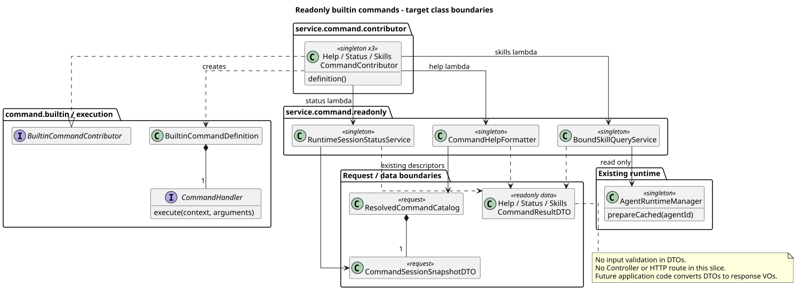

# Builtin Command 只读命令切片

> 版本：1.1.1 · 日期：2026-09-07 · 状态：Help / Status / Skills 已实现；未发布 Command HTTP 路由

## 1. Context

这是串行交付计划的第 2 个实现 PR。前置核心 PR #218 已合并，本分支从最新
`origin/main@6d7ba8483f69e8cccab04489a0111a27fde1315d` 创建，只注册三个有真实实现的
Builtin，不为剩余四个命令安装占位 Handler。Help 根据后续确认的 Agent 使用指南读取本地完整缓存，
不再承担命令目录展示职责；命令目录仍由最终 GET Commands 接口提供。

本记录只维护实现仓的交付证据，不变更 `pi-mono-java-design` 的任何文件或接口决策。
按已合入设计 `fd8604956632c880264434791465d1f59917038d` 的通用模块 §1/§5，
Builtin、Skill 与共享 HTTP 由用户统一负责；旧“同事并行开发”说明已被替代（superseded）。
Skill 真实执行及共享 HTTP 属于整体验收，不因本切片只实现 Builtin 而被排除。
本文保留只读 PR #222 的交付证据；实现主线 `7b3769a5` 已另行合入 Name、Model、Thinking
和 Compact 6a，剩余 Compact 生命周期、应用边界、Skill 执行及 HTTP 集成继续按依赖交付。

## 2. 源码证据与关键定义

Java 基线为 `6d7ba8483f69e8cccab04489a0111a27fde1315d`；初始只读切片为
`21d19792ce72546a7d0072501463dd4c1241b669`，新版 Help 实现为
`2ceb3f7319e61c6d036526f4ccd2f6e56114ac5a`。下表 Java 路径的根为
`modules/coding-agent-cli/src/main/java/com/campusclaw/codingagent/`。

| 来源 | 相对根路径与符号 | 已观察行为 |
|---|---|---|
| Java 基线 | `runtimeapi/service/command/CompositeCommandRegistry.java:resolve`、`BuiltinCommandSource.java` | 来源过滤在解析之前；每次生成一个不可变 Catalog；启动聚合 Contributor 并查重 |
| Java 基线 | `runtimeapi/dto/command/CommandSessionSnapshotDTO.java:from` | 从已完成访问检查的持久化 Session DTO 复制状态、模型和 Thinking，不读取 Active Holder |
| Java 基线 | `runtime/AgentRuntimeManager.java:prepareCached/loadSnapshot/loadSkills` | 仅读取本地目录；完整性失败返回 null；完整无绑定目录返回空列表；此入口不调用 Mate |
| 本切片实现 | `runtimeapi/service/command/contributor/{Help,Status,Skills}CommandContributor.java:definition` | 各自提供元数据、只读准入与调用窄服务的 Handler lambda；没有中央名称分派 |
| 新版 Help 实现 | `runtimeapi/service/command/readonly/AgentHelpQueryService.java:query` | 根据 Session Agent ID 读取一次完整缓存，投影 displayName、description 和 userCases；不刷新、不读取 Catalog |
| 新版缓存前置 | `runtime/AgentRuntimeManager.java:prepareCached/toIdentity/toRuntime`、`MateServiceClient.AgentRuntime` | 缓存读取与刷新共用 Agent 锁；userCases 写入并恢复；旧缓存缺字段恢复为空列表；介绍数组拒绝非字符串项 |
| 本切片实现 | `runtimeapi/service/command/readonly/{RuntimeSessionStatusService,BoundSkillQueryService}.java:query` | 分别读取请求内持久化观察值和执行时完整绑定快照；返回内部 DTO |
| 已确认设计输入 | `pi-mono-java-design@e2afc2632ecbf2a528daf266626eaff5aff9289b` · `04-命令与技能/01-内置命令/Help-Agent使用指南/README.md` | Help 是 Agent 使用指南而非命令目录；本实现仓只读取该决策，未修改设计仓 |
| pi `4af9d21d3b4d664e4a29fcabfec85171077248e3` | `packages/coding-agent/src/core/agent-session.ts:1289` · `_tryExecuteExtensionCommand` | 扩展命令按名称查找并调用 `handler(args, ctx)`；不是 Java Builtin HTTP 实现 |
| 同一 pi 提交 | 同文件 `getSessionStats:3247`、`_bindExtensionCore:2464` | 前者聚合消息、用量和成本；后者把扩展、模板和 Skill 组合成命令元数据 |

pi 仅提供 Handler/上下文分离和资源元数据读取的行为参考。Java Status 不统计用量属于
已确认的产品约束；Java Skills 只返回名称、描述属于最小信息暴露约束；使用 Spring
Contributor、请求 Catalog 和内部 DTO 属于架构变化，不宣称这些类型已存在于 pi。
跨进程数据库与 HTTP 序列化验收仍是后续目标，不能把本 PR 的服务测试描述为该验收已通过。

## 3. 架构与数据流

[PlantUML 源码](builtin-command-readonly/diagram.puml#L1)

下表包前缀为 `com.campusclaw.codingagent.runtimeapi`。

| 命令 | Spring 装配 `service.command.contributor` | 窄服务 `service.command.readonly` | 内部结果 `dto.command` |
|---|---|---|---|
| Help | HelpCommandContributor | AgentHelpQueryService | HelpCommandResultDTO |
| Status | StatusCommandContributor | RuntimeSessionStatusService | StatusCommandResultDTO |
| Skills | SkillsCommandContributor | BoundSkillQueryService | SkillsCommandResultDTO / SkillDTO |

Contributor 只依赖窄服务和核心 SPI，窄服务不反向依赖 Contributor。核心 SPI 保留在
`command.builtin` / `command.execution`，没有 Spring 依赖。DTO 不依赖窄服务。
所有 Spring 单例只保存固定协作者，Catalog、Session 观察值和结果均属于本次调用。

1. 后续应用层负责授权和读取持久化 Session，调用一次 Builtin 来源解析。
2. 本切片从 Catalog 取同一原始定义，Handler 使用 Context 中的 Catalog / Session。
3. Help 与 Skills 分别按 Session Agent ID 调用一次 `prepareCached`；Status 使用请求内 Session 观察值。
   `prepareCached` 与刷新发布共用 Agent 锁，因此不会跨原子目录切换拼接两代文件。
4. 窄服务同步返回内部 DTO，Handler 用已完成的 CompletionStage 返回结果。
   服务错误可在取得 Stage 之前同步抛出，后续应用层须统一捕获同步异常与异步失败。
5. 后续应用层将 DTO 转为独立响应 VO，Controller 才返回 ResultBean；本 PR 不增加 VO 或路由。

## 4. 设计决策

沿用并补充 [ADR-0049：Builtin 分层与并行扩展边界](../decisions/0049-builtin-command-json-execution.html#readonly)。

- **Help 展示 Agent 指南**：Help 不注入 Registry，也不读取命令目录。参数缺省、null、空串或
  纯空白时读取一次最新完整本地缓存；其他参数返回 `INVALID_COMMAND_REQUEST`。显示名先对
  `displayName` 去除两端空白，空白时回退同样处理后的 Agent `name`；介绍和场景保持顺序及
  条目内部换行，只去除条目两端空白并过滤空项。缺少完整缓存返回 `AGENT_NOT_AVAILABLE`。
- **缓存提供完整指南快照**：`agent.json` 在既有 schemaVersion 下保存 `userCases`，重启后恢复；
  旧缓存缺字段时返回空列表。缓存中的 null、数字、布尔或对象文本项使快照不可用，Mate 响应中的
  同类值映射为无效响应。显式刷新失败保留上一完整快照。
- **Status 使用持久化观察值**：不根据 Holder 推测状态、不补算 Token 或费用；同一请求
  内保持模型与 Thinking 的一致观察。下一请求重新读取最新 Session。
- **Skills 执行时读缓存，不刷新**：不在目录发现时读取 Agent；执行时缺少完整快照返回
  `AGENT_NOT_AVAILABLE`，完整空快照返回 `[]`。每次执行重新读取，不在单例中保存旧结果。
  不调用 SkillCommandSource，不暴露 Skill ID、版本、文件路径、正文或使用场景。
- **准入与参数规则分工**：三个命令在 idle / running 均允许只读查询且都为 NONE。
  Catalog 的可用性是 Session 级只读准入预览，不保证本地 Agent 快照存在；Help / Skills
  的完整性在执行时检查。NONE 的输入不可用原因仍是核心既有展示码。
- **DTO 是数据载体**：只含结果字段及列表防御复制，不在 DTO 中校验参数或业务状态。
  服务直接调用时也把 null 视为空参数；Help 接受纯空白，Status / Skills 的空格、
  换行及其他非空参数均拒绝。统一请求长度、未知字段、Header 与名称格式在后续应用/HTTP 边界实现。
- **不提前发布公共接口**：三个内部结果不包含 `command` 或 `sourceEventSeq`；未来 VO
  组装器添加命令名，查询不返回领域事件序号。不把 DTO 的序列化测试当作 HTTP 契约测试。

## 5. 边界情况与性能（DFX）

- Help 的完整缓存即使没有 description 或 userCases 也成功返回空列表；显示名同时缺少
  displayName 和 name 时按不可用处理。不返回 Agent ID、版本、路径、提示词、Skill 或工具细节。
- Status 可保留 null 模型值，不因 Agent 快照缺失导致查询失败。
- Skills 成功后若绑定刷新，下一次查询取得新快照；若目录随后不完整，不返回上一次列表。
  复用现有 Manager 完整性与路径安全校验，不建立独立的文件校验或刷新流程。
- Help 与 Skills 复用现有完整快照文件读取成本；Status O(1)，Skills 另对 s 项排序
  O(s log s)。不占运行容量，不创建线程、不保存凭据，不写 Session、Entry 或通用命令事件。
- 没有新增日志记录参数、Skill 正文或 Mate Header。原 POST Events / SSE 未改动。

## 6. 契约改动与交付边界

只增加内部结果类型、三个 Contributor 和窄服务，补充 RuntimeErrorCode 的
`INVALID_COMMAND_REQUEST`（400）及 `COMMAND_NOT_FOUND`（404）和中英文错误文案。
复用 `AGENT_NOT_AVAILABLE`（422）。本 PR 不新增任何 HTTP 路由、鉴权入口、SQL 或持久化结构。
共享 HTTP 契约由用户在最终发布切片统一对齐 Builtin 与 Skill，不在只读切片决定 Skill 请求形状。

## 7. 测试与验证

- 新版 Help 测试覆盖 idle/running、无参描述符、显示名回退、条目裁剪与空列表、缓存缺失、
  非字符串元数据、userCases 发布/重载/重启、旧缓存、刷新失败保留旧值及并发读取互斥。
- Skills 使用真实 AgentRuntimeManager 和临时目录验证缺失、完整空列表、更新后的绑定及
  不完整目录；Mock Mate 在命令执行期间零调用。独立测试固定逆序输入，断言排序与最小字段。
- 模块与依赖 `./mvnw -q -pl modules/coding-agent-cli -am -DskipITs test`：1399 项，0 失败、0 错误、0 跳过。
- `./mvnw -q spotless:apply checkstyle:check`、`git diff --check` 通过。
- 指定质量脚本 `~/.claude/skills/java-ut-coverage-loop/scripts/check_test_quality.py` 在当前机器不存在，
  未声称该项通过；聚焦测试和模块完整测试均已执行。
- 默认 `scripts/sync-campusclaw.sh` 因公司 `NativeParent:26.0.0-SNAPSHOT` 无法解析而失败；
  显式 `--no-verify` 完成镜像同步，不宣称公司镜像已编译通过。
- 模块侧非文档新增 850 行，镜像后为 1700 行；完整 PR 门禁以最终提交执行结果为准。
  下一个 Name PR 等本 PR 合并后从最新 main 创建。
- PlantUML ASCII、SVG 生成/XML/同步、文档链接/锚点、33 份 Markdown 无 Mermaid 检查通过；
  HTML 在禁用 JavaScript 的 1280px / 360px 宽度下渲染通过且无横向溢出，生成图已可视核对。

## 8. 版本历史

| 版本 | 日期 | 变更 |
|---|---|---|
| 1.1.1 | 2026-09-07 | 以 fd86049 的统一责任替代旧人员分工；区分历史只读切片证据与后续已合入进度。 |
| 1.1.0 | 2026-09-05 | 按已确认的新设计将 Help 改为 Agent 使用指南，并记录 userCases 缓存、严格文本类型和并发快照一致性。 |
| 1.0.0 | 2026-09-04 | 记录 Help / Status / Skills 只读切片、DTO 边界、测试与串行 PR 行数预算；不改设计仓、不发布 HTTP。 |
