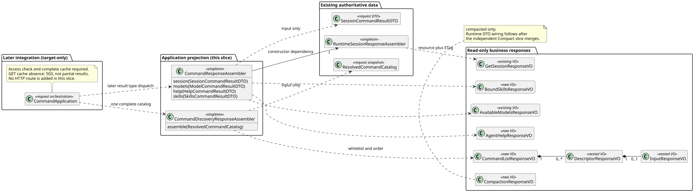

# Builtin 业务响应与命令发现纯投影

> 版本：1.0.0 · 日期：2026-09-07 · 状态：应用层投影切片；未发布 Command HTTP

## 1. Context 与范围

本切片从 `origin/main@ca2600da15dfaf8dda1f16b9d2f3d130b5d9ace5` 独立开发。
用户已授权并行开发、独立评审、串行合并；不堆叠未合入分支。
设计只读基线为 `pi-mono-java-design@88f4df16bc24bbfcd28e1ec374feb2de0db8be3b`：
Builtin 2.9.0 §8/8.1、Slash 1.6.0 §3.1 和 Help 1.2.0，精确发现字段取 Runtime 操作 12。
本文只记录实现仓证据，不修改设计仓，不重新决定产品契约。

权威 Session 与 lifetimeUsage 已在前置修复中完成，本轮补齐可独立验收的白名单投影：
复用 Session/Models 业务 VO，新增 Help、Compaction、BoundSkills 三个最小业务 VO，
并将既有 Catalog 转为轻量发现 VO。没有新增请求、HTTP 路由、鉴权、缓存读取、Runtime 调用或数据库修改。

## 2. 源码证据与关键定义

Java 分析基线为上述 `ca2600da`。下表路径根为
`modules/coding-agent-cli/src/main/java/com/campusclaw/codingagent/runtimeapi/`。

| 相对路径 / 符号 | 已观察行为 | 本切片与理由 |
|---|---|---|
| `dto/command/SessionCommandResultDTO.java` | 保留完整 Session 与内部 changed/sourceEventSeq | 投影只读取 session，不复制公开回执，也不重新 GET |
| `session/RuntimeSessionResponseAssembler.java:getView` | 从同一 DTO 投影完整资源、十项 Usage/Cost 和 ETag | 委派既有组装器，避免再维护一份资源字段清单 |
| `vo/AvailableModelsResponseVO.java` | 保留 currentModelId 和模型配置顺序，复制列表 | 直接复用，不新建 Model Command VO |
| `dto/command/{HelpCommandResultDTO,SkillsCommandResultDTO}.java` | 窄服务已返回归一后的公开业务数据；Skill 条目仍是 DTO | 单独复制为只读 VO，嵌套 Skill 条目不直接序列化 DTO |
| `command/catalog/ResolvedCommandCatalog.java:list` | 请求内不可变 DTO 列表、Definition 身份与 Session 观察值 | 纯投影消费已有 Catalog，不重新 resolve，不修改列表或定义 |
| `service/command/CompositeCommandRegistry.java:resolve` | 内部 TreeMap 按名称排序 | 只在响应侧调整为产品固定显示顺序，内部查找和执行分派不变 |
| `command/builtin/BuiltinCommandDefinition.java:describe` | 对无参和带参分别预览准入 | 响应过滤 available=false，input.available=false 时省略 input |
| `service/command/SkillCommandSource.java:list` | 缺失缓存返回空列表；完整性与空绑定尚未在共享应用边界区分 | 本片不改该职责，也不宣称完整 GET 已验收 |

本次主基线是既有 Java 业务资源 API 与已确认产品设计，不重新选择 pi 行为。
轻量提示、排序及无回执为**产品约束**；复用组装器、只读 VO 与按类型投影为**架构变更**；
不输出内部原因、建议值、快照、路径、正文与凭据为**安全边界**。

## 3. 架构与数据流

[PlantUML 源码](diagram.puml#L1)

- `CommandResponseAssembler` 是无请求状态的 Spring 单例，只依赖既有 Session 组装器。
  本片提供 session/models/help/skills 类型化投影方法；统一结果类型分派留到执行应用接入。
  不调用 Controller、Repository、Registry、Manager 或 Runtime，不读取旧 Catalog 拼资源。
- `CommandDiscoveryResponseAssembler` 也是无请求状态单例，只接受一个已解析 Catalog。
  过滤不可用项后按固定 Builtin 顺序、Skill 名称顺序排序；排序和字段选择不是命令执行分派。
  未认识的 Builtin 显示项直接拒绝，不自行推断新的公共命令形态。
- `ClawConstants.RuntimeApi.Command` 集中固定显示顺序和输入提示。内部 placeholder/suggestions
  不作为公共 hint 的来源；Help/Status/Compact/Skills 不输出 input。
- 所有新 VO 都为 `@Getter`、final 字段；列表复制且不可修改。嵌套条目也是 VO。
  只有发现的 input 使用字段级 NON_NULL，acceptsFiles 使用字段级 NON_DEFAULT；
  false 被省略，Skill true 被保留。没有全局 NON_NULL，Session displayName=null 继续出现。
- CompactionResponseVO 只含 compacted；本片不复制并行 Compact 分支的 DTO 或连接未合入实现。

## 4. 设计决策

见 [ADR-0063](../../decisions/0063-command-response-projection.html)。

Session 类型化投影返回既有 `RuntimeSessionView<GetSessionResponseVO>`，正文与 ETag 同源；
该 Service 返回值不是新增公共包装，后续 Controller 仍只将 resource 放入 ResultBean，ETag 写 Header。
Help/Models/Skills 直接返回未包装业务 VO。没有 public command/changed/sourceEventSeq 或替代回执。
模型查询顺序及 currentModelId 不在候选列表的行为保持，Skills 不重复排序已归一的内部结果。

## 5. 边界情况与性能（DFX）

- idle/running 的可调用性由既有 Catalog 准入快照提供：running 的 Compact/Skill 不可用则整项省略，
  Model/Thinking 只隐藏输入，Name 保留输入。本投影不重新解释 Session 当前状态，也不能替代执行锁内校验。
- 空列表始终序列化为 []；Help 文案保留归一后的作者顺序及内部换行，不执行 HTML 或自动翻译。
- 发现始终白名单输出 name/kind/description/可选 input；输入只包含 hint 和可选 acceptsFiles=true。
- 复杂度为 O(n log n)，Builtin 排序查找最多七项；无外部 I/O、线程、容量、持久化或凭据保留。

## 6. 契约改动与剩余接入

没有已发布路由改动。当前投影的输入可以是内部局部 Catalog，因此**不能直接当作完整 GET Service**。
后续共享发现应用必须先完成访问检查，取得一个完整 Agent 缓存并解析全部来源，即使 running 隐藏 Skill，
也不能跳过完整性检查；无缓存整体返回 503 AGENT_NOT_AVAILABLE、Retry-After: 3，完整空绑定成功。
需要消除“先检查一次，再由 Skill Source 再读一次”的快照混用风险，不刷新、不远程补拉。
POST Help 无缓存仍为 422，不能全局改同名错误映射。

统一执行类型分派、Compact DTO 接入、请求/Header/错误映射与 GET/POST 同时发布仍属后续切片。
Skill 执行返回协议及历史快照待决不由本次发现展示推断；公共 HTTP、跨进程执行及凭据生命周期均未验收。

## 7. 测试与验证

新测试覆盖：完整 Session/ETag 复用、变化/同值和 idle/running、null 显示名、非零 Usage、
模型顺序、Help 精确三字段、Skills 条目 VO、Compaction 精确单字段、空数组、列表防御复制；
发现两种状态下的固定排序、字段精确集合、旧字段/快照不泄漏、输入和附件省略及未知 Builtin 拒绝。

本片最终代码的本地验证结果：

- JDK 21 `./mvnw -q spotless:apply checkstyle:check` 通过。
- `./mvnw -q -pl modules/coding-agent-cli -am test`：1706 项，0 失败、0 错误、0 跳过；
  包含新增业务投影 11 项和发现投影 7 项。既有包扫描测试补齐真实 Session 组装依赖并验证两组装器。
- 指定质量脚本原路径不存在，使用本机归档副本检查三份新增/修改测试：0 errors、0 warnings。
- Java AST 方法/构造器长度、VO 布局及版权检查无 finding；公共新类型 Javadoc 与中文注释人工检查。
  ClawConstants 的既有 Unicode 转义由机械工具留作人工项，新增常量分组未改这些转义且源码布局已核对。
  BuiltinCommandCoreTest 的既有 TestResultDTO record 布局同样保持不变并已人工核对。
- 默认 mirror sync 因 NativeParent 无法解析失败；显式 `--no-verify` 同步后十对 Java 一致。
  **公司镜像编译未验证**，镜像一致性不能代替公司编译。
- 本主题 PlantUML 生成/ASCII/SVG XML/二次生成字节一致、六个链接/锚点、无 Mermaid、
  ADR 1280px/360px 禁用 JavaScript 渲染无横向溢出、实际图文可视检查及 `git diff --check` 通过。
- 模块侧新增 625 行，含镜像新增 1250 行；最终提交再次运行 origin/main 到 HEAD 的正式门禁。

本片没有数据库代码，未重跑 openGauss；纯投影 JSON 测试不等于 HTTP 验收。

## 8. 版本历史

| 版本 | 日期 | 变更 |
|---|---|---|
| 1.0.0 | 2026-09-07 | 首个独立响应/发现纯投影片；保留共享应用与 HTTP 未接入边界，不修改设计仓。 |
