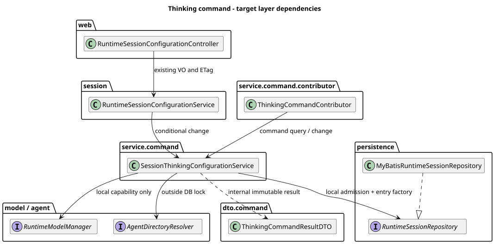
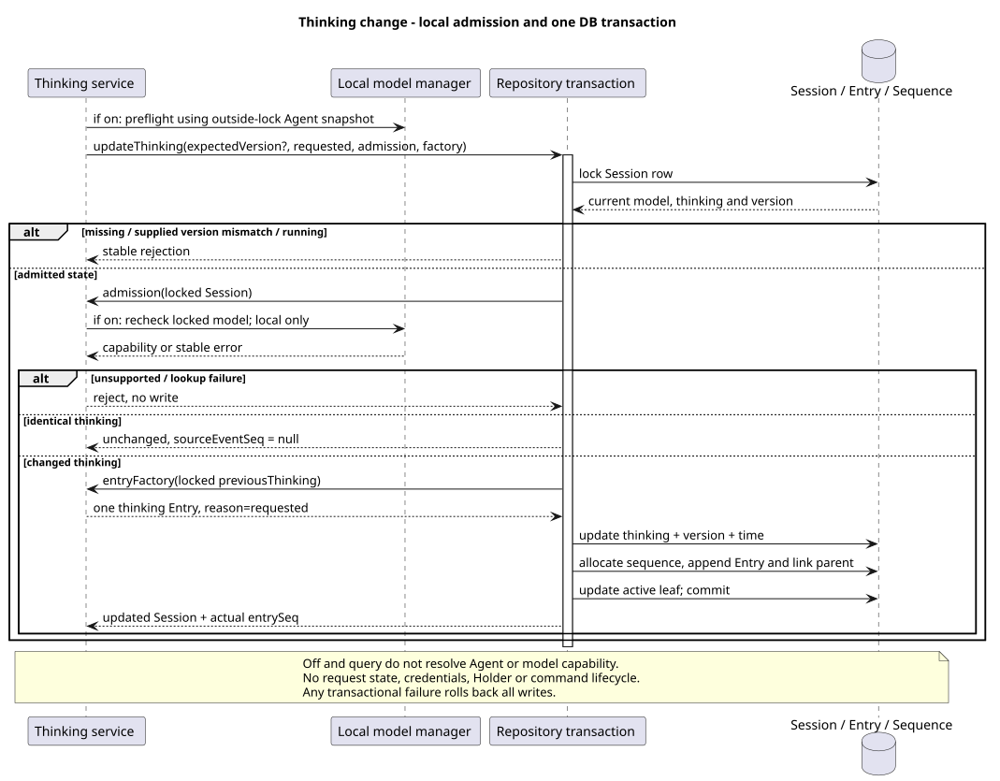

# Builtin Command：Thinking 实现切片

> 版本：1.0.0 · 日期：2026-09-07 · 状态：内部执行与既有 PUT 复用已实现，Command HTTP 待统一发布

## 1. Context 与范围

Model PR #228 已合并为 `6da70564c6daef04e3ea5d856c6dbea6a861a06a`，本切片从该 main 创建独立
`codex/builtin-command-thinking` worktree。开发中按普通 merge 同步 #226，最终分析基线为
`origin/main@7fb2737f1220b92e4cea130505467905a8616daf`，本次实现为
`de3716d4b6404d34df3b15e0604c60d6df582ddd`，不堆叠 Model 分支、不重写历史。

本次仅交付 Thinking Contributor、窄 Service、结果 DTO 和必要配置事务复用。
不发布 Command HTTP，不做 Compact，不修改 pi-mono-java-design，不增加 SQL 或升级脚本。
Builtin/Skill 及共享 HTTP 对齐仍在最终统一验收范围；Help 保持 Agent 使用指南语义。

## 2. 源码证据与关键定义

Java 路径根：`modules/coding-agent-cli/src/main/java/com/campusclaw/codingagent/runtimeapi/`。

| 证据基线 | 仓库相对路径与符号 | 观察行为或已确认决定 |
|---|---|---|
| Java main `7fb2737f` | `session/RuntimeSessionConfigurationService.java:changeThinking/requireThinkingSupported/requireMutableSession` | PUT 要求当前强 ETag，开启前解析当前模型能力；Entry 锁前生成并由锁内版本保护 |
| Java main `7fb2737f` | `persistence/MyBatisRuntimeSessionRepository.java:updateThinking/rejectConfigurationUpdate` | 行锁内按存在、版本、idle、同值检查，配置/Entry/Sequence 同事务；Model 已支持可选版本和锁内事件工厂 |
| Java main `7fb2737f` | `model/MateRuntimeModelManager.java:resolveModel`、`model/CatalogRuntimeModelManager.java:resolveModel` | 前者用目录白名单和注入属性，后者用本地 ModelCatalogService 及服务端配置；不调用远端模型服务 |
| Java 本次 `de3716d4` | `service/command/SessionThinkingConfigurationService.java:execute/change/requireThinkingSupported` | 精确参数解析，锁外预检查保留既有 PUT 行为，锁内按最新模型再次复核能力 |
| Java 本次 `de3716d4` | `persistence/RuntimeSessionRepository.java:updateThinking` | 可选 expectedVersion、本地 admission 与独立 entryFactory；准入在同值判定前，工厂只在实际变化后调用 |
| Java 本次 `de3716d4` | `service/command/contributor/ThinkingCommandContributor.java:definition`、`dto/command/ThinkingCommandResultDTO.java` | OPTIONAL 元数据、独立 Handler、内部不可变结果；无请求状态和公共 VO |
| 已确认设计仓 `41304c1f3df0e8eca53141312724d7a684a1d07f` | `04-命令与技能/01-内置命令/README.md:6`；`01-总体架构/01-CampusClaw多Agent运行时/接口契约/操作/12-list-session-commands.json`、`13-execute-session-command.json` | 小写 on/off，running 仅查询，可选版本与同值无 Entry，sourceEventSeq 为本次最后权威 Entry |
| pi `4af9d21d3b4d664e4a29fcabfec85171077248e3` | `packages/coding-agent/src/core/agent-session.ts:setThinkingLevel/getAvailableThinkingLevels/supportsThinking`（1716 起） | 按模型能力 clamp 思考级别，仅实际变化追加历史；可选 persist 控制全局默认 |
| 同一 pi 提交 | `packages/coding-agent/src/core/session-manager.ts:appendThinkingLevelChange`（1069 起） | 在当前 leaf 后追加 thinking_level_change；不是 Java HTTP 错误或数据库序号契约 |

本次已核对设计 main 的新进展 `c16ed3f904a85d01d69deb1a3575e2c52cdaa958`：新增确认集中在 ListEvents 分页，
没有替代上述 Thinking 决定；Help/Builtin-Skill 责任仍使用用户确认分支，而非退回旧 main 的说明。
Java 的 boolean on/off、idle 写入限制与不支持时报错（不静默 clamp）是**产品约束**；
数据库行锁、可选版本、本地能力复核和权威序号是**架构变化**，不是 pi 的现有实现。

## 3. 架构与数据流

[PlantUML 源码](builtin-command-thinking/diagram.puml#L1)

- Contributor 发现阶段只有固定元数据与准入，不访问 Repository、Agent 或模型；现有组件扫描可发现六个 Builtin。
- Command 的 null/空字符串只查询持久化开关；空白、布尔别名、大小写变体、前导 Slash 都不是 on/off。
- 查询允许 running，不刷新 Agent、不查询模型能力、不写 Entry；关闭也完全不解析 Agent/模型能力。
- 开启在锁外取得一次 Agent 目录快照并进行预检查，锁内以最新 Session.modelId 调用本地 resolveModel 再验证。
  resolveModel 明确禁止刷新 Agent、远端调用或获取请求凭据。快照和闭包仅在本次调用栈中存在。
- DTO 只承载 thinking、changed、sourceEventSeq；不执行参数校验、不添加 JSON 注解。响应 VO 组装留到应用/HTTP 切片。
- 既有配置应用服务只保留 VO、If-Match、错误翻译和 Session 响应组装，不再生成 Thinking Entry。

[PlantUML 源码](builtin-command-thinking/diagram.puml#L49)

## 4. 设计决策与边界

决策见 [ADR-0054](../decisions/0054-builtin-thinking-locked-capability.html)，在同步最新 main 后分配未占用编号。

1. Command 不传 expectedVersion；PUT 仍先校验 If-Match，再以同一版本进入 Repository。Model 与运行前校准不变。
2. 锁内顺序为：Session 存在 → 可选版本 → idle → 本地能力 → 同值 → 事件工厂 → 配置/Entry/Sequence/leaf 更新。
   running 即使同值仍拒绝修改。开启同值仍复核能力，但不调用工厂、不生成 ID、不升版本、不更新时间或 leaf。
3. 能力检查与事件工厂分开，避免同值操作为了验证模型而生成无用 Entry。关闭时 admission 不调用 Manager。
4. Command 开启使用锁内最新模型，previousThinking 同样来自锁内旧值；不能把无版本更新当成取消原 CAS 即可。
   模型先切到不支持 Thinking 时，后到的开启拒绝；Thinking 先开启时，后到的 Model 更新仍自动关闭。
5. 实际变化只追加一条 session.thinking.changed，reason=requested。sourceEventSeq 来自该 Entry 的实际序号；
   查询/同值为 null，后续响应 VO 按契约省略。失败整体回滚配置、版本、leaf、Entry 和 Sequence。
6. Command 将 AGENT_MODEL_NOT_CONFIGURED 映射为 MODEL_NOT_AVAILABLE；其他稳定业务错误原样保留，
   非业务异常转 COMMAND_EXECUTION_FAILED 且不暴露原因。既有 PUT 保留原业务错误与 SESSION_THINKING_UPDATE_FAILED。

## 5. DFX 与契约影响

每次修改复用一个 Session 行锁；开启进行两次本地能力检查（预检查和锁内复核），目录只在锁外解析一次。
不新增线程、Holder、容量、请求 Header、重放机制、通用命令生命周期或 Name 历史。
单例字段均为固定依赖。查询/关闭不依赖 Manager；开启依赖的本地目录服务需要保持短小和无远端调用。

无 Controller 路由、JSON/SSE 字段或前端类型变更。旧 PUT 的 428/412/ETag 保持，最终 Command JSON 契约尚未发布。
同步 #226 时发现公司镜像缺少源码已有的 MAPPER 声明；同步脚本额外补齐 2 行，不改动 schema 解析逻辑。

## 6. 测试与验证

- 新增组合测试 27 项；相关模块/依赖 1552 项通过，完整 mvnw verify 和 Spotless/Checkstyle 通过。
- 独立 openGauss 7.0.0-RC3 测试库采用首版全量 SQL，Repository IT 24 项通过：新增相同开启并发、
  重启查询无新事件、锁前通过/模型先提交后能力拒绝、事件冲突导致开关/版本/leaf/序号回滚。
  并发为单 JVM 多事务连接，不代表最终多 JVM HTTP 验收。
- 指定测试质量脚本原路径仍缺失，使用本机归档副本：0 errors、20 项旧命名 warnings；新 Thinking 测试无问题。
- Java AST 检查无 finding；record 排版需人工检查，已核对两个载体及镜像。自查记录单独保存，不写进产品目录。
- 默认 sync 校验无法解析公司 NativeParent:26.0.0-SNAPSHOT；显式 --no-verify 已同步，**公司镜像编译未验证**。
- 模块新增 708/850 行；镜像后 1418/2000 行，含上述主线镜像补齐 2 行，低于 1800 软上限。
- PlantUML/SVG 生成、ASCII/XML、重复生成、链接/锚点、ADR 桌面/360px 禁用 JavaScript 渲染和 diff --check 验证通过。
- 当前切片合并后才开始 Compact Runtime；共享 HTTP、Skill 对齐与最终跨进程全流程仍待后续切片验收。

## 7. 版本历史

| 版本 | 日期 | 变更 |
|---|---|---|
| 1.0.0 | 2026-09-07 | Thinking 窄服务、锁内能力准入、可选版本、同值无副作用、权威序号与并发回滚验证。 |
