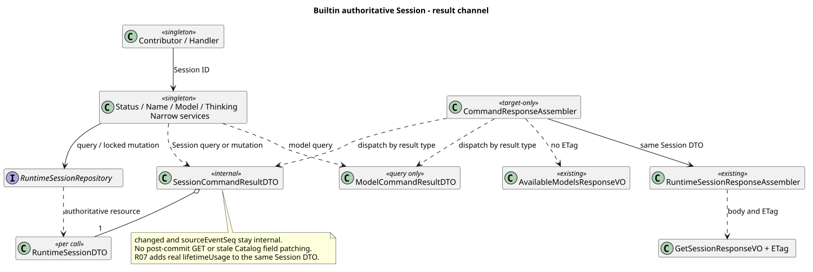

# Builtin 权威 Session 结果通道

> 版本：1.1.0 · 日期：2026-09-07 · 状态：R06 与已合入 R07 组合验证完成；Command HTTP 尚未发布

## 1. Context 与范围

用户已完成新响应设计：`pi-mono-java-design@88f4df16bc24bbfcd28e1ec374feb2de0db8be3b`，
`04-命令与技能/01-内置命令/README.md` 2.9.0 §8/8.1、Slash 1.6.0、Help 1.2.0。
Slash 是业务入口；成功资源不再带 command/changed/sourceEventSeq，不创建七类 Command VO。
本修复仅补齐已实现窄服务的权威结果通道，不发布 Controller、请求 VO 或 CommandResponseAssembler。
设计仓保持只读；没有新 Maven 依赖、安装 SQL 或升级脚本。

2026-09-07 用户明确授权并行修复、逐个复审和串行合并，替代此前串行开发安排。
R06 与 R07 均从最新 `origin/main@6f52fddc87a03c20916fc7b6ef1de87f6a7a8cf5` 建独立工作树，不堆叠。
R07 补 lifetimeUsage 的真实分项累计与既有 Session VO，已随 PR #236 合入 main `b143aec605ca444f8af62ce47034004446cc2e33`。
本分支通过普通 merge 接入该主线；组合代码及新增 Usage 断言的提交为
`ab88af5335f40bb371736bc0f143328d3eb7caf1`，父提交为 `92b4ac8d` 与 `b143aec6`，此阶段尚不包含 PR #235。
随后 PR #235 合入 main `188b1c3fd22fe9a943391f313a677d40da7530fd`；本分支再次普通合并，
最终组合代码提交为 `9dcd938fdde1daafc221a97e24b5de438991d379`，父提交为 `ab88af53` 与 `188b1c3f`。
未将完整内部资源与既有 Session VO 验证冒充共享 Command HTTP 契约验收。

## 2. 源码证据与关键定义

下表路径根为 `modules/coding-agent-cli/src/main/java/com/campusclaw/codingagent/runtimeapi/`。
变更前基线为 `6f52fddc87a03c20916fc7b6ef1de87f6a7a8cf5`，初始实现提交为 `b2506c1f2b2fcb36228d4114cd32f77c15c42ab0`；
“本轮修复”不冒充基线既有行为。

| 路径与符号 | 变更前观察 | 本轮修复与理由 |
|---|---|---|
| `service/command/readonly/RuntimeSessionStatusService.java:query` | 从 CommandSessionSnapshotDTO 子集生成 Status DTO | 按 Session ID 一次 find，完整保留查询资源；Catalog 仍为只读准入预览 |
| `service/command/SessionNamingService.java:execute`；`dto/SessionNameUpdateDTO.java` | 查询和锁内结果均裁剪为名称/changed | Repository 返回完整 Session；Service 不丢字段、不提交后 GET |
| `persistence/MyBatisRuntimeSessionRepository.java:updateName` | 更新 SQL 但返回名称，不更新内存 DTO 的版本和时间 | 同值返回锁内原对象；变化后同步名称、版本、时间再返回，其他字段不动 |
| `service/command/{SessionModelConfigurationService,SessionThinkingConfigurationService}.java:execute` | update.session() 已存在，但返回时丢失完整资源 | 保留事务 DTO，既有 change 和条件 PUT 入口不变 |
| `dto/command/SessionCommandResultDTO.java` | 基线无此类型 | 共用 Session/changed/sourceEventSeq 数据载体；消除三个标量子集 DTO |
| `dto/command/ModelCommandResultDTO.java` | 混合查询和修改结果，并在修改时重复读取模型清单 | 仅服务模型查询；修改返回 Session 结果类型，未来无需命令名称分派 |
| `session/RuntimeSessionResponseAssembler.java:getView` | 既有 Session VO 与 ETag 来自同一个 DTO | 后续 Command 应用层复用此投影，本轮通过真实组装器证明数据已保留 |

本轮以既有 Java Session API 为主设计基线，不重新选择 pi 行为；原 Name/Model/Thinking 的 pi 观察
保留在各历史记录。复用业务资源和按结果类型分派是 **Java 架构变更**；无公开回执是 **产品约束**。
不增命令历史、不记录凭据或查询内部路径，继续保留既有安全边界。

## 3. 架构与数据流

[PlantUML 源码](builtin-session-snapshot/diagram.puml#L1)

1. Catalog / CommandExecutionContext 固定元数据和 Definition 身份，仍只用于预览和分派，不扩展为可变资源缓存。
2. Status、Name 和 Thinking 查询各做一次权威读取；不会刷新 Agent、调用模型或获取容量。
3. Name 直接进入行锁；Model/Thinking 保留原预检查和锁内复核。变化和同值均返回锁内资源。
4. SessionCommandResultDTO 原样持有本次 DTO。没有提交后 GET，也没有拿旧 Catalog 补充缺失字段。
   所有单例只有固定依赖；结果对象不放入单例、Catalog 或跨请求缓存。
5. 后续应用层按结果类型选择业务 VO：Session 委派现有组装器，模型查询复用 AvailableModelsResponseVO；
   Help/Compact/Skills 保留三个最小业务 VO。Controller 不处理内部 DTO，亦不调用 Repository。

## 4. 决策与边界

见 [ADR-0060](../decisions/0060-builtin-authoritative-session-result.html)。

- SessionCommandResultDTO 保留 changed 和 sourceEventSeq 是领域信息，并非公开回执。新 HTTP 层必须白名单投影。
- 完整保留 RuntimeSessionDTO，而不是复制一套 Session 字段；已合入的 R07 lifetimeUsage 沿同一通道传递，
  分项累计与业务 VO 的源码证据见 [R07 实现说明](session-lifetime-usage.md)。
- Model 查询保留模型配置顺序及不可变非 null 列表，无 ETag；修改与同值只返回 Session 结果。
- Name running 可修改，归一值相同不改 updatedAt/resourceVersion，不写 Entry/Record，不改变 leaf。
- Model/Thinking running 修改仍拒绝；模型能力、自动关闭 Thinking、Entry 顺序和回滚语义不变。
- PUT 仍校验 If-Match，并在锁内使用 expectedVersion；Command 仍不携带条件版本。
- ETag 仅承担原配置条件更新职责，不为实时 state/usage 新增缓存版本承诺。
- 真实测试暴露返回时间包含纳秒而数据库为 TIMESTAMPTZ(3)；三个配置更新仅在实际变化分支统一
  `truncatedTo(ChronoUnit.MILLIS)`，SQL 入参与返回 DTO 使用同一个 storedAt，不依赖驱动舍入。
  同值直接返回原资源，不用新时间覆盖 updatedAt。

## 5. DFX 与交付边界

Status 增加一次按主键查询完整资源；其余查询/修改不增加提交后的往返，Model 修改减少一次候选目录读取。
沿用数据库行锁，不增加线程、队列、容量、文件持久化或通用生命周期。
R07 调整了同一 Repository 的 Usage 加载，本次合并保留锁后读取 Stats、完整 Session 结果和三个配置更新的毫秒截断；
组合回归覆盖锁内快照与事务回滚，未新增生产逻辑。
不扩展 Events V2、旧控制退役、前端迁移或 Skill 待决执行契约。

## 6. 测试与验证

### 6.1 初始 R06 历史证据

以下为初始实现的验证记录；两次组合结果见第 6.2、6.3 节。

- `./mvnw -q spotless:apply checkstyle:check` 与完整 `./mvnw -q verify` 通过：1669 项普通测试，0 失败/错误/跳过。
- 独立 openGauss 全量安装库执行 Repository IT：27 项，0 失败/错误/跳过。时间精度回归先真实失败再修复通过；
  受控 Clock 使用 123999999 纳秒验证 Name/Model/Thinking 修改、数据库查询及次日时钟下同值资源精确相等。
- SessionCommandSnapshotTest 的 12 个参数化用例覆盖 idle/running 查询、变化/同值完整对象传递、
  与旧 Catalog/锁前读取不同的锁内值、禁止二次 GET、实际 Session 组装器的正文与 ETag 同源。
  原 Model/Thinking PUT 的 If-Match、能力与序号回归保持。
- openGauss 保留 Name 并发每次结果、同值不写、Thinking 并发与重建 Spring/MyBatis 上下文恢复、事务/序号回滚；
  不冒充新 JVM 或完整 HTTP 流程。
- 指定质量脚本原路径缺失，使用本机归档副本：0 errors、16 项既有测试命名 warnings；新增测试无质量问题。
- Java AST 检查无 finding；三个 record 的布局及 Name 测试 Unicode 源码布局另行人工核对，未将机械 unverified 当作通过。
- 镜像 16 个有效 Java 文件对逐字节包名替换比对，另验证三个旧 DTO 在两侧均删除。
  默认 sync 因公司 NativeParent 无法解析失败；显式 `--no-verify` 同步完成，**公司镜像编译未验证**。
- 模块新增 403/850，含镜像新增 806/2000，低于 1800 软上限；删除行未抵扣。
- PlantUML ASCII、生成/SVG XML/可重复生成、52 个链接/锚点、4 份 ADR 的 1280px/360px 无 JavaScript 渲染、
  新图可视检查及 `git diff --check` 通过。

公共 Command JSON 的字段、鉴权、Header、ResultBean 和多 JVM HTTP 验收留给共享应用/HTTP 切片。

### 6.2 合入 R07 后的组合验证

以下命令针对 `ab88af53` 的组合代码执行，不作为后续合入 #235 后重跑完整验证的声明。

- JDK 21 `./mvnw -q spotless:apply checkstyle:check verify`：1671 项常规测试，0 失败/错误/跳过。
- 专用 openGauss 全量安装库：Repository 27 + LifetimeUsage 10 + Compact Admission 11，共 48 项全部通过。
  其中 R07 独立 JVM 恢复、锁等待后同值 Model 最新 Usage、原子累计与回滚继续通过；不包含 #235 接入测试。
- 原 12 个 SessionCommandSnapshotTest 参数用例增加锁前后不同的非零十项 Usage/Cost 断言，验证查询/修改/同值的完整业务 VO。
- 原三种配置时间精度用例先经生产 Entry + Usage 路径写入非零用量，再验证修改/同值的完整资源、用量不丢失与毫秒时间。
- 两份增强测试的质量检查 0 errors，14 项既有命名 warnings；32 个有效 Java 的 AST 无 finding，原 record/Unicode 人工检查保持。
- 镜像显式同步且一致；公司 NativeParent 编译仍未验证。相对最新 main 模块新增 455/850、含镜像 910/2000。
- 文档冲突合并保留 R06/R07 链接、当前响应/工作流和一条 1.0.2 历史项；没有重写旧图或设计仓。

### 6.3 再合入 Compact 接入主线后的增量验证

- `9dcd938f` 干净合并已审 #235 的 12 个既有路径，无额外生产修改；保留完整 Session、锁后 Usage 和三个配置时间截断。
- 最小定向回归：Compact Service 17 + Session Repository 5 + Compact Repository 10 + Session Snapshot 12，共 44 项全部通过。
- 同一专用 openGauss 全量安装库：Repository 27 + LifetimeUsage 10 + Compact Admission 11 + Compact Service 6，共 54 项全部通过。
- 镜像 dry-run 与 `git diff --check` 通过；相对 `origin/main@188b1c3f` 新增代码仍为模块 455/850、含镜像 910/2000。
- 本阶段不重复完整 verify；最终提交另受远端 CI 门禁约束。公司 NativeParent 编译仍未验证。

## 7. 版本历史

| 版本 | 日期 | 变更 |
|---|---|---|
| 1.1.0 | 2026-09-07 | 普通合并已审 R07 和 Compact 接入主线，补非零 Usage 的资源投影及真实数据库组合断言；区分两次组合代码与验证。 |
| 1.0.0 | 2026-09-07 | 修复权威 Session 结果传递，旧公开回执与标量子集方向 superseded；保留事务、领域信息和交付边界。 |
