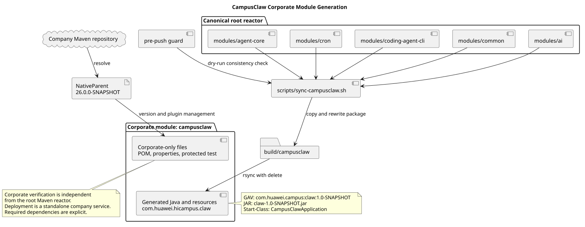

# CampusClaw 公司镜像模块设计

## 文档信息

| 项目 | 内容 |
|---|---|
| 文档版本 | 1.1.0 |
| 状态 | Implemented |
| 日期 | 2026-09-01 |
| 源码基线 | `98d3999ec6d57e099d7bf02aaa4fcf9607fc61aa` |
| 配置默认值变更前基线 | `2cb1661fd4dc27f2bc02579c44878d7a69775c3d` |
| 适用范围 | `campusclaw/`、镜像同步脚本、pre-push 门禁和公司 Maven 构建 |
| 变更类型 | 架构变化、公司集成约束 |
| 决策记录 | [ADR-0041](../decisions/0041-standardize-campusclaw-corporate-module-identity.html)、[ADR-0042](../decisions/0042-default-campusmate-base-url-for-corporate-mirror.html) |

> 本文中的路径和标识按 2026-09-01 的当前仓库位置展示；源码基线 SHA 仍是迁移前行为证据。

## 1. Context

主工程以根 Maven Reactor 中的四个 `modules/*` 模块作为唯一源码。公司交付同时需要一个单模块
镜像，但其目录、Java 包、Maven 坐标和父 POM 必须符合公司集成约束。若继续把公司元数据混入
根 Reactor，普通开发构建会依赖公司仓库；若独立维护两份 Java 源码，又会产生功能漂移。

目标是保留“主模块生成公司镜像”的单向关系，同时统一公司模块身份，并让公司父 POM解析和
可执行 JAR 验证成为独立、显式的构建门禁。1.0.0 的身份迁移不改变 HTTP/SSE、数据库表、
环境变量、`campusmate.*` 配置或 Mate Tool 契约；1.1.0 只为公司镜像的 `campusmate.base-url`
增加本地缺省值，不改变通用主模块或 HTTP 契约。

## 2. 关键定义与源码证据

### 2.1 观察行为

以源码基线为证据，镜像同步流程已经从 `modules/{ai,agent-core,cron,coding-agent-cli}` 汇总生产和
测试 Java 文件，重写包名，通过 `rsync --delete` 传播新增、修改和删除，并用排除清单保护公司
专有文件。公司应用配置与 POM 由镜像侧单独维护，根 `pom.xml` 的 Reactor 不包含公司镜像。

| 观察结论 | 当前仓库相对路径与符号 |
|---|---|
| 四个主模块是生成源 | `scripts/sync-campusclaw.sh` 的 `MODULES` |
| 同步分为 Stage、Apply、Verify | `scripts/sync-campusclaw.sh` 的三个阶段 |
| 公司专有路径由排除清单保护 | `scripts/sync-campusclaw-exclude.txt` |
| 根 Reactor 只包含主模块 | `pom.xml` 的 `<modules>` |
| 公司管理配置有镜像专用回归测试 | `campusclaw/src/test/java/com/huawei/hicampus/claw/codingagent/config/ManagementConfigurationTest.java` |

### 2.2 目标决策

| 项目 | 目标值 |
|---|---|
| 镜像目录 | `campusclaw/` |
| Java 根包 | `com.huawei.hicampus.claw` |
| Parent | `com.huawei.hicampus:NativeParent:26.0.0-SNAPSHOT` |
| 项目 GAV | `com.huawei.campus:claw:1.0-SNAPSHOT` |
| 默认 JAR | `claw-1.0-SNAPSHOT.jar` |
| Spring 应用名 | `campusclaw` |
| 启动类 | `com.huawei.hicampus.claw.codingagent.CampusClawApplication` |
| 同步入口 | `scripts/sync-campusclaw.sh` |

这些变化属于架构变化和公司集成约束。Java 业务行为与公开契约保持不变，不属于产品功能迁移。

## 3. 架构与数据流

[PlantUML 源码：`campusclaw_corporate_module`](campusclaw-corporate-module/diagram.puml#L1)

同步脚本先把四个主模块复制到 `build/campusclaw`，将 `com.campusclaw` 重写为
`com.huawei.hicampus.claw`，并验证 Stage 中不存在源包残留或包树外 Java 文件。Apply 阶段再将
Stage 结果同步到 `campusclaw/src`。`application.properties`、公司 POM 和受保护测试不由主模块
覆盖。

默认 Verify 在应用镜像前检查 `NativeParent` 是否能从当前 Maven 配置解析。普通本地环境若只需
生成或检查镜像，必须显式传入 `--no-verify`；脚本不得自行降级。pre-push 使用
`--dry-run --no-verify` 只检查受控源码是否漂移，不替代公司 Maven 构建。

## 4. 设计决策

### 4.1 公司镜像不加入根 Reactor

根工程继续只构建通用模块。公司镜像的 `<relativePath/>` 禁止 Maven 回退到仓库根 POM，确保
构建使用公司仓库提供的 `NativeParent`。该隔离避免普通开发环境被公司仓库可用性阻塞。

### 4.2 只保留单向生成

生产与测试 Java 源码只在 `modules/*` 修改。同步脚本生成 337 个生产 Java 文件和 140 个通用
测试文件，排除清单额外保护 1 个公司专有测试，镜像最终共有 141 个测试文件。

### 4.3 不提供兼容入口

目录、同步脚本、Java 包、Maven 坐标和 JAR 名一次性切换。仓库不保留旧入口、别名或复制品，
公司父工程必须同步更新模块路径、GAV、启动类、日志分类和包扫描或白名单。

### 4.4 使用 Maven 默认产物名

镜像 POM 不配置 `finalName`，产物由 `artifactId` 和 `version` 推导为
`claw-1.0-SNAPSHOT.jar`。这使构建结果与有效 GAV 一致，减少额外命名规则。

### 4.5 公司镜像提供 CampusMate 本地缺省地址

公司镜像手工维护的 `application.properties` 使用
`${CAMPUSMATE_BASE_URL:https://localhost:8591}`。未配置环境变量时，镜像连接本机 8591 端口的
HTTPS CampusMate 服务；显式 `CAMPUSMATE_BASE_URL` 继续覆盖该值。通用主模块的
`application.yml` 保持 `${CAMPUSMATE_BASE_URL}` 必填，不获得公司环境默认值。

该差异属于公司集成产品约束。它不恢复旧部署变量、不增加配置别名，也不改变共享客户端的 URI
校验或 CampusMate HTTP 契约。架构关系没有变化，因此本版本复用现有生成关系图。

## 5. 边界情况

- 无法解析 `NativeParent`：默认同步失败并提示配置公司 Maven 仓库；只允许显式
  `--no-verify` 跳过。
- 新增公司专有 Java 文件：必须登记到 `scripts/sync-campusclaw-exclude.txt`，否则下一次
  `rsync --delete` 会移除。
- 源包重写遗漏：Stage 校验立即失败，未通过的内容不得应用到镜像。
- 公司父 POM 缺少依赖或插件版本：记录具体缺项并在公司构建边界修正，不回退根 POM。
- 根模块改变：必须重新同步，pre-push dry-run 对内容漂移进行拦截。
- 未配置 `CAMPUSMATE_BASE_URL`：公司镜像使用 `https://localhost:8591`；本地服务或证书不可用时，
  后续请求按连接或 TLS 错误失败，不回退到其他地址。
- 已配置 `CAMPUSMATE_BASE_URL`：显式值覆盖缺省值，并继续接受共享配置的启动期 URI 校验。

## 6. DFX

- 可维护性：主模块仍是唯一业务源码，镜像由确定性脚本生成。
- 可诊断性：父 POM解析错误明确给出坐标、环境要求和显式跳过方式。
- 安全性：不保留旧包扫描和白名单入口，降低重复暴露或错误扫描的风险。
- 可验证性：根 Reactor 与公司镜像分别构建，验证结果不会相互冒充。

## 7. 契约改动

外部部署构建契约使用新目录、GAV、JAR、启动类和 Java 包。Spring 应用名为 `campusclaw`。
公司镜像的 `campusmate.base-url` 新增 `https://localhost:8591` 缺省值，原有
`CAMPUSMATE_BASE_URL` 环境变量继续作为覆盖入口；通用主模块仍要求显式配置。HTTP/SSE、数据库
表、其余 `campusmate.*` 配置和 Mate Tool 契约没有变化。

## 8. 测试与验证

仓库内验证包括根工程 `./mvnw verify`、同步后 dry-run 零漂移、337/141 文件计数、POM 坐标和
`finalName` 缺失检查、公司镜像缺省地址与环境变量覆盖测试、受控文件旧标识零残留、PlantUML/SVG
验证以及 `git diff --check`。

公司 Maven 环境还必须执行 `./scripts/sync-campusclaw.sh` 与
`./mvnw -f campusclaw/pom.xml clean verify`，检查有效 GAV、Manifest、Start-Class、默认 JAR
和 `BOOT-INF/classes/com/huawei/hicampus/claw`。这些结果通过前 Draft PR 不得转为 Ready 或合并。

## 9. 版本历史

| 版本 | 日期 | 说明 |
|---|---|---|
| 1.1.0 | 2026-09-01 | 公司镜像为 `campusmate.base-url` 增加 `https://localhost:8591` 缺省值并保留环境变量覆盖；通用主模块仍为必填。 |
| 1.0.0 | 2026-09-01 | 统一 CampusClaw 公司镜像目录、Java 包、父 POM、项目坐标、产物名和验证边界。 |
