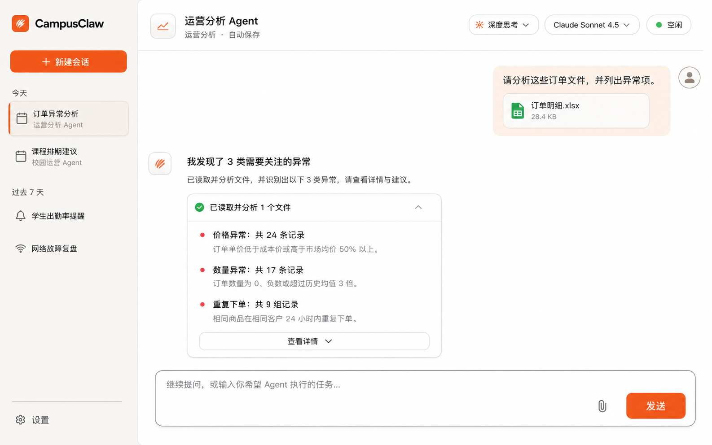
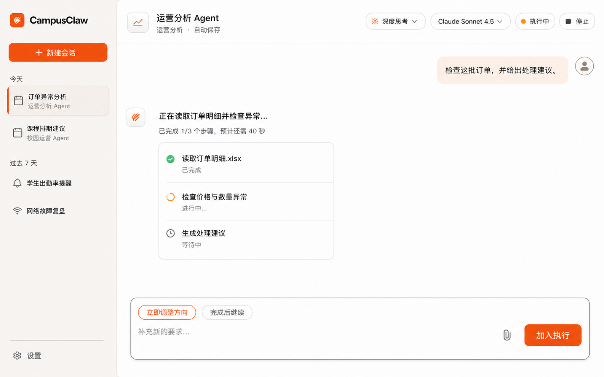

# CampusClaw 产品前端体验设计

> 文档版本：0.1.0
>
> 状态：Proposed，等待低保真与高保真评审确认
>
> pi-mono-java 源码基线：`origin/main@3a6358bc9dd5837cdf5ac866fc0761298372510a`
>
> Runtime 精确契约参考：设计仓 `a63f2fcb9633bae95d082b508f8f2b4c9af72754` 上的工作快照 `1.36.0`
>
> Postman 核对：2026-08-20，只读核对 `Agent Runtime` collection 及真实 SSE 响应
>
> 日期：2026-08-20

## 1. 结论

CampusClaw 前端应从“把 HTTP/SSE operation 摊在页面上的本地调试台”改为面向任务的
Agent 工作台。主界面只暴露用户能够理解并需要决策的概念：Agent、会话、消息、附件、
模型、深度思考、执行状态与执行中控制。`Service URL`、JWT/APPKEY、`session_id`、ETag、
原始 JSON 和 SSE frame 不进入产品主流程。

本轮提出一个桌面优先的单工作区方案：左侧会话导航、中央对话、顶部 Session 能力、
底部 Composer。工具生命周期合并为对话内活动卡；运行中 `Steer`、`FollowUp`、`Abort`
分别产品化为“立即调整方向”“完成后继续”“停止”。现有调试能力可以保留，但只能作为
内部构建中的开发者诊断入口，不能继续充当产品首页。

## 2. 源码与契约证据

### 2.1 已观察行为

| 证据 | 已观察事实 |
|---|---|
| `frontend/src/App.vue:77-150` | 页面标题为 `CampusClaw HTTP + SSE`，右侧直接展示 Connection、鉴权、Session、Model/Thinking 与 Stream 控件，底部直接暴露 Send、Steer、FollowUp。 |
| `frontend/src/composables/useRuntimeApi.ts:5-235` | 浏览器直接调用 `/campusclaw-service/v1`；凭据、ETag、Session、原始 SSE Event 均由前端状态直接管理。 |
| `RuntimeSessionController`、`RuntimeEventController`、`RuntimeSessionConfigurationController`、`RuntimeSessionControlController` | 当前后端已实现 11 个内部 Session Runtime operation。 |
| `RuntimeEventType.java:13-26` | 对外事件同时包含持久化消息、瞬时 Assistant delta、工具进度和流终止事件。 |
| `RuntimeEventProjector.java:117-195` | Assistant preview 与 completed 分离，工具开始/结束是瞬时事件，`tool.result` 才是持久化结果。 |
| `RuntimeEntryCodec.java:94-107` | SSE data 与 GET history 的持久化事件投影共享 Entry 数据。 |
| Postman `Agent Runtime` collection | Session、Configuration、Events、Control 四组请求与源码 11 个 operation 一致；真实 `POST /events` 响应按 frame 展示大量 delta，证明原始事件视图适合诊断，不适合终端用户阅读。 |

### 2.2 已确认契约约束

- 每个 Session 同一时刻最多有一个 active execution。
- `POST /sessions/{id}/events` 是请求范围 SSE；断线不等于中止，也不能自动重放 POST。
- `user.message`、`assistant.message.completed`、`tool.result` 是可恢复的持久化 Entry。
- `assistant.message.started/delta`、工具执行 started/completed 和流控制事件是瞬时状态。
- Model 与 Thinking 只允许在 Session `idle` 时修改，并通过强 ETag 防止覆盖并发修改。
- Steer 优先于 FollowUp；两者只在 `running` 时接受；Abort 在 `idle` 时也是幂等成功。
- Runtime 只接收 `file_ids`，不负责浏览器文件上传、文件名和预览元数据。
- 精确 Runtime 设计明确要求浏览器/UI 经 mate-service 调用，内部 SSE 不能字节透明转发。

### 2.3 目标设计与分类

| 目标差异 | 分类 | 理由 |
|---|---|---|
| 产品主界面不再直接调用内部 Runtime V1 | 架构变化 | 浏览器需要稳定的公共 Chat/Agent 资源，而不是内部 Session 标识和凭据。 |
| 隐藏凭据、ETag、原始 SSE 与内部错误 | 安全加固 | 降低凭据暴露、内部实现泄漏和错误信息越界风险。 |
| 将 Steer/FollowUp/Abort 改为用户语言 | 产品约束 | 用户决策是“现在改变方向”“完成后继续”“停止”，不是选择内部 queue operation。 |
| 将工具事件合并为活动卡 | 产品约束 | 保留执行透明度，同时避免 started/completed/result 三段协议噪音。 |
| 保留独立开发者诊断入口 | 架构变化 | 保留接口联调效率，但与面向用户的路由、权限和构建产物隔离。 |

## 3. 用户、目标与非目标

### 3.1 目标用户

- 主要用户：选择受管 Agent 完成校园运营、教学、运维或分析任务的业务人员。
- 次要用户：需要查看 Agent 活动与失败原因的支持人员。
- 开发者：只在内部诊断入口中查看 Runtime IDs、原始事件和请求信息。

### 3.2 本轮目标

- 确认桌面端信息架构与三个关键状态。
- 确认产品化执行控制、工具活动呈现与断线恢复文案。
- 确认视觉方向、基础尺寸和色彩语义。
- 明确现有 11 个 Runtime operation 能支持什么，以及生产前端还缺哪些公共契约。

### 3.3 非目标

- 本轮不实现 Vue 组件、不替换现有调试客户端。
- 本轮不设计 mate-service 公共 API 的精确路径和 VO。
- 本轮不承诺移动端完整功能等价；只定义响应式降级原则。
- 高保真 PNG 是视觉方向，不是可直接切图交付的组件资产。

## 4. 产品边界

[PlantUML 源码：`frontend_product_boundary`](campusclaw-frontend/diagram.puml#L1)

生产链路必须是：浏览器调用 mate-service 公共 HTTP/SSE，mate-service 完成认证、授权、
`chat_id` 与内部 `session_id` 映射、错误脱敏和 Event 投影，再调用 CampusClaw Runtime。
当前仓库的直接 Runtime client 只能作为本地诊断基线，不能被描述为已满足生产安全边界。

## 5. 信息架构

| 区域 | 主要内容 | 用户动作 | 默认隐藏内容 |
|---|---|---|---|
| 左侧导航 | 新建会话、最近会话、Agent 中心、设置 | 创建、切换、搜索会话 | `session_id`、接口地址 |
| 顶部栏 | Agent 名称、自动保存、模型、深度思考、粗粒度状态 | 切换 idle Session 的模型/思考；运行时停止 | ETag、资源版本、Provider 凭据 |
| 对话画布 | User/Assistant turn、附件、工具活动卡、错误恢复提示 | 阅读、展开工具详情、复制结果 | SSE frame、瞬时 Entry ID |
| Composer | 附件、输入、发送；运行时控制模式 | 发送新消息、立即调整方向、完成后继续 | operation path、内部请求体 |
| 开发者诊断 | 请求摘要、原始事件、内部标识 | 复制调试信息 | 仅内部构建和授权角色可见 |

### 5.1 低保真设计

低保真同时覆盖常规对话、首次进入/选择 Agent、执行中控制三个状态。

[打开可缩放低保真评审页](campusclaw-frontend/low-fidelity.html)

### 5.2 高保真：常规对话

视觉意图：温暖中性画布、柔和沙色导航、深石墨正文、珊瑚橙主动作、鼠尾草绿成功状态。
页面保持大面积留白，不把执行过程做成监控 Dashboard。

### 5.3 高保真：执行中

运行态只增加必要的进度、停止操作与 Composer 模式，不改变导航和会话身份。图中“立即
调整方向”已由用户主动选中；产品默认应选“完成后继续”，减少无意改变当前执行方向的风险。

## 6. 关键状态与交互

### 6.1 首次进入

1. 页面从 mate-service 获取当前用户可用的 Agent 目录。
2. 用户选择 Agent 后创建公共 Chat；mate-service 在内部创建并绑定 Runtime Session。
3. Session 创建、鉴权、默认模型和 `thinking` 初始化不以表单方式暴露。
4. 若 Agent 目录或模型不可用，显示业务可读错误和重试，不显示内部错误响应。

Agent 目录与公共 Chat 创建是目标态设计；当前 11 个 Runtime operation 没有 Agent 列表、
Chat 标题或用户会话列表接口。

### 6.2 Idle 对话

- Composer 默认提交新的用户消息。
- 模型和深度思考放在顶部栏；修改成功后在本地更新 Session 资源与并发版本。
- 相同配置不制造“已变更”提示；服务端无变化响应保持原时间与版本。
- 删除会话放入会话菜单并二次确认。若 Session running，不自动 Abort；先提示用户停止执行。

### 6.3 Running 对话

- 顶部状态改为“执行中”，显示“停止”。
- Composer 展示两个互斥模式：“完成后继续”（默认，映射 FollowUp）与“立即调整方向”
  （显式选择，映射 Steer）。
- 成功接受控制消息后显示“已加入本次执行”，不虚构 Entry ID 或已持久化状态。
- 队列已满时保留输入并给出可重试提示；响应结果不确定时不自动重发。
- Stop 映射 Abort；成功后等待 Session 回到 idle，不把 Stop 解释为删除。

### 6.4 断线与恢复

- 网络断开后显示“连接已中断，执行可能仍在继续”。
- 禁止自动重放初始消息、Steer 或 FollowUp。
- 重新读取公共持久化历史并按公共事件标识去重；未持久化 delta 不尝试补齐。
- 若 Session 仍 running，可继续展示“后台执行中”，但只有正确路由到执行实例后才能控制。

## 7. Runtime Event 到 UI 的投影

[PlantUML 源码：`runtime_event_ui_projection`](campusclaw-frontend/diagram.puml#L61)

| Runtime 事件 | 产品 UI 对象 | 处理规则 |
|---|---|---|
| `user.message` | User turn | 以持久化完整数据替换本地 optimistic turn。 |
| `assistant.message.started` | Assistant 占位 | 创建 streaming turn，不单独显示事件名。 |
| `assistant.message.delta` | Assistant 文本预览 | 顺序追加；仅是临时显示。 |
| `assistant.message.completed` | Assistant 完整 turn | 用持久化完整内容替换 preview，保存公开事件身份。 |
| `tool.execution.started` | 活动卡 running | 与此前 Assistant tool call 关联。 |
| `tool.execution.completed` | 活动卡状态 | 结束 spinner；等待或合并 `tool.result`。 |
| `tool.result` | 活动卡结果 | 成功默认折叠，失败默认展开；不另起聊天气泡。 |
| `session.status.idle` | 顶部与 Composer idle | 关闭 running 控件，恢复普通发送。 |
| `stream.end` | 本轮完成 | 根据 `completed/aborted` 展示轻量结束状态。 |
| `stream.error` | 可恢复错误提示 | 保留已持久化 turn，提示重新读取历史，不生成伪 Assistant 消息。 |

## 8. 视觉与组件基线

### 8.1 布局

- 设计画布：1440 × 900；桌面优先。
- 左侧导航：248 px；可折叠至 72 px。
- 顶部栏：72 px；只放 Session 级能力和状态。
- 对话正文：建议最大宽度 900 px；保留长内容阅读空间。
- Composer：固定在对话区底部，最大宽度与正文一致，输入增长至 8 行后内部滚动。

### 8.2 色彩语义

| Token | 建议值 | 用途 |
|---|---:|---|
| `--surface-canvas` | `#FFFEFC` | 对话主画布 |
| `--surface-navigation` | `#FAF7F2` | 左侧导航 |
| `--text-primary` | `#171717` | 正文与标题 |
| `--text-muted` | `#72706C` | 次要信息 |
| `--border-subtle` | `#E8E2DB` | 分隔线和卡片边界 |
| `--action-primary` | `#FF4F1F` | 新建、发送、加入执行 |
| `--status-success` | `#2FB66D` | idle、完成 |
| `--status-running` | `#F59A23` | running、进行中 |
| `--status-danger` | `#D94A3A` | 错误与不可逆操作 |

这些值来自高保真方向稿，进入实现前需执行 WCAG 对比度校验并形成最终 Design Token。

### 8.3 可访问性与键盘

- 正文与交互文字至少满足 WCAG 2.2 AA；状态不能只靠颜色表达。
- 所有图标按钮具有可读名称；主要命中区至少 44 × 44 CSS px。
- `Enter` 发送、`Shift+Enter` 换行；运行中发送前明确显示当前控制模式。
- Tool Activity 使用可聚焦的 disclosure；展开状态通过 `aria-expanded` 表达。
- 流式文本更新使用低打扰 live region，避免每个 token 都被读屏播报。
- `prefers-reduced-motion` 下取消 spinner 旋转，保留静态状态文本。

### 8.4 响应式

- `>= 1280 px`：完整导航与对话。
- `1024..1279 px`：导航默认折叠，会话列表用抽屉打开。
- `< 1024 px`：顶部模型/思考进入 Session 菜单；Composer 控制模式保持显式。
- `< 768 px`：本轮只保证核心对话、附件、发送和停止；Agent 目录与诊断不做并排布局。

## 9. 公共契约缺口

以下内容没有对应的 Runtime V1 implementation，属于生产前端落地前必须评审的目标态设计：

| 前端需要 | 当前证据 | 目标责任方 |
|---|---|---|
| 可用 Agent 列表、名称、描述、图标与能力 | Runtime 只按 `agent_id` 创建 Session | mate-service Agent 目录 |
| 用户 Chat 列表、标题、搜索、重命名 | Runtime 无 Session list/name | mate-service Chat 资源 |
| `chat_id` 与内部 `session_id` 映射 | 设计已确认需要两跳，精确公共接口未评审 | mate-service bridge |
| 浏览器文件上传、文件名、大小和预览 | Runtime 只接收 `file_ids` | 附件服务 + mate-service |
| 模型友好名称与能力说明 | Runtime Models 只返回 `model_id:string[]` | 模型目录 |
| 浏览器安全 Event Schema | 内部 SSE 不能字节透明转发 | mate-service event projector |
| 浏览器认证、权限和审计 | Runtime 只做内部 Header 形状校验 | mate-service / 网关 |

因此，高保真稿是已确认 Runtime 能力上的产品体验目标，不应表述为现有后端已经提供了
全部页面数据。公共 bridge 契约完成前，只能使用 mock adapter 或内部开发环境验证界面。

## 10. 错误、边界与 DFX

- `401/403`：交给统一登录/权限处理，不在 Chat 里展示凭据编辑器。
- `409 SESSION_BUSY`：普通发送切换到运行中控制，不自动重复请求。
- `409 SESSION_NOT_RUNNING`：刷新 Session；允许用户改为新的普通消息。
- `412 SESSION_VERSION_MISMATCH`：刷新模型/思考状态，再让用户确认是否继续修改。
- `422` 能力错误：在具体控件旁展示；保留原 Session 配置。
- `429 CONTROL_QUEUE_FULL`：保留 Composer 内容，提示等待或停止。
- `503`：读取 `Retry-After`，显示可重试状态；不要泄漏执行实例归属信息。
- Tool error：活动卡默认展开；提供“复制诊断摘要”，不直接展示原始私有 payload。
- 长会话：历史虚拟化；分页向上加载；持久化 turn 与 streaming turn 使用稳定 key。
- 大消息：输入区显示字符计数接近上限；附件最多 32 个，在选择阶段阻止超限。

## 11. 设计决策

- [ADR-0016：产品前端隔离 Runtime 调试协议](../decisions/0016-campusclaw-product-frontend-boundary.html)
  （Proposed）：生产 UI 使用公共 bridge；内部协议只在诊断入口出现。

## 12. 实施分期

1. **设计确认**：确认本文件的三状态结构、执行中控制命名和视觉方向。
2. **前端壳与 mock adapter**：实现路由、导航、对话、活动卡、Composer 与状态机，不接真实凭据。
3. **公共 bridge 契约评审**：逐项确认 Agent、Chat、Attachment、Model Catalog 与 public SSE。
4. **真实集成**：替换 mock adapter；实现历史去重、断线恢复、ETag 冲突和错误投影。
5. **诊断隔离**：把现有调试台迁移到内部路由或独立开发构建，验证生产包不可达。

## 13. 测试与验收

- 视觉回归：1440、1280、1024、768 四个宽度。
- 状态测试：first use、idle、running、aborted、stream error、offline recovery。
- Event projector 测试：delta 合并、completed 替换、tool result 合并、重复 Entry 去重。
- 控制测试：running 默认 FollowUp、显式 Steer、Abort、队列满、响应不确定不重试。
- 配置测试：idle 才能改模型/思考、ETag 冲突刷新、模型切换关闭不支持的 thinking。
- 安全测试：生产 DOM、网络日志和错误 UI 不出现内部凭据、`session_id`、ETag 或原始 SSE。
- 可访问性：键盘全流程、焦点顺序、读屏 streaming、色彩对比、reduced motion。

## 14. 验证要求

- `plantuml -tsvg docs/designs/campusclaw-frontend/diagram.puml`
- `.puml` ASCII-only；SVG 是同步生成物且为合法 XML。
- Markdown 不包含 Mermaid；所有图片和 PlantUML 行锚点存在。
- 低保真 HTML 可独立打开，三个状态均在首屏评审板中可见。
- 两张高保真 PNG 可解码，尺寸一致。
- `git diff --check` 通过。

## 15. 高保真生成说明

两张视觉稿使用内置 imagegen 的 `ui-mockup` 路径生成，第一张以低保真评审板为布局参考，
第二张以前一张高保真稿为视觉系统参考。最终约束重点是：完整产品视口、无右侧设置栏、
隐藏内部协议字段、对话内工具卡、温暖中性色与克制珊瑚橙动作色；运行态只改变状态、
进度和 Composer 控制。实际实现以本设计文档的字段与交互规则为准。

[查看两次生成使用的完整 Prompt](campusclaw-frontend/imagegen-prompts.md)

## 16. 版本历史

| 版本 | 日期 | 变更 |
|---|---|---|
| 0.1.0 | 2026-08-20 | 基于现有 Vue 调试台、Runtime V1 源码、精确契约和 Postman 实测，提出低保真三状态、高保真常规/运行态、产品边界和公共契约缺口。 |
