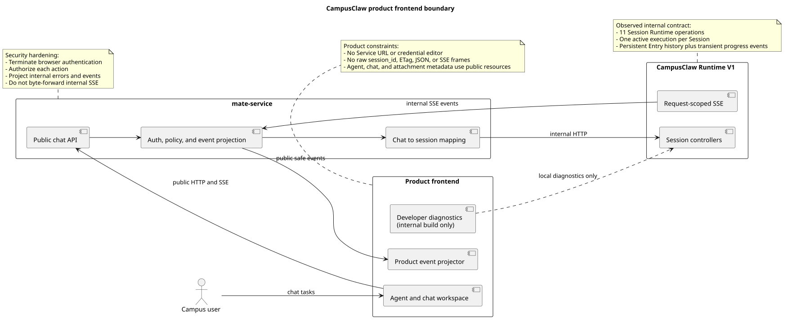
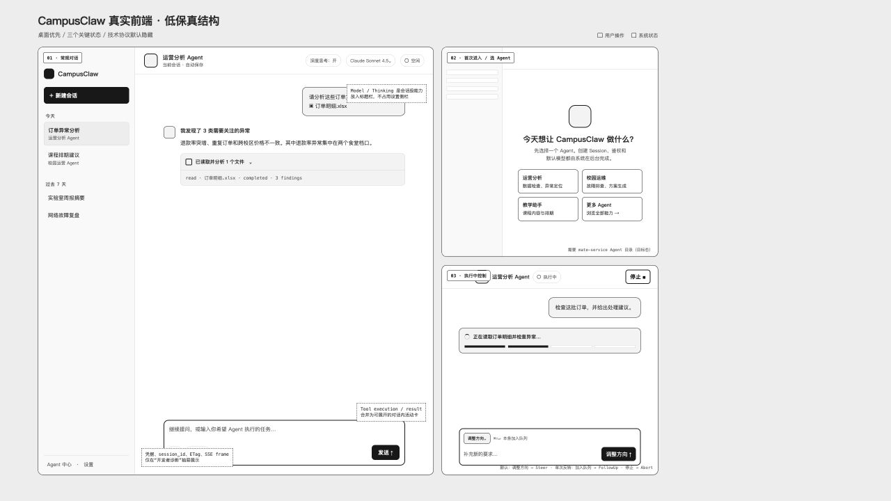
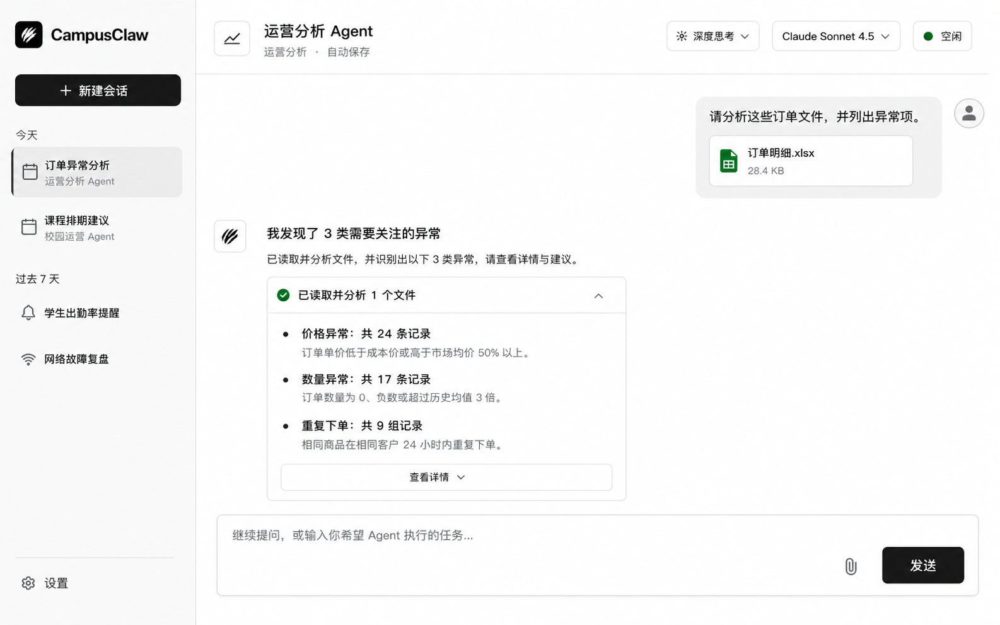
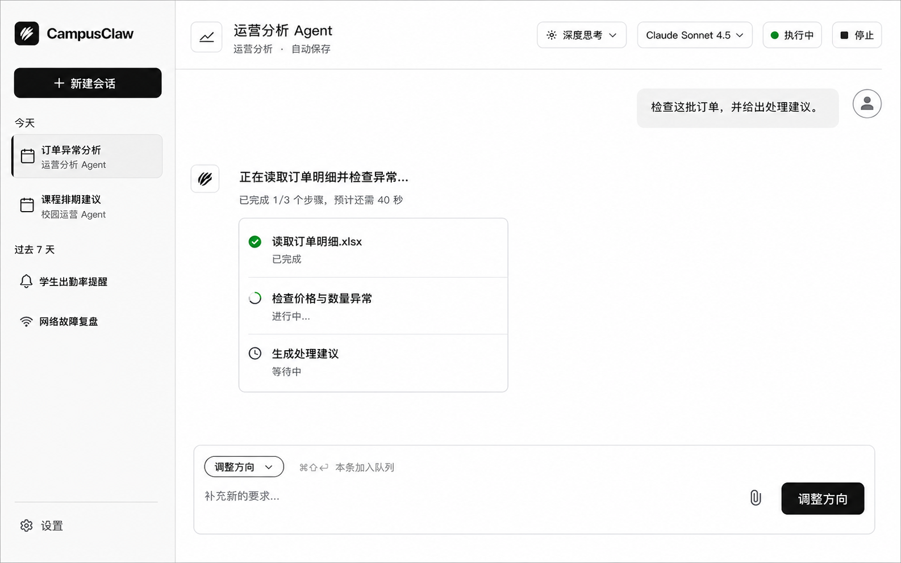
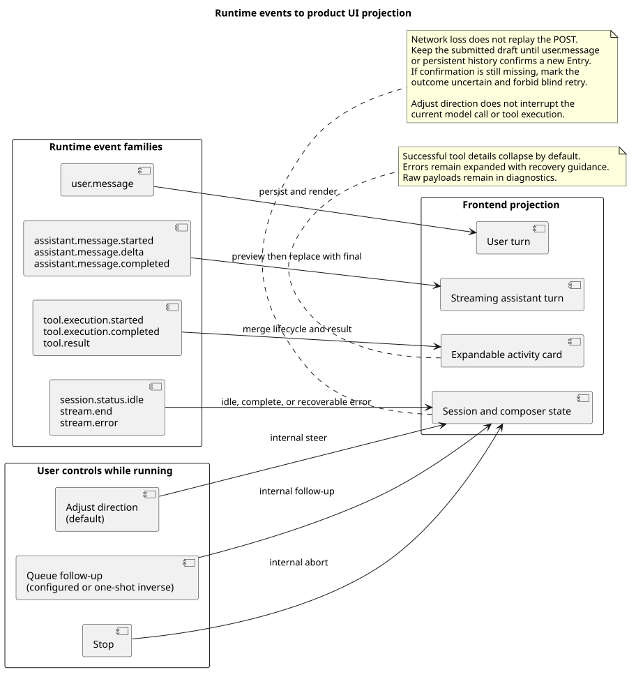

# CampusClaw 产品前端体验设计

| 属性 | 值 |
|---|---|
| 文档版本 | 0.5.0 |
| 状态 | Implemented（过渡集成）；产品界面与 HTTP 1.38.0 已对齐，生产公共 bridge 仍待设计 |
| 界面评审状态 | `firstUse`、`idleConversation`、`runningConversation` 已实现并通过本地多视口技术验收；待产品验收 |
| 主设计依据 | 本文件，维护源码证据、目标差异、设计理由、状态与 Design Token |
| 人类评审界面 | [`frontend-review.html`](campusclaw-frontend/frontend-review.html)，集中展示低保真、高保真和待确认项 |
| 图源 | [`diagram.puml`](campusclaw-frontend/diagram.puml)，生成两张架构 SVG |
| HTTP 设计风格基线 | `chat-http-v1-design.md` 与 `contract/operations/01..11` 1.38.0；设计仓 `ea4c70c33a458182b354ed0908cfc0ef54f13bc0` |
| Codex 视觉证据 | 本机 `ChatGPT.app` 26.814.41407（build 6720）中的 light-theme CSS Token；`app.asar` SHA-256 `8fba32f8baa6d984b0f0f4149d3da46221e3adb3b52836f85fe65e31e655a8c0` |
| Codex 跟进交互证据 | 同一安装包 `webview/assets/app-initial-BCLYDefw.js` 的 `followUpQueueMode`、`K9s()`、submit action，以及 `webview/assets/zh-CN-ByRVSIXt.js` 的 Composer 文案 |
| pi-mono-java 后端基线 | `d0efb2fd18f2f2a7db121a1cbd4f039348a8094a` (`origin/main`) |
| 前端改造前基线 | `9ae08be97e49387367500da8fd8b01b4a607c4b3` |
| 实现源码 | `frontend/src/App.vue`、`frontend/src/components/`、`frontend/src/composables/useRuntimeApi.ts`、`frontend/src/projectors/runtimeEventProjector.ts`、`frontend/src/style.css` |
| Postman 核对 | 2026-08-20；只读核对 `Agent Runtime` collection 及真实 SSE 响应 |
| 更新日期 | 2026-08-21 |

## 1. 结论

CampusClaw 前端应从“把 HTTP/SSE operation 摊在页面上的本地调试台”改为面向任务的
Agent 工作台。主界面只暴露用户能够理解并需要决策的概念：Agent、会话、消息、附件、
模型、深度思考、执行状态与执行中控制。`Service URL`、JWT/APPKEY、`sessionId`、ETag、
原始 JSON 和 SSE frame 不进入产品主流程。

当前实现采用桌面优先的单工作区方案：左侧会话导航、中央对话、顶部 Session 能力、
底部 Composer。工具生命周期合并为对话内活动卡；运行中 `Steer`、`FollowUp`、`Abort`
分别产品化为“调整方向”“加入队列”“停止”。Composer 像 Codex desktop 一样只呈现当前
跟进模式，默认“调整方向”，而不是同时展示两个常驻选择。现有调试能力可以保留，但只能
作为内部构建中的开发者诊断入口，不能继续充当产品首页。

视觉采用 Codex-inspired 而非品牌复制：以黑白中性层级、原生工具感、紧凑活动表达和
少量状态色为主，保留 CampusClaw 自有名称与图形，不使用 OpenAI/Codex 商标或标志。

## 2. 设计权威顺序与 HTTP 风格对齐

本专题沿用 Runtime HTTP 设计的“设计依据与人类评审面分离”方式，但不引入没有实际
消费方的 UI JSON Schema：

1. 本文件是唯一可编辑的设计依据，维护源码证据、目标设计、设计理由、状态机、视觉
   Token 和验收规则；
2. [`frontend-review.html`](campusclaw-frontend/frontend-review.html) 是主要人类评审界面，按稳定
   `screenKey` 展示三个界面状态、评审材料与待确认项；
3. [`diagram.puml`](campusclaw-frontend/diagram.puml) 是架构图唯一图源，SVG 只由 PlantUML 生成；
4. 低保真 HTML 是可编辑布局源，PNG 是其评审快照；高保真 PNG 是视觉方向稿，不是
   可直接切图的实现资产。

| 对齐项 | HTTP 设计方式 | 前端设计采用方式 |
|---|---|---|
| 文档入口 | 顶部属性表记录版本、状态、权威源和基线 | 采用相同属性表，并显式记录三个 `screenKey` 的评审状态 |
| 人类评审 | 独立 HTML 按 `operationKey` 展示 operation | 独立 HTML 按 `screenKey` 展示 first-use、idle、running |
| 视觉语言 | HTTP 评审页使用中性表面、细边框和蓝色选择态 | 文档评审面保持同一结构；产品稿采用 Codex-inspired 黑白中性体系，蓝色只保留给焦点/链接 |
| 证据表达 | 区分观察行为、产品约束、安全加固和架构变化 | 保持相同分类，不把高保真目标误写为现有实现 |
| 机器契约 | JSON 是字段级精确契约源 | 不新增目标不明确的 UI JSON；这是产品设计制品差异 |

## 3. 源码与契约证据

### 3.1 改造前已观察行为

| 证据 | 已观察事实 |
|---|---|
| `8691e880:frontend/src/App.vue:77-150` | 改造前页面标题为 `CampusClaw HTTP + SSE`，右侧直接展示 Connection、鉴权、Session、Model/Thinking 与 Stream 控件，底部直接暴露 Send、Steer、FollowUp。 |
| `8691e880:frontend/src/composables/useRuntimeApi.ts:5-235` | 改造前浏览器直接管理凭据、ETag、Session 和原始 SSE Event。 |
| `RuntimeSessionController`、`RuntimeEventController`、`RuntimeSessionConfigurationController`、`RuntimeSessionControlController` | 当前后端已实现 11 个内部 Session Runtime operation。 |
| `RuntimeEventType.java:13-26` | 对外事件同时包含持久化消息、瞬时 Assistant delta、工具进度和流终止事件。 |
| `RuntimeEventProjector.java:117-241` (`projectMessageStart`、`projectThinking`、`projectToolStart`、`projectToolEnd`) | HTTP 1.38 SSE 使用 `entryId`、`assistantEntryId`、`toolCallId`、`toolName`、`isError` 等 lowerCamelCase 字段；Assistant preview 与 completed 分离，工具开始/结束是瞬时事件。 |
| `RuntimeEntryCodec.java:108-128, 258-322` (`toSseData`、`toHistoryEvent`、`appendPublicPayload`) | SSE data 与 GET Events 的持久化事件共享 lowerCamelCase 公开投影；数据库 payload 中的 snake_case 只是内部存储兼容形式。 |
| `CreateSessionResponseVO`、`GetSessionResponseVO`、`AvailableModelsResponseVO`、`EventPageResponseVO`、`ControlMessageAcceptedResponseVO` | 后端 `d0efb2fd` 的边界 VO 分别序列化 `sessionId/agentId/modelId/createdAt/updatedAt`、`currentModelId`、`nextPage`、`acceptedAt`。 |
| Postman `Agent Runtime` collection | Session、Configuration、Events、Control 四组请求与源码 11 个 operation 一致；真实 `POST /events` 响应按 frame 展示大量 delta，证明原始事件视图适合诊断，不适合终端用户阅读。 |
| 本机 `ChatGPT.app` 26.814.41407 的 `app.asar` light-theme Token | 可观察到 `gray-0/50/75/100/500/750/900`、近黑 primary solid、5%/10% alpha border、灰色 user message background、green success 与 blue focus/link；这是 Codex-inspired 视觉证据，不是公开品牌规范。 |
| 同一 `app.asar` 的 `webview/assets/app-initial-BCLYDefw.js`：`followUpQueueMode`、`K9s()`、`composer.submitButtonTooltip.*` 与 submit telemetry | Codex desktop 的跟进模式取值为 `steer` / `queue`，desktop 默认 `steer`；`Cmd/Ctrl+Shift+Enter` 对单条消息执行相反模式；已排队消息支持送入当前运行、编辑、删除、重试与恢复。历史 `interrupt` 配置会归一为 `steer`。 |
| 同一 `app.asar` 的 `webview/assets/zh-CN-ByRVSIXt.js` | 产品文案使用“调整方向”“加入队列”“停止”；“调整方向”的说明是提交但不中断正在运行的模型，而不是立即中止当前模型或工具。 |
| [OpenAI 官方 Codex use cases](https://developers.openai.com/codex/use-cases) | 官方将 Codex 表述为理解代码、构建/测试、评审并交付任务的工作界面；官方未公开可复制的 Codex Design Token，因此具体色值以本机可观察资源和本设计决策为依据。 |

### 3.2 当前实现行为

| 源码证据 | 已实现行为 |
|---|---|
| `frontend/src/App.vue:64-137`，`createSession`、`resumeSession`、`submit` | 以 Agent 和会话为产品入口；会话列表当前仅保存在内存；初始消息在 `user.message` 或历史确认前保留 Composer 草稿，运行中按当前 `steer/queue` 模式提交。 |
| `frontend/src/App.vue:177-290` | 产品主界面只呈现侧栏、Agent/会话标题、模型、深度思考、执行状态、停止、对话和 Composer；开发者诊断仅在 `import.meta.env.DEV` 下出现。 |
| `frontend/src/composables/useRuntimeApi.ts:45-240` | 全部普通 JSON 请求/响应、`nextPage` 分页与控制接受结果已对齐 HTTP 1.38 lowerCamelCase。 |
| `frontend/src/composables/useRuntimeApi.ts:252-447` | UTF-8 增量解析 SSE；断流后读取 Session 和全量 Events 对账；只有新 `user.message` 按 `entryId`、正文和 `fileIds` 确认后才解除草稿保留，否则发布 `OUTCOME_UNCERTAIN`。 |
| `frontend/src/projectors/runtimeEventProjector.ts:9-130` | 投影器直接消费 `entryId`、`fileIds`、`assistantEntryId`、`toolCallId/toolName/isError` 并转换为稳定对话 turn 和活动卡。 |
| `frontend/src/composables/useRuntimeApi.test.ts`、`frontend/src/projectors/runtimeEventProjector.test.ts` | Vitest 契约测试覆盖 Session/Model/Control、多页 Events、SSE lowerCamelCase 投影与断流确认/不确定分支。 |
| `frontend/src/style.css` | Codex-inspired 黑白中性 Token、44 px 交互目标、reduced-motion 与 800 px 移动端折叠已实现。 |

直接 Runtime adapter 是公共 bridge 尚未设计期间的过渡架构，不代表生产边界已经完成。
它只读取非秘密环境配置，不提供 JWT/APPKEY 编辑器，也不在产品 DOM 展示内部资源标识。

### 3.3 已确认契约约束

- 每个 Session 同一时刻最多有一个 active execution。
- `POST /sessions/{id}/events` 是请求范围 SSE；断线不等于中止，也不能自动重放 POST。
- `user.message`、`assistant.thinking.completed`、`assistant.message.completed`、`tool.result` 是可恢复的持久化 Entry，其中 thinking 的历史可见性受 Session 当前开关控制。
- `assistant.message.started/delta`、工具执行 started/completed 和流控制事件是瞬时状态。
- Model 与 Thinking 只允许在 Session `idle` 时修改，并通过强 ETag 防止覆盖并发修改。
- Steer 优先于 FollowUp；两者只在 `running` 时接受；Abort 在 `idle` 时也是幂等成功。
- Runtime 只接收 `fileIds`，不负责浏览器文件上传、文件名和预览元数据。
- Path、Query、JSON 和 SSE `data` 只接受 lowerCamelCase；前端不保留 snake_case 双读或双写兼容层。
- 精确 Runtime 设计明确要求浏览器/UI 经 mate-service 调用，内部 SSE 不能字节透明转发。

### 3.4 目标设计与分类

| 目标差异 | 分类 | 理由 |
|---|---|---|
| 产品主界面不再直接调用内部 Runtime V1 | 架构变化 | 浏览器需要稳定的公共 Chat/Agent 资源，而不是内部 Session 标识和凭据。 |
| 隐藏凭据、ETag、原始 SSE 与内部错误 | 安全加固 | 降低凭据暴露、内部实现泄漏和错误信息越界风险。 |
| 将 Steer/FollowUp/Abort 改为用户语言 | 产品约束 | 用户决策是“调整方向”“加入队列”“停止”，不是选择内部 operation；命名与 Codex desktop 对齐。 |
| 运行中只显示当前跟进模式，默认 Steer | 产品约束 | Codex desktop 的 Composer 以一个可配置默认行为和单次反转快捷键工作；两个常驻模式会增加不必要决策并偏离参照实现。 |
| 将工具事件合并为活动卡 | 产品约束 | 保留执行透明度，同时避免 started/completed/result 三段协议噪音。 |
| 保留独立开发者诊断入口 | 架构变化 | 保留接口联调效率，但与面向用户的路由、权限和构建产物隔离。 |
| 采用 Codex-inspired 而非复制 Codex 品牌 | 产品约束 | 复用工具型工作台的层级和密度，不使用 OpenAI/Codex 商标，也不声称存在官方公开 Token。 |

## 4. 用户、目标与非目标

### 4.1 目标用户

- 主要用户：选择受管 Agent 完成校园运营、教学、运维或分析任务的业务人员。
- 次要用户：需要查看 Agent 活动与失败原因的支持人员。
- 开发者：只在内部诊断入口中查看 Runtime IDs、原始事件和请求信息。

### 4.2 本轮目标

- 实现桌面端信息架构与三个关键状态。
- 实现产品化执行控制、工具活动呈现与断线恢复文案。
- 落地 Codex-inspired 视觉 Token、基础尺寸和响应式规则。
- 对齐 HTTP 1.38.0 lowerCamelCase wire contract，同时明确生产前端仍缺少的公共契约。

### 4.3 非目标

- 本轮不设计 mate-service 公共 API 的精确路径和 VO。
- 本轮不实现 Agent 目录、可持久化 Chat 列表、浏览器附件上传和队列项编辑；缺失接口不使用伪 API 补齐。
- 本轮不承诺移动端完整功能等价；实现核心对话、发送、停止和侧栏抽屉。
- 高保真 PNG 是视觉方向，不是可直接切图交付的组件资产。

## 5. 产品边界

[PlantUML 源码：`frontend_product_boundary`](campusclaw-frontend/diagram.puml#L1)

生产链路必须是：浏览器调用 mate-service 公共 HTTP/SSE，mate-service 完成认证、授权、
公共 Chat 标识与内部 `sessionId` 映射、错误脱敏和 Event 投影，再调用 CampusClaw Runtime。
当前仓库的直接 Runtime adapter 只能作为过渡集成，不能被描述为已满足生产安全边界。

## 6. 信息架构与界面状态

三个界面状态使用与 HTTP `operationKey` 相同的稳定评审键。中文名称用于评审沟通，
`screenKey` 用于设计、组件 Story、视觉回归和测试名称，不随文案调整而改变。

| 中文简称 | screenKey | 当前状态 | 主要评审材料 | 依赖边界 |
|---|---|---|---|---|
| 首次进入 | `firstUse` | 已实现 | 低保真评审板 + Vue 页面 | Agent 元数据来自非秘密构建配置；公共目录仍为目标态 |
| 常规对话 | `idleConversation` | 已实现 | 高保真常规态 + Vue 页面 | 过渡 adapter 复用已确认 Session/Event 能力 |
| 执行中 | `runningConversation` | 已实现 | 高保真运行态 + Vue 页面 | FollowUp、Steer、Abort 已产品化，不暴露 operation 名称 |

| 区域 | 主要内容 | 用户动作 | 默认隐藏内容 |
|---|---|---|---|
| 左侧导航 | 新建会话、最近会话、Agent 中心、设置 | 创建、切换、搜索会话 | Runtime `sessionId`、接口地址 |
| 顶部栏 | Agent 名称、自动保存、模型、深度思考、粗粒度状态 | 切换 idle Session 的模型/思考；运行时停止 | ETag、资源版本、Provider 凭据 |
| 对话画布 | User/Assistant turn、附件、工具活动卡、错误恢复提示 | 阅读、展开工具详情、复制结果 | SSE frame、瞬时 Entry ID |
| Composer | 附件、输入、发送；运行时当前跟进模式 | 发送新消息、调整方向、加入队列 | operation path、内部请求体 |
| 开发者诊断 | 请求摘要、原始事件、内部标识 | 复制调试信息 | 仅内部构建和授权角色可见 |

### 6.1 低保真设计

低保真同时覆盖常规对话、首次进入/选择 Agent、执行中控制三个状态。

[打开可缩放低保真评审页](campusclaw-frontend/low-fidelity.html)

### 6.2 高保真：常规对话

视觉意图：Codex-inspired 黑白中性层级、近黑主动作、浅灰选中态、深石墨正文和只在
成功/执行时出现的绿色。工具活动保持紧凑、可展开和编辑器式精度；页面仍保留充足留白，
不把执行过程做成监控 Dashboard。

### 6.3 高保真：执行中

运行态只增加必要的进度、停止操作与 Composer 跟进方式，不改变导航和会话身份。v4 移除
两个常驻模式胶囊，默认动作显示为“调整方向”，并提示可用 `⌘/Ctrl+Shift+Enter` 将本条
消息改为“加入队列”；这与 Codex desktop 的默认模式和单次反转行为一致。

## 7. 关键状态与交互

### 7.1 首次进入

1. 页面从 mate-service 获取当前用户可用的 Agent 目录。
2. 用户选择 Agent 后创建公共 Chat；mate-service 在内部创建并绑定 Runtime Session。
3. Session 创建、鉴权、默认模型和 `thinking` 初始化不以表单方式暴露。
4. 若 Agent 目录或模型不可用，显示业务可读错误和重试，不显示内部错误响应。

Agent 目录与公共 Chat 创建是目标态设计；当前 11 个 Runtime operation 没有 Agent 列表、
Chat 标题或用户会话列表接口。

### 7.2 Idle 对话

- Composer 默认提交新的用户消息。
- 模型和深度思考放在顶部栏；修改成功后在本地更新 Session 资源与并发版本。
- 相同配置不制造“已变更”提示；服务端无变化响应保持原时间与版本。
- 删除会话放入会话菜单并二次确认。若 Session running，不自动 Abort；先提示用户停止执行。

### 7.3 Running 对话

- 顶部状态改为“执行中”，显示“停止”。
- Composer 只显示当前跟进处理方式，不同时展示两个互斥胶囊。desktop 默认“调整方向”，
  设置中的“跟进处理方式”可改为“加入队列”。
- `Enter` 按当前默认方式提交；`Cmd/Ctrl+Shift+Enter` 只对本条消息使用相反方式，不修改设置。
- “调整方向”映射内部 Steer：服务端接受后，不中断当前正在进行的模型调用或工具；它在
  当前 Assistant Turn 及其工具结束后、下一次模型调用前优先送达。因此禁止使用“立即调整”
  或会让用户误解为硬中断的文案。
- “加入队列”映射内部 FollowUp：只有当前执行本会自然结束时才送达，并在同一 active
  execution 中继续。Steer 队列优先于 FollowUp 队列。
- 成功接受后分别显示“已接受调整”或“已加入队列”，不虚构 Entry ID、送达时间或已经
  持久化；HTTP `202` 目前只返回 `sessionId` 与 `acceptedAt`。
- 当前过渡 adapter 只在 Composer 上方显示紧凑的“已接受调整/已加入队列”状态；编辑、
  删除、重试以及把队列项送入当前运行属于 target-only。公共 bridge 提供稳定控制项 ID
  与查询能力前，刷新后不承诺还原未送达队列，也不把本地 optimistic key 伪装为 Runtime ID。
- 队列已满时保留输入并给出可重试提示；响应结果不确定时不自动重发。
- Stop 映射 Abort；成功后等待 Session 回到 idle，不把 Stop 解释为删除。

| 产品动作 | 当前内部 HTTP operation | 接受结果 | 产品解释 |
|---|---|---|---|
| 调整方向 | `POST /sessions/{sessionId}/steers` | `202` | 已接受，在下一次模型调用前优先送达；不表示当前模型或工具已被中断 |
| 加入队列 | `POST /sessions/{sessionId}/follow-ups` | `202` | 已入 FollowUp 队列，在执行本会自然结束时送达 |
| 停止 | `POST /sessions/{sessionId}/abort` | `204` | 请求中止 active execution，并清空尚未送达的两类跟进 |

这些路径只用于 bridge/adapter 对齐当前 HTTP 设计，不进入产品文案或浏览器可见诊断信息。

### 7.4 断线与恢复

- 提交初始消息后，HTTP `200`/SSE 响应头不单独作为草稿清空依据。只有看到本次持久化 `user.message`，或 GET Events 读到本次新 `entryId` 且正文/`fileIds` 一致时，才将草稿标记为已确认并清空。
- 网络断开后立即重读 Session 与持久化 Events。若已找到本次 User Entry，显示“消息已确认，但执行流已中断”；若仍无法确认，保留草稿并显示 `OUTCOME_UNCERTAIN`。
- 禁止自动重放初始消息、Steer 或 FollowUp。
- 重新读取公共持久化历史并按公共事件标识去重；未持久化 delta 不尝试补齐。
- 若 Session 仍 running，可继续展示“后台执行中”，但只有正确路由到执行实例后才能控制。

## 8. Runtime Event 到 UI 的投影

[PlantUML 源码：`runtime_event_ui_projection`](campusclaw-frontend/diagram.puml#L70)

| Runtime 事件 | 产品 UI 对象 | 处理规则 |
|---|---|---|
| `user.message` | User turn | 以持久化完整数据替换本地 optimistic turn。 |
| `assistant.message.started` | Assistant 占位 | 创建 streaming turn，不单独显示事件名。 |
| `assistant.message.delta` | Assistant 文本预览 | 顺序追加；仅是临时显示。 |
| `assistant.message.completed` | Assistant 完整 turn | 用持久化完整内容替换 preview，保存公开事件身份。 |
| `tool.execution.started` | 活动卡 running | 与此前 Assistant tool call 关联。 |
| `tool.execution.completed` | 活动卡状态 | 结束 spinner；等待或合并 `tool.result`。 |
| `tool.result` | 活动卡结果 | 成功默认折叠，失败默认展开；不另起聊天气泡。 |
| `session.status.idle` | 顶部与 Composer idle | 关闭 running 控件，恢复普通发送。 |
| `stream.end` | 本轮完成 | 根据 `completed/aborted` 展示轻量结束状态。 |
| `stream.error` | 可恢复错误提示 | 保留已持久化 turn，提示重新读取历史，不生成伪 Assistant 消息。 |

## 9. 视觉与组件基线

### 9.1 布局

- 设计画布：1440 × 900；桌面优先。
- 左侧导航：248 px；折叠后完全隐藏，由 44 px 顶部按钮恢复。
- 顶部栏：72 px；只放 Session 级能力和状态。
- 对话正文：最大宽度 880 px；保留长内容阅读空间。
- Composer：固定在对话区底部，最大宽度与正文一致，输入增长至 8 行后内部滚动。

### 9.2 Codex-inspired 专业配色与语义

| Token | 建议值 | 用途 |
|---|---:|---|
| `--surface-primary` | `#FFFFFF` | 对话主画布 |
| `--surface-secondary` | `#F9F9F9` | 应用壳和侧栏 |
| `--surface-tertiary` | `#F3F3F3` | 用户消息、工具弱背景和分组 |
| `--surface-selected` | `#EDEDED` | 当前会话、选中控制模式 |
| `--text-primary` | `#282828` | 正文与标题，对应 light-theme `gray-750` |
| `--text-secondary` | `#5D5D5D` | 次要信息，对应 `gray-500` |
| `--border-subtle` | `rgba(13,13,13,.05)` | 分隔线、低强调边界 |
| `--border-default` | `rgba(13,13,13,.10)` | Composer 和活动卡边界 |
| `--action-primary` | `#181818` | 新建、发送、调整方向或加入队列，对应 `gray-900` |
| `--action-primary-hover` | `#303030` | 主动作 hover，对应 `gray-700` |
| `--status-running` | `#00A240` | 执行中状态点和小面积进度，对应 `green-500` |
| `--status-success` | `#008635` | 已完成，对应 `green-600` |
| `--status-error` | `#C62828` | 错误、停止确认和不可逆操作 |
| `--focus` | `#0169CC` | 键盘焦点与链接；不作为大面积品牌主色 |

这些值来自本机安装包的可观察 light-theme Token，并被本设计收敛为 CampusClaw 的
Codex-inspired 视觉系统；它们不是 OpenAI 官方公开品牌规范。禁止把橙色、珊瑚色、暖沙色、
大面积蓝色或渐变作为品牌主视觉。运行中与完成都可使用绿色，但必须同时通过 spinner/
进度文本和 check/“已完成”标签区分，不能只依赖颜色。

### 9.3 可访问性与键盘

- 正文与交互文字至少满足 WCAG 2.2 AA；状态不能只靠颜色表达。
- 所有图标按钮具有可读名称；主要命中区至少 44 × 44 CSS px。
- `Enter` 按当前跟进方式发送，`Shift+Enter` 换行；运行中通过动作名称明确当前方式。
- `Cmd/Ctrl+Shift+Enter` 对单条运行中消息临时反转“调整方向”与“加入队列”，不改变默认设置。
- Tool Activity 使用可聚焦的 disclosure；展开状态通过 `aria-expanded` 表达。
- 流式文本更新使用低打扰 live region，避免每个 token 都被读屏播报。
- `prefers-reduced-motion` 下取消 spinner 旋转，保留静态状态文本。

### 9.4 响应式

- `>= 1280 px`：完整导航与对话。
- `1024..1279 px`：保留导航，隐藏低优先级状态文字并收紧模型控件。
- `801..1023 px`：保留导航，顶部能力压缩为图标和紧凑选择器。
- `<= 800 px`：侧栏默认收起为抽屉，顶部隐藏模型/思考，保留核心对话、发送和停止。

## 10. 公共契约缺口

以下内容没有对应的 Runtime V1 implementation，属于生产前端落地前必须评审的目标态设计：

| 前端需要 | 当前证据 | 目标责任方 |
|---|---|---|
| 可用 Agent 列表、名称、描述、图标与能力 | Runtime 只按 `agentId` 创建 Session | mate-service Agent 目录 |
| 用户 Chat 列表、标题、搜索、重命名 | Runtime 无 Session list/name | mate-service Chat 资源 |
| 公共 Chat 标识与内部 `sessionId` 映射 | 设计已确认需要两跳，精确公共接口未评审 | mate-service bridge |
| 浏览器文件上传、文件名、大小和预览 | Runtime 只接收 `fileIds` | 附件服务 + mate-service |
| 模型友好名称与能力说明 | Runtime Models 只返回 `models:string[]` 与 `currentModelId` | 模型目录 |
| 浏览器安全 Event Schema | 内部 SSE 不能字节透明转发 | mate-service event projector |
| 浏览器认证、权限和审计 | Runtime 接收调用上下文 Header，不校验凭据组合、格式或真实性 | mate-service / 网关 |
| 可恢复的排队项 ID、列表与队列管理 | Steer/FollowUp 的 `202` 无控制项 ID，Runtime 无公开队列查询/修改接口 | mate-service bridge + Runtime 目标契约 |

因此，高保真稿是已确认 Runtime 能力上的产品体验目标，不应表述为现有后端已经提供了
全部页面数据。公共 bridge 契约完成前，只能使用 mock adapter 或内部开发环境验证界面。

## 11. 错误、边界与 DFX

- `401/403`：交给统一登录/权限处理，不在 Chat 里展示凭据编辑器。
- `409 SESSION_BUSY`：普通发送切换到运行中控制，不自动重复请求。
- `409 SESSION_NOT_RUNNING`：刷新 Session；允许用户改为新的普通消息。
- `412 SESSION_VERSION_MISMATCH`：刷新模型/思考状态，再让用户确认是否继续修改。
- `422` 能力错误：在具体控件旁展示；保留原 Session 配置。
- `429 CONTROL_QUEUE_FULL`：保留 Composer 内容，提示等待、切换跟进方式或停止。
- `503`：读取 `Retry-After`，显示可重试状态；不要泄漏执行实例归属信息。
- `OUTCOME_UNCERTAIN`：保留提交草稿，告知用户先刷新历史，不提供“重试”主动作。
- `STREAM_INTERRUPTED`：表示 User Entry 已确认但本次实时预览中断；保留已持久化 turn，继续以 GET Events 为权威事实。
- Tool error：活动卡默认展开；提供“复制诊断摘要”，不直接展示原始私有 payload。
- 长会话：历史虚拟化；分页向上加载；持久化 turn 与 streaming turn 使用稳定 key。
- 大消息：输入区显示字符计数接近上限；附件最多 32 个，在选择阶段阻止超限。

## 12. 设计决策

- [ADR-0020：产品前端隔离 Runtime 调试协议](../decisions/0020-campusclaw-product-frontend-boundary.html)
  （Accepted）：生产 UI 使用公共 bridge；当前直接 Runtime adapter 只作为过渡集成；副作用 POST 只在持久化确认后清空草稿。

## 13. 实施分期

1. **已完成：产品前端壳**：导航、三类状态、对话、活动卡、Composer、响应式和安全错误文案。
2. **已完成：过渡 Runtime adapter**：对齐 HTTP 1.38.0 lowerCamelCase、请求级 SSE、历史去重、ETag、运行控制和提交结果确认；不接收浏览器凭据。
3. **下一步：公共 bridge 契约评审**：逐项确认 Agent、Chat、Attachment、Model Catalog、队列项和 public SSE。
4. **下一步：生产集成**：把 `useRuntimeApi` 替换为公共 adapter，补齐认证、授权、持久化会话列表和上传。
5. **部分完成：测试固化**：已增加 Runtime adapter 和 Event projector 的 Vitest 契约测试；浏览器 E2E 与截图视觉回归仍待接入持续集成。

## 14. 测试与验收

- 视觉回归：1440、1280、1024、768 四个宽度。
- 状态测试：first use、idle、running、aborted、stream error、offline recovery。
- HTTP 1.38 契约测试：Session/Model/Control lowerCamelCase、`modelId` 请求、`nextPage` 多页读取。
- Event projector 测试：`entryId/fileIds/assistantEntryId/toolCallId/toolName/isError` 投影、completed 替换和 tool result 合并。
- 恢复测试：SSE 断流后历史确认返回 `confirmed`；未找到新 User Entry 返回 `uncertain` 并发布 `OUTCOME_UNCERTAIN`。
- 控制测试：desktop running 默认 Steer、设置切换 Queue、单条快捷键反转、Abort、Steer 优先、
  队列满、响应不确定不重试、刷新后不虚构未送达队列。
- 配置测试：idle 才能改模型/思考、ETag 冲突刷新、模型切换关闭不支持的 thinking。
- 安全测试：当前过渡构建的产品 DOM 和错误 UI 不出现内部凭据、Runtime `sessionId`、ETag 或原始 SSE；
  公共 bridge 上线后，生产网络日志也不得出现内部资源身份。
- 可访问性：键盘全流程、焦点顺序、读屏 streaming、色彩对比、reduced motion。

## 15. 验证要求

- 在本目录执行 `plantuml -tsvg diagram.puml`
- `.puml` ASCII-only；SVG 是同步生成物且为合法 XML。
- Markdown 不包含 Mermaid；所有图片和 PlantUML 行锚点存在。
- `frontend-review.html` 可独立打开，三个 `screenKey`、版本、评审状态和图片均可见。
- 低保真 HTML 可独立打开，三个状态均在首屏评审板中可见。
- 常规态 v3 与运行态 v4 高保真 PNG 可解码，尺寸一致，且符合 Codex-inspired 黑白中性体系。
- `git diff --check` 通过。

## 16. 高保真生成说明

常规态 v3 与运行态 v4 使用内置 imagegen 的 `ui-mockup` 编辑路径生成：以此前高保真稿为
布局与内容参考；运行态 v4 在 v3 基础上只改 Composer 跟进交互。最终约束重点是：
完整产品视口、无右侧设置栏、隐藏内部协议字段、对话内工具卡、Codex-inspired 黑白
中性表面、近黑主动作、少量绿色状态与蓝色焦点；运行态采用一个当前模式、可配置默认值
和单次反转快捷键。实际实现以本设计文档的字段、Token 与交互规则为准。

[查看两次生成使用的完整 Prompt](campusclaw-frontend/imagegen-prompts.md)

## 17. 版本历史

| 版本 | 日期 | 变更 |
|---|---|---|
| 0.5.0 | 2026-08-21 | 合并 `origin/main@d0efb2fd` 后对齐 Runtime HTTP 1.38.0 lowerCamelCase；修复 Session/Model/Control、SSE 与 `nextPage` 分页投影；新增初始消息持久化确认句柄，断流时优先从历史对账，无法确认则保留草稿并禁止盲目重试；增加 Vitest 契约测试，ADR 因主分支编号冲突顺延为 0020。 |
| 0.4.0 | 2026-08-20 | 实现 Codex-inspired 产品前端，按 HTTP 1.37.0 重写直接 Runtime 过渡 adapter，新增产品事件投影、单一跟进模式、开发态诊断入口和 800 px 响应式折叠；记录公共 bridge、目录、附件和持久化队列项仍是目标态。 |
| 0.3.0 | 2026-08-20 | 对照本机 Codex desktop 实现，将运行中跟进改为单一当前模式：desktop 默认“调整方向”，可配置“加入队列”，`Cmd/Ctrl+Shift+Enter` 单次反转；明确 Steer 不硬中断当前模型/工具、队列 UI 与现有 HTTP 控制项身份缺口；更新低保真、运行态 v4、评审页、ADR 与图。 |
| 0.2.0 | 2026-08-20 | 对齐 Runtime HTTP 1.37.0 的属性表、权威顺序、稳定评审键、证据分类和 HTML 评审风格；新增 `frontend-review.html`；依据本机 Codex/ChatGPT 应用可观察 Token 将视觉改为 Codex-inspired 黑白中性体系，并生成常规态与运行态 v3 高保真稿。 |
| 0.1.0 | 2026-08-20 | 基于现有 Vue 调试台、Runtime V1 源码、精确契约和 Postman 实测，提出低保真三状态、高保真常规/运行态、产品边界和公共契约缺口。 |
