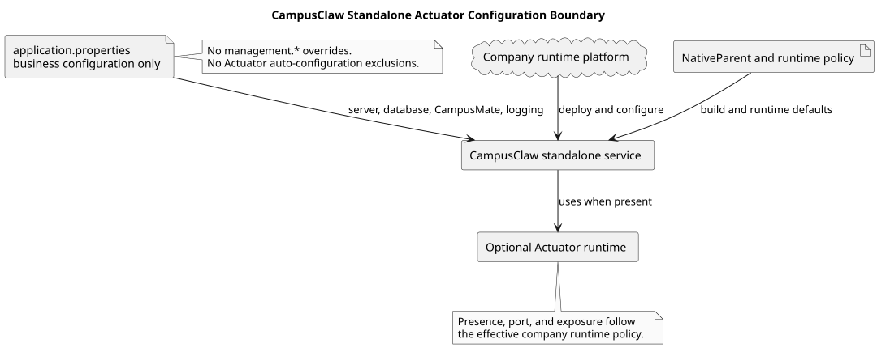

# CampusClaw 独立服务 Actuator 配置边界设计

## 文档信息

| 项目 | 内容 |
|---|---|
| 文档版本 | v2.0 |
| 历史变更前基线 | `origin/main@5dfa22ada4c7958eff6b4de5f1c718362805b6ee` |
| 历史已评审实现 | `c03bd5da488ae5a1a5c80386de64a4b5e7c8d1c9` |
| 本次源码基线 | `origin/main@b46b9d37e634dae12a777576062e2097516fe153` |
| 适用范围 | `campusclaw` 独立服务的 Spring Boot 配置与专有回归测试 |
| 变更类型 | 部署架构变化、公司集成边界收敛 |
| 决策状态 | [ADR-0043](../decisions/0043-remove-campusclaw-standalone-actuator-configuration.html) 已替代 ADR-0040 |

> 公司镜像相关路径和标识按 2026-09-01 的当前仓库位置展示；历史提交 SHA 仍是对应行为证据。

## 1. Context

历史上，`campusclaw` 按公司父项目的子模块运行。父 POM 传递引入 Actuator 后，
公司专用 `application.properties` 使用 `management.server.port=-1`、
`management.endpoints.enabled-by-default=false` 和 Actuator 自动配置排除清单，以关闭父项目带入的
管理面。ADR-0038 记录了端点基础 Bean 与管理 Web 暴露的分离，ADR-0040 将排除项收敛为
18 个仍有独立作用的自动配置。

公司部署拓扑现已变更：CampusClaw 是独立服务，不再需要应用配置去抵消公司父项目的
Actuator 管理面行为。继续保留这些属性会让独立服务携带已失效的集成策略，并将运行平台的
Actuator 策略隐藏在应用自动配置排除字符串中。

## 2. 关键定义与源码证据

### 2.1 已观察的修改前行为

以 `origin/main@b46b9d37e634dae12a777576062e2097516fe153` 为本次修改前基线：

| 观察到的行为 | 仓库源码证据 |
|---|---|
| 镜像强制关闭管理端口 | `campusclaw/src/main/resources/application.properties:1-3` |
| 镜像默认禁用全部 Endpoint | `campusclaw/src/main/resources/application.properties:4` |
| 镜像排除 18 个 Actuator 自动配置 | `campusclaw/src/main/resources/application.properties:5-23` |
| 专有测试精确锁定上述属性和排除集合 | `campusclaw/src/test/java/com/huawei/hicampus/claw/codingagent/config/ManagementConfigurationTest.java:30-63` |
| 业务 HTTP 端口独立使用 `server.*` | `campusclaw/src/main/resources/application.properties:27-28` |
| 镜像 POM 不直接声明 Actuator | `campusclaw/pom.xml` 的 `<dependencies>` |

CampusClaw 已成为公司独立服务是用户确认的目标部署条件，不是从本仓库源码推导的
观察行为。

### 2.2 目标配置语义

- **独立服务：** CampusClaw 按自身的 `server.address` 和 `server.port` 提供 HTTP/SSE 服务。
- **无应用级 Actuator 覆盖：** `application.properties` 不再声明 `management.*` 或针对 Actuator 的
  `spring.autoconfigure.exclude`。
- **平台策略：** 如果 `NativeParent` 或运行平台提供 Actuator，启用、端口和暴露策略使用公司
  独立服务的标准配置，不由本应用隐式抵消。
- **业务配置保持：** 数据库、CampusMate、日志、Runtime 和控制面心跳配置不变。

## 3. 架构与配置流

[PlantUML 源码：`campusclaw_actuator_boundary`](campusclaw-management-web/diagram.puml#L1)

CampusClaw 作为独立服务从自身 `application.properties` 读取业务配置。公司运行平台和
`NativeParent` 仍可以提供标准运行能力，但应用文件不再为 Actuator 创建第二套关闭或排除策略。

## 4. 设计决策

当前决策见 [ADR-0043：删除 CampusClaw 独立服务的 Actuator 专用配置](../decisions/0043-remove-campusclaw-standalone-actuator-configuration.html)。
ADR-0038 和 ADR-0040 保留为旧部署拓扑下的历史决策。

### 4.1 删除 Actuator 专用应用配置

删除 `management.server.port`、`management.endpoints.enabled-by-default` 以及整个
`spring.autoconfigure.exclude` Actuator 清单。不保留空属性、注释、兼容键或部分排除。

### 4.2 将 Actuator 策略交还独立服务运行边界

应用不再假设 Actuator 是被上层业务容器意外传递的能力。如果公司平台需要健康检查、指标
或独立管理端口，应通过标准独立服务配置明确提供，而不是修改或恢复本仓库的自动配置
排除列表。

### 4.3 保留专有 CampusMate 配置测试

删除原 `ManagementConfigurationTest` 中的管理面断言，并将文件重命名为
`CampusMateConfigurationTest`。测试继续加载真实 `application.properties`，锁定公司镜像的
CampusMate 缺省地址与环境变量覆盖行为，同步排除清单更新为新路径。

## 5. 边界情况

- `NativeParent` 或运行平台未引入 Actuator：应用不创建管理端点，无需额外排除。
- `NativeParent` 引入 Actuator：使用有效 Classpath 和外部配置的标准行为；应在公司环境验证实际端口与暴露范围。
- 公司平台需要特定端点或端口：使用部署配置显式设置，不将旧排除清单作为兼容入口。
- 业务 HTTP/SSE 服务继续由 `SERVER_ADDRESS` 和 `SERVER_PORT` 决定。
- 公司父 POM 和最终 Classpath 不在本仓库；本地根 Reactor 验证不能替代公司环境启动验证。

## 6. DFX

- **可维护性：** 删除 18 个与 Spring Boot 类名耦合的排除字符串，后续补丁升级无需维护该清单。
- **可诊断性：** Actuator 实际行为由有效依赖树和部署配置直接决定，不再受隐藏的应用排除影响。
- **安全性：** 本仓库不再强制关闭管理端点；实际暴露范围必须在公司独立服务的运行平台边界验证。
- **性能：** 应用本身不新增线程、连接或缓存；如果外部 Classpath 启用 Actuator，其开销由最终公司配置决定。

## 7. 契约改动

- 删除应用级 `management.server.port`、`management.endpoints.enabled-by-default` 和 Actuator
  `spring.autoconfigure.exclude` 配置契约。
- 不修改 Java API、业务 HTTP/SSE、JSON、数据库、CampusMate、Mate Tool 或日志契约。
- 不提供旧 Actuator 属性或排除清单兼容入口。

## 8. 实现证据

目标实现以 `origin/main@b46b9d37e634dae12a777576062e2097516fe153` 为修改前证据：

| 目标行为 | 实现证据 |
|---|---|
| 应用配置不含 Actuator 专用键 | `campusclaw/src/main/resources/application.properties` |
| 业务端口配置保留 | `campusclaw/src/main/resources/application.properties:4-5` |
| 专有测试仅覆盖 CampusMate 配置 | `campusclaw/src/test/java/com/huawei/hicampus/claw/codingagent/config/CampusMateConfigurationTest.java` |
| 同步流程保护重命名后的专有测试 | `scripts/sync-campusclaw-exclude.txt` |

## 9. 测试与验证

- 执行 `CampusMateConfigurationTest`，验证真实 properties 的缺省地址与环境变量覆盖。
- 扫描 `application.properties`，确认不存在 `management.*`、Actuator 类名或 Actuator 排除项。
- 执行根工程 `./mvnw verify` 与镜像同步 dry-run。
- 公司 Maven 环境执行 `./mvnw -f campusclaw/pom.xml clean verify` 并验证最终 Actuator 端口与暴露范围。
- 生成 PlantUML SVG，校验 XML、Puml ASCII、Markdown 链接、Mermaid 禁用和 `git diff --check`。

## 10. 版本历史

| 版本 | 日期 | 说明 |
|---|---|---|
| v2.0 | 2026-09-01 | CampusClaw 改为公司独立服务，删除应用级 Actuator 属性和自动配置排除，策略交还运行平台。 |
| v1.3 | 2026-09-01 | 更名为 CampusClaw 公司集成管理 Web，并对齐公司镜像的新目录、Java 包和同步排除清单。 |
| v1.2 | 2026-08-31 | 删除与管理端口及 Endpoint 默认 access 重复的纵深保护，清理失效类名并精确锁定剩余排除集合。 |
| v1.1 | 2026-08-29 | 根据公司启动验证恢复 Actuator Endpoint 公共基础配置，并增加防回归断言。 |
| v1.0 | 2026-08-29 | 保留原 Actuator 排除清单，追加管理端口和管理 Web 上下文关闭配置。 |
