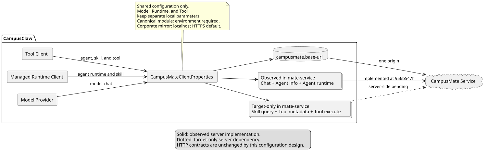
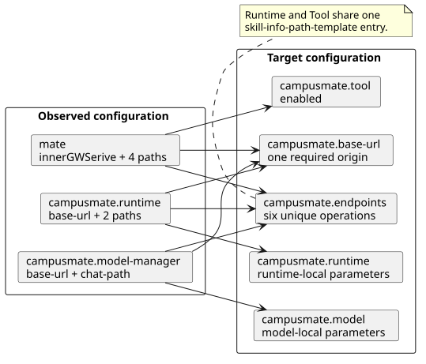

# CampusMate 客户端共享配置设计

| 属性 | 值 |
|---|---|
| 文档版本 | 1.4.1 |
| 状态 | Implemented |
| 更新日期 | 2026-09-01 |
| 外部设计基线 | `/Users/z/设计`：`c250e3f07536871d3d676242e552a5eb4346b0c7` |
| 外部设计文档 | `campusmate-shared-client-configuration/README.md` 2.1.0 |
| 实施前源码基线 | `56be8eee59415a5f86658d6635a7b7e8891263d3` |
| 受审实现基线 | `e8533b5ebf564f9d8d707faa115be638dc377556` |
| 兼容清理源码基线 | `28b3235e5cff0da2f768cbfc6b7b9ce5e2b51193` |
| 公司镜像默认值变更前基线 | `2cb1661fd4dc27f2bc02579c44878d7a69775c3d` |
| mate-service 观察基线 | `956b547f5ca12ca89e68f73012f92a4406b0c9fa` |
| 决策记录 | [ADR-0026](../decisions/0026-unify-campusmate-client-configuration.html)、[ADR-0035](../decisions/0035-remove-legacy-campusmate-environment-adapter.html)、[ADR-0042](../decisions/0042-default-campusmate-base-url-for-corporate-mirror.html) |

> 公司镜像相关路径和标识按 2026-09-01 的当前仓库位置展示；历史提交 SHA 仍是对应行为证据。

## 1. 结论

`mate`、CampusMate Model、受管 Runtime 与 Mate Tool 是同一个 CampusMate 服务的不同消费面，
因此统一使用一个 `campusmate.base-url` 和一个 `campusmate.endpoints` operation 目录。
模型本地参数归入 `campusmate.model`，Runtime 本地参数归入 `campusmate.runtime`，Tool 开关归入
`campusmate.tool`。不再保留 `campusmate.model-manager.base-url`、
`campusmate.runtime.base-url`、顶层 `mate.*` 应用配置或旧部署变量转换脚本。通用主模块仍要求部署
显式提供 `CAMPUSMATE_BASE_URL`；公司镜像缺省使用 `https://localhost:8591`，同一环境变量可覆盖。



[PlantUML 源码：`campusmate_shared_configuration`](campusmate-shared-config/diagram.puml#L1)

## 2. 源码证据

### 2.1 实施前观察行为

以下证据均来自实施前源码基线 `56be8eee59415a5f86658d6635a7b7e8891263d3`：

| 源码 | 符号或基线行 | 观察行为 |
|---|---|---|
| `modules/coding-agent-cli/src/main/resources/application.yml` | L89-L108、L129-L140 | Model、Runtime、Tool 分散在 `campusmate.model-manager`、`campusmate.runtime` 与顶层 `mate`；声明三个服务地址和七个路径键。 |
| `modules/ai/src/main/java/com/campusclaw/ai/provider/mate/MateServiceModelManagerProvider.java` | `MateServiceModelManagerProvider`，L68-L76 | Model Provider 独立注入 base URL 与 Chat path。 |
| `modules/coding-agent-cli/src/main/java/com/campusclaw/codingagent/runtime/MateServiceClient.java` | `MateServiceClient`，L37-L69 | Runtime Properties 持有自己的 base URL，并在客户端注入两条 Runtime 路径。 |
| `modules/coding-agent-cli/src/main/java/com/campusclaw/codingagent/config/MateToolAutoConfiguration.java` | `MateToolAutoConfiguration`，L21-L81 | Tool 使用顶层 `mate.innerGWSerive` 和四个 `mate.endpoints`；Skill query 与 Runtime 实际指向相同 operation。 |
| `campusclaw/scripts/install_value.sh` | 环境变量映射 | 安装边界把 `CAMPUSINNERGWSERVICE_DOMAIN_NAME_URL` 映射到拼写错误的 `MATE_INNERGWSERIVE`。 |

这些内容是已观察到的旧实现，不代表目标设计。

### 2.2 目标实现证据

以下目标实现证据冻结于受审实现基线 `e8533b5ebf564f9d8d707faa115be638dc377556`，
不以可移动分支名替代源码版本：

| 源码 | 符号 | 目标职责 |
|---|---|---|
| `modules/coding-agent-cli/src/main/java/com/campusclaw/codingagent/config/CampusMateClientProperties.java` | `CampusMateClientProperties`、`Endpoints` | 绑定并校验唯一 base URL 与六个 operation path，统一拼接完整 URI。 |
| `modules/coding-agent-cli/src/main/resources/application.yml` | `campusmate` | 提供 `base-url/endpoints/model/runtime/tool` 单一配置树。 |
| `modules/ai/src/main/java/com/campusclaw/ai/provider/mate/MateServiceModelManagerProvider.java` | 注入构造器 | 使用共享 base URL、共享 Chat endpoint 与 `campusmate.model.*`。 |
| `modules/coding-agent-cli/src/main/java/com/campusclaw/codingagent/runtime/MateServiceClient.java` | `getAgentRuntime`、`querySkillInfo` | 从共享 endpoint 目录取得 Runtime 和 Skill operation。 |
| `modules/coding-agent-cli/src/main/java/com/campusclaw/codingagent/config/MateToolAutoConfiguration.java` | `mateToolClient` | Tool 客户端复用同一 base URL、Agent/Skill operation 与 Tool operation。 |

### 2.3 公司镜像默认值

以 `2cb1661fd4dc27f2bc02579c44878d7a69775c3d` 为变更前观察基线，
`campusclaw/src/main/resources/application.properties` 只声明
`${CAMPUSMATE_BASE_URL}`，未提供缺省地址；通用主模块的 `application.yml` 使用同一必填占位符。

目标实现只修改公司镜像手工维护的配置：

| 源码 | 目标职责 |
|---|---|
| `campusclaw/src/main/resources/application.properties` | 未配置环境变量时把 `campusmate.base-url` 解析为 `https://localhost:8591`；显式环境变量优先。 |
| `campusclaw/src/test/java/com/huawei/hicampus/claw/codingagent/config/CampusMateConfigurationTest.java` | 同时锁定缺省值和环境变量覆盖行为。 |
| `modules/coding-agent-cli/src/main/resources/application.yml` | 保持通用部署必填，不引入公司环境默认值。 |

该差异是公司集成产品约束，不是 CampusMate HTTP 契约或主模块架构变化。

### 2.4 旧部署变量兼容清理

以下证据来自兼容清理源码基线 `28b3235e5cff0da2f768cbfc6b7b9ce5e2b51193`：

| 源码 | 观察行为或目标决策 |
|---|---|
| `campusclaw/scripts/install_value.sh` | 观察行为：脚本读取 `/etc/profile`，把旧变量 `CAMPUSINNERGWSERVICE_DOMAIN_NAME_URL` 转换成应用所需的 `CAMPUSMATE_BASE_URL`。 |
| `campusclaw/src/main/resources/application.properties` | 观察行为：应用只读取 `CAMPUSMATE_BASE_URL`，不读取旧变量。 |
| `modules/coding-agent-cli/src/main/resources/application.yml` | 观察行为：主模块同样只读取 `CAMPUSMATE_BASE_URL`，且不存在对应安装脚本。 |
| `scripts/sync-campusclaw-exclude.txt` | 目标决策：删除脚本后移除其公司镜像侧独有路径登记。 |

根据 [ADR-0035](../decisions/0035-remove-legacy-campusmate-environment-adapter.html)，删除该 mate
侧兼容脚本属于部署边界收敛：当时的新旧部署都必须直接注入 `CAMPUSMATE_BASE_URL`，不再由仓库
代码转换旧变量。ADR-0042 后续只为公司镜像增加本地缺省值，仍不恢复旧变量或转换脚本。两次变化
均不修改 CampusMate HTTP 契约。

### 2.5 mate-service 服务端状态

以下状态来自独立 mate-service 仓库的观察基线
`956b547f5ca12ca89e68f73012f92a4406b0c9fa`。客户端已有依赖不等于服务端已存在对应实现：

| operation | mate-service 源码证据 | 分类 |
|---|---|---|
| `POST /mate-service/v1/LLM/chat` | `src/main/java/com/huawei/hicampus/mate/agentdefinition/modelmanager/controller/LlmChatController.java`：`CHAT_PATH`、`createChat` | 已观察服务端行为 |
| `GET /mate-service/v1/agents/{agentId}` | `src/main/java/com/huawei/hicampus/mate/agentdefinition/controller/AgentDefinitionController.java`：`getAgent` | 已观察服务端行为 |
| `GET /mate-service/v1/agents/{agentId}/runtime` | `src/main/java/com/huawei/hicampus/mate/agentdefinition/controller/AgentDefinitionController.java`：`getRuntimeAgent` | 已观察服务端行为 |
| `GET /mate-service/v1/skill/query/{skillId}` | 在该基线未发现对应 Controller | 目标态设计，服务端待实现 |
| `POST /mate-service/v1/runtime/tools/query` | 在该基线未发现对应 Controller | 目标态设计，服务端待实现 |
| `POST /mate-service/v1/runtime/tools/{toolId}/execute` | 在该基线未发现对应 Controller | 目标态设计，服务端待实现 |

## 3. 配置结构与迁移



[PlantUML 源码：`configuration_key_migration`](campusmate-shared-config/diagram.puml#L52)

```yaml
campusmate:
  base-url: ${CAMPUSMATE_BASE_URL}
  endpoints:
    model-chat-path: /mate-service/v1/LLM/chat
    agent-info-path-template: /mate-service/v1/agents/%s
    agent-runtime-path-template: /mate-service/v1/agents/%s/runtime
    skill-info-path-template: /mate-service/v1/skill/query/%s
    tool-metadata-query-path: /mate-service/v1/runtime/tools/query
    tool-execute-path-template: /mate-service/v1/runtime/tools/%s/execute
  model:
    api: openai-completions
  runtime:
    agents-root: agent
  tool:
    enabled: true
```

公司镜像在手工维护的 properties 中增加本地缺省值：

```properties
campusmate.base-url=${CAMPUSMATE_BASE_URL:https://localhost:8591}
```

迁移规则：

| 旧键或变量 | 新键或变量 | 处理 |
|---|---|---|
| `campusmate.model-manager.base-url` | `campusmate.base-url` | 删除旧键，不做应用内双读。 |
| `campusmate.runtime.base-url` | `campusmate.base-url` | 删除旧键，不做应用内双读。 |
| `mate.innerGWSerive` | `campusmate.base-url` | 修复服务身份与拼写，不保留别名。 |
| 三组旧 path | `campusmate.endpoints.*` | 按 HTTP operation 去重为六条。 |
| `campusmate.model-manager.*` 本地参数 | `campusmate.model.*` | 按用户命名决策将 `model-manager` 收敛为 `model`。 |
| `CAMPUSINNERGWSERVICE_DOMAIN_NAME_URL` | 无 | 删除旧变量兼容和 `campusclaw/scripts/install_value.sh`；不再读取该变量。 |
| 公司镜像缺省 CampusMate 地址 | `https://localhost:8591` | 仅在 `CAMPUSMATE_BASE_URL` 未配置时使用；显式值继续覆盖。 |

## 4. 校验与安全边界

- `campusmate.base-url` 必须是带 host 的绝对 HTTP(S) URI，不允许 user-info、query、fragment
  或服务路径；尾部 `/` 统一去除。
- operation path 必须以 `/mate-service/` 开头，不允许 origin、query、fragment、`.` 或 `..`；
  百分号编码的点段按 URI 解码后的 path 同样拒绝。
- Agent、Runtime、Skill、Tool execute 模板必须且只能包含一个 `%s`；非模板 operation 不得包含占位符。
- 模板展开只精确替换 `%s`，保留其余合法百分号编码（例如 `%20`），不使用格式化器解释整个 path。
- 配置在 Spring 绑定和 Provider 初始化阶段失败，避免错误地址延迟到首次调用才暴露。
- 六个条目以 `HTTP method + path` 校验唯一性；Runtime 和 Tool 共享同一个 Skill query 条目。
- 应用和仓库交付脚本不读取旧部署变量；通用主模块缺少 `CAMPUSMATE_BASE_URL` 时按必填配置失败，
  公司镜像则使用 `https://localhost:8591`。

## 5. HTTP 契约边界

本次是配置架构改造，不修改任何 HTTP method、path、请求体、响应体、SSE 或认证语义。
六个 operation 的 method 与 path 保持 pi-mono-java 实施前客户端调用值，只消除重复配置入口；
其中三项已在 mate-service 观察基线中实现，Skill query 与两项 Tool operation 是目标态设计、
服务端待实现。Provider 身份 `mate-model-manager` 也保持不变，`model` 仅是配置分组名称。

## 6. 验证

- 配置绑定：通用主模块缺失或非法 base URL、公司镜像缺省值与环境变量覆盖、越界或规范化点段
  path、占位符数量与重复 operation；
- 客户端：Model、Runtime、Tool 在自定义共享 base URL 和自定义 endpoint 下请求正确 URI，
  并保留 path 中 `%20` 等合法百分号编码；
- 兼容交付：规范 YAML 与手工维护的镜像 properties 只读取 `CAMPUSMATE_BASE_URL`，公司镜像提供
  本地缺省值，仓库不再提供旧变量转换脚本；
- 工程规则：Spotless、Checkstyle、相关测试、镜像同步、PlantUML/SVG 和 `git diff --check`。

## 7. 版本历史

| 版本 | 日期 | 变化 |
|---|---|---|
| 1.4.1 | 2026-09-01 | CampusClaw 删除 Actuator 专用断言后，专有测试重命名为 `CampusMateConfigurationTest`；CampusMate 缺省值决策不变。 |
| 1.4.0 | 2026-09-01 | 公司镜像为 `campusmate.base-url` 增加 `https://localhost:8591` 缺省值并保留环境变量覆盖；通用主模块仍为必填。 |
| 1.3.0 | 2026-09-01 | 对齐 CampusClaw 公司镜像的新目录、Java 包和同步入口；历史行为继续以原提交 SHA 为准。 |
| 1.2.0 | 2026-08-28 | 删除公司镜像侧旧部署变量转换脚本，要求部署直接注入 `CAMPUSMATE_BASE_URL`，并以 ADR-0035 记录兼容边界收敛。 |
| 1.1.0 | 2026-08-26 | 响应 PR 审查：冻结受审实现基线，区分 mate-service 已观察 operation 与服务端目标态，并补充模板百分号编码及规范化点段校验。 |
| 1.0.0 | 2026-08-26 | 实现 CampusMate 单一 base URL、六 operation endpoint 目录、`model/runtime/tool` 配置分组与启动期校验。 |
