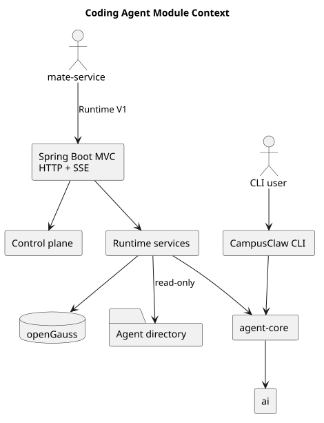
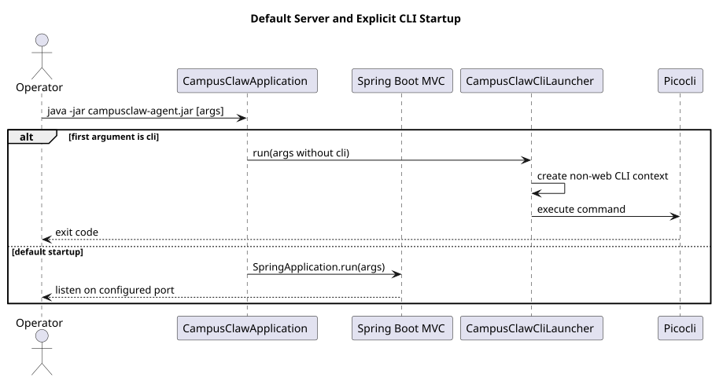
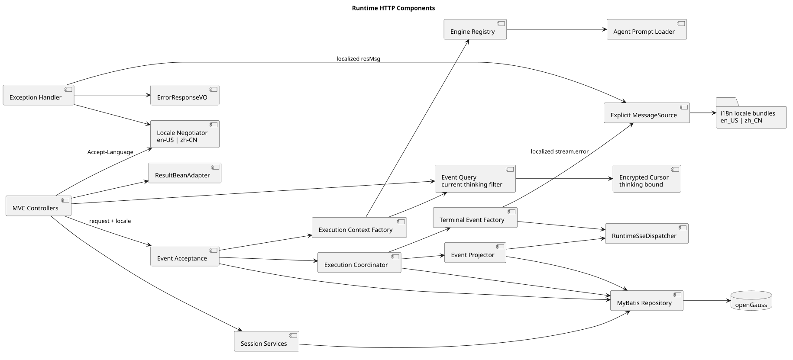

# Coding Agent 启动与 Runtime HTTP 设计

> 文档版本：2.4.0
>
> 实现分析基线：`1f801dbb82bdda30478e3354e685e3153b179a0c`
>
> 源码仓库：本仓库 `pi-mono-java`

## 1. 结论

`campusclaw-agent.jar` 现在只有两种顶层启动方式：

- 不带 `cli` 子命令时，由 Spring Boot 正常启动 Spring MVC HTTP 服务；
- 带 `cli` 子命令时，启动无 Web 容器的 CLI 上下文，再由 Picocli 分派 interactive、one-shot、rpc 或 print 等模式。

历史 `--mode server`、手工 Reactor Netty `ServerMode`、函数式 WebFlux 路由和公开 WebSocket 接口均已删除。Runtime 对外协议统一为 HTTP + 请求范围 SSE。

## 2. 源码证据

| 事实 | 源码位置与符号 |
|---|---|
| 默认启动 Spring Boot Web 应用 | `modules/coding-agent-cli/src/main/java/com/campusclaw/codingagent/CampusClawApplication.java`，`CampusClawApplication#main` |
| `cli` 子命令切换至 CLI 上下文 | `modules/coding-agent-cli/src/main/java/com/campusclaw/codingagent/CampusClawCliLauncher.java`，`isCliInvocation`、`run` |
| CLI 排除数据库、Runtime 与控制面 Bean | `modules/coding-agent-cli/src/main/java/com/campusclaw/codingagent/CampusClawCliConfiguration.java` |
| Runtime 使用 Spring MVC Controller | `modules/coding-agent-cli/src/main/java/com/campusclaw/codingagent/runtimeapi/web/*Controller.java` |
| Session 与事件持久化使用 MyBatis | `modules/coding-agent-cli/src/main/java/com/campusclaw/codingagent/runtimeapi/persistence/MyBatisRuntimeSessionRepository.java` |
| 事件接受、历史查询和执行生命周期相互分离 | `RuntimeEventService`、`RuntimeEventQueryService`、`RuntimeExecutionCoordinator` |
| SSE 使用有界请求级订阅 | `RuntimeEventStream`、`RuntimeSseDispatcher`、`RuntimeSseEmitterSubscriber` |
| 公司响应包装保留适配点 | `runtimeapi/result/ResultBeanAdapter.java`、`StandaloneResultBeanAdapter.java` |
| 本地工具由目录统一索引与筛选 | `tool/catalog/ToolCatalog.java`、`DefaultToolCatalog.java`、`ToolSelection.java` |
| MateService 工具通过专用客户端查询和调用 | `common/client/mate/MateToolClient.java`、`tool/mate/ListMateTool.java`、`CallMateTool.java` |

这些内容是实现基线的已观察行为，不是目标态推测。

## 3. 模块上下文



[PlantUML 源码](coding-agent-cli/diagram.puml#L1)

Spring MVC 只负责 HTTP 边界、鉴权形状、校验、国际化和 SSE 连接。会话执行复用 `agent-core` 的 Agent 循环，模型调用复用 `ai` 模块；控制面与 Runtime V1 共享同一 Spring Boot 进程，但路径和业务模型相互独立。

## 4. 启动时序



[PlantUML 源码](coding-agent-cli/diagram.puml#L32)

### 默认 HTTP 服务

```bash
java -jar modules/coding-agent-cli/target/campusclaw-agent.jar
```

默认监听 `0.0.0.0:8080`，可通过标准 Spring Boot 配置（例如 `SERVER_PORT`）覆盖。服务使用 Java 21 虚拟线程承载阻塞式 Spring MVC 请求；数据库访问和 Controller 均为阻塞式模型。

### CLI

```bash
java -jar modules/coding-agent-cli/target/campusclaw-agent.jar cli -m glm-5
java -jar modules/coding-agent-cli/target/campusclaw-agent.jar cli --mode rpc -m glm-5
```

仓库仅维护 macOS/Linux 的 `campusclaw.sh`，脚本会校验操作系统并自动补充 `cli`。Windows 启动入口不属于产品支持范围。CLI 上下文使用 `campusclaw-cli` profile，不启动 Web 容器，也不加载 Runtime 数据库组件。平台支持决策见[启动平台支持设计](platform-support.md)和[ADR-0016](../decisions/0016-macos-linux-launch-support.html)。

## 5. Runtime HTTP 结构



[PlantUML 源码](coding-agent-cli/diagram.puml#L58)

Runtime V1 固定前缀为 `/campusclaw-service/v1`，包含 11 个接口：

| 序号 | 方法与路径 | 作用 |
|---:|---|---|
| 1 | `POST /agents/{agent_id}/sessions` | 创建 Session |
| 2 | `GET /sessions/{session_id}` | 读取精简 Session 状态 |
| 3 | `DELETE /sessions/{session_id}` | 幂等逻辑删除并创建清理任务 |
| 4 | `POST /sessions/{session_id}/events` | 接收用户消息并以 SSE 返回本轮事件 |
| 5 | `GET /sessions/{session_id}/events` | 以不透明游标读取当前分支对话 Entry |
| 6 | `GET /sessions/{session_id}/models` | 返回当前模型和可用模型 ID 字符串数组 |
| 7 | `PUT /sessions/{session_id}/model` | 通过强 ETag 切换后续消息使用的模型 |
| 8 | `PUT /sessions/{session_id}/thinking` | 通过强 ETag 开启或关闭深度思考 |
| 9 | `POST /sessions/{session_id}/steers` | 将高优先级补充消息加入活动执行 |
| 10 | `POST /sessions/{session_id}/follow-ups` | 将普通后续消息按 FIFO 加入活动执行 |
| 11 | `POST /sessions/{session_id}/abort` | 中止活动执行并清空未投递控制消息 |

权威、可交互的字段级契约维护在独立设计仓库的 HTML 文档中。本仓不再维护 OpenAPI 副本，避免出现两份互相漂移的契约。

## 6. 关键实现决策

### 6.1 鉴权边界

Runtime 接受且只接受以下两种完整 Header 组合之一：

- JWT：`X-HW-ID` + `Authorization`；
- APPKEY：`X-HW-ID` + `X-HW-APPKEY`。

混用、缺失或不完整组合返回 401。当前服务只验证凭据形状，凭据真实性和业务授权由上游 `mate-service` 完成；`X-HW-ID` 不是 Session owner，也没有落库为所有者。这是当前部署边界下的产品约束，不应误写成服务内完成了 JWT 验签。

### 6.2 响应包装

普通成功响应由 `ResultBeanAdapter` 生成 `resCode`、`resMsg`、`result`；错误响应只有 `resCode`、`resMsg`；204 和 SSE 不包装。独立仓提供 `StandaloneResultBeanAdapter`。公司工程接入时以 Bean 替换该适配器，并在该实现内调用公司真实的 `ResultBeanFactory.getFactory().normal()`，无需修改 Controller 或 Service。

### 6.3 SSE 生命周期

一次 `POST /events` 对应一个请求范围 SSE 连接。服务发出 `stream.end` 后关闭连接；下一次用户消息重新建立连接。Steer 与 FollowUp 在当前执行仍活动时进入其队列，事件继续从原 SSE 输出。客户端断线、订阅缓冲溢出只分离订阅，不中止 Agent。

每个订阅的缓冲限制为 256 个事件或 1 MiB，心跳间隔 15 秒。执行上限为 100 个，默认 30 分钟超时。

### 6.4 数据和 Agent 目录

Session、Entry、严格序号、物化数据、删除墓碑和异步清理任务持久化到 openGauss。删除活动 Session 返回 409；成功删除的墓碑只包含 `session_id` 与 `deleted_at`。

Agent 配置默认直接读取 `agent/{agent_id}/.campusclaw/` 下的 `settings.json`、
`SYSTEM.md` 和 `skills/`；部署可通过 `CAMPUSCLAW_AGENT_ROOT` 替换 `agent` 根目录。
`.campusclaw/` 的真实路径同时作为 Session `cwd`、提示词根目录和 `ReadTool` 根目录，
不会把 Agent 父目录暴露给 HTTP V1。Runtime 工具集合只启用 `read`。`file_ids` 作为固定
`[File IDs]` 提示块传入，不在 Runtime 内解析或下载文件。

### 6.5 事件执行职责

`RuntimeEventService` 只负责接受 `user.message` 和提交前的原子边界；
`RuntimeEventQueryService` 负责当前分支分页与 Agent 历史恢复；
`RuntimeExecutionCoordinator` 负责 Agent 启动、控制消息续跑、超时、持久化收尾和资源释放。
SSE 流、事件投影器与终止事件分别由独立工厂创建，避免 Controller 或单个 Service 同时承担完整执行生命周期。

### 6.6 错误和多实例边界

`RuntimeErrorCode` 是错误码、HTTP 状态、国际化 key 和可选 `Retry-After` 的唯一目录。
错误消息资源 key 与枚举名称一致，异常调用点不能自行拼装 HTTP 状态。

活动执行仍是进程内资源。如果数据库状态为 `running`，但 Steer、FollowUp 或 Abort 请求没有命中执行实例，
服务返回 `503 SESSION_EXECUTION_UNAVAILABLE` 和 `Retry-After: 3`。这是对现有执行归属边界的显式表达；
本次整改没有假设粘性路由或跨实例转发基础设施。

### 6.7 工具所有权与沙箱边界

CLI 的 `BashTool`、`ReadTool`、`WriteTool`、`EditTool`、`GlobTool` 和 `GrepTool`
仍是当前 JVM 内的普通本地工具，由 `ToolCatalog` 发现并按 `ToolSelection` 筛选。
需要集中查询、授权和执行的工具通过 `ListMateTool`、`CallMateTool` 与
`MateToolClient` 交给 MateService。旧 Docker Sandbox、Hybrid Tool、
`ToolExecutionProperties` 和 `tool.execution.*` 配置已经删除，不提供兼容入口。

本地工具只保留各实现已有的路径校验、超时和输出截断能力，不构成 Docker 容器隔离承诺。
Runtime V1 事件名 `tool.execution.started` 与 `tool.execution.completed` 是 HTTP/SSE
事件类型，不是已删除的 Sandbox 配置项，必须继续保留。完整迁移记录见
[Sandbox 清理设计](sandbox-cleanup.md)和
[ADR-0015](../decisions/0015-sandbox-cleanup-tool-manager.html)。

## 7. 质量约束

- Controller 只接收和返回 VO，Service 负责业务规则和 VO/DTO 转换，Mapper 使用 DTO；
- 请求 VO 使用 Jakarta Bean Validation；
- MyBatis Mapper XML 使用 `resultType`，全局启用下划线到驼峰映射；
- 新增或修改的 Java 方法不超过 50 个非空物理行；
- Java 与 XML 源文件遵循公司版权、中文 Javadoc 和 XML DTD 规则；
- 主模块与 `mate-campusclaw` 镜像必须通过同一套测试。

## 8. 版本历史

| 版本 | 日期 | 说明 |
|---|---|---|
| 2.4.0 | 2026-08-20 | 将本地启动平台收敛为 macOS/Linux，删除 Windows 启动入口并关联平台支持决策 |
| 2.3.0 | 2026-08-19 | 合入最新 HTTP V1 启动与执行架构，并明确 ToolCatalog、MateService 工具和已删除本地 Sandbox 的边界 |
| 2.2.0 | 2026-08-19 | 统一 `.campusclaw` 真实运行根目录，拆分事件职责，集中错误语义并明确非本机执行边界 |
| 2.1.0 | 2026-08-19 | HTTP V1 的 Agent 根目录默认值改为 `agent`，受控子目录改为 `.campusclaw/` |
| 2.0.0 | 2026-08-18 | 按实现提交 `8691e880` 重写；默认 Spring MVC 服务、显式 CLI、HTTP+SSE 和 11 个 Runtime 接口成为现行设计 |
| 1.x | 2026-08-18 以前 | 历史 ServerMode、WebFlux RouterFunction 与公开 WebSocket 设计，已废弃 |
