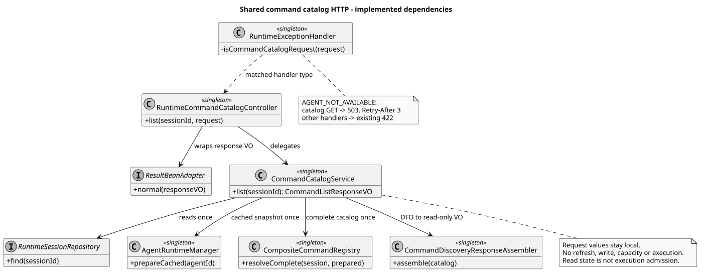

# 共享命令清单 HTTP 实现

> 版本：1.1.0 · 日期：2026-09-08 · 状态：Implemented

## 1. 范围与结论

本片发布 `GET /campusclaw-service/v1/sessions/{sessionId}/commands`，接入已合并的
`CommandCatalogService`。清单包含 Builtin 与直接绑定 Skill 的轻量描述，不执行任何命令。
根据本次开发协调中明确的交付授权，GET 独立交付，不等待 POST；这是实现顺序调整，
不改动设计仓的操作定义。POST Command、Skill 正文展开与公开方式、Events 新协议均不在本片范围。

规范来源是只读设计仓 `pi-mono-java-design@88f4df16bc24bbfcd28e1ec374feb2de0db8be3b`：

- `01-总体架构/01-CampusClaw多Agent运行时/接口契约/操作/12-list-session-commands.json`；
- `01-总体架构/01-CampusClaw多Agent运行时/chat-http-v1-design.md` §5，第 595–601 行的已冻结错误消息；
- `04-命令与技能/00-Slash-Command通用模块/README.md` v1.6.0。

本文仅记录实现映射，不建立第二份字段规范，不修改 `pi-mono-java-design`。

## 2. 源码证据与理由

合并基线为 `pi-mono-java@7d771ca802b781361e0e62e9014bafb6b0ed5e7a`。
本片实现提交为 `afee9bd333d0fc74ba0cef8b27b6df7357acdf30`；下表新增入口和错误投影以此提交为证据，
不能归为合并基线已有行为。Java 路径前缀为
`modules/coding-agent-cli/src/main/java/com/campusclaw/codingagent/`。

F245-C1 修复提交为 `ce03d9e1d92ab2e8b5711caca4df728625ce89d8`，基于已包含主线
`0ed71babf3f4c0a1d6260f4101f702bb88e822ca` 的正常合并提交 `9a8701a7`。
只修正 `modules/coding-agent-cli/src/main/resources/i18n/messages_{en_US,zh_CN}.properties`
的 INVALID_SESSION_ID 文案及下文路由测试，其他消息、错误码和状态不变。

| 类型 | 路径与符号 | 已观察行为、决定及原因 |
|---|---|---|
| 上游观察 | pi `5cd93f688aaab89dbb6dfa4aca535f21796ae185`，`packages/coding-agent/src/core/slash-commands.ts` 的 `BuiltinSlashCommand`、`BUILTIN_SLASH_COMMANDS` | 本地命令提供名称、描述、可选参数提示；不定义 Java HTTP、缓存、排序或 503 语义。 |
| Java 基线 | `runtimeapi/service/command/CommandCatalogService.java#list` | 查持久化 Session，调用一次 `prepareCached`，要求完整 Agent 元数据后解析一次 Catalog；不触发刷新。 |
| Java 基线 | `runtimeapi/service/command/CompositeCommandRegistry.java#resolveComplete`、`runtimeapi/service/command/SkillCommandSource.java#definitions` | 使用同一 PreparedAgentRuntime；完整解析路径不再次读取 Manager 或 Skill 文件，展示定义没有伪 Handler。 |
| Java 基线 | `runtimeapi/service/command/CommandDiscoveryResponseAssembler.java#assemble` | 固定 Builtin 顺序、按名称追加 Skill，按已读取 Session 状态投影轻量响应；清单不是执行准入凭证。 |
| Java 新增 | `runtimeapi/web/RuntimeCommandCatalogController.java#list` | 仅依赖应用 Service 和 ResultBeanAdapter；标量 ID 使用共享正则与 Jakarta 校验；包装响应 VO 为普通 JSON。属于架构接入，不复制 Catalog 业务。 |
| Java 新增 | `runtimeapi/web/RuntimeExceptionHandler.java#response`、`#isCommandCatalogRequest` | 依据 Spring 已匹配的 HandlerMethod，仅对清单入口的 AGENT_NOT_AVAILABLE 投影 503/Retry-After；不按任意 URI 后缀猜测操作，不全局改动错误枚举的 422。属于已确认产品契约的操作级适配。 |
| Java 新增 | `modules/common/src/main/java/com/campusclaw/common/constant/ClawConstants.java` 的 `RuntimeApi.Command.CATALOG_RETRY_AFTER_SECONDS` | 重试秒数复用共享业务常量归属，不增加转发常量或配置框架。 |

## 3. 分层与生命周期

### 设计决策

复用既有 Catalog 服务可保持单次完整解析，集中错误处理可避免影响其他操作的 422 语义。
独立发布 GET 及上述选择的取舍见
[ADR-0069：独立发布共享命令清单 GET](../../decisions/0069-publish-command-catalog-http.html)。



[PlantUML 源码](diagram.puml#L1)

Controller、Service、Assembler、Registry、Adapter 和集中错误处理器沿用 Spring 单例，
没有请求状态字段。每次调用的 Session DTO、PreparedAgentRuntime、不可变 Catalog 与只读响应 VO
只通过方法参数或局部变量传递。Controller 不接触 Repository、Registry、Holder 或内部 DTO。
既有核心结构详见[完整命令清单实现](../builtin-command-catalog/README.md)。

读取清单不占运行容量、不安装工具、不写数据库、不追加 Entry，也不捕获 Mate 执行凭据。
Session 状态是在查询时读取的快照，不承诺返回后仍保持 idle；执行时必须由对应操作重新检查状态。
本片沿用 Runtime 不做本地身份认证、由上游保证授权的既有集成边界，不新增认证器或公司制品依赖。

## 4. HTTP 映射

成功返回 HTTP 200、`application/json`、`Cache-Control: no-store`、实际 `Content-Language`，
不返回 ETag、Retry-After 或 SSE。ResultBean 成功字段为 `resCode/resMsg/result`，
`result` 仅包含非 null 的 `commands` 数组；Controller 只包装 Service 返回的 VO。

- idle：Builtin 顺序为 help、status、name、model、thinking、compact、skills，后接名称升序的 Skill。
- running：移除 compact 和 Skill；model/thinking 保留描述但不提供 input，name 仍有 input。
- 描述符只保留 name、kind、description 与必要的 input；input 只保留 hint 和仅在 true 时出现的 acceptsFiles。
  不输出 available、unavailableCode、ID、版本、路径、正文或内部 DTO 字段。
- 完整的空绑定是成功空 Skill 列表；缓存不完整时整个清单失败，包括 running，不返回部分 Builtin。
- 路径参数由标准 MVC 校验映射为 `400 INVALID_SESSION_ID`；Session 不存在为 `404 SESSION_NOT_FOUND`；
  Agent 完整缓存不可用为 `503 AGENT_NOT_AVAILABLE` 并返回 `Retry-After: 3`。
- 所有错误只包含 `resCode/resMsg`，沿用语言响应头；错误正文不包含内部异常原因。
  其他操作上的 AGENT_NOT_AVAILABLE 仍为 422，不附加此清单重试头。

错误文本由 `i18n/messages_en_US.properties` 与 `messages_zh_CN.properties` 集中维护，
遵循主设计 §5 明确冻结的消息。INVALID_SESSION_ID 必须为“sessionId 格式不正确。”与
“The sessionId format is invalid.”，不能当作可任意调整的示例措辞。
AGENT_NOT_AVAILABLE 既有中英文消息与冻结表一致，继续保留，例如“指定的 Agent 当前不可用。”。
客户端按稳定 resCode 分支，不解析 resMsg。描述文本沿用 Contributor 元数据，不引入命令描述翻译系统。

## 5. 测试与交付证据

新增测试位于
`modules/coding-agent-cli/src/test/java/com/campusclaw/codingagent/runtimeapi/web/RuntimeCommandCatalogRoutesTest.java`。
它启动真实 Spring MVC 上下文，使用实际七个 Contributor、Builtin/Skill Source、Registry、
应用 Service、Assembler、VO 和集中错误处理器，只替换 Repository、Manager 及未被调用的执行服务。
不是预先拼装 JSON 后直接断言固定返回值。

| 检查 | 证据与边界 |
|---|---|
| HTTP 契约 | 19 个用例覆盖字段精确集合、idle/running、完整空绑定、缺缓存、异常脱敏、缺 Session、非法 ID、语言协商和现有 POST 422 回归；检查新 Controller 只注册 GET，并从实际 GET 响应断言中英文冻结消息。 |
| 一次解析 | 成功路径验证一次 Session 读取、一次 prepareCached、同一 PreparedAgentRuntime 的一次 resolveComplete，且无额外交互。 |
| 针对性回归 | 初始 afee9bd3 的清单/应用/配置共 44 项通过；F245-C1 修复后，清单 19、既有四类路由 25、消息源/Locale/错误码 10、已合入测试辅助代码 5，共 59 项通过，0 失败、错误或跳过。 |
| 完整构建 | afee9bd3 执行 `./mvnw -q spotless:apply checkstyle:check verify`，393 个测试类、1860 项测试，0 失败、错误或跳过；文字修正只重跑相关检查，不宣称本地重新完成全量。 |
| 测试质量 | 用户指定脚本路径为失效链接；从本机原始 `java-ut-coverage-loop.skill` 归档执行同名脚本，0 错误、0 警告。 |
| Java 规范 | Controller、Handler、测试的 AST 检查通过；ClawConstants 因既有 Unicode 转义需人工复核，新增常量格式与所有方法长度逐项确认，无超过 50 行的方法。 |
| 公司镜像 | 四组 Java 源码与测试、两组消息资源同步；布局测试及包名替换后的内容一致性检查通过。默认同步的公司编译因 NativeParent 无法解析而失败，显式 `--no-verify` 仅完成同步，不宣称公司编译通过。 |
| 规模 | 模块侧新增 503 行，镜像后 1006 行；整个 PR 以 `scripts/check-commit-additions.sh origin/main HEAD` 为准，文档不计入。 |

上述 #245 开发阶段没有运行新增 GET 的真实 JAR/openGauss 跨进程测试；MVC 验证不等同于数据库部署验证，
也不证明尚未发布的 POST Command/Skill 执行。真实后端测试辅助代码已随 #244 合入上述主线，
后续组合验收复用它，不把已有服务测试算作新增 GET 已验收。

文档需执行 PlantUML 生成及重生成一致性、ASCII、SVG XML、Markdown 链接与锚点、无 Mermaid、
ADR 桌面/窄屏渲染和 `git diff --check`。最终执行结果记录在 PR。

### 5.1 实际服务的命令清单回归测试

后续测试切片以合并主线 `7007d4a1af86e84a600f5ae7c67edddc3de66ab9` 为最终基线。
该基线已有共享 GET、实际服务启动辅助代码及旧原型清理；本次不修改生产代码、数据库结构或公开契约。
新增测试实现提交为 `94567779ff1341c293f89028847228e626b222de`，不归为上述主线已有内容。
新增测试路径为
`modules/coding-agent-cli/src/test/java/com/campusclaw/codingagent/runtimeapi/web/RuntimeCommandCatalogOpenGaussIT.java`。
这是 Java 自动化验收补充，不是 pi 的既有行为，也不修改独立设计仓。

复用 [ADR-0068](../../decisions/0068-reuse-runtime-http-process-fixture.html) 的测试资源管理方式和
[ADR-0069](../../decisions/0069-publish-command-catalog-http.html) 的已确认 GET 决策，不新增产品设计决定：

- `testActualCatalogDuringIdleRunningAndFailures` 分别使用 zh-CN/en-US 启动真实 JAR。
  先检查完整闲置清单，再提交普通 Events 并等待真实模型 HTTP 请求到达，验证 running 过滤；
  临时移出当前测试目录的 agent.json，分别验证 idle/running 的 503；finally 恢复文件和放行模型响应。
  还验证真实 400/404、精确错误正文、语言响应头和仅 503 附带的 Retry-After。
- `testCompleteEmptyBindingsStillReturnSevenBuiltins` 将测试 Skill 移出完整绑定目录，验证空绑定仍返回七个 Builtin，
  而不是把完整空快照误判为缓存缺失。
- `readOnlyCatalog` 比较请求前后的 GET Session（含 ETag）及 GET Events；模拟 Mate 服务的
  `RuntimeHttpProcessFixture.ModelStub.requestCount` 统计包括非 Chat 路径在内的所有 HTTP 请求，
  验证清单读取未引起上游访问。辅助代码单测同时验证 Chat 和非 Chat 请求都计数。
- 成功响应断言精确字段集合、固定顺序、输入提示及字段省略规则；清单不暴露 Skill 正文或路径。
  真实普通消息仍生成两条消息历史并正常完成 SSE。每个测试断言服务进程退出、模拟服务 executor 终止。

测试只使用新建 Session ID、JUnit 临时目录和外部提供的专用测试数据库，不运行安装 DDL 或全表清理。
缺少 JAR/数据库参数时沿用辅助代码的显式跳过，不能据此报告跨进程验收成功。
原 `RuntimeHttpProcessOpenGaussIT` 的 Events/重启场景保留并回归，不复制到新类。

运行当前 JAR 及定向回归：

```bash
./mvnw -q -pl :campusclaw-coding-agent -am package -DskipTests
./mvnw -q -pl :campusclaw-coding-agent -am test \
  -Dtest=RuntimeCommandCatalogOpenGaussIT,RuntimeHttpProcessFixtureTest,RuntimeHttpProcessOpenGaussIT,RuntimeCommandCatalogRoutesTest \
  -Dsurefire.failIfNoSpecifiedTests=false \
  -Druntime.it.jar=/absolute/path/to/campusclaw-agent.jar \
  -Dgaussdb.it.url=jdbc:postgresql://127.0.0.1:45433/catalog_it \
  -Dgaussdb.it.username=catalog_it -Dgaussdb.it.password='<test-only-password>'
```

上述实际 GET 验收不证明共享 POST、Skill 执行或其正文公开策略已经完成。
最终提交、执行次数、JAR 和自有数据库资源清理结果记录在本次 PR，不复用 #245 审查阶段临时测试报告充当新提交证据。

本次代码验证：最新主线上的 `clean spotless:apply checkstyle:check verify` 通过 393 类、1864 项普通测试，
0 失败/错误/跳过。随后使用该次新打包 JAR 及单独创建的 openGauss 7.0.0-RC3 数据库执行上面四类定向回归：
新 IT 3 项（15 次命令清单 GET）、辅助代码单元 5 项、原进程 IT 2 项、MVC 19 项，共 29 项，
0 失败/错误/跳过。两个语言场景均覆盖 idle/running 缺缓存。
测试通过后专用容器及其数据库已删除，核查无该容器或该 JAR 的残留进程；JUnit 临时目录沿用自动清理机制。
测试质量脚本为 0 error / 0 warning；AST 无方法长度违规，既有两个 DTO record 的布局人工核对。
模块侧新增 283 行，镜像后 566 行；镜像同步和布局检查通过，公司 NativeParent 仍不可解析，
显式 `--no-verify` 只证明源码同步，不证明公司制品编译。

## 6. 版本历史

| 版本 | 日期 | 说明 |
|---|---|---|
| 1.1.0 | 2026-09-08 | 增加实际服务 GET 回归测试说明，覆盖状态过滤、双语错误、空绑定、无副作用和资源清理；生产契约不变。 |
| 1.0.1 | 2026-09-07 | 按 F245-C1 对齐明确冻结的 Session 标识文案，补双语响应断言与证据归属；按 F245-S1 增加设计决策至 ADR 的正向链接。 |
| 1.0.0 | 2026-09-07 | 独立发布共享清单 GET，记录精简响应、操作级 503 与验证边界。 |
