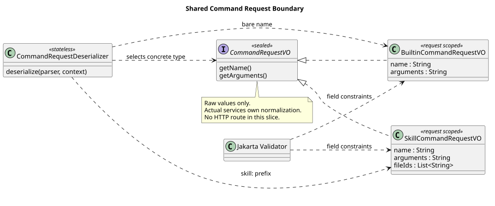

# 共享命令请求解析

版本：1.0.0 · 日期：2026-09-08 · 状态：请求类型已实现，尚未发布 POST 路由。

## 1. Context：实现边界与确认依据

已有 `CommandExecutionService.executeBuiltin` 只接收 Builtin 请求，不能直接作为两类命令的共享 HTTP 请求。
本片增加真正的联合请求类型和严格 JSON 解析，供后续同一
`POST /campusclaw-service/v1/sessions/{sessionId}/command` 接入；不增加 Controller、临时 Handler 或占位成功。

只读设计基线为 `pi-mono-java-design@88f4df16bc24bbfcd28e1ec374feb2de0db8be3b`：
`04-命令与技能/00-Slash-Command通用模块/README.md` §3/4、`01-内置命令/README.md` §8、
`02-技能命令/README.md` §3/4，以及 Runtime 的 `接口契约/操作/13-execute-session-command.json`。
该基线仍将 Skill 联合请求标为待评审；2026-09-08 用户在协调任务回复“建议执行”，
确认 v1.2.1 的共享请求建议及实际展开文本的模型/普通消息保存/SSE/历史/重启恢复方案，补充上述旧标记。
该确认不授权修改独立设计仓，本片也不复制或改写其规范化操作文件。

## 2. 固定源码证据与关键定义

Java 分析与分支基线：`8d61c767d09d47ef6c8d76c05535fcbb58c48373`。
下表 Java 路径相对 `modules/coding-agent-cli/src/main/java/com/campusclaw/codingagent/`。

| 来源与符号 | 已观察行为 | 本次决定与理由 |
| --- | --- | --- |
| `runtimeapi/vo/BuiltinCommandRequestVO.java#readName/readArguments/rejectUnknownField` | 严格字符串/null 绑定；Jakarta 声明字段约束；拒绝附件 | 保留约束，只加入联合接口及明确的子类反序列化覆盖，防止 Skill 附件规则影响 Builtin |
| `runtimeapi/vo/UserEventRequestVO.java#readFileIds` | 附件只接收字符串数组，字段最多 32 个且每项非空白 | Skill 复用普通消息的字段上限和类型规则，不定义新的文件 ID 格式 |
| `runtimeapi/service/command/CommandExecutionService.java#normalize` | Builtin 的 null 参数在 Service 复制归一，验证后执行 | 本片不改既有调用方或默认路径；Skill 的默认值和重复附件检查也必须由实际执行 Service 负责 |
| `modules/common/src/main/java/com/campusclaw/common/constant/ClawConstants.java#Skill`（仓库相对路径） | 名称唯一严格语法、64 字符限制和 `skill:` 前缀 | 从同一编译期表达式生成裸名与完整命令名正则，整个 Skill 命令名允许 70 字符 |
| pi `4af9d21d3b4d664e4a29fcabfec85171077248e3`，`packages/coding-agent/src/core/agent-session.ts#_expandSkillCommand`（1320 起） | 本地文本解析 `/skill:` 并展开；未知名称回退原文本 | 仅作为来源语义对照；Java 使用结构化请求，严格拒绝非法输入且不回退普通消息，是产品约束与安全加固 |

Builtin 和 Skill 请求分别实现 `CommandRequestVO`，只有 `name` 和 `arguments` 是公共字段；
`fileIds` 只属于 Skill。合法但未注册/未绑定的名称仍由执行层判断，本片不查询注册表或 Agent。

## 3. 架构与数据流

[PlantUML 源码](diagram.puml#L1)

`CommandRequestDeserializer` 只按 `name` 是否以准确的 `skill:` 开头选择子类型，
不按 Accept 或额外 kind 字段分派，也不承担命令名称到 Handler 的分派。
它拒绝非对象请求体，子类严格读取 JSON 字段；缺失/null 名称、格式和长度交给标准 Jakarta 约束。
未知命名空间落入 Builtin 字段约束并被名称正则拒绝，不会成为普通消息执行。
两个子类使用 `JsonDeserializer.None` 明确覆盖联合接口的注解，避免 `treeToValue` 再次进入自身。
解析器无请求状态，不依赖 Spring 单例中的可变字段。

## 4. 已确认输入与后续职责

- Builtin 仅 `name/arguments`；`fileIds` 即使是 null 也拒绝。现有 Service 归一化不变。
- Skill 仅 `name/arguments/fileIds`；示例 `{"name":"skill:pdf"}`、
  `{"name":"skill:pdf","arguments":"请分析","fileIds":["file-a"]}` 均是有效请求形态。
- VO 保留省略/null 字段和原字符串，不设字段初始值或 Builder 默认值；原始 arguments 最大 262144 UTF-16 代码单元。
- Skill 名称使用同一严格包名语法，包名 1～64，前缀额外占 6 字符；不接受前导 Slash、裁剪或别名。
- `fileIds` 最多 32 个非空白字符串、无新增 ID 正则。JSON 解析保留顺序及重复值；
  后续实际 Skill 执行 Service 统一将省略/null 变为空列表、防御性复制、拒绝重复，不能悄悄去重。
- Skill 参数缺失/null/空白表示无附加说明，非空保留原文；原字段和展开后的实际消息都必须验证长度，不能先丢弃超长空白。
  本片只声明原始字段约束，不增加第二条归一化路径或 Skill 私有正文保存机制。

后续 HTTP 应用将所选 Skill VO 转为真实执行 DTO，再调用同一实际 PreparedAgentRuntime 上的输入准备和绑定准入。
只有该通路接通后才发布共享路由。Builtin 返回业务 ResultBean JSON 与对应 ETag；Skill 返回普通消息 SSE。
共享 Header 拒绝、真实 400/404 等错误映射、`@Valid` 实际触发、SSE/JSON 分流及跨进程验收属于后续 HTTP 切片。
本片 JSON 异常与 Jakarta 违反项的单测不等于这些真实 HTTP 语义已经验收。

## 5. 设计决策、边界与 DFX

决策见 [ADR-0072](../../decisions/0072-command-request-contract.html)。以名称区分类别属于已确认产品约束；
封闭联合类型与保持执行层默认值所有权属于架构选择；拒绝宽松转换、未知字段和未支持命名空间属于安全加固。
没有生产配置、新依赖、表、升级脚本、锁、容量、请求级存储或凭据处理变化。
解析需要暂存一个 JSON 树再绑定 VO，额外空间随请求大小线性增长；本片不扩大消息或附件上限。
错误消息只包含固定描述，不主动复制用户正文、文件 ID、路径或凭据。

## 6. 测试与验证

`CommandRequestVOTest` 使用真实 Jackson 与 Jakarta Validator，覆盖两类子类型选择与直接绑定、
非对象、缺少名称、类型拒绝、宽松 Mapper 下未知字段仍拒绝、Builtin 的 null 附件拒绝、
Skill 原值/空值/顺序、严格名称、70 字符边界、UTF-16 参数上限及附件数量/元素校验。
它明确将默认值与重复附件检查留给执行 Service，不假称仅字段校验已完成业务准入。
既有 `BuiltinCommandRequestVOTest` 和 `CommandExecutionServiceTest` 验证原路径不回归。

Spotless、Checkstyle 与 `./mvnw -q verify` 通过：394 类、1926 项测试，0 失败、错误或跳过。
其中新增请求测试 62 项；既有 Builtin 请求 22 项及执行应用 41 项也在定向运行中通过，
这些定向数已包含在全量结果中，不重复累计。质量脚本 0 错误、0 警告。
模块新增 382 行，镜像后总新增 764 行；6 对代码/测试镜像按包名替换后逐字节一致。
普通同步实际失败于 NativeParent 解析，随后显式 `--no-verify` 同步完成；企业编译/JAR 未验证。
PlantUML 生成、ASCII、SVG XML、源码锚点、Markdown/ADR 本地链接及 diff 检查通过。
ADR 已用实际 Chrome 在 1280px/360px 渲染并检查无横向溢出；SVG 另经 rsvg-convert 渲染查看，
图和文档的版本历史均已核对。这些检查不覆盖尚未发布的共享 POST 真实服务验收。

## 版本历史

| 版本 | 日期 | 变更 |
| --- | --- | --- |
| 1.0.0 | 2026-09-08 | 落实已确认的共享请求类型和严格解析；保留真实执行与 HTTP 发布责任边界。 |
