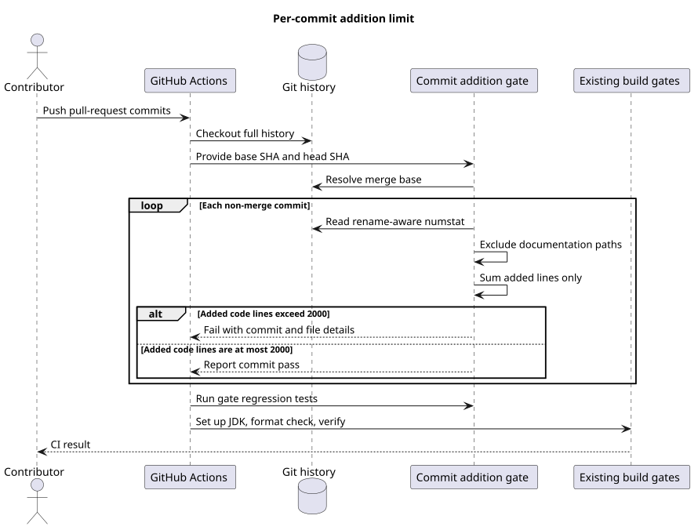

# CI 单提交新增代码行门禁设计

## 文档信息

| 项目 | 内容 |
|---|---|
| 文档版本 | v1.1 |
| 变更前源码基线 | `origin/main@c9d858bc8261bf07f5585f545b53495bf2226a56` |
| 集成基线 | `origin/main@c2e8564d55f4408d32d7bf94ea164b6ee9adbf62` |
| 评审实现提交 | `93a0c11952218cb03cb4f9b89927e2280820dbce` |
| 实现分支 | `codex/ci-addition-limit` |
| 适用范围 | GitHub Actions、提交新增行检查脚本及其回归测试 |
| 变更类型 | 仓库 CI 架构变化 |
| 决策状态 | Accepted |

## 1. Context

变更前，`.github/workflows/ci.yml` 在 `pull_request` 和 `main` 分支 `push` 事件上执行 Spotless 与 Maven `verify`，但不限制单个提交的新增规模。大提交可以在已有格式化和构建门禁全部通过后进入评审，使改动难以逐提交理解、回滚和定位。

本次目标是在现有 CI 构建前增加单提交门禁：每个提交最多新增 2000 行非文档内容；文档不参与统计。该规则约束提交粒度，不限制整个 PR 的累计新增行数，也不修改 Java、HTTP、数据库或运行时契约。

## 2. 变更前源码证据

以下观察均来自变更前基线 `origin/main@c9d858bc8261bf07f5585f545b53495bf2226a56`：

| 观察到的行为 | 源码证据 |
|---|---|
| CI 由 `pull_request(main)` 和 `push(main)` 触发 | `.github/workflows/ci.yml:3-7`，`on` |
| Checkout 使用 `actions/checkout@v4` 的默认历史深度 | `.github/workflows/ci.yml:13`，`build.steps` |
| Checkout 后直接配置 JDK、执行 Spotless 和 Maven `verify` | `.github/workflows/ci.yml:15-26`，`build.steps` |
| 仓库没有对应的提交新增行检查脚本或测试 | `scripts/` 目录在该基线下仅包含 Claude hook、Git hook 和公司镜像同步脚本 |

`scripts/check-commit-additions.sh`、`scripts/tests/check-commit-additions-test.sh` 及其行为均为本次 target-only 设计，不作为变更前已有能力描述。

以下目标实现证据固定在评审实现提交 `93a0c11952218cb03cb4f9b89927e2280820dbce`：

| 目标行为 | 实现证据 |
|---|---|
| CI 拉取完整历史并传入 base/head SHA，随后运行门禁测试 | `.github/workflows/ci.yml:13-24` |
| 普通提交使用 `diff-tree`，二父合并提交使用 `--remerge-diff`，所有 Git 读取显式检查状态 | `scripts/check-commit-additions.sh:40-81`，`write_commit_stats` |
| 文档移入代码目录时读取目标 Blob 并按完整文本行数统计 | `scripts/check-commit-additions.sh:83-94`，`count_blob_lines`；`scripts/check-commit-additions.sh:121-143`，`check_commit` |
| 提交枚举写入临时文件，避免 process substitution 丢失 producer 退出状态 | `scripts/check-commit-additions.sh:165-202` |
| 回归覆盖边界、重命名、合并、冲突解决和 Git 读取失败 | `scripts/tests/check-commit-additions-test.sh:86-234` |

## 3. 关键定义

- **单提交：** PR 分支相对目标分支共同祖先可达的每个提交，包括普通提交和合并提交。
- **普通提交新增代码行：** Git `diff-tree --numstat` 对非文档路径报告的文本新增行数。删除行不能抵扣新增行。
- **合并提交独有新增行：** Git `--remerge-diff --numstat` 重建自动合并结果后，实际合并提交相对该结果新增的非文档文本行；目标分支和主题分支已有提交不重复计费。
- **文档路径：** 任意 `docs`、`doc` 或 `documentation` 目录；Markdown、MDX、reStructuredText、AsciiDoc 文件；以及 README、CHANGELOG、CONTRIBUTING、LICENSE、NOTICE 标准文档文件。
- **跨边界重命名：** 旧路径属于文档、目标路径不属于文档时，按目标文件的完整文本行数计费；其他非文档重命名只累计 Git 报告的实际新增行。
- **通过边界：** 新增代码行小于或等于 2000 行；2001 行起失败。

## 4. 架构与数据流

[PlantUML 源文件](commit-addition-limit/diagram.puml#L1)

CI 使用完整 Git 历史解析事件提供的 base/head SHA。检查脚本先求共同祖先，再按提交顺序读取父提交：普通提交读取 rename-aware `diff-tree numstat`；二父合并提交读取 `remerge-diff numstat`，只度量自动合并之外的内容。解析时同时保留 rename 的旧、新路径，文档移入代码目录会读取目标 Blob 的完整文本行数。任一 Git 读取失败、无法解析或不支持的多父合并都会以执行错误拒绝放行；全部提交通过后才继续 JDK、Spotless 和 Maven 构建。

## 5. 设计决策

正式决策见 [ADR-0047：限制每个提交的非文档新增行](../decisions/0047-limit-added-code-lines-per-commit.html)。

### 5.1 按提交检查，不按 PR 汇总检查

规则目的是控制可评审、可回滚的提交单元。两个各新增 1500 行的提交分别合规，即使 PR 汇总为 3000 行；单个新增 2001 行的提交即使 PR 后续又删除内容，仍然失败。

### 5.2 使用 Git 原生 numstat 与 remerge-diff

门禁统计版本库实际保存的提交差异，不依赖语言识别器或 GitHub API。普通提交使用 `git diff-tree --numstat -M`；二父合并提交使用 `git show --remerge-diff --numstat -M` 重建自动合并结果，只统计冲突解决或额外暂存内容造成的差异。二进制文件没有文本行数，不进入本门禁计数，仍由构建、资产规则和评审约束。

### 5.3 以路径和文档扩展名排除文档

排除规则集中在脚本函数内并由回归测试锁定。`docs` 等文档目录下的 HTML、SVG、PlantUML 或示例源码均作为文档排除；目录外的 HTML、YAML、JSON、测试和构建配置仍计入。rename 记录同时保留旧、新路径：从文档路径移入非文档路径时，读取提交中的目标 Blob 并按完整文本行数计费，不能利用 Git 的 `0/0` 纯重命名结果绕过门禁。

### 5.4 合并提交只计算自动合并之外的内容

Git 合并提交相对任一父提交的普通 diff 都会重复包含另一分支历史。`remerge-diff` 以两个父提交重建自动合并，再比较实际合并树，因此无冲突同步不产生额外计费，冲突解决和 merge-only 新文件则受同一 2000 行上限约束。三父及以上 octopus merge 没有纳入当前产品工作流，门禁以执行错误拒绝而不是跳过。

### 5.5 所有读取显式 fail-closed

`set -e` 不负责门禁正确性。提交列表和每个 `numstat` 结果先由显式检查退出状态的 Git 命令写入临时文件，再由循环解析；父提交、目标 Blob、提交主题等关键读取也逐一检查。Git 对象缺失、版本不支持 `remerge-diff` 或输出无法解析时返回执行错误 2，不把空输出解释为 0 行。

## 6. 边界情况

- 2000 行通过，2001 行失败；空提交和纯删除提交计为 0。
- 文档与代码在同一提交中出现时，只累计代码路径。
- code-to-code 纯重命名通过 rename detection 保持 0 新增；docs-to-code 重命名按目标文件完整行数计费，包含同时修改后的内容。
- 无冲突二父合并只复核其中普通提交，合并本身为 0；冲突解决或额外暂存内容按 `remerge-diff` 结果计费。
- 三父及以上 octopus merge 当前不受支持并返回执行错误，不静默放行。
- base 不是 head 的祖先时，以二者共同祖先确定 PR 自有提交，支持目标分支在 PR 开发期间前进。
- 多个越界提交会在一次运行中分别报告，便于一次性修正。
- 无共同祖先、无效 SHA、Git 对象读取失败或无法解析的记录属于门禁执行错误，返回退出码 2，不静默放行。

## 7. DFX

- **性能：** 复杂度与 PR 自有提交数及其变更文件数线性相关；二父合并需要额外重建自动合并结果。完整 Checkout 增加历史拉取量，但避免依赖 GitHub API 和浅克隆补拉分支。
- **可维护性：** 统计规则位于独立脚本，CI 只负责传递事件 SHA；脚本可在本地复现。
- **可观测性：** 每个提交输出通过或失败摘要，失败时列出非文档文件新增行。
- **安全性：** 脚本只读取 Git 对象，不执行提交中的内容，不需要额外 Token 权限；所有统计输入失败时关闭门禁。
- **兼容性：** 使用 Bash、Git `remerge-diff` 和标准命令，适配当前仓库支持的 macOS/Linux 与 GitHub Ubuntu Runner；缺少所需 Git 能力时明确失败。

## 8. 契约改动

- PR 与 `main` push 的 `build` Job 新增 `Commit addition limit` 和脚本回归测试步骤。
- Checkout 改为 `fetch-depth: 0`，确保共同祖先与逐提交对象可用。
- 新增 CI 失败契约：任意普通或合并提交新增非文档行超过 2000 时，构建步骤不再继续；统计无法完成时同样失败。
- 不修改应用 API、持久化、配置键、模块镜像或运行时行为。

## 9. 测试

`scripts/tests/check-commit-additions-test.sh` 使用临时 Git 仓库覆盖：

- 恰好 2000 行通过；
- 2001 行失败并报告 `2001/2000`；
- 大体量 `docs` 内容和文档扩展名不计入；
- PR 累计超过 2000、但每个提交均未越界时通过；
- code-to-code 纯重命名不会被误记为全文件新增；docs-to-code 纯重命名及同时修改按目标完整内容计费；
- 无冲突合并不重复计费，merge-only 新文件和超大冲突解决会失败；
- 提交 Tree 对象不可读时返回执行错误 2，不能以 0 行假绿。

## 10. 验证

- 执行 `bash -n` 与 ShellCheck 校验两个脚本。
- 执行脚本回归测试。
- 对当前分支提交范围执行新增行门禁。
- 执行 `plantuml -tsvg docs/designs/commit-addition-limit/diagram.puml` 并验证 SVG XML。
- 校验 Markdown 不含 Mermaid、PlantUML 仅含 ASCII、文档链接和 PlantUML 行锚有效。
- 执行 `git diff --check` 和仓库 Maven `verify`。

## 11. 版本历史

| 版本 | 日期 | 说明 |
|---|---|---|
| v1.1 | 2026-09-03 | 按评审修复 Git 读取假绿、docs-to-code 重命名与 merge-only 绕过，固定评审实现提交，并将冲突 ADR 编号调整为 0047 |
| v1.0 | 2026-09-03 | 新增每个普通提交最多 2000 行非文档新增内容的 CI 门禁设计 |
