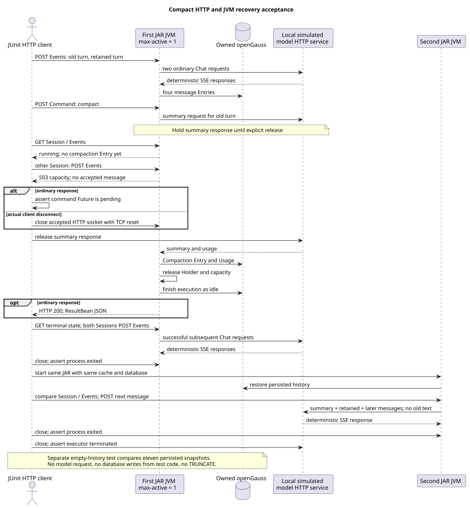

# Compact 命令真实 HTTP 与重启测试

> 版本：1.0.0 · 日期：2026-09-08 · 状态：Implemented

新增 `RuntimeCompactCommandOpenGaussIT`：启动实际打包的后端 JAR，通过 HTTP 写入对话并执行 Compact，
读取 openGauss 验证摘要和 Usage，关闭第一 JVM 后在第二 JVM 验证恢复。外部模型由本地 HTTP 服务模拟，
不是生产 Mate 或真实大模型。本次不修改生产代码、共享测试辅助代码、公开协议或独立设计仓。

## 源码证据与范围

从已合入的 Java `744c871742502bb19ea76eee30d1bfb25072b00e` 独立开发，随后正常同步到
`43ba1759a0dc025ace758dcc2b52a706ffb16a57`（#255 已合入），再合并
`5e200f5361e0d2944d7f7a04d97a89bfe7720228`（#254 已合入）。每次同步后重新打包、执行真实测试；
最终使用最新完整安装 SQL 初始化新的专用数据库，不在旧数据库上执行覆盖安装。
以下路径相对于实现仓；生产 Java 路径统一加前缀
`modules/coding-agent-cli/src/main/java/com/campusclaw/codingagent/`。

| 基线源码及符号 | 观察行为与测试理由 |
|---|---|
| `runtimeapi/web/RuntimeCommandController.java:execute`、`runtimeapi/service/command/CommandExecutionService.java:executeBuiltinAndAwait` | Compact 等待独立完成结果后返回普通 ResultBean JSON；需要实际 HTTP 检查响应，而不是只检查 DTO。 |
| `runtimeapi/compaction/RuntimeCompactionService.java:prepare` | 空有效历史先返回；非空历史准备 Holder 并执行数据库准入。空历史测试比较持久化快照和模型调用次数。 |
| `session/compaction/SessionCompactor.java:prepare/findSplitIndex`、`session/compaction/CompactionTokenEstimator.java:estimateMessage` | 默认保留 20000 Token，按文本估算确定可安全压缩的前缀。第二轮写入约 84000 字符，产生可验证的真实保留边界。 |
| `runtimeapi/event/RuntimeEventProjector.java:projectCompactionCompleted` | 追加 Compaction Entry 及关联 Usage；检查摘要、保留 Entry ID、顺序和 Token 汇总。 |
| `runtimeapi/compaction/RuntimeCompactionCoordinator.java:CompactionRun.finishLocked`、`runtimeapi/runtime/RuntimeSessionEngineRegistry.java:complete` | 完成时释放本次 Holder/全局容量并收尾状态；使用真实 503 和随后两个 Session 成功证明资源可复用。 |
| `runtimeapi/event/RuntimeEntryCodec.java:effectiveContextEntries` | 模型恢复使用摘要、保留消息和后续消息，GET 历史仍保留原始 Entry；需直接检查新 JVM 发出的模型请求。 |

共享辅助代码证据：`modules/coding-agent-cli/src/test/java/com/campusclaw/codingagent/runtimeapi/web/RuntimeHttpProcessFixture.java`
的 `prepareRuntimeFiles/startRuntime/RuntimeProcess.close/ModelStub/ModelGate` 在上述最新基线已存在。
它准备完整 Agent 缓存、启动真实服务、模拟模型接口并控制响应返回时机，最后关闭服务和相关资源。

新增测试符号绑定代码提交 `ee6523e71b85dcfe6baf39ddc0acc8f5f9ceb9ad`，不归到上述基线：
`modules/coding-agent-cli/src/test/java/com/campusclaw/codingagent/runtimeapi/web/RuntimeCompactCommandOpenGaussIT.java`
中的 `compactAndAwait/assertCapacityExhausted/assertReleasedResources/assertRestartedInput/assertCompactionStorage`。
同步 #254 后，`9b959f15480f4ce14cc327d419ef65bbf605e076` 为 `persistentState` 补入最新三张控制表的只读快照。

本切片沿用 [ADR-0068 测试辅助代码](../../decisions/0068-reuse-runtime-http-process-fixture.html)、
[ADR-0059 压缩准入](../../decisions/0059-connect-compaction-runtime-admission.html) 和
[ADR-0062 请求作用域](../../decisions/0062-bind-compact-command-invocation.html)，没有新的架构决策。
这是既有 Java 行为的验收增量，不是 pi 行为对齐设计，也不把尚未合入的 Skill 或 Events V2 工作当作依赖。

## 执行顺序



[PlantUML 源码](diagram.puml#L1)

1. 通过现有 POST Events 写入两轮真实历史。第二轮超过默认保留窗口，第一轮成为摘要输入，第二轮原样保留。
2. 在临时工作目录写 `application.properties`，将既有 `campusclaw.runtime.execution.max-active` 设为 1。
   阻塞摘要响应时检查 Session 为 running、历史尚无 Compaction，另一个 Session 的普通消息返回
   `503 RUNTIME_CAPACITY_EXCEEDED`，且该请求未改变 Session/ETag、历史或模型请求次数。该行为证明配置实际生效。
3. 正常分支等待模型响应前，Command HTTP Future 尚未完成；放行后校验 HTTP 200、JSON、no-store、语言及精确响应字段。
   断线分支使用真实 HTTP/1.1 Socket，确认服务已开始摘要后以 TCP reset 关闭连接，再放行模型响应；不只取消本地 Future。
4. 两个分支均观察到 idle 和唯一 Compaction Entry。数据库保存摘要与 `firstKeptEntryId`，Usage 关联该 Entry，
   Usage 序号紧随 Entry、内部 runId 独立，三次模型调用的累计 Token 为 21。
5. 竞争 Session 成功提交消息，原 Session 在同 JVM 继续执行；随后关闭第一 JVM，并断言它实际退出。
6. 第二 JVM 读取完全相同的 Session/ETag 和历史；下一轮实际模型请求包含摘要、保留的完整第二轮、同 JVM 续跑消息及新输入，
   不包含已经压缩的第一轮原文。最后确认第二 JVM 退出、模拟模型服务的 executor 已关闭。

独立空历史场景返回精确 `compacted=false` JSON，模型请求数为 0，Session/ETag、GET 历史以及
`t_sessions/t_session_entries/t_session_records/t_session_sequences/t_session_stats/t_session_materialized/t_session_events`
及 `t_session_executions/t_session_execution_segments/t_session_execution_segment_events`
十类按 Session ID 读取的持久化快照不变。测试不写数据库数据、不执行 TRUNCATE；安装 SQL 由测试运行者在专用数据库预先执行。

## 验证命令与结果

使用 JDK 21 及拥有的独立 openGauss。先按当前代码打包，不使用其他工作树的 JAR：

```bash
./mvnw -q -pl :campusclaw-coding-agent -am package -DskipTests
./mvnw -q -pl :campusclaw-coding-agent -am test \
  -Dtest=RuntimeCompactCommandOpenGaussIT \
  -Dsurefire.failIfNoSpecifiedTests=false \
  -Druntime.it.jar=/absolute/path/to/campusclaw-agent.jar \
  '-Dgaussdb.it.url=jdbc:postgresql://127.0.0.1:32814/compact_process_main254?sslmode=disable' \
  -Dgaussdb.it.username=compact_user -Dgaussdb.it.password='<test-only-password>'
```

同步后代码的 3 项真实测试均通过，0 failure/error/skip；普通与断线分支为同一参数化场景的两次执行，
空历史为第三项。补入三张新控制表后再次单独执行空历史场景，1 项通过且无跳过。
缺少 JAR 或数据库参数会跳过，不能称为通过。新测试还通过 Spotless、Checkstyle、
测试质量检查（0 error / 0 warning）及 Java AST 方法长度检查（每方法不超过 50 个非空物理行，含注释）。
JAR 校验值、实际命令、Surefire XML、镜像同步和最终新增行数以交付记录为准。

## 验收边界与后续

- 覆盖真实网络、打包进程、数据库和正常退出后的恢复；不证明生产 Mate、模型摘要语义质量或不可用网络下的业务表现。
- Socket 场景证明请求断线后已接受的压缩能落库并复用容量；不把派生 Future 取消测试当作实际断线证据。
- 空历史场景证明可观察持久化状态和模型调用无变化；不以这些断言替代容量内部实现检查。
- 不增加 Events V2、公开调试接口、私有 Skill 快照、SQL、升级脚本或生产启动参数；不改变现有事件协议。
- 本片不覆盖压缩失败、实际 30 分钟超时、显式中断、进程突然崩溃、数据库提交结果不确定或凭据内存取证。
  若补充这些真实进程场景，按生命周期边界另开测试切片，继续遵守模块侧 850、镜像后 2000 行硬上限。

## 版本历史

| 版本 | 日期 | 说明 |
|---|---|---|
| 1.0.0 | 2026-09-08 | 增加真实摘要、普通 JSON、Socket 断线、容量复用、空历史和第二 JVM 恢复测试。 |
