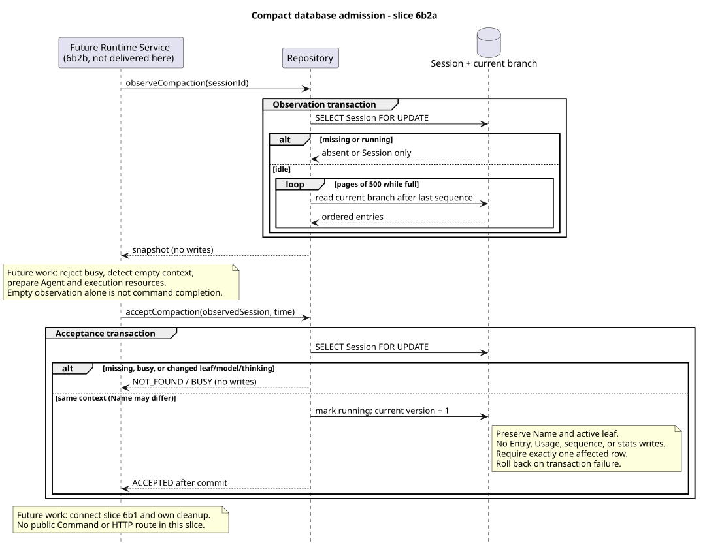

# Compact Runtime：数据库观察与原子准入

版本：1.0.2 · 日期：2026-09-07 · 原 6b2a 切片，当前交付规则见第 7 节。

## 1. Context 与交付边界

[6b1](compact-runtime-lifecycle.md) 仅执行已经准入的压缩。完整 6b2 的格式化 WIP 达到模块新增
858 行，尚需补接入链路验证，超过 850 行预算。当时按已确认的相邻职责边界拆为两个串行 PR，
本切片只交付数据库端口；Runtime 接入及资源回收当时安排由 6b2b 在本 PR 合入后另建分支完成。
上述是历史交付过程，不作为限制后续并行开发的当前规则。
这不是减少验收项，更不提前公开 Command/HTTP 路由。

本次已实现：同一行锁内读取 Session 与完整当前分支、再次行锁内复核 idle/历史/配置、
无人工 Entry 的 running 准入、保留并发名称、缺失/冲突拒绝及事务回滚。
**空历史在本切片仅证明观察零写入**；尚未实现整个命令的 `compacted=false`、容量跳过或执行接入。
Registry、Holder、Coordinator、请求 Header、控制队列和旧 POST Events 路径均不修改。

## 2. 定义与来源证据

实现基线：`pi-mono-java@14769188538eaa2f1df1e25ef2fef40d87ceafed`（#233 合并）。
目标设计只读基线：`pi-mono-java-design@2734a36b6f3cee2ebe16f1133d50ccb3eaaeb4e9`，
`04-命令与技能/01-内置命令/README.md` §3（预算拆分）、§7（Compact），版本 2.7.1。
本次未修改设计仓。

Java 路径前缀为 `modules/coding-agent-cli/src/main/`。

| 来源 | 仓库相对路径与符号 | 观察、目标决策与理由 |
|---|---|---|
| Java 基线 | `java/com/campusclaw/codingagent/runtimeapi/persistence/MyBatisRuntimeSessionRepository.java:acceptUserEvent/updateModel/updateThinking/updateName` | 现有生产事务以 Session 行锁串行化；Name 只改名称和版本，配置与消息会改变当前叶节点 |
| Java 基线 | `resources/mapper/session/RuntimeSessionMapper.xml:lockSessionForUpdate/markSessionRunning/listCurrentBranchEntries` | 现有 SQL 支持行锁、保留指定叶节点的状态转换、从当前叶节点回溯且按序号分页。本次复用 SQL，不改 schema |
| Java 基线 | `java/com/campusclaw/codingagent/runtimeapi/event/RuntimeEntryCodec.java:toAgentContextEntryIds/toAgentMessages` | 既有 Codec 负责可恢复上下文及压缩边界；不能把“有配置 Entry”等同于“有可压缩消息” |
| Java 基线 | `java/com/campusclaw/codingagent/runtimeapi/compaction/RuntimeCompactionCoordinator.java:start` | 调用前要求已注册、已持久化 running、已分配内部 Usage 身份；本次仍无生产接入调用方 |
| 本 PR 新增，非基线现状 | `java/com/campusclaw/codingagent/runtimeapi/persistence/RuntimeSessionRepository.java:observeCompaction/acceptCompaction` 及 MyBatis 实现 | 分离观察与接受事务，让将来的 Agent 准备不持数据库锁；接受时检查历史及配置是否仍对应准备快照 |
| pi `4af9d21d3b4d664e4a29fcabfec85171077248e3` | `packages/coding-agent/src/core/agent-session.ts:compact`，1864–2011；`abortCompaction`，2017 起 | 手动压缩读取分支，准备不足时抛错，成功追加 Compaction 并重建上下文；没有 Java 数据库原子准入或全局容量 |

idle-only、空历史 no-op、无队列和普通 JSON 是 Java **产品约束**；两阶段数据库事务及版本复核
是 **架构差异**。本 PR 的 Repository 端口是 Java 目标实现，不声称 pi 已有该协议。

## 3. 架构与数据流

[PlantUML 源码](compact-runtime-admission/diagram.puml#L1)

`observeCompaction` 使用普通读写事务，以允许 `SELECT ... FOR UPDATE`；它自身不执行任何写入。
缺失返回 `Optional.empty()`；running 返回 Session 和非 null 空列表，不查询历史。
idle 时在同一行锁生命周期内，每页 500 个 Entry 读取完整当前分支，按最后真实 Entry 序号续页，
不假设序号连续（Usage 与 Entry 共享序列）。通过 `List.copyOf` 发布不可修改的列表。

`RuntimeCompactionSnapshotDTO` 仅包含 Session DTO 与 Entry 列表，没有校验、Handler 或运行状态。
沿用既有可变 Mapper DTO；快照调用方不得修改观察值，也不能把它作为跨请求缓存。
判定可恢复空上下文、准备 Agent/Model/消息/容量/Holder 的逻辑不进入 Repository，留在 6b2b。

`acceptCompaction` 对同一 Session 再取行锁：

- 缺失返回 NOT_FOUND；非 idle 返回 BUSY。
- 当前 `activeLeafId/modelId/thinking` 任一不同，返回 BUSY，避免使用过期准备结果。
- 不以旧 resourceVersion 作为准入条件；Name 可以并发修改，并且不会影响消息上下文。
- 匹配时调用现有 `markSessionRunning`，传入锁内当前叶节点，要求受影响行数严格为 1。
  SQL 在锁内当前版本上加 1；名称、叶节点、Entry、Usage、序列、统计及 materialized 不改。

调用此内部接受端口的前提是：观察有可恢复上下文且执行资源已准备好。
端口不负责分配/回收容量，不提供 HTTP `If-Match`，不削弱现有 PUT 的条件更新语义。

## 4. 决策与边界

见 [ADR-0058](../decisions/0058-compaction-database-admission.html)。

- 空观察以持锁读取为线性化时点；锁释放后出现新用户消息，不改变当次观察结果。
- Entry 追加及模型/Thinking 修改沿用现有行锁，叶节点代表不可变历史分支末端。
  同值配置不写 Entry；Name-only 版本变化不造成虚假冲突。
- 接受失败没有状态写入；更新受影响行数异常抛出运行时异常，生产 Spring 事务回滚。
- 成功准入本身没有合成用户消息、公开 commandId、Usage 或通用命令生命周期记录。
- 6b2b 必须在返回 ACCEPTED 后才启动 6b1；明确拒绝时只清理本进程未接受资源，不恢复竞争执行的 idle。
  数据库提交结果不确定属于失败且不能自动重放；不能仅凭 sessionId 盲目撤销其他执行。
  该异常接入和资源责任仍是下一切片验收项，本切片不宣称已完成进程崩溃/数据库失联恢复。
- 没有新增表、安装 SQL、升级脚本或迁移兼容分支。

## 5. DFX

完整分支读取占用一把数据库行锁，内存 O(N)，查询次数为 `floor(N/500)+1`。
现有递归 SQL 每次分页会回溯当前路径，大历史存在重复遍历成本；本切片不伪称分页把总内存降为常数。
持锁期间只有本地数据库读取，无模型调用、Agent 刷新、文件准备、网络请求或容量等待。
Repository Spring 单例只保留 final Mapper，临时列表与游标均为方法局部值。

## 6. 测试与验证

以下数字为原 6b2a 切片的历史验证证据，本次仅纠正文档交付指导。

单元测试验证缺失/忙状态不读历史、跨页且非连续序号、不修改列表、各类旧观察拒绝、Name-only 接受、
受影响行数为 0 时失败、无 Entry/Usage 写入。它们不替代数据库锁验证。

真实 openGauss 测试复用生产 MyBatis Mapper 与 Spring 事务代理，显式提供独立测试库参数：
`gaussdb.it.url`、`gaussdb.it.username`、`gaussdb.it.password`。普通 Maven verify 不自动运行 `*IT`。
本机使用新建的专用 openGauss 7.0.0-RC3 容器，生产 schema 全量安装；不连接现有业务数据库。

跨 JVM 测试由生产 `acceptCompaction` 或 `acceptUserEvent` 获得行锁并保持外层测试事务未提交，
另一 JVM 使用独立 Spring 容器和连接池调用生产准入/观察方法：提交前不得返回，提交后只可 BUSY
或读到最新 running。没有用手写锁 SQL/进程内 Registry 锁替代生产准入。
另外验证空观察及配置-only 观察零写入、并发名称保留、版本加 1、缺失/忙/过期值、501 条完整分页、
回滚以及 Entry/Usage/序列/统计不变。

- 干净构建 `./mvnw -q clean spotless:apply checkstyle:check verify`：1656 项测试，0 失败、0 跳过。
- 单独执行真实数据库 IT：新增 11 项（含 3 个跨 JVM 场景）及原 Repository 24 项均通过；
  新增 10 项单元测试也在普通 verify 中通过。真实数据库使用仓库当前 PostgreSQL JDBC 驱动连接 openGauss。
- 指定质量脚本路径不存在，使用本机归档副本；两个新增测试文件 0 errors、0 warnings。
- 12 个 Java 文件通过版权和 AST 方法/构造器 ≤50 非空物理行检查；两个 record 排版提示人工核验为纯数据空 body。
- 默认镜像同步因公司 NativeParent 无法解析而失败；按普通本地环境流程显式 `--no-verify` 完成 6 对镜像同步。
  **公司父 POM 编译未验证**；未绕过 Git hook。
- 模块新增 535 行，镜像后非文档新增 1070/2000 行，低于 1800 软上限。
- PlantUML 重生成一致、SVG XML、ASCII、无 Mermaid、8 个本地链接/锚点、ADR 1280/360 渲染与无横向溢出检查通过；
  `git diff --check` 通过。范围外 Runtime 接入与 HTTP 验收不计作通过。

## 7. 后续职责与当前交付规则

6b2b 保留：空上下文在资源准备前返回、内部 Usage 身份、Runtime Service 到 Coordinator/Projector
的真实接入，以及初始化失败、数据库拒绝和启动失败时的状态/容量/Holder 清理与完整链路测试。
当前未交付 WIP 已保存到任务外恢复清单，不能整文件覆盖下一次最新 main。
然后接 Compact Handler/Contributor，再进行共享 Builtin/Skill 应用层和 HTTP。
Compact 不支持控制队列；通用 Events V2、旧控制接口退役和其他前端迁移仍不属本任务前置条件。
以上保留原交接职责，实际完成状态须对照当前 main。旧串行开发安排已 superseded：2026-09-07 用户授权
独立 worktree 从最新 main 并行开发、独立复审、串行合并；不堆叠、不 force-push，后合方合入最新 main 并复验。
模块新增 ≤850、含镜像 ≤1800 软上限/2000 硬上限不变。公共结果按设计
`88f4df16bc24bbfcd28e1ec374feb2de0db8be3b` Builtin 2.9.0 §8/8.1 复用业务资源 VO，禁止公开
command/changed/sourceEventSeq 或替代回执；细则见 [当前交付说明](compact-runtime-output.md)，原图与源码证据不重写。

## 8. 版本历史

| 版本 | 日期 | 变更 |
|---|---|---|
| 1.0.2 | 2026-09-07 | R08：明确串行拆分仅为历史过程；后续按并行开发/独立复审/串行合并交付，公共结果复用业务资源。 |
| 1.0.1 | 2026-09-07 | 按 R05 为跨 JVM 测试四处 Files 文本读写显式声明 UTF-8，同步镜像并更新行数；事务与设计行为不变。 |
| 1.0.0 | 2026-09-07 | 6b2a 独立交付数据库观察与准入；明确 6b2b 尚未交付的资源、执行与空历史整体行为。 |
