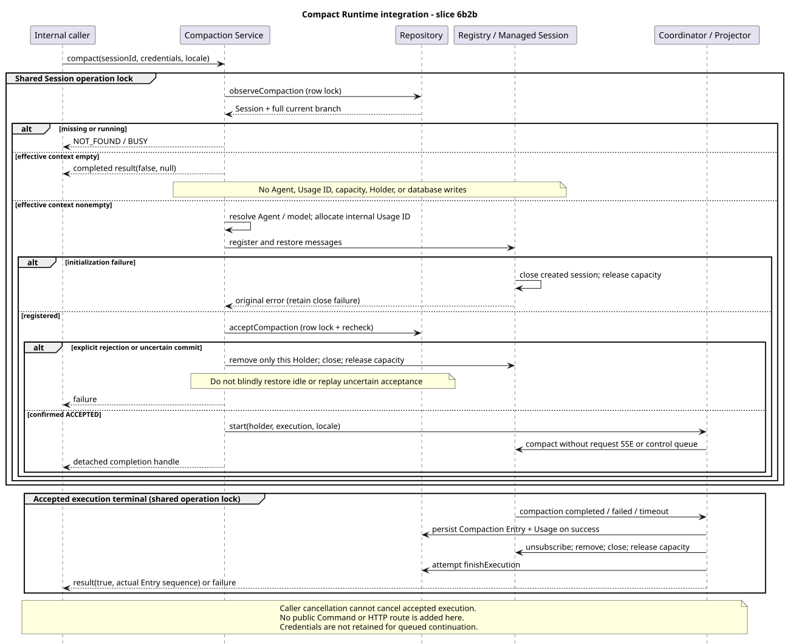

# Compact Runtime：空上下文与执行接入

版本：1.0.0 · 日期：2026-09-07 · 串行切片 6b2b。

## 1. Context 与范围

本切片以内部 `RuntimeCompactionService` 接通 [6b2a 数据库准入](compact-runtime-admission.md)
与 [6b1 已准入执行](compact-runtime-lifecycle.md)：空上下文零副作用、非空上下文资源准备、
原子接受、内部 Usage 身份及异常清理。尚不注册 Compact Contributor/Handler，不提供 Command/HTTP。
不接控制队列，不修改 POST Events SSE，不加入通用 Events V2、旧控制接口退役或前端迁移。

## 2. 来源证据与定义

实现基线：`pi-mono-java@6f52fddc87a03c20916fc7b6ef1de87f6a7a8cf5`（#234 已合并）。
目标设计只读基线：`pi-mono-java-design@2734a36b6f3cee2ebe16f1133d50ccb3eaaeb4e9`，
`04-命令与技能/01-内置命令/README.md` v2.7.1 §3、§7。本次未修改设计仓。
下表 Java 路径统一以 `modules/coding-agent-cli/src/main/java/com/campusclaw/codingagent/` 为前缀。

| 来源 | 相对路径与符号 | 观察、目标与理由 |
|---|---|---|
| Java 基线 | `runtimeapi/persistence/MyBatisRuntimeSessionRepository.java:observeCompaction/acceptCompaction` | 两次独立行锁事务；接受时复核 idle、叶节点、模型和 Thinking，允许 Name-only 更新 |
| Java 基线 | `runtimeapi/event/RuntimeEntryCodec.java:toAgentContextEntryIds/toAgentMessages` | 同一恢复规则过滤配置 Entry、失败/取消 Assistant，并恢复已有压缩边界 |
| Java 基线 | `runtimeapi/runtime/RuntimeSessionEngineRegistry.java:register/createHolder/complete/withOperationLock` | 已有全局容量、操作锁和匹配身份释放；初始化消息恢复异常时尚未关闭已创建的 Managed Session |
| Java 基线 | `runtimeapi/compaction/RuntimeCompactionCoordinator.java:start`、`runtimeapi/event/RuntimeEventProjector.java:projectCompactionCompleted` | 接收已注册且已准入的执行，投影 Compaction Entry + Usage，独立终态在清理后完成 |
| Java 基线 | `session/AgentSessionFactory.java:create`、`session/ManagedAgentSession.java:compact/close`、`session/compaction/SessionCompactor.java:prepare/compact` | 公共受管执行和压缩实现；不足以安全删除前缀时失败，不修改保留边界规则 |
| 本 PR 新增，非基线现状 | `runtimeapi/compaction/RuntimeCompactionService.java:prepare/acceptAndStart` | 先判空，再准备与接受，最后交接；Service 单例仅保留 final 协作者，不保存请求状态 |
| pi `4af9d21d3b4d664e4a29fcabfec85171077248e3` | `packages/coding-agent/src/core/agent-session.ts:compact`（1864–2011）、`abortCompaction`（2017 起） | 先 abort，读取分支、准备摘要，追加 Compaction 并重建消息；准备不足抛错。pi 没有 Java 数据库准入、全局容量或 HTTP JSON 协议 |

idle-only、有效空上下文 no-op、不接队列是 Java **产品约束**；两阶段数据库事务与独立完成句柄是
**架构差异**；不盲目回滚未知提交状态、不延长凭据作用域是 **安全加固**，不能称为 pi 现有行为。

## 3. 架构与数据流

[PlantUML 源码](compact-runtime-integration/diagram.puml#L1)

`compact(sessionId, credentials, locale)` 在与 POST Events 共用的 Session 操作锁内协调以下步骤：

1. 行锁观察完整当前分支。缺失抛 SESSION_NOT_FOUND；running 抛 SESSION_BUSY，优先于判空。
2. 用 Codec 判断有效上下文；空时立即返回 `RuntimeCompactionResultDTO(false, null)`。
   不解析 Agent/Model、不调用工厂、不分配 Usage 身份、容量或 Holder，不改任何持久化数据。
3. 解析当前 Agent 和已持久化模型，分配内部 Usage runId；恢复消息并注册本次 Managed Holder。
   Agent 准备不占数据库行锁，未进行隐式模型回退或配置写入。
4. 行锁内原子准入；ACCEPTED 后调用 6b1 Coordinator，复用 Projector、30 分钟预算及独立终态。
   结果只携带本次真实 Compaction Entry 序号，不把后续 Usage 序号当作 sourceEventSeq。

空观察以数据库读事务为线性化时点。之后新消息到达不改变当次 no-op；非空观察则以第二次事务为
接受时点，历史或配置变化会拒绝过期准备结果。Name-only 更新继续由既有端口保留。

## 4. 决策与边界

见 [ADR-0059](../decisions/0059-connect-compaction-runtime-admission.html)。

| 失败阶段 | 本次资源 | 持久化状态 |
|---|---|---|
| Agent/Model/工厂准备失败 | 尚未注册；工厂失败由 Registry 归还已取得容量 | 不调用 accept/finish |
| 已创建 Managed Session 后初始化失败 | 尝试 close；close 也失败时保留原异常并附加清理异常；容量仍归还 | 不调用 accept/finish |
| 数据库明确 NOT_FOUND/BUSY | 仅关闭并移除本次未接受 Holder | 不调用 finish，不清理竞争执行的 running |
| 数据库抛错，提交结果不确定 | 清理本次进程内资源，不自动重放 | 不凭 sessionId 盲目写 idle；可能仍 running，不能宣称已恢复 |
| 已返回 ACCEPTED，启动/执行失败 | 交接前由 Service 清理；交接后由 Coordinator 一次性清理 | 尝试恢复 idle；数据库不可用时结果失败，不伪报回滚 |

Service 的状态回收只在已明确接受且执行尚未完成时补偿，避免重复收尾。
此处没有数据库提交不确定或进程崩溃的持久化恢复协议；后续应用/HTTP 必须禁止自动重放结果不确定的压缩。
非空但无法安全选择保留边界时，沿用底层压缩失败语义，不误报空历史 no-op。

Mate 凭据由调用方传给本次工厂，供本次 Managed Session 的既有工具上下文使用；Service 不缓存、记录、
持久化或写入 Prompt。终态关闭 Holder 并断开 Coordinator 回调，不续跑任何队列。
本切片没有 Header 解析入口或授权逻辑；调用方必须完成授权，公共错误翻译和 VO 组装留到应用层。

## 5. DFX 与契约影响

沿用完整分支 O(N) 恢复、分片操作锁与共享容量；本地 Agent 准备期间保持操作锁，但不持数据库锁。
30 分钟预算从 Coordinator 启动开始，不是 Agent 准备总时限。复用现有调度线程，无新线程池、表、
SQL、升级脚本、通用命令 Entry 或公开 commandId。Registry 初始化清理也覆盖既有 POST Events 调用者。
`CompletionStage` 的派生 Future 取消不传播到底层执行；真实 HTTP 断线仍需后续路由测试。

## 6. 测试与验证

单元测试组合真实 Registry/Codec，验证空上下文先于准备、缺失/忙状态、消息恢复、Thinking 与 Mate 凭据
传递、内部 Usage 身份、隔离取消、初始化 close 异常、准备失败、容量耗尽、操作锁竞争、数据库拒绝/
不确定提交与同步启动/多重清理异常。新测试质量检查不以 mock SUT 替代被测逻辑。

真实 openGauss IT 使用生产 Spring/MyBatis 事务、Service、AgentSessionFactory、ManagedAgentSession、
SessionCompactor、Coordinator 与 Projector；外部模型、Agent 目录/配置及工具发现使用替身。
模型响应通过可控 Reactor Sink 完成，无真实模型请求。
覆盖三类空上下文的六类持久化快照不变、真实摘要/保留边界/Entry 3 与 Usage 4、Usage runId/Token 统计、
调用方取消后继续、重新创建 Spring 数据库上下文后恢复、模型失败及竞争执行不被清理。
跨 JVM 行锁证据继续运行 6b2a 原测试，不用本地锁测试替代。

验证命令：JDK 21 下 `./mvnw -q clean spotless:apply checkstyle:check verify`；另显式运行三个 Repository/
Compaction openGauss IT（独立测试容器及全量安装 schema，不连接业务数据库）。普通 verify 不自动执行 IT。
普通构建 1673 项测试、额外 41 项真实 openGauss IT（新增 6 项、原准入 11 项、原 Repository 24 项）均通过，
0 失败、0 跳过；其中新增单元测试 17 项。原指定质量脚本路径不存在，使用本机归档副本，0 errors/0 warnings。
8 个 Java 源文件（含镜像）通过 AST/版权检查，4 对镜像逐字转换一致。
PlantUML 重生成一致、SVG XML/ASCII、无 Mermaid、9 个链接/锚点、ADR 1280/360 渲染与无横向溢出均通过；
`git diff --check` 通过。固定提交及远端 CI 结果见 PR 验证记录。

模块新增 850 行，含镜像 1700/2000 行；已到本切片模块上限，在此职责边界结束，不提前发布公共路由。
默认同步已尝试，公司 NativeParent 无法解析；按 CLAUDE 普通本地流程显式 `--no-verify` 完成同步。
**公司镜像编译未验证**，未绕过 Git hook。

## 7. 后续与版本历史

当前 PR 合入后，从最新 main 接 Compact Contributor/Handler，再完成 Builtin/Skill 共享应用边界与 HTTP。
本文不改变用户确认的总体验收或设计仓文档。

| 版本 | 日期 | 变更 |
|---|---|---|
| 1.0.0 | 2026-09-07 | 接通空上下文、资源准备、数据库接受及真实压缩执行；明确不确定提交边界与后续公共入口。 |
