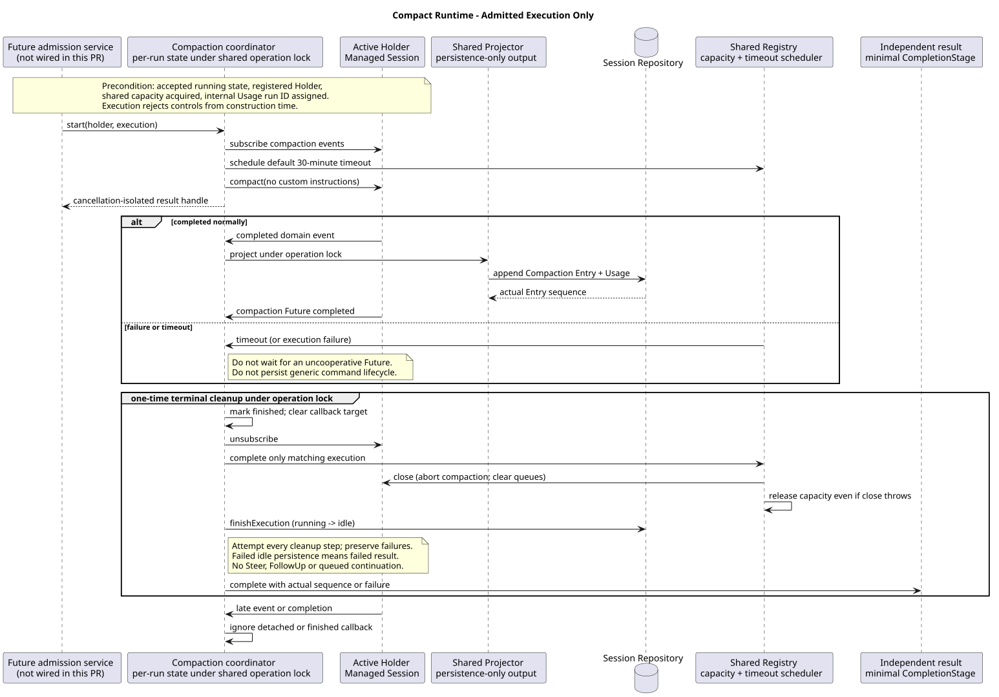

# Compact Runtime：已准入执行与终态清理

版本：1.0.1 · 日期：2026-09-07 · 原 6b1 切片，当前交付规则见第 7 节。

## 1. Context 与范围

本切片完成已准入 Compact 的内部执行协调器，不发布命令或 HTTP 入口。
调用前必须已持久化 running、占用共享容量、注册专属 Holder，并分配内部 Usage runId。
**这些准入条件不是本 PR 已实现的功能**，下一切片 6b2 接通数据库行锁、idle 复核、
空历史观察、注册失败回收及调用入口；不得由当前执行器绕过它们。

本次先修正 [6a 交接说明](compact-runtime-output.md) 与 ADR-0055 中的 R04 陈旧指导：
Compact 不接收 Steer/FollowUp，不消费任何控制队列，不让 Mate 凭据通过续跑延寿。
通用 Events V2、旧控制路由退役、前端迁移由用户另行开发，不是当前系列的交付前置条件。
命令专属中断绑定/响应没有在这里确定，更没有恢复旧 Abort 204 契约。

## 2. 关键定义与来源证据

Java 基线：`bfc7ad88520a3f31c7d43b6b8c67a5a2bbfca30e`（#232 已合并）。
目标设计：`pi-mono-java-design@0a113ce8e12cc65bd6e5589087bd4642a7d016e1`，
`04-命令与技能/01-内置命令/README.md` 第 7 节；设计仓仅只读核验，未修改。
下表 Java 路径共同前缀为 `modules/coding-agent-cli/src/main/java/com/campusclaw/codingagent/`。

| 来源 | 路径与符号 | 观察 / 本次目标与理由 |
|---|---|---|
| Java 基线 | `runtimeapi/event/RuntimeExecutionCoordinator.java:continueQueuedExecution/completeExecution` | 既有 POST Events 协调器可能续跑队列并输出 SSE 终态；Compact 不复用此收尾策略，旧事件路径保持不变 |
| Java 基线 | `runtimeapi/runtime/RuntimeSessionEngineRegistry.java:withOperationLock/register/complete` | 已有分片操作锁、全局容量和 Active Holder；本次复用它们，并修正错误执行身份/重复释放及 close 异常泄漏容量 |
| Java 基线 | `runtimeapi/event/RuntimeEventProjectorFactory.java:createForCompaction`；`runtimeapi/event/RuntimeEventProjector.java:projectCompactionCompleted/lastCompactionEntrySeq` | 6a 已支持无请求流的 Compaction Entry + Usage 事务投影与实际 Entry 序号 |
| Java 基线 | `session/ManagedAgentSession.java:compact/finishCompaction/close/abort` | 手动压缩经独立 Future；完成先替换消息再发领域事件；关闭取消当前压缩并清理 Agent 控制队列 |
| Java 基线 | `runtimeapi/runtime/RuntimeExecutionProperties.java:maxDuration` | 既有默认 30 分钟预算，本次复用原超时调度器，不新建线程或配置 |
| 本 PR 新增 | `runtimeapi/compaction/RuntimeCompactionExecution.java`；`runtimeapi/compaction/RuntimeCompactionCoordinator.java:CompactionRun` | 专属执行句柄从构造时禁止控制输入；独立完成句柄、操作锁内一次性收尾与迟到回调隔离，尚无生产调用方 |
| pi `4af9d21d3b4d664e4a29fcabfec85171077248e3` | `packages/coding-agent/src/core/agent-session.ts:compact`（1864 起）、`abortCompaction`（2017 起） | 手动压缩先 abort，再写 Compaction、重建消息、通知终态；不会续跑被打断的 turn，但终态监听器可能提交排队 prompt；没有 Java 数据库锁、HTTP JSON 或全局容量 |

idle-only、禁止控制队列、普通 JSON 和不传播客户端取消属于 **Java 产品约束**；
共享数据库投影、专属协调器和完成句柄属于 **架构差异**；不记录外部异常正文属于 **安全加固**。
以上不能描述为 pi 已有的 HTTP 行为。

## 3. 架构与数据流

[PlantUML 源码](compact-runtime-lifecycle/diagram.puml#L1)

`RuntimeCompactionExecution` 继承现有活动执行身份，构造时固定 persistence-only 输出并关闭控制接收。
它是拥有生命周期的运行对象，不是 DTO；`RuntimeCompactionResultDTO` 仅传输 `compacted/sourceEventSeq`，
不校验请求、不携带 Handler、摘要、凭据或序列化策略。Controller/VO 转换仍属后续应用层。

Spring 协调器只持有 final 协作者；每次调用新建局部 `CompactionRun`，不在单例中保存请求状态。
启动、领域事件回调、超时和终态均使用 POST Events 所用的 Session 操作锁。
只订阅手动压缩领域事件，不订阅 Agent 消息，不创建请求 SSE，也不调用通用控制队列协调器。

独立结果使用 `minimalCompletionStage()`；调用方取得的 Future 可被取消或人为完成，
但不会影响底层压缩、注册表或其他结果观察者。它只在投影和清理结束后成功或异常完成。

## 4. 设计决策与边界

见 [ADR-0057](../decisions/0057-isolate-compact-runtime-lifecycle.html)。

- 一个句柄只能启动一次，且必须拥有传入 Holder；内部 Usage 身份必须已分配。
- 正常结束读取本次 Projector 的实际 Compaction Entry 序号，不用 Usage 序号；
  Future 成功却没有权威 Entry 时按失败处理，不伪报 `compacted=true`。
- 终态在操作锁内先设置 finished 并断开回调目标，再解绑监听、关闭 Holder、释放容量、
  尝试恢复持久化 idle，最后完成结果。取消 close 导致的同步重入也只能收尾一次。
- 完成回调只捕获可清空的目标引用；超时后不配合完成的上游 Future 不再通过该回调持有 Holder/凭据。
  已复制的迟到事件也被目标引用和操作锁内 finished 双重屏蔽，不会向后来执行追加旧 Entry。
- 超时到期不等待底层 Future 自行结束；主动关闭 Managed Session 并收尾。
  默认预算是 30 分钟，锁与正在提交的投影必须串行完成，不能以超时绕过数据库事务互斥。
- 每一步清理失败仍继续后续清理；注册表仅释放匹配执行身份的 Holder，close 抛异常仍归还容量。
  数据库不可用时无法保证 idle 写入，结果必须失败并保留内部异常链，不能声称状态已恢复。
- 新协调器日志仅记录 Session ID、稳定错误码、异常类型，不记录第三方异常正文/堆栈或 Mate Header。
  凭据只由既有工厂放入本次 Managed Session；不增加缓存、持久化或日志字段。
- 当前底层“无可压缩历史”失败行为未改；空历史的无副作用 `compacted=false` 在 6b2 准入前处理。
  命令参数/错误翻译、客户端重放策略和真实 HTTP 断线验证均留到后续命令/HTTP 切片。

## 5. DFX 与契约影响

复用既有容量信号量、256 个操作锁和单一超时调度器；每次执行仅增加一个结果 Future、
局部协调对象与可解除的回调引用。无新增线程池、队列、SQL、数据库表、升级脚本或通用命令生命周期存储。
新执行器不调用普通 POST Events 协调器；共享注册表仅增强释放的身份校验和异常安全。

Entry 已提交而后续清理失败时结果为失败；权威 Entry 保留，不伪造回滚或重复执行。
这也是后续 HTTP 层不能对结果不确定的 Compact 自动重放的原因。

## 6. 测试与验证

以下为原 6b1 切片的历史验证，不作为本次文档纠正或后续完整命令的验收结果。

新协调器测试组合真实 Registry、操作锁、Holder、Projector、Codec；数据库和 Managed Session 为可控替身。
覆盖成功序号与清理顺序、共享容量、禁止控制输入、调用方取消/伪造完成、四类同步启动失败、
异步失败、缺少权威 Entry、投影失败、多重清理失败、硬超时、不合作 Future、同步触发超时、
取消重入、重复/错误身份释放、迟到回调、服务端取消、锁竞争、重复启动及 Holder 身份不匹配。
另用真实 Managed Session 验证 Holder 压缩桥接、关闭取消及清空队列。

本切片没有数据库准入或公共路由，不把上述测试当成 openGauss 跨 JVM、HTTP 断线或空历史验收。

- 新增 22 项测试；完整 `./mvnw -q spotless:apply checkstyle:check verify` 通过，1646 项测试、0 失败、0 跳过。
- 指定测试质量脚本路径缺失，使用本机归档副本：0 errors；9 个 warnings 均为原 Managed Session 测试的旧命名，新增测试无警告。
- 16 个 Java 源文件通过版权、AST 方法/构造器 ≤50 非空物理行检查；2 个镜像/模块 record 排版提示已人工核对为纯载体。
- 默认镜像同步无法解析公司 NativeParent；按普通本地环境流程显式 `--no-verify` 同步，8 对源码/镜像一致。
  **公司镜像编译未验证**，没有绕过 Git hook。
- 模块新增 801 行、镜像后非文档新增 1602/2000 行，低于 1800 软上限；删除不抵扣新增。
- 两个主题的 3 个 SVG 均由 PlantUML 生成并通过同步性/XML 校验；PUML 为 ASCII，无 Mermaid；19 个本地链接/锚点有效。
  ADR-0055/0057 在 1280 和 360 像素宽度完成渲染与无横向溢出检查，`git diff --check` 通过。

## 7. 后续职责与当前交付规则

原 6b2 交接职责为：实现行锁下 idle 复核、历史观察、
空历史不占容量/不写状态/不写 Entry、真实压缩接受与内部 Usage 身份、注册/准入失败回收。
随后接 Compact Contributor/Handler，再完成共享 Builtin/Skill 应用边界和 HTTP 契约。
每一切片继续遵守模块新增 ≤850、镜像后 ≤1800 软上限与 2000 硬上限，不发布未完成的公共入口。
上述是历史职责顺序，原“前一 PR 合并后才开始下一切片”安排已 superseded；2026-09-07 用户授权
从最新 main 建独立 worktree 并行开发、独立复审、串行合并，禁止堆叠/force-push，后合方合入最新 main 并复验。
后续公共结果按设计 `88f4df16bc24bbfcd28e1ec374feb2de0db8be3b` Builtin 2.9.0 §8/8.1
复用业务资源 VO，禁止 command/changed/sourceEventSeq；内部 RuntimeCompactionResultDTO 的序号不公开。
原源码证据和图不重写；完整后续响应指导见 [6a 交付说明](compact-runtime-output.md)。

## 8. 版本历史

| 版本 | 日期 | 变更 |
|---|---|---|
| 1.0.1 | 2026-09-07 | R08：区分历史切片证据与当前并行开发/独立复审/串行合并规则，明确内部序号不成为公开回执。 |
| 1.0.0 | 2026-09-07 | 独立交付已准入压缩执行、隔离完成句柄、禁止队列、共享超时及一次性清理；明确 6b2 准入尚未实现。 |
