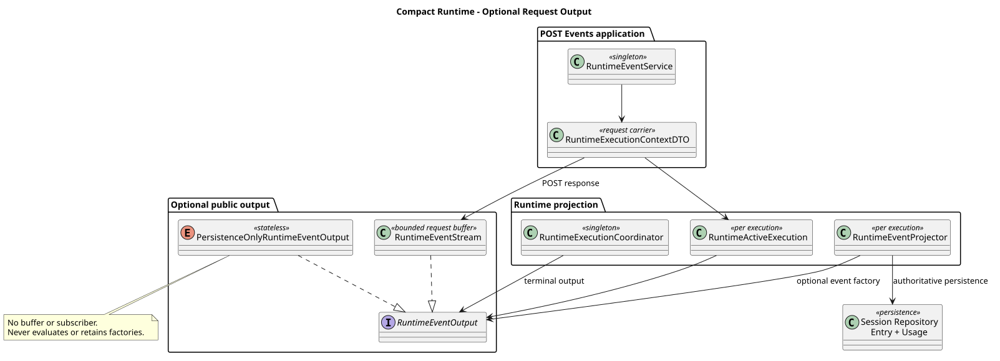
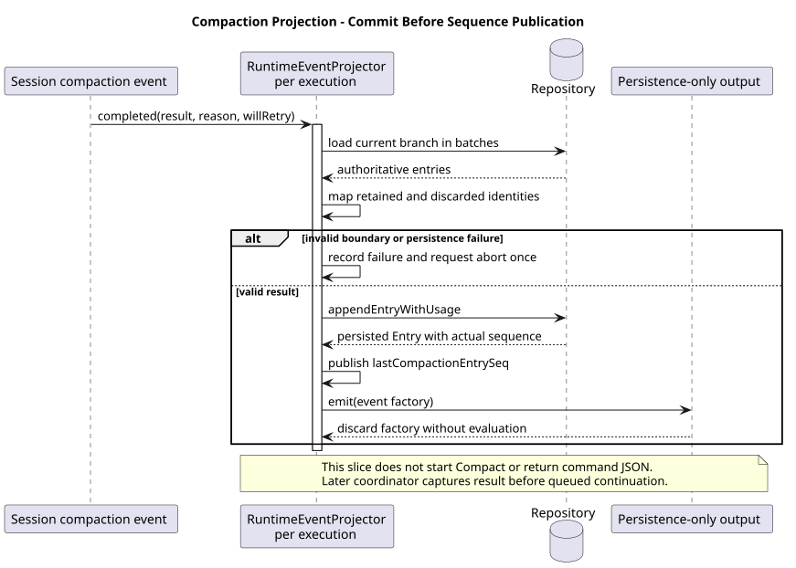

# Compact Runtime：无请求流的持久化投影

版本：1.0.1 · 日期：2026-09-07 · 串行计划第 6a 个切片及后续边界纠正。

## 1. Context 与范围

为普通 JSON Compact 执行准备 Runtime 基础设施：活动执行可以没有 SSE 流，仍使用同一
Projector 保存权威领域 Entry 与 Usage。本 PR **没有可调用的 Compact 入口**；不接入
Contributor、Handler、Command Application Service、Controller 或 Skill 执行。

完整生命周期还包含原子准入、历史观察、容量、超时、独立完成句柄和资源清理。
最新 Compact 约束明确禁止控制队列及续跑；本文 1.0.0 的队列续跑交接已撤销。
本次在“输出与持久化解耦”处独立交付，避免将这些职责及并发测试同时塞入 850 模块行预算。
下一切片必须等本 PR 合并后从最新 main 创建，不使用堆叠分支。
6b1 的实际进展与验证见 [已准入执行生命周期](compact-runtime-lifecycle.md)，不要把 6a 历史验证当作完整准入证据。

## 2. 关键定义与源码证据

Java 变更前基线：`ee89ff00e516c01444bd120034a936d6203dffc0`（Thinking #230 已合并）。
本次实现：`defb688093e2237656516d66639d2548364cfa3f`。
下表 Java 相对路径的共同前缀为 `modules/coding-agent-cli/src/main/java/com/campusclaw/codingagent/`。

| 基线 | 相对路径与符号 | 观察与目标理由 |
|---|---|---|
| Java 变更前 | `runtimeapi/runtime/RuntimeActiveExecution.java:eventStream`；`runtimeapi/event/RuntimeExecutionContextFactory.java:create` | 活动执行必须携带请求流，初始上下文必须携带用户消息；不能直接复用给无输入消息的 Compact |
| Java 变更前 | `runtimeapi/event/RuntimeEventProjector.java:projectCompactionCompleted/emitPersisted` | 已保存 Compaction Entry、Usage、保留边界与重试丢弃身份；保存后立即构造公共 SSE 数据 |
| Java 变更前 | `runtimeapi/event/RuntimeExecutionCoordinator.java:completeExecution`；`runtimeapi/runtime/RuntimeSessionEngineRegistry.java:withOperationLock/register/complete` | 超时、队列、收尾及容量已存在；本次仅替换输出依赖，不宣称已有 Compact 准入 |
| Java 本次 | `runtimeapi/event/RuntimeEventOutput.java`、`runtimeapi/event/PersistenceOnlyRuntimeEventOutput.java`、`runtimeapi/event/RuntimeEventStream.java` | 明确同步求值的可选输出；无流策略丢弃事件工厂，不保留请求或创建缓冲 |
| Java 本次 | `runtimeapi/event/RuntimeEventProjectorFactory.java:createForCompaction`；`runtimeapi/event/RuntimeEventProjector.java:lastCompactionEntrySeq` | 无初始用户消息的专用创建方式；只从 Repository 成功返回的压缩 Entry 读取序号 |
| Java 本次 | `runtimeapi/dto/RuntimeExecutionContextDTO.java`；`runtimeapi/event/RuntimeEventService.java:prepareAndSubmitLocked` | 请求流只由 POST Events 的内部 DTO 携带；DTO 无校验，工厂构造完整上下文；Web 不接触该 DTO |
| pi `4af9d21d3b4d664e4a29fcabfec85171077248e3` | `packages/coding-agent/src/core/agent-session.ts:compact`（1864 起）、`abortCompaction`（2017 起） | 手动压缩先 abort，写 Compaction 后恢复消息并通知结束；pi 无 Java 数据库操作锁或请求 JSON 完成句柄 |

已确认设计：`pi-mono-java-design@41304c1f3df0e8eca53141312724d7a684a1d07f`，
`04-命令与技能/01-内置命令/README.md` 第 7 节与
`04-命令与技能/01-内置命令/设计图/diagram.puml:compact_command_execution`。
以上为 6a 历史设计基线。后续以设计 main `0a113ce8e12cc65bd6e5589087bd4642a7d016e1`
相同 README 第 7 节为准：Compact 不支持 Steer/FollowUp，不排队续跑，Mate Header 只保留至本次压缩结束。
设计仓只读，未修改。通用 Events V2、旧控制路由退役及前端迁移由用户另行开发，
不属于当前 Slash Command 工作，也不是本系列发布前置条件。命令专属中断绑定/响应若未确认，单独说明该边界。

Java 的 idle-only、JSON、独立压缩终态是已确认的**产品约束**；可选输出与数据库投影解耦是
**架构变化**。保留已存领域事件，不引入通用命令生命周期、Name 历史或公开 commandId。
这些 Java 目标不能表述为 pi 的既有 HTTP 行为。

## 3. 架构与数据流

[PlantUML 源码](compact-runtime-output/diagram.puml#L1)

RuntimeEventOutput 只描述公共事件的输出，不承担保存数据或完成执行的职责。
RuntimeEventStream 仍使用原队列、字节预算、心跳和 detach 机制；新增重载同步求值后调用旧方法。
无流策略为无字段的单例，不求值事件工厂，因此不运行 toSseData、公共错误翻译或事件序列化。
已有 Map 组装仍可能发生，但不会进入缓冲、后台任务或请求历史。

Projector 与 ActiveExecution 各自属于一次执行，Spring Factory 只有 final 协作者。
createForCompaction 仅表示没有初始 UserMessage；调用者另选 persistenceOnly 输出策略，
并须在持久化前提供现有 Usage 所需的内部 runId。这个 ID 不变成命令身份或公共字段。
6a 还验证了通用 Projector 的排队 UserMessage 不会被误认为初始输入；
这是既有 POST Events 的兼容性证据，不表示 Compact 接受排队输入。

[PlantUML 源码](compact-runtime-output/diagram.puml#L41)

## 4. 决策与边界情况

见 [ADR-0055](../decisions/0055-runtime-persistence-without-request-stream.html)。编号在同步最新 main 后分配。

- 不创建无人订阅的假 SSE，也不以 null 流分散判空；输出策略是明确的对象。
- Entry/Usage 仍在既有 Repository 事务中保存；只有成功返回后才更新 lastCompactionEntrySeq。
  它不是 Usage 序号，也不随排队 UserMessage 更新。读取与写入共用 Projector 的 synchronized 边界。
- lastCompactionEntrySeq 是投影器最近成功的压缩记录，不是命令结果：后续失败保留旧值。
  Compact 协调器必须检查本次错误，并在本次投影与资源收尾后固定结果；它不消费控制队列。
- 分页读取当前分支后按恢复上下文身份定位保留点；不存在的点在写入前失败。重试的精确丢弃身份保持原样。
- 保存失败沿用 failure 标记与一次 abort 回调；之后忽略投影。此处没有新增失败清理事务或恢复执行机制。
- 无流策略 complete 只完成输出动作，不取消或完成 ActiveExecution；各执行 Future 不受共享无状态策略影响。
- 原 POST Events 接受顺序、字段、SSE 结束语义与错误码不变，Controller 不接触内部 DTO。

## 5. DFX 与契约影响

无流执行不分配 SSE 缓冲、心跳线程或订阅者，不新增依赖/配置/数据库表/SQL/后台线程。
持久化和恢复复杂度沿用现有当前分支读取；按 500 条分批加载，不在本切片修改历史算法。
不新增 Header 捕获或凭据存储；Mate Header 只属于本次 Compact 的 Active Holder，
压缩终态必须释放 Holder，不允许通过续跑延长凭据生命周期。
无公开 API、JSON/SSE schema 或前端类型变更。DTO 更名仅影响内部工厂与 Service。

## 6. 测试与验证

- 新增 15 项：无输出工厂不求值、独立执行完成、SSE 同步保序、无输出终态无需翻译、
  协调器成功/失败收尾；手动压缩 Entry/Usage、保留工具对、无初始输入的首条控制消息、
  精确重试丢弃身份、保存失败、非法边界、瞬态事件不落盘、多批历史和最后压缩序号。
- 完整 `./mvnw -q spotless:apply checkstyle:check verify` 通过；1567 项模块/依赖测试，0 失败、0 跳过。
  现有 POST Events 路由、真实 AgentLoop 投影、背压及 detach 测试同时执行。
- 测试质量脚本指定路径不存在，使用本机归档副本，0 errors、0 warnings。
- Java AST 检查无 finding；内部 record 排版需人工核对，已确认纯载体与对应镜像。
- 默认 sync 因 NativeParent 无法解析失败；按仓库本地流程显式 `--no-verify` 同步源码，
  **公司镜像编译未验证**。不绕过 Git hook。
- 最终行数门禁：646 模块新增行、1292/2000 总新增行；包含镜像和测试，低于 1800 软上限。
- 本次不运行真实 openGauss Compact/跨 JVM 流程：尚无 Compact 接受入口，Repository 未变。
  当前恢复证据为真实 Codec + 模拟 Repository，不冒充数据库事务或跨进程验证。

## 7. 后续串行交付

| 切片 | 尚需实现和验证 |
|---|---|
| 6b1：已准入 Compact 执行 | 共用操作锁/容量/Holder/Projector；30 分钟超时；独立且不传播调用方取消的完成句柄；禁止控制输入与队列续跑；终态后 Holder、Session、容量清理 |
| 6b2：Compact 准入与观察 | 操作锁/数据库行锁下 idle 复核；空历史在容量、状态、Entry 前无副作用返回；实际压缩注册与准入、内部 Usage 身份；并发接受与恢复验证 |
| 7：Compact 命令接入 | 窄应用服务与 Contributor/Handler；错误翻译、实际领域序号与无变化结果；Mate Header 只保留至本次压缩结束 |
| 最终应用/HTTP | 七类 DTO→VO、普通 JSON、共享 Skill 契约对齐、客户端断线不取消、不自动重放、真实 openGauss 跨进程恢复与 POST Events 回归 |

6b 如仍超过预算则继续按可验证职责拆分，仍保持仅一个待合并 PR；不发布不完整公共入口。
通用 Events V2、旧控制路由退役和前端迁移不纳入当前待交付清单；不恢复旧 Abort 204 契约。

## 8. 版本历史

| 版本 | 日期 | 变更 |
|---|---|---|
| 1.0.1 | 2026-09-07 | 按最新设计纠正 R04：撤销 Compact 队列续跑和凭据延寿指导，区分历史 POST Events 测试与 Compact 目标；按 850 行预算拆分 6b1/6b2。 |
| 1.0.0 | 2026-09-07 | 记录无请求流输出、压缩权威序号及恢复验证，明确 6a 范围与剩余生命周期交接。 |
