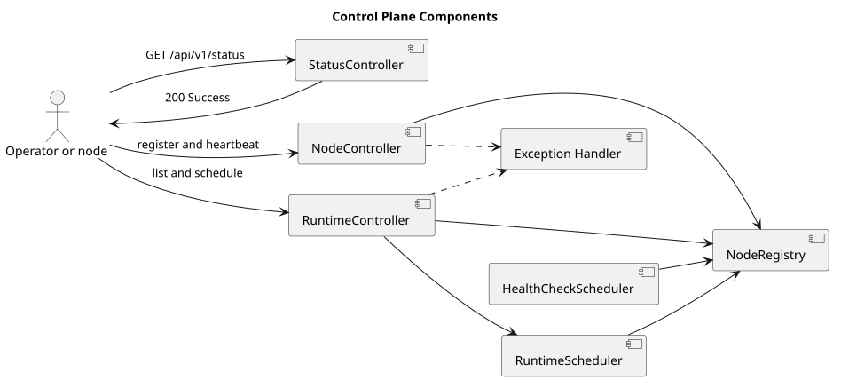

# Control Plane 设计

> 文档版本：2.0.0
>
> 实现基线：`8691e8800f05f28afe22499050c29220ef5b7475`

## 1. 现状

控制面已经从函数式 WebFlux 路由迁移为 Spring MVC `@RestController`，并随默认 Spring Boot HTTP 进程启动。它不是 CampusClaw Runtime V1 的 11 个业务接口；两者只共享进程和 Web 容器。

| 组件 | 源码证据 | 职责 |
|---|---|---|
| `NodeController` | `modules/coding-agent-cli/src/main/java/com/campusclaw/codingagent/controlplane/api/NodeController.java` | 注册、心跳、查询和注销数据面节点 |
| `RuntimeController` | `modules/coding-agent-cli/src/main/java/com/campusclaw/codingagent/controlplane/api/RuntimeController.java` | 汇总活动 Runtime、能力和调度决策 |
| `NodeRegistry` | `modules/agent-core/src/main/java/com/campusclaw/agent/controlplane/service/NodeRegistry.java` | 维护进程内节点状态 |
| `RuntimeScheduler` | `modules/agent-core/src/main/java/com/campusclaw/agent/controlplane/service/RuntimeScheduler.java` | 按能力和负载选择节点 |
| `ControlPlaneExceptionHandler` | `modules/coding-agent-cli/src/main/java/com/campusclaw/codingagent/controlplane/error/ControlPlaneExceptionHandler.java` | 映射稳定的控制面错误响应 |

上述为实现基线的已观察行为。

## 2. 组件关系

[PlantUML 源码](control-plane/diagram.puml#L1)

## 3. HTTP 接口

### Node

| 方法 | 路径 | 结果 |
|---|---|---|
| `POST` | `/api/v1/nodes` | 注册节点，返回 201 与 `Location` |
| `POST` | `/api/v1/nodes/{nodeId}/heartbeat` | 更新指标并返回节点快照 |
| `GET` | `/api/v1/nodes` | 返回全部节点 |
| `GET` | `/api/v1/nodes/{nodeId}` | 返回单个节点或 404 |
| `DELETE` | `/api/v1/nodes/{nodeId}` | 注销节点，返回 204 或 404 |

### Runtime

| 方法 | 路径 | 结果 |
|---|---|---|
| `GET` | `/api/v1/runtimes` | 返回状态为 ACTIVE 的节点 |
| `GET` | `/api/v1/runtimes/capabilities` | 返回活动节点能力并集 |
| `POST` | `/api/v1/runtimes/schedule` | 根据必需能力和首选节点返回调度决策 |

请求对象使用 Jakarta Bean Validation；输出使用专用 Response VO。控制面暂时保留自身错误结构，不复用 Runtime V1 的 ResultBean，这是既有控制面兼容性约束。

## 4. 生命周期与并发

`NodeRegistry` 是进程内状态源。注册产生节点 ID；心跳更新指标与时间；健康检查任务将超时节点标记为不可用。`RuntimeScheduler` 只在活动节点中筛选，先满足能力约束，再应用首选节点和负载规则。

本设计没有把控制面状态持久化到 openGauss。因此进程重启后节点必须重新注册。这是当前实现事实，不应解释为持久化控制平面。

## 5. 安全边界

当前控制面端点没有认证或授权，而默认 HTTP 服务监听 `0.0.0.0`。这不是安全完成态，而是明确的安全债务；在生产网络暴露这些 `/api/v1/*` 路径前，必须由网关隔离，或补充与部署体系匹配的认证和授权。

Runtime V1 的双凭据 Header 形状校验不会覆盖控制面路径。历史“仅绑定 localhost，因此可以延期鉴权”的 ADR 已因启动模型变化而删除。

## 6. 验证

`NodeControllerTest` 和 `RuntimeControllerTest` 使用 MVC 测试覆盖成功、校验、404 和调度失败映射。`NodeRegistryTest`、`HealthCheckSchedulerTest` 与 `RuntimeSchedulerTest` 覆盖领域行为。

## 7. 版本历史

| 版本 | 日期 | 说明 |
|---|---|---|
| 2.0.0 | 2026-08-18 | 对齐 Spring MVC Controller 与默认 Web 进程，删除 WebFlux RouterFunction 和 ServerMode ADR |
| 1.x | 2026-06-22 | 历史函数式 WebFlux 控制面设计，已废弃 |
