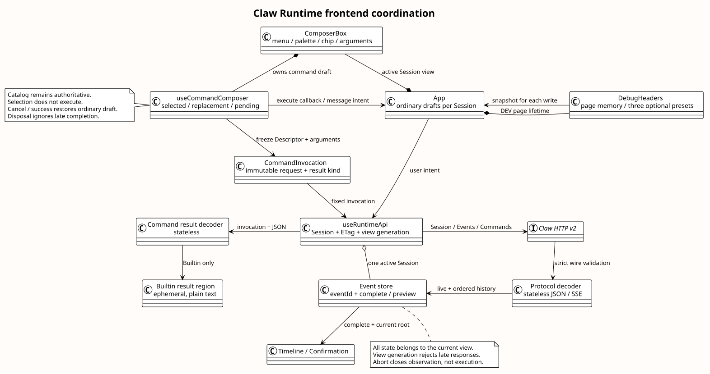

# Claw Runtime Events v2 前端实现

| 属性 | 值 |
|---|---|
| 版本 | 1.1.0 |
| 日期 | 2026-09-09 |
| 状态 | 前端已实现；本次以契约 fixture 验收，真实后端 E2E 未验收；不是生产 Mate 前端 |
| 初始源码基线 | `pi-mono-java@821418e7f2ece298a04a066ab8d11d3388ef2f16` |
| 同步源码基线 | `pi-mono-java@9b01a9f1e659359b6a7bff9ec622e6700ef6e384`；经 c57db26d 同步消息受理/控制分发，再同步控制受理与旧 Entry 拒绝；本文消费的 VO 不变 |
| 本次交互源码基线 | `pi-mono-java@4cc8dd86f601417c22cf9306e52152acbb59bb60` |
| 本次已确认交互设计 | `pi-mono-java-design@1eb85523fe1d210856851c5185d64858562db0c6`（Headers）；`759e72d25903da76b3e37a6712dde63fe2d4255a`（Slash 1.4.0） |
| 已确认目标契约 | `pi-mono-java-design@9b8c5b7`；Claw Events B01～B15、Slash 前端 1.3.0；用户本次明确对接 Claw Runtime |
| 决策 | [ADR-0102](../../decisions/0102-runtime-events-v2-frontend.html)、[交互更新 ADR-0103](../../decisions/0103-composer-command-and-header-interaction.html) |

## 背景、定义与交付边界

旧工作台消费 HTTP 1.38 的 `message/fileIds`、命名 SSE、字符串历史游标及三种独立控制接口。
1.0.0 交付时后端会话并行实现 Events v2；前端任务只改 `frontend/` 与前端文档，不改 Controller、Service、
数据库、企业镜像或公共 Mate 契约。接口技能用于核对已有字段和消费状态，不引入新协议字段。

“回执”是当前 POST 第一个完整 user.* 事件；它证明接收，不证明执行完成。
“预览”是 agent.message/thinking 的 delta；完整记录以相同 eventId 覆盖预览。
“确认等待”是对应 sourceEventId 的 confirming idle，只关闭本段 SSE，Session 仍 running。
“命令结果”只指 Builtin 的页面临时 JSON；Skill 复用消息、工具和终态。

## 源码证据、目标决定与理由

以下路径相对实现仓。初始基线与同步基线中这些接口文件内容一致；本次不重新推导 pi Runtime 内核，
不把前端协议投影描述为 pi 内部实现。

| 源码 / 符号 | 已观察行为 | 本次前端处理与理由 |
|---|---|---|
| `frontend/src/composables/useRuntimeApi.ts`（改造前）· sendMessage/steer/followUp/abort | 旧请求字段、独立控制路径；曾以同文历史确认提交 | 移除旧路径，禁止同文确认；无回执保留草稿，避免重复副作用（安全加固） |
| `modules/coding-agent-cli/src/main/java/com/campusclaw/codingagent/runtimeapi/vo/SubmitSessionEventRequestVO.java`、`SessionUserEventRequestVO.java` | 新 event 包装和三种输入联合类型已经存在 | 严格按已确认目标组装；不发送幂等键、执行 ID 或内部序号（产品约束） |
| 同目录 `SessionEventResponseVO.java`、`ListSessionEventsResponseVO.java` | 完整事件的显式字段与 Long nextPage/null 已存在 | 共享解码、eventId 合并、数字分页；不按 createdAt 排序（架构调整） |
| 同目录 `CommandListResponseVO.java`、`BuiltinCommandRequestVO.java`、`SkillCommandRequestVO.java` | Descriptor/input 省略、Builtin 与 Skill 请求分支 | 保留服务端顺序，提交前冻结调用快照，不由 JSON 形状猜响应（安全加固） |
| `modules/coding-agent-cli/src/main/java/com/campusclaw/codingagent/runtimeapi/web/RuntimeCommandController.java` · execute | Builtin JSON / Skill SSE 共用 singular command，拒绝 If-Match/Idempotency-Key | Gateway 固定请求 Accept 和解码分支；命令不套配置 PUT 的版本头 |
| 同目录 `RuntimeEventController.java` · submit/list | 同步基线仍接旧 UserEventRequestVO/RuntimeEventService | **HTTP v2 接线仍待后端会话交付**；本前端不能对该旧入口自动降级，真实端到端未验收 |
| `modules/common/src/main/java/com/campusclaw/common/constant/ClawConstants.java` · EVENT_FILE_ID_REGEX/Skill.NAME_REGEX | fileId 为 32 位十六进制；Skill 名允许数字起始及连字符分段 | 请求构造和 Catalog 测试使用对应格式；不凭旧示例编造 file- 前缀 |

主线新增的 RuntimeV2MessageEventService、RuntimeV2ExecutionCoordinator、RuntimeSessionControlDispatcher
是本次同步引入的其他任务成果，不属于本 PR 改动或本前端测试的覆盖声明。

### 1.1.0 交互更新的证据与范围

上述 HTTP 迁移证据对应 1.0.0 的源码基线。1.1.0 仅落实已确认的 Headers 与命令 Composer，
不重新判断真实后端接线状态，不修改 Thinking、Runtime 生命周期或公共 Mate 契约。
设计仓路径为 `01-总体架构/04-CampusClaw前端体验/README.md` 和
`04-命令与技能/00-Slash-Command通用模块/前端设计/README.md`，分别按上表提交读取。
Codex 仅作为已批准的视觉与入口参考；标签及草稿规则是 CampusClaw 的产品决定，不推断其内部实现。

| 4cc8dd8 源码 / 符号 | 已观察行为 | 本次决定、分类与理由 |
|---|---|---|
| `frontend/src/components/DebugHeaders.vue` · rows/ensureTrailingRow | 初始空行，编辑后自动补一行，清空后仍保留一行；显示技术说明 | 产品约束：改为三个可删除预置和显式新增，清空可为零；去掉重复说明，避免把空行误认为新增操作 |
| `frontend/src/debugHeaders.ts` · validateDebugHeaders | 完整启用行参与快照；缺 Key/Value 报错 | 产品约束：只有名称未改变的空预置可忽略；自定义和改名行继续校验，避免未填凭据阻止普通操作 |
| `frontend/src/components/ComposerBox.vue` · enter/choose/submit | 独立命令草稿已存在，但以斜杠按钮、模式栏和完整命令文本展示 | 产品约束：精简清单、可删除标签、独立参数与统一箭头，让选择和执行边界清楚 |
| `frontend/src/runtime/commands.ts` · freezeInvocation | 解析完整 Slash 文本再冻结请求及结果类型 | 架构变化：新增 freezeCommandArguments，从已选 Descriptor 与独立参数冻结，保留参数前导空白和换行，避免二次解析改变含义 |
| `frontend/src/composables/useRuntimeApi.ts` · listCommands/executeCommand | 清单去重与失效已存在；Builtin JSON、内部 Skill SSE 已接入 | 保持已有传输；useCommandComposer 消费最新 Descriptor，并在命令消失或 input 收回时保留草稿、阻止不合法提交 |
| `frontend/src/App.vue` · message/drafts/ComposerBox key | 普通草稿归 App，Composer 按 Session 重建 | 架构变化：命令状态抽到视图级 useCommandComposer；取消或成功仅退出命令状态，不覆盖普通草稿；卸载忽略迟到完成和焦点 |

新增 composable 及关系是本次实现落点；设计仓独立 Palette/Chip/Gateway 的完整组件拆分仍为
target-only，本次不声称已全部落地。公共 Mate Skill 的文件门禁不应禁用这里已有的内部 Runtime Skill SSE。

## 目标结构与数据流

[PlantUML 源码](./diagram.puml#L1) · [原尺寸](./frontend_event_coordination.svg)

本图是本轮落地的推荐目标结构，不另维护旧实现类图。
`useRuntimeApi` 持有当前视图的资源/ETag、流读取器、请求代次和状态；组件只发用户意图。
协议解码与事件合并是纯函数，HTTP live 与历史必须共用。命令快照在 POST 前固定，
Builtin Renderer 消费相同快照；Skill 不进入临时结果区。响应解码失败不更新权威资源。

会话切换 abort 旧视图的 Fetch 和 reader，代次阻止迟到结果污染新会话。关闭观察不是业务取消。
同一视图中完整回执与历史都按 eventId 去重，完整消息覆盖预览，晚到 delta 不会追加到完成消息。
普通分页按响应顺序暂存到全部读取成功，再与实时尾部合并；失败不删除当前可见记录。
`nextPage=null` 只结束当前翻页，不能宣布执行完成。没有跨页快照或时间下界。

## 关键决策与界面行为

- 单 Session 新消息在 idle 才可发；2048 Unicode code point 上限。已上传 fileId 的构造函数支持
  最多 4 个引用及纯附件请求，但**上传尚未接入**，按钮明确禁用；不编造上传 API 或假上传成功。
- 停止提交固定 root user.message.eventId。中断回执只显示正在停止；对应真实终态才解除。
  409/过期决定保留意图，用户重新核对，不自动改绑下一轮或重发控制。
- 工具确认仅对当前根消息的有效待确认 toolCallId 开放；本次 allow 不发送 denyMessage，deny
  允许非空可选说明，最多 2048 字符。参数和工具结果使用文本；不执行其中的 Markdown 链接或图片。
- 空草稿首字符 `/` 或“+ → 命令”打开输入框上方的清单。列表只显示规范名称和说明，不带前导
  `/`、kind、逐行 hint、标题或操作教学；移除独立 Slash 按钮与命令模式栏。
- 选中后收起清单并显示浅灰标签；点击名称更换、× 删除。参数单独编辑，无 input 隐藏参数框并
  聚焦统一圆形上箭头。第一次 Enter 只选择，第二次独立 Enter 或点击才执行；重复 Enter、IME
  composition/229 不选择或执行，Shift+Enter 换行。未知 Slash 不回退普通消息。
- 首次 Escape 关闭清单、保留查询；再次退出。更换时暂存原选择与参数，Escape 恢复它们。
  空参数区（无参数命令为提交按钮）Backspace 或标签 × 退出；仅有 `/` 时 Backspace 退出。
  取消/成功恢复普通草稿，失败保留命令草稿；切换 Session 清空命令临时状态。
- Catalog 仅在内存中缓存，GET 合并在途读取；Session 状态变化与命令 POST 后失效。
  更新后的 input 是权威展示提示，不能从 hint 推导参数枚举或硬编码 running 准入矩阵。
  清单加载/失败时禁止提交；已选命令消失、类型改变或不再接受已填参数时保留输入并报错。
  点击标签或菜单会移除原 DOM 节点，外部点击判断使用原事件 composedPath，防止误收起新清单。
- Model 空参解码 Models，带参解码 Session；后者必须有 ETag，并同资源一起应用。Models GET
  不能覆盖 Session.modelId/ETag。配置 412 只重读，显示当前真实值，要求用户再次选择。
- Help/Skills 都为纯文本临时卡，最多一条，离开当前会话即清除，不进入模型上下文或事件历史。
- 思考展示已公开摘要，关闭后续 thinking 不隐藏既有摘要。Assistant 继续已有安全 Markdown；
  不为只有工具调用、正文为空的完成事件伪造回答。
- 视觉保留 O1 品牌、浅暖灰导航和独立虚线活动框；命令行没有装饰图标列。窄屏清单单列，
  可滚动区带键盘入口，输入动作区不随 Palette 膨胀而被挤出视口。

## 错误、恢复与 DFX

| 情况 | 行为与安全边界 |
|---|---|
| POST 首回执丢失 | 显示提交结果不确定、保留草稿、禁止直接重复消息；同文历史不能确认本次请求。人工检查后在 idle 显式解除，不自动发送 |
| 已有回执、EOF 前没有对应 idle | 保留预览标记，GET 历史与 Session 对账；只有相同根消息终态/确认阶段有归属意义，不把任意资源 idle 当执行成功 |
| SSE/JSON 类型错误、旧 wire、畸形字段 | INVALID_RESPONSE；停止本段观察并核对，不兼容旧字段、不把未知内容包装成模型回答 |
| 读取失败或某页不合法 | 保持已有可见事件，显示错误；GET 可显式重试，所有写请求无自动重试 |
| Builtin 网络结果未知 | 保留命令草稿，通过 Session/Events 读取现状；没有虚构 commandId、进度或幂等键 |
| 切换/卸载 | 取消客户端观察和读请求，不声称后台取消；当前页面草稿按 Session 隔离，秘密不持久化 |

读取帧缓冲上限为 2 Mi 个 JavaScript 字符，超过即显式失败/对账，不截断完整事件再显示成功。
这是客户端保护，不是新增后端协议上限；高容量会话的内存/渲染与时间线虚拟化仍需单独压测。
工具参数不额外存日志或 localStorage；显示的安全内容由后端共享投影负责，调试环境必须受控。
临时 Headers 为每次消息/Skill/Builtin/停止/确认 POST 单独生成副本；GET/配置不复用，
Accept/Content-Type 固定并剔除禁止的版本/幂等/续流头，不把凭据带入历史或恢复请求。
预置 `access-token`、`X-HW-ID`、`Authorization`，Value 留空；只有预置名称未变且值为空时，
跳过校验、计数与快照。编辑或删除不自动补行；“增加请求头”仅增加一条空 Key/Value 并聚焦 Key。
删除最后一行或全部清空后为零行，焦点回到增加按钮。改名后的空值仍按普通自定义行报错。

## 测试与验证

执行入口：`frontend/package.json` 现有 test/typecheck/build，无新增 npm 或 Maven 直接依赖。
`frontend/scripts/fixture-runtime.mjs` 只监听 127.0.0.1，用于浏览器契约验收；不会装配到生产包。
本地运行说明见 [frontend/README.md](../../../frontend/README.md)。

- Vitest：新联合字段、负例、Unicode/纯附件、数字分页、跨字节 CRLF SSE、reader 取消、
  完整覆盖预览、晚到 delta、时间回退、停止绑定、确认等待、首回执丢失、会话隔离、412、
  Header 边界、Catalog 去重、Model 调用快照、Skill SSE 与临时 Builtin 分离。
- 保留已有 Markdown URL/HTML/图片安全回归、整轮复制与 Headers 校验测试。
- 浏览器：实际 Vue + 显式契约 fixture，验证创建、二次 Enter、草稿恢复、未知 Slash、
  running Catalog、工具允许续跑、停止终态、320px 窄屏输入按钮及横向溢出；console 无 error/warn。
- 必须执行 `npm test`、`npm run typecheck`、`npm run build`、`npm audit --audit-level=high`、
  PlantUML 生成/ASCII/XML/链接/同步验证、`git diff --check` 与 PR 2000 行新增代码门禁。
- 未运行：真实 Java 后端 E2E、实际上传、公共 Mate 接入、真实 IME/读屏器/200% 缩放、长历史压测。
  Java/Maven 与镜像验证不适用本次前端改动，不能以 fixture 验收声称真实后端已完成。

1.0.0 历史验收：7 个 Vitest 文件、73 项用例；类型检查、构建、依赖审计与图校验通过。
1.1.0 验收新增预置空值、参数原样冻结、重复 Enter、IME 标记、两级 Escape、更换恢复、
动态清单、并发提交、卸载迟到响应和普通草稿保护用例。实际 Vue 浏览器验收覆盖键入/菜单入口、
标签切换、无参数焦点、参数执行、未知命令、Headers 显式增删至零、运行中只读 Model、
Skill SSE 与工具确认续跑；320/390/768/1024/1440px 无横向溢出，清单和提交按钮可用。
最终验证：8 个 Vitest 文件、93 项用例通过，类型检查与 Vite 构建通过，npm audit 为 0 漏洞。
PlantUML 生成、ASCII、SVG XML、链接及源码锚点、生成同步通过；已对照旧图检查新图原尺寸与
900px 缩放。变更 Markdown 没有 Mermaid 围栏，`git diff --check` 通过。
未验收真实后端、真实 IME、读屏器或 200% 缩放。

## 版本历史

| 版本 | 日期 | 变更 |
|---|---|---|
| 1.1.0 | 2026-09-09 | 落实 Headers 预置与显式增删、命令标签与独立参数、统一箭头及草稿恢复；保留内部 Skill SSE。 |
| 1.0.0 | 2026-09-08 | 独立前端交付 Events v2、Slash、确认/停止与恢复；明确并行后端联调边界。 |
