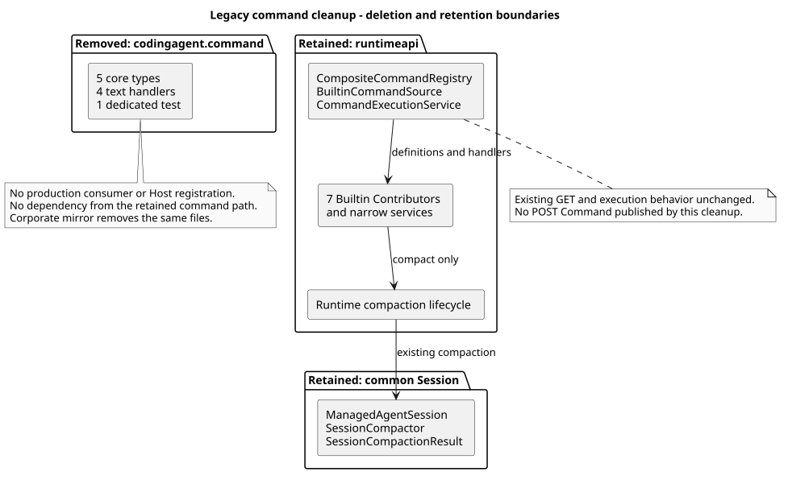

# 删除未注册的旧命令原型

> 版本：1.0.0 · 日期：2026-09-07 · 状态：Implemented

## 1. Context 与边界

原实施计划要求删除 `com.campusclaw.codingagent.command` 中未注册的旧原型。
共享清单 GET 已随 #245 合入，新 Builtin 核心、七个 Contributor 和执行应用也已具备；
旧原型既不是它们的依赖，也没有 Runtime Session 端口实现。此时独立删除旧代码，
可消除两套不同参数与输出语义的命令实现，且不依赖 Skill 正文公开方式的待决事项。

本片只删除原型及其专属测试，同步公司镜像，更新本实现仓的当前状态和历史决策关联。
不发布 POST Command，不修改现有 HTTP/SSE、控制端点、Skill 执行或数据库，
不增加升级脚本，不修改 `pi-mono-java-design`。

## 2. 源码证据与关键定义

删除前基线：`pi-mono-java@146a6c9ecdc6eda987fcecd65b1e14416ce78bb1`（#245 合并）。
删除实现：`1bf1ce6d631a5c394153bd8e8cce55a861d3a387`。
以下 Java 路径相对于 `modules/coding-agent-cli/src/main/java/com/campusclaw/codingagent/`。

| 来源 | 相对路径与符号 | 观察、决定及理由 |
|---|---|---|
| Java 基线 | `command/SlashCommandRegistry.java#register/execute/parse` | 非 Spring 注册表，解析前导 `/` 并向文本端口输出；整个受版本控制的代码及资源中，其消费者仅在旧包和专属测试内。 |
| Java 基线 | `command/SlashCommandSession.java`、`command/SlashCommandContext.java`、`command/SlashCommandOutput.java` | 只有测试内 `TestSession` 实现该 Session 端口；不存在运行时适配，不承载真实 Session 持久化。 |
| Java 基线 | `command/builtin/{Model,Name,Thinking,Compact}Command.java#execute` | 四个旧文本处理器。Thinking 接受布尔别名，Compact 接受自定义指令，Name 的注释保留旧 Host 设想；不能把这些旧语义接入当前 HTTP。 |
| Java 基线，保留 | `runtimeapi/service/command/{CompositeCommandRegistry,BuiltinCommandSource,CommandExecutionService}.java` 的 `resolve`、构造器、`executeBuiltin` | 当前分层体系自行聚合定义、准入与执行，不 import 旧包；删除不修改这些文件。 |
| Java 基线，保留 | `session/ManagedAgentSession.java#compact`、`session/compaction/{SessionCompactor,SessionCompactionResult}.java` | 公共压缩与结果仍由真实 Session 使用；旧测试对结果类型的单向依赖不是删掉压缩能力的理由。 |
| pi 观察 | `5cd93f688aaab89dbb6dfa4aca535f21796ae185`，`packages/coding-agent/src/core/slash-commands.ts#BuiltinSlashCommand/BUILTIN_SLASH_COMMANDS` | pi 提供本地命令提示元数据；不定义本次 Java 包清理、Spring 装配或 HTTP 发布顺序。 |
| Java 决策 | 本片删除旧包，不增加转发类或新入口 | 属于架构清理，落实既有服务产品约束；不是声称 pi 已删除这些命令，也不是新的 API 决策。 |

删除范围精确为下表，企业镜像由脚本执行相同删除，仅根包前缀不同。

| 生产源相对 `command/` 的文件 | 当前保留能力，不代表兼容旧 Java 类型 |
|---|---|
| `SlashCommand.java` | `runtimeapi/command/definition/CommandDefinition.java` 与 Builtin 定义/执行 SPI |
| `SlashCommandRegistry.java` | `CompositeCommandRegistry`、`BuiltinCommandSource` 与 `CommandExecutionService` |
| `SlashCommandContext.java` | `runtimeapi/command/execution/CommandExecutionContext.java` |
| `SlashCommandSession.java` | 各命令窄服务和真实 Runtime Session，不增加旧端口适配 |
| `SlashCommandOutput.java` | 内部结果 DTO 与 `CommandResponseAssembler` 的业务 VO 投影 |
| `builtin/ModelCommand.java` | `ModelCommandContributor` → `SessionModelConfigurationService` |
| `builtin/NameCommand.java` | `NameCommandContributor` → `SessionNamingService` |
| `builtin/ThinkingCommand.java` | `ThinkingCommandContributor` → `SessionThinkingConfigurationService` |
| `builtin/CompactCommand.java` | `CompactCommandContributor` → `SessionCompactionApplicationService` → Runtime 压缩通路 |

另删除 `modules/coding-agent-cli/src/test/java/com/campusclaw/codingagent/command/SlashCommandRegistryTest.java`：
两个用例只测试上述旧类型和测试内端口，不是 HTTP 或数据库用例。
其余 `HelpCommandContributor`、`StatusCommandContributor`、`SkillsCommandContributor` 分别继续委托
`readonly/AgentHelpQueryService`、`readonly/RuntimeSessionStatusService`、`readonly/BoundSkillQueryService`。
七个 Contributor 位于 `runtimeapi/service/command/contributor/`，均不改动。

## 3. 架构与设计决策

[PlantUML 源码](diagram.puml#L1)

[ADR-0070](../../decisions/0070-remove-legacy-command-prototype.html) 记录保留、适配与删除三种方案的取舍。
它仅替代 [ADR-0023](../../decisions/0023-retain-entry-independent-session-capabilities.html)
中“保留未注册 Slash 原型”的决定；公共 Session 压缩与文件追踪的迁移决定保持有效。
旧记录的源码观察和当时的产品范围保留为历史，不据此限制当前命令实现。

## 4. 边界情况与 DFX

- 以受版本控制的全仓文件搜索类型名、点分包名和路径式包名，覆盖 Java、Spring 配置、
  ServiceLoader 资源、脚本与反射字符串；删除前只有旧代码/专属测试和三份历史或架构文档命中。
  这证明仓内没有其他显式消费者，不宣称可枚举仓外任意 Java 反射调用。
- 删除公开 Java 类型会使自行直接依赖旧原型的仓外代码无法编译；它们不是当前服务的 HTTP 契约，
  本片不提供兼容层。Git 历史保留原文件，可按需回查，不提供运行时回退开关。
- 没有新增状态、锁、线程、缓存、凭据、I/O 或数据库变更；不改变执行准入、取消、队列、事件投影。
- Maven 增量编译可能留下已删除类，验证必须从 `clean` 开始，并检查最终服务 JAR。
  镜像通过同步脚本删除，不直接手改第二份代码；单纯源码删除不等于公司制品已验证。

## 5. 契约与测试

GET 清单沿用已发布入口；POST Command 仍未发布。旧 `/thinking true` 等文本行为没有 HTTP 调用方，
删除它们不改变已发布请求。现有普通 Events 消息不会因此新增命令解析。

未新增或修改测试方法，因此新增测试质量检查不适用；不会为已删除原型新增反射式存在性测试。
保留的 `CommandExecutionServiceTest#shouldExecuteAllSevenRealContributorsThroughTheApplication`
通过七个真实 Contributor、实际应用与响应组装验证现有通路，窄服务仍用模拟数据，不能称作跨进程验收。
`BuiltinCommandCoreTest` 继续验证 Spring 装配，`RuntimeCommandCatalogRoutesTest` 验证实际 MVC 清单。
公共压缩和 Runtime 压缩的原有测试完整保留。

## 6. 验证与交付

- `./mvnw -q clean spotless:apply checkstyle:check verify`：393 个测试类、1864 项测试，0 失败、错误或跳过。
  仅删除旧测试的两个用例；不把历史不同基线的总数当作本次功能差异。
- `CommandExecutionServiceTest` 41 项、`BuiltinCommandCoreTest` 9 项、清单 MVC 19 项、
  `CompactCommandTest` 24 项、`SessionCompactorTest` 14 项、`ManagedAgentSessionTest` 10 项均在本轮通过。
- `jar tf modules/coding-agent-cli/target/campusclaw-agent.jar`：不存在 `codingagent/command/`，
  仍含七个 Contributor、应用/注册服务、GET Controller、公共 Session 和压缩类。
- 默认同步因无法解析 `com.huawei.hicampus:NativeParent:26.0.0-SNAPSHOT` 失败；
  显式 `scripts/sync-campusclaw.sh --no-verify` 完成镜像删除。布局测试、两侧删除集合、
  后续 dry-run 内容一致性通过；公司独立编译与公司 JAR 未验证。
- 代码差异精确为 20 个文件删除：模块侧 432 行，含镜像 864 行；新增代码为 0，
  `bash scripts/check-commit-additions.sh origin/main HEAD` 通过。没有数据库或依赖文件差异。
- 文档执行 PlantUML 生成及重生成一致性、ASCII、SVG XML、链接/行锚点、无 Mermaid、
  ADR 桌面/窄屏渲染和 `git diff --check`；最终发布证据记录在 PR。

本轮不运行真实 openGauss 跨进程场景；只删除无运行时消费者的原型，
不借用先前 PR 的数据库验证来证明尚未发布的 POST/Skill 已完成。

## 7. 版本历史

| 版本 | 日期 | 说明 |
|---|---|---|
| 1.0.0 | 2026-09-07 | 删除未注册旧原型与专属测试，记录保留能力、历史决策范围与干净构建证据。 |
