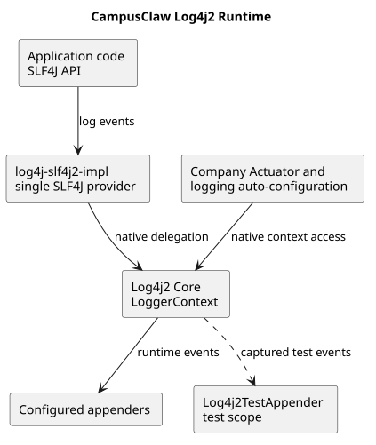

# CampusClaw Log4j2 统一运行时设计

## 文档信息

| 项目 | 内容 |
|---|---|
| 文档版本 | v1.3 |
| 变更前源码基线 | `origin/main@32db273125dc0a14d5f751dc0bfaa332ee87ceb8` |
| 已评审日志实现 | `26d146f401a8557b687e1490f97a5899b22f79be` |
| 管理面补充实现 | `65fb8eabbaa1a7dd63c2777280e19c8bdf5be8eb` |
| 公司父 POM 切换后修复基线 | `origin/main@294e6d90bcad8c4214b08807bfd1cfdee5cc2404` |
| 实现分支 | `codex/align-log4j2` |
| 适用范围 | Maven 日志依赖、Spring Boot 主程序与测试、`campusclaw` 镜像 |
| 变更类型 | 架构变化、公司运行环境兼容 |
| 决策状态 | Accepted |

> 公司镜像相关路径和标识按 2026-09-01 的当前仓库位置展示；历史提交 SHA 仍是对应行为证据。

## 1. Context

变更前，根 POM 为所有模块直接引入 `logback-classic`，Spring Boot 主程序和测试 Starter 同时按默认规则引入 `spring-boot-starter-logging`。这使仓库在本地形成以 Logback 为实现的 SLF4J 链路，部分日志测试也直接依赖 Logback 的 `Logger`、`ListAppender` 和 `ILoggingEvent`。

公司环境通过父 POM 引入 Actuator 及日志自动配置。根据本次启动异常，外部自动配置需要访问 Log4j2 Core 的 `LoggerContext`，而实际 SLF4J 上下文是 `org.apache.logging.slf4j.SLF4JLoggerContext`，最终在启动阶段发生类型转换失败。该公司父 POM 和自动配置源码不在本仓库内，因此这里把它标记为用户报告的外部集成条件，不把它写成仓库已观察源码行为。

Windows 只是暴露问题的运行环境；冲突来自同一 Classpath 中日志实现和桥接方向不一致，与 Windows API 或文件路径无关。本设计不新增 Windows 启动、安装或维护承诺。

公司镜像切换到 `NativeParent` 后不再继承仓库根 POM 的公共依赖。修复前基线
`294e6d90bcad8c4214b08807bfd1cfdee5cc2404` 中，`campusclaw/pom.xml` 保留了默认日志 Starter
排除，却没有显式声明 `slf4j-api` 和 `spring-boot-starter-log4j2`；公司构建因此在测试编译阶段报告
`org.apache.logging.log4j` 不存在。这是父 POM 切换时的实现遗漏，不改变 ADR-0037 已接受的运行时决策。

## 2. 变更前源码证据

以下观察来自变更前基线 `origin/main@32db273125dc0a14d5f751dc0bfaa332ee87ceb8`：

| 观察到的行为 | 源码证据 |
|---|---|
| 根 POM 为全部模块直接引入 `slf4j-api` 和 `logback-classic` | `pom.xml:122-131` |
| CLI 的 `spring-boot-starter` 和 `spring-boot-starter-test` 没有排除默认日志 Starter | `modules/coding-agent-cli/pom.xml:39-55`、`modules/coding-agent-cli/pom.xml:87-92` |
| 独立镜像 POM 同样保留 Spring Boot 默认日志依赖 | `campusclaw/pom.xml:36-56`、`campusclaw/pom.xml:124-129` |
| Mate Provider 日志测试直接导入并使用 Logback 类型 | `modules/ai/src/test/java/com/campusclaw/ai/provider/mate/MateServiceModelManagerProviderTest.java:40-50`、`:62-82` |

这些证据只能说明仓库原有 Logback 选择；Actuator 和公司日志自动配置行为属于外部集成条件。

## 3. 目标设计

CampusClaw 的主模块、`campusclaw` 镜像以及测试统一使用一条日志链路：

1. 业务代码继续只依赖 SLF4J API，不改写现有日志调用。
2. 根 POM 使用 `spring-boot-starter-log4j2` 提供唯一的 SLF4J Provider 和 Log4j2 Core。
3. Spring Boot 主程序和测试 Starter 排除默认的 `spring-boot-starter-logging`，避免 Logback 和 `log4j-to-slf4j` 回到 Classpath。
4. 公司 Actuator/日志自动配置与应用共享原生 Log4j2 Core `LoggerContext`。
5. 日志测试直接捕获不可变的 Log4j2 `LogEvent`，分别断言消息、级别、结构化 ContextData 和 Throwable。
6. 通用模块从根 POM 继承日志依赖；公司镜像在独立 POM 中显式声明 `slf4j-api` 和
   `spring-boot-starter-log4j2`，由 `NativeParent` 管理版本而不是代替应用声明依赖。

[PlantUML 源码](logging-runtime/diagram.puml#L1)

## 4. 设计决策

正式决策见 [ADR-0037：统一使用 Log4j2 运行时](../decisions/0037-align-log4j2-runtime.html)。

### 4.1 统一生产和测试日志实现

不采用“生产使用 Log4j2、测试继续使用 Logback”。测试和生产使用不同 Provider 会继续隐藏绑定冲突，也会让日志断言依赖另一套事件模型。统一实现后，测试验证的是实际运行时语义。

### 4.2 在每个 Maven 构建边界声明日志实现

根 POM 负责声明统一的 Log4j2 实现；直接引入 `spring-boot-starter` 和 `spring-boot-starter-test` 的模块在各自入口排除 `spring-boot-starter-logging`。不在每个 Web、JDBC 或 Validation Starter 上重复排除，因为 Maven 对相同传递依赖的直接路径调解已经从主入口切断默认日志 Starter。

公司镜像使用独立的 `NativeParent`，不能再依赖根 POM 的公共 `<dependencies>`。镜像 POM 必须显式
声明 SLF4J API 和 Log4j2 Starter；公司父 POM 只负责依赖版本与插件管理。Maven 的
`dependencyManagement` 不会自动把受管依赖加入应用 Classpath。

### 4.3 日志对齐与管理面关闭分别决策

日志类型冲突仍通过统一 Log4j2 运行时解决，不以逐项排除 Actuator 替代日志依赖对齐。公司镜像原有的 Actuator 排除清单属于独立的公司集成边界；管理端口和管理 Web 上下文关闭配置按追加策略补齐，见 [ADR-0038：追加关闭 CampusClaw 公司集成管理 Web 面](../decisions/0038-disable-campusclaw-corporate-management-web.html)。

### 4.4 测试断言事件语义而非控制台排版

Log4j2 的默认控制台 Layout 不保证把 SLF4J 结构化键值渲染成与 Logback 完全相同的字符串。测试应从 `LogEvent.getContextData()` 读取结构化字段，从 `getThrown()` 读取异常，并使用 `getFormattedMessage()` 检查稳定消息。WARN 用例通过 `Configurator` 临时调整实际 logger 级别，并在清理阶段恢复。

## 5. 依赖和运行时契约

目标 Classpath 必须满足以下约束：

- 存在：`slf4j-api`、`log4j-slf4j2-impl`、`log4j-api`、`log4j-core`、`log4j-jul`。
- 不存在：`logback-classic`、`logback-core`、`log4j-to-slf4j`。
- SLF4J 到 Log4j2 的桥接方向只有 `log4j-slf4j2-impl`，不得同时出现反向桥。
- 可执行 JAR 中必须只有同样的单向日志链路。
- `campusclaw/pom.xml` 必须直接声明 `slf4j-api` 和 `spring-boot-starter-log4j2`；不得假设
  `NativeParent` 自动引入应用所需日志实现。
- `campusclaw` POM 的公司定制部分继续保留，模块测试变更通过同步脚本进行包名镜像。

## 6. 边界情况与影响

- 本次不修改 Java API、HTTP/SSE 契约、数据库对象或日志业务字段。
- 没有新增 `log4j2.xml`；日志级别和输出 Layout 继续由 Spring Boot 或部署环境配置。
- 公司父 POM 若再次显式引入 Logback 或 `log4j-to-slf4j`，仍会破坏单实现约束，集成构建必须通过依赖树检查发现它。
- 公司父 POM 若未管理显式日志依赖的版本，公司构建应报告具体缺失版本并在公司依赖管理边界补齐，
  不回退仓库根 POM，也不在镜像中另行固定版本。
- 第三方库使用 JUL 时由 `log4j-jul` 进入统一链路；本次不改变第三方日志级别。
- Windows、macOS 和 Linux 对这条 Java 日志链路没有不同设计；仓库支持平台政策保持不变。
- 测试 Appender 仅存在于 test scope，不进入生产 JAR。

## 7. DFX

- **可靠性：** 消除多 SLF4J Provider、双向桥和不兼容 `LoggerContext` 类型造成的启动失败。
- **可维护性：** 主工程、镜像和测试只维护一种日志事件模型。
- **可观测性：** 保留现有消息、结构化键值和异常对象；具体展示格式仍由部署 Layout 决定。
- **性能：** 从 Logback 切换到 Log4j2，不启用异步 Logger，也不改变业务日志数量；没有新增队列或持久化路径。
- **安全性：** 不扩大日志内容，测试继续验证上游私密错误详情不会进入稳定错误消息。

## 8. 实现证据

除显式日志依赖一行属于本次目标实现外，以下内容来自已评审实现
`26d146f401a8557b687e1490f97a5899b22f79be`。目标实现以修复前基线
`294e6d90bcad8c4214b08807bfd1cfdee5cc2404` 和当前 `campusclaw/pom.xml` 为证据：

| 目标行为 | 实现证据 |
|---|---|
| 全模块统一继承 Log4j2 Starter | `pom.xml:122-131` |
| CLI 排除主程序和测试默认日志 Starter | `modules/coding-agent-cli/pom.xml:39-49`、`:93-104` |
| 独立镜像应用相同排除 | 当前 `campusclaw/pom.xml:49-58`、`:143-153` |
| 目标：独立镜像显式声明 SLF4J 与 Log4j2 Starter | 当前 `campusclaw/pom.xml:38-46`；修复前基线 `294e6d90bcad8c4214b08807bfd1cfdee5cc2404` 未声明该段 |
| 测试 Appender 保存不可变 Log4j2 事件 | `modules/ai/src/test/java/com/campusclaw/ai/test/Log4j2TestAppender.java:20-34` |
| Mate WARN/ERROR 日志按实际 logger 配置和恢复 | `modules/ai/src/test/java/com/campusclaw/ai/provider/mate/MateServiceModelManagerProviderTest.java:62-99` |
| 结构化字段和异常直接从 LogEvent 断言 | `modules/coding-agent-cli/src/test/java/com/campusclaw/codingagent/runtimeapi/agent/FileAgentDirectoryResolverTest.java:62-89` |

## 9. 测试与验证

- 主工程执行完整 `./mvnw verify`。
- `campusclaw` 执行完整 `./mvnw -f campusclaw/pom.xml verify`。
- 两侧执行日志依赖树检查，确认没有 Logback 和 `log4j-to-slf4j`。
- 公司镜像依赖树必须包含 `slf4j-api`、`log4j-slf4j2-impl`、`log4j-api`、`log4j-core` 和
  `log4j-jul`，并能编译直接使用 Log4j2 Core 的测试源码。
- 检查两个可执行 JAR 的 `BOOT-INF/lib`，确认只包含 Log4j2 API、Core 和 SLF4J2 Provider。
- 执行 `scripts/sync-campusclaw.sh --dry-run`，确认镜像同步没有源码漂移。
- 生成 PlantUML SVG，校验 XML、Markdown 路径、源码链接、ASCII 和 `git diff --check`。

## 10. 版本历史

| 版本 | 日期 | 说明 |
|---|---|---|
| v1.3 | 2026-09-01 | 修复公司镜像切换 `NativeParent` 后丢失根 POM 公共日志依赖的问题，要求镜像显式声明 SLF4J 和 Log4j2 Starter。 |
| v1.2 | 2026-09-01 | 对齐 CampusClaw 公司镜像的新目录、Java 包和公司父 POM 构建边界。 |
| v1.1 | 2026-08-29 | 澄清日志运行时对齐与公司管理 Web 面关闭是两个独立决策 |
| v1.0 | 2026-08-29 | 统一生产、测试和 `campusclaw` 的 Log4j2 运行时，并记录公司 Actuator 集成边界 |
