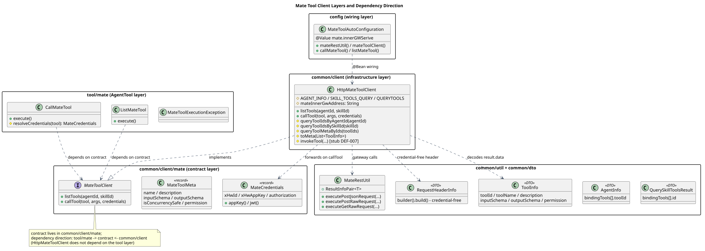
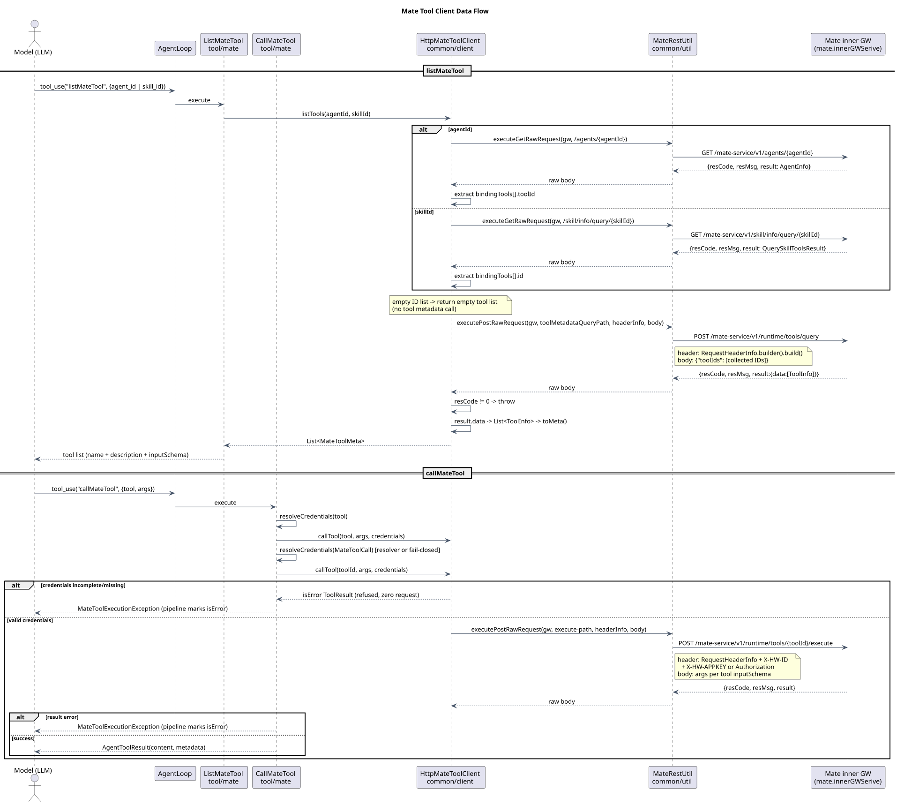

# Mate Tool Client 设计文档

> 模块:`coding-agent-cli`
> 文档版本:1.2.0
> 状态:Accepted(初版 #136 / 目录调整 #140 / 内网网关对接 #161 / 执行链路与凭据解析 #164)
> 日期:2026-08-17 初版,2026-08-22 更新(执行 RPC + toolId 契约统一 + 凭据解析)

---

## Context(为什么)

CampusClaw 需要调用 Mate 平台管理的工具。这批工具由 Mate 工具服务统一管理(工具元数据、执行),调用经内网网关(`mate.innerGWSerive`),listTools 查询无需凭据,callTool 需携带 agent 下发的凭据。

**约束**:AgentLoop / ToolExecutionPipeline / AgentTool 接口由 core 团队维护,本特性**不允许改动这三个组件**,采用纯增量方式接入。

## 源码基线

- 分析提交:`330c1e1e`(PR #164 分支 feat/mate-tool-invoke 当前头)
- `modules/coding-agent-cli/src/main/java/com/campusclaw/codingagent/common/client/HttpMateToolClient.java`:`listTools`、`queryToolIdsByAgentId`、`queryToolIdsBySkillId`、`queryToolMetaByIds`
- `modules/coding-agent-cli/src/main/java/com/campusclaw/codingagent/config/MateToolAutoConfiguration.java`:`mateToolClient`
- `modules/coding-agent-cli/src/main/resources/application.yml`:`mate.innerGWSerive`
- `mate-campusclaw/src/main/resources/application.properties`:`mate.innerGWSerive`

观察到的基线行为是三个出站接口路径以 Java 静态常量保存。目标设计将这些部署相关路径移入应用配置并以 `@Value` 注入；这是架构配置治理，不是分析基线的既有行为。稳定的入站 HTTP 契约路径仍由对应 API 常量维护，不纳入本次配置化。

## 关键定义

| 名称 | 类型 | 位置 |
|---|---|---|
| `ListMateTool` | AgentTool | `tool/mate/` — 传 agent_id/skill_id 列出绑定的工具;查询后硬性刷新会话缓存 |
| `CallMateTool` | AgentTool | `tool/mate/` — 入参为工具名,经会话缓存映射为工具标识后转发;凭据经 resolver 按调用解析 |
| `MateToolClient` | 接口 | `common/client/mate/` — `listTools(agentId, skillId)` / `callTool(tool, args, credentials)` |
| `MateToolMeta` | record | `common/client/mate/` — 工具元数据 |
| `MateCredentials` | record | `common/client/mate/` — 凭据(AppKey / JWT 两模式),仅 callTool 携带 |
| `HttpMateToolClient` | 实现 | `common/client/` — 两步元数据查询 + 工具执行 RPC 均为真实调用 |
| `MateRestUtil` | 工具类 | `common/util/` — 网关 REST 调用(executePostRawRequest / executeGetRawRequest),返回原始 body 由调用方解信封;`RequestHeaderInfo.toHeaders()` 将 15 字段映射为真实 HTTP header |
| `RequestHeaderInfo` | DTO | `common/dto/` — 请求头信息(内网网关无需凭据字段,`builder().build()` 即可) |
| `ToolInfo` | DTO | `common/dto/` — 元数据项,全字段对齐网关契约(id/type/version/createdAt/updatedAt/permission/enabled/is_concurrency_safe/name/display_name/description/source/input_schema/output_schema) |
| `MateToolSessionCache` | 缓存 | `tool/mate/` — 会话级工具名→标识映射;listMateTool 每次查询硬性全量刷新,实例随会话创建即天然隔离 |
| `AgentInfo` | DTO | `common/dto/` — agent 元数据,`bindingTools[].toolId` 是第一步的 tool ID 来源 |
| `QuerySkillToolsResult` / `SkillBindingTool` | DTO | `common/dto/` — skill 工具查询结果,`bindingTools[].id` 是第一步的 tool ID 来源 |
| `MateToolAutoConfiguration` | 配置 | `config/` — 通过 `@Value` 注入网关地址与三个出站接口路径并完成装配 |

## 架构与数据流

分层与依赖方向:



[PlantUML 源码](mate-tool-client/diagram.puml#L1)

调用时序:



[PlantUML 源码](mate-tool-client/diagram.puml#L123)

```
listMateTool({agent_id | skill_id})
  → ListMateTool.execute (无状态)
    → MateToolClient.listTools(agentId, skillId)
      → HttpMateToolClient 两步查询:
        [第一步:tool ID 来源]
        agentId: GET /mate-service/v1/agents/{agentId}
                  → result: AgentInfo → 摘 bindingTools[].toolId
        skillId: GET /mate-service/v1/skill/info/query/{skillId}
                  → result: QuerySkillToolsResult → 摘 bindingTools[].id
        (ID 列表为空 → 直接返回空工具列表,不发工具元数据查询)
        [第二步:工具元数据]
        POST {mate.innerGWSerive}{mate.endpoints.tool-metadata-query-path}
        header: RequestHeaderInfo.builder().build()      ← 无凭据
        body: {"toolIds": [第一步摘到的列表]}
        ← {"resCode":"0","resMsg":"...","result":{"data":[ToolInfo,...]}}
      → resCode != "0" 抛 IllegalStateException;result.data → List<ToolInfo]
      → toMeta() 转 MateToolMeta(toolId + toolName 双字段)
      → MateToolSessionCache.refresh(metas)   ← 硬性全量刷新该会话映射
  → 返回工具列表(toolName (id: toolId) + description + inputSchema)给模型

callMateTool({tool: toolName, args})
  → CallMateTool.execute
    → sessionCache.lookupToolId(toolName)  ← 未命中拒绝并提示先调 listMateTool
    → resolveCredentials(call)          ← MateCredentialResolver 按调用解析(未注册则 fail-closed)
    → MateToolClient.callTool(toolId, args, credentials)
      → invokeTool(...)                 ← POST {网关}/tools/{toolId}/execute (仍用 toolId 入 path)
    → result.isError() 抛 MateToolExecutionException(pipeline 转 isError=true)
```

## 设计决策

### D1. 两个工具均无状态

**决策**:工具与 client 不保存任何会话间状态;无 metaCache、无 updateMeta。

**理由**:MateToolClient 是进程级 Spring 单例(横跨所有会话/agent),实例字段会串会话数据。每次调用自包含,结果只返回给模型。

### D2. 权限(allow/ask/deny)不在客户端执行

**决策**:客户端不做 ask 审批、不做 deny 拦截;permission 字段仅透传展示,执行交给 Mate 服务端。

**理由**:审批 UI 与权限语义暂不引入(用户决策);服务端是权限的最终裁决点。`MateApprovalUI`、metaCache、本地参数校验随权限逻辑一并移除。

### D3. listTools 免凭据,callTool 透传凭据（[ADR-0021](../decisions/0021-mate-tool-credential-resolution.html)）

**决策**:`listTools(toolIds)` 不带凭据(RequestHeaderInfo 默认构造即可过网关);`callTool(tool, args, credentials)` 第三参数透传 agent 下发的 `MateCredentials`。

**理由**:内网网关的查询接口不校验凭据;工具执行需要身份。凭据来源由部署方注册的 `MateCredentialResolver` Bean 按调用解析(`MateToolCall` 只读快照,含 toolCallId/tool/args;每次调用重新解析,进程级单例上不缓存)。未注册 resolver 时 `resolveCredentials()` 返回 null,invokeTool 以 fail-closed 拒绝(零请求)——`MateCredentials.isComplete()` 校验 X-HW-ID 非空且 AppKey/JWT 恰其一非空白,`jwt()` 工厂拒绝空 token。

**边界**:HTTP 入口的凭据捕获与(如需异步执行时的)跨线程传播属于上层职责,不在本客户端范围内——本层只消费 resolver 给出的凭据。

### D4. 两步查询:先元数据摘 tool ID,再批量查询详情

**决策**:`listTools(agentId, skillId)` 先 GET agent/skill 元数据摘绑定工具 ID(agent 路径 `bindingTools[].toolId`,skill 路径 `bindingTools[].id`),再把 ID 列表 POST 给工具元数据批量查询接口;ID 列表为空直接返回空列表。

**理由**:授权关系(agent/skill → tool)由 Mate 元数据服务持有,客户端不自行推断;工具元数据接口只按 ID 批量查详情,职责单一。三个 protected 编排方法(`queryToolIdsByAgentId`/`queryToolIdsBySkillId`/`queryToolMetaByIds`)可内网覆写。

### D5. 查询与执行均为真实调用,执行端点路径配置化

**决策**:两步元数据查询与 `invokeTool` 执行 POST(`mate.endpoints.tool-execute-path-template`,默认 `/mate-service/v1/runtime/tools/%s/execute`)均为完整实现;toolId 过 `TOOL_ID_PATTERN` 校验后入 path,args 按工具 inputSchema 序列化为请求体,resCode!=0 转 isError 结果。

**理由**:网关契约已确认;路径经配置注入(与其它三个 endpoint 一致),内网可按环境覆盖。

### D6. 契约与工具分层(继承自 #140)

`tool/mate`(AgentTool 层)→ `common/client/mate`(契约)← `common/client`(HTTP 实现);`HttpMateToolClient` 不依赖工具层。

### D7. 网关地址初始化链路(环境变量注入)

**决策**:网关地址经三层链路注入,全部走标准 Spring 占位符:

```
部署机 /etc/profile                          (运维维护)
  export CAMPUSINNERGWSERVICE_DOMAIN_NAME_URL="http://<ip>:<port>"
        │
        ▼ source /etc/profile
mate-campusclaw/scripts/install_value.sh     (mate 侧独有,已登记 sync-exclude)
  export MATE_INNERGWSERIVE="$CAMPUSINNERGWSERVICE_DOMAIN_NAME_URL"
        │
        ▼ 进程环境变量
application.yml(外网仓) / application.properties(mate 侧)
  mate.innerGWSerive=${MATE_INNERGWSERIVE:}    ← 引用全大写环境变量,默认空
        │                                     (Spring 环境派生仅识别全大写)
        ▼
MateToolAutoConfiguration
  @Value("${mate.innerGWSerive:}") → HttpMateToolClient.mateInnerGwAddress
```

**理由**:
- 占位符引用**独立环境变量** `MATE_INNERGWSERIVE` 而非属性自身——早期写法 `${mate.innerGWSerive:}` 自引用在环境变量未设置时触发 `Circular placeholder reference`,开箱启动即失败(PR #144 评审阻断项,已由 `ApplicationYmlLoadTest` 走 config-data 加载路径防回潮)
- 环境变量必须**全大写**:Spring 的属性名→环境变量派生规则(去点、全大写)只识别 `MATE_INNERGWSERIVE`,混合大小写导出不生效(二审阻断项)
- mate-campusclaw 模块加载的是 `application.properties`(非 yml),占位符条目必须写在该文件——已补 `mate.innerGWSerive=${MATE_INNERGWSERIVE:}`(mate 侧手工文件,sync 不触碰)
- 值的来源遵循 mate 侧部署惯例(与 `GAUSSDB_URL` 等同体系):运维写 `/etc/profile`,脚本 source 后导出,应用只认环境变量
- 默认空串:未配置的环境仍可启动,仅在真正调用 Mate 工具时于网关侧报错(fail-late 但报错清晰,不阻断无关功能)

### D8. 出站接口路径配置化

**决策**:三个部署相关的 Mate 出站接口路径统一使用可读的 lowerCamelCase 实例字段，并由 `MateToolAutoConfiguration` 通过 `@Value` 注入。配置键采用 kebab-case：

| Java 字段 | 应用配置键 | 默认路径 |
|---|---|---|
| `agentInfoPathPrefix` | `mate.endpoints.agent-info-path-prefix` | `/mate-service/v1/agents/` |
| `skillToolsQueryPathPrefix` | `mate.endpoints.skill-tools-query-path-prefix` | `/mate-service/v1/skill/info/query/` |
| `toolMetadataQueryPath` | `mate.endpoints.tool-metadata-query-path` | `/mate-service/v1/runtime/tools/query` |
| `toolExecutePathTemplate` | `mate.endpoints.tool-execute-path-template` | `/mate-service/v1/runtime/tools/%s/execute` |

外网主模块在 `application.yml` 中维护默认值和环境变量占位符；`mate-campusclaw` 按其现有资源格式在 `application.properties` 中维护完全相同的配置键。Java 中不再保留 `AGENT_INFO`、`SKILL_TOOLS_QUERY`、`QUERYTOOLS` 这类静态路径常量。

**理由**:这些路径属于部署环境中的下游服务拓扑，不是 CampusClaw 对外发布的入站 HTTP 契约。配置化允许不同部署覆盖路径，同时避免含义不清的缩写或合词常量。入站契约常量仍保持集中定义，避免部署配置意外改变公开 API。

## 边界情况

| 场景 | 行为 |
|---|---|
| listMateTool 无 agent_id/skill_id | 返回 0 tool(s),不发网关请求 |
| agent/skill 元数据 bindingTools 为空 | 返回 0 tool(s),不发工具元数据查询 |
| 任一网关调用 resCode != "0" | 抛 IllegalStateException(含 resCode/resMsg) |
| 工具元数据批量查询返回空 data | 返回空工具列表 |
| callTool 网关异常 | 包装为 isError=true 的 ToolResult 返回,不中断 agent |
| Mate result.isError() | 抛 MateToolExecutionException,pipeline 转 ToolResultMessage.isError=true |
| `mate.tool.enabled=false` | 两个 AgentTool 均不注册 |
| 凭据缺失或残缺(空白/双模式) | invokeTool 拒绝执行,返回 isError 结果,零请求 |

## 性能(DFX)

- 无缓存无状态;listTools 为两次网关往返(元数据 GET + 工具元数据 POST),callTool 一次
- MateRestUtil:连接超时 10s、请求超时 60s,JDK HttpClient
- 无 AgentLoop 改动,对现有工具路径零开销

## 契约改动

LLM API tools 字段新增 listMateTool / callMateTool 两个工具定义。网关契约:元数据批量查询与工具执行均已对接(执行端点路径可配置)。

## 测试

| 测试类 | 数量 | 覆盖 |
|---|---|---|
| `CallMateToolTest` | 8 | 调用透传 / 未知工具错误传播 / 缺 tool 参数抛错 / resolver 凭据到达 client / 并发会话凭据隔离 / 顶层与嵌套 Map、嵌套 List 防篡改 |
| `ListMateToolTest` | 3 | agent_id 透传 / skill_id 透传 / 空参查空列表 |
| `MateToolAutoConfigurationTest` | 4 | 默认装配 / enabled=false 排除 / 网关地址与端点路径经属性到达 client / isError 经 pipeline 传播 |
| `MateToolPropertiesTest` | 1 | enabled 默认值 |
| `HttpMateToolClientTest` | 19 | MockWebServer 桩测试:两步查询 / 空 bindingTools 跳过详情查询 / 错误分支 / 标识校验 / header 发送 / 配置路径生效 / AppKey 与 JWT 双模式 header 断言 / 凭据残缺 7 形态零请求拒绝 / jwt 空 token 拒绝 / 恶意 toolId 拒绝 / **发现→执行契约(list 返回 toolId 直达执行路径)** |
| `ApplicationYmlLoadTest` | 3 | config-data 真加载 application.yml,占位符解析无循环引用,默认路径和外部覆盖(含执行端点模板)生效 |

共 25 个:工具层使用内存 `MockMateToolClient`;HTTP 层使用 MockWebServer 桩服务(不依赖 mock client,直测 `HttpMateToolClient` 两步查询)。

## 验证

- `./mvnw -pl modules/coding-agent-cli test -Dtest='HttpMateToolClientTest,CallMateToolTest,MateToolAutoConfigurationTest,ListMateToolTest,MateToolPropertiesTest,ApplicationYmlLoadTest' -Dsurefire.failIfNoSpecifiedTests=false` — **38 tests, 0 failures**
- `./mvnw clean test` — 全量 Reactor 通过，`coding-agent-cli` **1306 tests, 0 failures**
- `mvn clean test`(`mate-campusclaw`) — **2777 tests, 0 failures**
- 主模块 `checkstyle:check` 与 `spotless:check` → clean；mate 镜像全量测试内置 `checkstyle:check` → 0 violations
- mate 镜像独立 `spotless:check` 仍报告 120 个包名替换后的既有格式问题，首个报告文件不在本次差异中；本次不扩展修改范围
- `./scripts/sync-mate-campusclaw.sh` — mate-campusclaw 同步并编译通过
- `plantuml -tsvg docs/designs/mate-tool-client/diagram.puml docs/designs/agent-skill-runtime/diagram.puml` — 三个 SVG 已重新生成；PlantUML ASCII、SVG XML、Markdown 路径和源码锚点校验通过

## 版本历史

| 日期 | 版本 | 说明 |
|---|---|---|
| 2026-08-17 | 26.0.0(PR #136) | 初版:双工具 + 契约 + stub,含权限审批与 metaCache |
| 2026-08-17 | 26.0.0(PR #140) | 目录按域聚合 tool/mate;契约提取 common/client/mate |
| 2026-08-18 | 26.0.0(本 PR) | 工具元数据批量查询真实对接;MateRestUtil/RequestHeaderInfo/ToolInfo;无状态化;去 ask/deny 客户端执行;凭据仅 callTool 透传;MateToolProperties 改 lombok @Data |
| 2026-08-18 | 26.0.0(本 PR 续) | listTools 两步查询:agent/skill 元数据摘 tool ID → 工具元数据批量查询;新增 AgentInfo/QuerySkillToolsResult/SkillBindingTool DTO;MateRestUtil 加 GET 支持 |
| 2026-08-22 | 26.0.0(#164 续) | callMateTool 入参改工具名,会话级 name→id 缓存(listMateTool 硬性刷新);ToolInfo 全字段对齐网关契约;MateToolMeta 含 toolId+toolName |
| 2026-08-22 | 26.0.0(#164) | invokeTool 执行 RPC 实现(端点路径配置化);MateCredentialResolver 按调用解析凭据(MateToolCall 只读深拷贝快照);MateCredentials 完整性校验(isBlank/模式互斥/jwt 空 token 拒绝) |
| 2026-08-18 | 26.0.0(评审修复) | 占位符自引用改环境变量注入(D7 初始化链路);resolveCredentials 默认 null;MateRestUtil 删死代码、header 真发送;补 MockWebServer 桩测试与 yml 加载回归;DEF-007 收敛为仅剩 invokeTool |
| 2026-08-21 | 1.1.0(PR #161 评审修复) | 三个 Mate 工具出站接口路径移入应用配置并通过 `@Value` 注入;Java 字段统一为可读 lowerCamelCase;同步外网 yml、mate 侧 properties、测试与 PlantUML。 |
