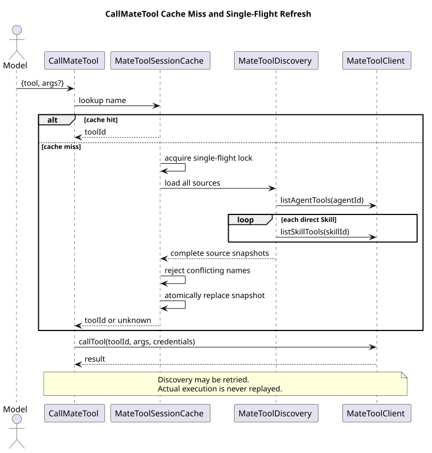

# Mate Tool Client 与 Session 发现设计

> 文档版本：2.3.0
>
> 状态：Implemented（§5 参数位置标注为 Proposal，待 CampusMate 对齐）
>
> 更新日期：2026-08-29
> 决策记录：[ADR-0024](../decisions/0024-mate-tool-execution-credential-chain.html)、
> [ADR-0022](../decisions/0022-managed-agent-tool-system-v2.html)、
> [ADR-0026](../decisions/0026-unify-campusmate-client-configuration.html)

## 1. 源码基线与分层

历史分析基线为 `d649866a6cae967ace18ceaeb9597edd47e5721e`；凭据链实现分析基线为
`934b5dd7d9e50b1d7359bea5f2dda71e3c4a34ac`。历史基线客户端已经具备 Agent/Skill
绑定 ID 查询、批量元数据查询和执行 RPC，但工具层仍暴露 ID/scope，并要求 Call 前先 List。
本次保留 HTTP 协议和按调用凭据解析，把模型契约改为直接按名称使用；这是产品约束和架构
改造。

| 层 | 当前类型 | 职责 |
|---|---|---|
| HTTP | `HttpMateToolClient` | 查询绑定 ID、批量元数据、恢复绑定顺序、执行 RPC |
| 契约 | `MateToolClient` | 三个方法都显式接收执行凭据快照 |
| Session | `MateToolsetFactory` / `MateToolSessionState` | 每 Session 创建工具和私有缓存 |
| 发现 | `MateToolDiscovery` / `MateToolSessionCache` | 来源快照、完整名称索引、single-flight |
| 模型工具 | `ListMateToolsTool` / `CallMateTool` | 稳定 JSON 列表和按名称调用 |

`MateToolClient` 是共享无状态客户端；`AgentTool` 和 `MateToolSessionCache` 从不作为 Spring
单例跨 Session 复用。

## 2. ListMateTools

`ListMateTools({skillName?})` 无参数查询当前 Agent，有参数时只接受当前 Agent 直接绑定 Skill
名称。每次调用实时访问 Mate，不读取列表缓存。返回 JSON 只包含：

```json
{
  "scope": {"type": "agent"},
  "tools": [{"name": "Query", "description": "...", "inputSchema": {}}]
}
```

响应不包含 Agent/Skill/tool ID、permission、outputSchema 或并发属性。成功列表会更新该来源
的名称到 ID 快照，但不清空其他来源。

## 3. CallMateTool



[PlantUML 源码](tool-system-v2/diagram.puml#L114)

`CallMateTool({tool,args?})` 先查当前 Session 的完整有效名称索引。miss 由
`MateToolSessionCache.resolveOrRefresh` single-flight 加载当前 Agent 和全部直接 Skill：

- 同名同 ID 合并；同名不同 ID 使整轮刷新失败；
- 所有来源成功后才原子替换完整快照；
- 并发调用共享同一轮刷新结果，包括失败；
- 刷新后仍无名称时返回 unknown；
- 实际 execute 最多发送一次，连接或业务失败均不重放。

`args` 缺省为 `{}`。模型不提交 scope、Skill 或 toolId；Mate 服务仍是最终授权和执行权威。

## 4. HTTP 契约与凭据链

Agent/Skill 查询先取得有序绑定 ID，再向元数据端点批量查询。客户端按 ID 关联结果并恢复
原绑定顺序；缺失、重复或未知 ID fail closed。查询端点允许空凭据，但只要当前执行携带
凭据，Agent 查询、Skill 查询和元数据批量查询都会透传同一份快照。

Runtime 只在 `POST /sessions/{sessionId}/events` 接受时从 `X-HW-ID`、`X-HW-APPKEY` 和
`Authorization` 创建不可变 `MateCredentials`。快照通过 `RuntimeEventService`、
`RuntimeSessionEngineRegistry`、`ManagedAgentSessionRequest` 和 `AgentSessionFactory` 显式传递，
不使用 ThreadLocal、请求作用域 Bean 或进程级 resolver。共享 `HttpMateToolClient` 不保存凭据。

`ListMateTools` 和 `CallMateTool` 属于同一个 Session 工具组，使用同一份快照。Child Session
继承父执行快照；Cron 没有入站请求，使用空快照，因此 List 仍可访问免认证发现端点，Call
在任何发现或执行 HTTP 请求之前 fail closed。凭据不写数据库、Agent 目录、Prompt、消息、
事件或日志；`MateCredentials.toString()` 只显示各字段是否存在。

Runtime 不验证凭据真实性，也不因 AppKey 与 JWT 同时存在而拒绝或选择其一。执行请求只做
最低完整性检查：`X-HW-ID` 非空且 AppKey/JWT 至少一种非空；最终认证与授权由 Mate 完成。
这一实现是 CampusClaw 的架构改造，pi 没有对应 Mate 工具或凭据链。

## 5. 工具参数位置标注（Proposal，待 CampusMate 对齐）

### 5.1 问题

`input_schema`/`output_schema` 目前是纯 JSON Schema（`{"type":"object","properties":{},"required":[]}`），
全链路没有任何一方声明"某个参数应进入后端 REST 调用的 path/query/body/header"：

- 模型侧：schema 无位置语义，模型只能靠参数名猜测（如 `userId` 是路径段还是 body 字段）；
- 执行侧：CampusMate execute 收到平铺 `{"arguments":{...}}`，若工具后端是 REST 形态
  （`GET /users/{userId}?verbose=true`），无法完成 URL 拼装与参数路由。

MCP 2026-07-28 规范同样没有 path/query/body 概念（`arguments` 平铺整体传递），唯一的位置类
先例是 `x-mcp-header`——但它语义固定为"MCP 传输层把参数镜像成 `Mcp-Param-*` 请求头"，
作用于 client→MCP server 一跳；若复用该关键字，工具将来直接暴露为 MCP server 时两层语义
会叠加。因此本提案使用规范未占用的 `x-mcp-in`，保持 `x-mcp-` 扩展家族命名。

### 5.2 约定

| 字段 | 取值 | 说明 |
|---|---|---|
| `x-mcp-in` | `path` \| `query` \| `header` | 参数位置；**缺省 = body**，不提供显式 body 取值 |
| `x-mcp-name` | 字符串 | 目标名：URL 模板占位符名 / query 参数名 / header 名；缺省 = 属性名 |

责任划分：**CampusClaw 全链路零改动**——发现、模型展示、execute 平铺均原样透传，不解析、
不校验该标注。校验在 Mate 工具注册期完成，拆分在 CampusMate 执行器完成。

校验约束（注册期，违规即拒绝注册）：

1. `x-mcp-in` 仅允许出现在 schema 根的一级 `properties`（静态可达）；嵌套属性不允许标注；
2. `path` 参数必须同时出现在 `required[]`（URL 段不可缺失）；
3. 仅 `query` 允许 array 类型（按重复键展开 `tag=a&tag=b`）；object/array 禁止标注 path/header；
4. `header` 仅允许 string/integer/boolean（对齐 MCP 对 number 的精度限制）；header 名符合
   RFC 9110 token 语法、不含 CR/LF、同一 schema 内大小写不敏感唯一；
5. query 参数名不含 `&`、`=`、`#` 及控制字符；
6. 敏感参数（token、PII）不得标注为 path/query/header——URL 与 header 对网络中间件可见；
7. `x-mcp-in` 出现未知取值视为工具定义无效。

### 5.3 场景示例

以下示例共用"校区用户管理"REST 后端。

**query**（数组展开、query 键改名），模板 `GET /campuses/{campusId}/users`：

```json
{
  "name": "ListCampusUsers",
  "inputSchema": {
    "type": "object",
    "properties": {
      "campusId": { "type": "string", "x-mcp-in": "path" },
      "status": { "type": "string", "enum": ["active", "frozen"], "x-mcp-in": "query" },
      "tags": { "type": "array", "items": { "type": "string" }, "x-mcp-in": "query", "x-mcp-name": "tag" },
      "limit": { "type": "integer", "minimum": 1, "maximum": 100, "x-mcp-in": "query" }
    },
    "required": ["campusId"]
  }
}
```

调用 `{"campusId":"c01","status":"active","tags":["新生","部长"],"limit":20}` 得到
`GET /campuses/c01/users?status=active&tag=新生&tag=部长&limit=20`。

**path**（位置参数必须 `required`），模板 `GET /campuses/{campusId}/users/{userId}`：

```json
{
  "name": "GetCampusUser",
  "inputSchema": {
    "type": "object",
    "properties": {
      "campusId": { "type": "string", "x-mcp-in": "path" },
      "userId": { "type": "string", "x-mcp-in": "path" }
    },
    "required": ["campusId", "userId"]
  }
}
```

**body**（缺省：无任何标注；嵌套对象内部不允许再标位置），模板 `POST /campuses/{campusId}/users`：

```json
{
  "name": "CreateCampusUser",
  "inputSchema": {
    "type": "object",
    "properties": {
      "campusId": { "type": "string", "x-mcp-in": "path" },
      "profile": {
        "type": "object",
        "properties": {
          "name": { "type": "string" },
          "email": { "type": "string" },
          "roles": { "type": "array", "items": { "type": "string" } }
        },
        "required": ["name", "email"]
      }
    },
    "required": ["campusId", "profile"]
  }
}
```

`profile` 整体作为请求体。

**header**（`x-mcp-name` 指定真实 header 名；幂等键场景），模板 `PUT /campuses/{campusId}/users/{userId}/freeze`：

```json
{
  "name": "FreezeCampusUser",
  "inputSchema": {
    "type": "object",
    "properties": {
      "campusId": { "type": "string", "x-mcp-in": "path" },
      "userId": { "type": "string", "x-mcp-in": "path" },
      "requestId": { "type": "string", "x-mcp-in": "header", "x-mcp-name": "Idempotency-Key" },
      "reason": { "type": "string" }
    },
    "required": ["campusId", "userId", "requestId"]
  }
}
```

完整往返（CampusMate 执行器视角）：

```text
模型 args: {"campusId":"c01","userId":"u42","requestId":"8f3c-9a","reason":"违规操作"}
  ↓ 拆分：path c01/u42 展开模板；header Idempotency-Key: 8f3c-9a；body {"reason":"违规操作"}
PUT /campuses/c01/users/u42/freeze
Idempotency-Key: 8f3c-9a
Content-Type: application/json

{"reason":"违规操作"}
```

### 5.4 兼容性与后续

- 对不感知标注的参与方无害：JSON Schema 未知关键字应被忽略，现有客户端行为不变；
- 若未来 MCP 将位置映射标准化，`x-mcp-in` 可平滑映射或由新关键字取代；
- 落地前置条件：CampusMate 确认执行器按本约定消费 `arguments`，并在工具注册期实现 §5.2 校验；
  确认后本节从 Proposal 转为契约，并在 `HttpMateToolClientTest` 增加"含标注 schema 原样透传"
  的锁定用例。

## 6. CampusMate 共享配置

自 2.2.0 起，Tool 不再使用顶层 `mate.innerGWSerive` 或私有的 `mate.endpoints`。
`HttpMateToolClient` 与 Model、受管 Runtime 共享 `campusmate.base-url`，并从
`campusmate.endpoints` 取得 Agent、Skill、Tool 元数据与 Tool execute operation。
其中 Skill query 与受管 Runtime 共用一个 `skill-info-path-template`，不再重复配置。

完整结构、源码基线、迁移规则和配置可视化见
[CampusMate 客户端共享配置设计](campusmate-shared-config.md)。本次只修改配置架构，Tool 的
HTTP method、path、请求响应和凭据链均保持不变。

## 7. 版本历史

| 版本 | 日期 | 说明 |
|---|---|---|
| 2.3.0 | 2026-08-29 | 新增 §5 工具参数位置标注提案（`x-mcp-in`/`x-mcp-name`，借鉴 MCP `x-mcp-header` 先例）；原 CampusMate 共享配置顺延为 §6 |
| 2.2.0 | 2026-08-26 | Tool 复用 CampusMate 单一 base URL、共享 Endpoint 目录与 Skill query operation；移除顶层 `mate.*` 配置。 |
| 2.1.0 | 2026-08-24 | 删除部署方 resolver 占位；实现 Runtime 执行级凭据快照、List/Call HTTP 透传、Child 继承和 Cron fail-closed |
| 2.0.0 | 2026-08-24 | PascalCase 双工具；按 Agent/Skill 方法拆分客户端；稳定 JSON；Session cache miss 自动完整发现且 execute 不重放 |
| 1.x | 2026-08-22 以前 | 历史 ID/scope List 与 Call-before-List 设计，已由 ADR-0022 取代 |
