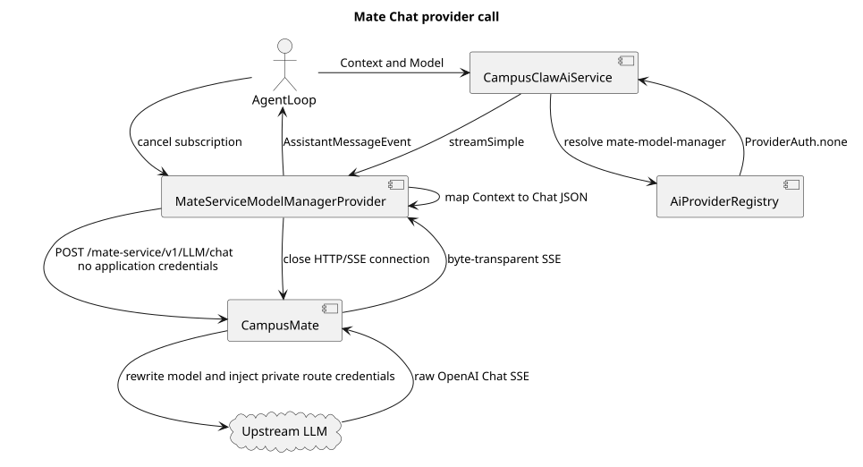
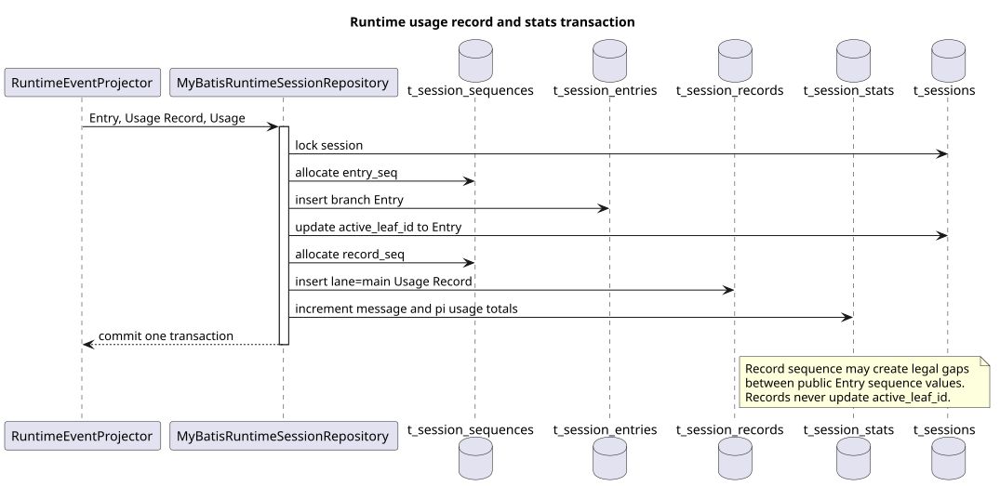

# Mate Chat 通用 Provider 2.0 实现设计

| 属性 | 值 |
|---|---|
| 文档版本 | 1.0.0 |
| 状态 | 已实现于 `codex/model-manager-chat-v2`，待评审合入 |
| 设计日期 | 2026-08-25 |
| 规范来源 | `/Users/z/设计/model-manager-provider-contract/README.md` 2.0.0 |
| pi-mono 基线 | `5cd93f688aaab89dbb6dfa4aca535f21796ae185` |
| 设计分析时 pi-mono-java 基线 | `d649866a6cae967ace18ceaeb9597edd47e5721e` |
| 实施前 pi-mono-java 主线 | `0d7a12e1dd89eed52f6e12db717fd5703b6b2125` |
| 实施前 mate-service 主线 | `6d5e6f3714e1cf8744d187a4796ca06300ad7e33` |

## 1. 结论与边界

CampusClaw 新增稳定身份为 `mate-model-manager` 的通用 Provider，调用
`POST /mate-service/v1/LLM/chat`。调用方只发送 Mate 模型 ID 与 OpenAI Chat 风格请求，
不发送 `agentId/sessionId/apiKey/baseUrl/providerId/upstreamModelId` 或身份头。CampusMate 负责
私有上游路由、模型替换、凭据注入和字节透明 SSE 转发。

本次只实现已经冻结的 Chat 调用协议。Model Manager 的模型目录、Agent 模型列表和模型解析
三个候选接口未冻结，因此没有在 CampusClaw 或 CampusMate 中虚构实现。



[PlantUML 源码：`model_manager_chat_call`](model-manager-chat-v2/diagram.puml#L1)

## 2. 源码证据与决策分类

### 2.1 pi-mono 观察行为

| 源码 | 观察行为 |
|---|---|
| `packages/ai/src/models.ts`：`Provider`、`createProvider` | Provider 使用稳定 `provider.id` 注册。 |
| `packages/ai/src/types.ts`：`ToolChoice`、`Usage` | `toolChoice` 支持 `auto/none`；Usage 始终存在。 |
| `packages/ai/src/api/openai-completions.ts`：`convertMessages`、`stream` | 转换四类 Chat 消息并解析文本、reasoning、ToolCall 和 usage chunk。 |
| `packages/coding-agent/src/core/compaction/compaction.ts`：`completeSummarization` | 摘要调用显式使用 `toolChoice=none`。 |
| `packages/agent/src/harness/session/types.ts`：`UsageRecord`、`SessionStats` | Usage 是不参与消息分支的独立运行记录。 |
| `packages/session-backends/sqlite-node/src/sqlite/repo.ts`：`appendRecord` | Usage Record 与累计 Stats 沿同一串行写路径提交。 |

### 2.2 实施前 Java 观察行为

实施前主线 `0d7a12e1` 已合入工具系统 2.0，但模型调用仍由
`ApiProviderRegistry` 按 `Api` 路由，且 Runtime 将生命周期 Usage 放入
`t_session_materialized.payload.lifetimeUsage`。这些是观察行为，不是目标设计。

关键路径和符号：

- `modules/ai/src/main/java/com/campusclaw/ai/provider/ApiProviderRegistry.java`；
- `modules/ai/src/main/java/com/campusclaw/ai/CampusClawAiService.java`：`stream/streamSimple`；
- `modules/coding-agent-cli/src/main/java/com/campusclaw/codingagent/runtimeapi/event/RuntimeEntryCodec.java`：
  `assistantEntry/assistantMessage`；
- `modules/coding-agent-cli/src/main/java/com/campusclaw/codingagent/runtimeapi/persistence/
  MyBatisRuntimeSessionRepository.java`：`appendEntry`；
- `modules/coding-agent-cli/src/main/resources/db/gaussdb/install/session_schema.sql`。

### 2.3 差异分类

| 分类 | 决策 | 原因 |
|---|---|---|
| 架构改造 | 新增 `AiProviderRegistry`，按 `ProviderId` 优先路由。 | 同一 `Api` 可由多个 Provider 实现，不能互相覆盖。 |
| 产品约束 | CampusClaw→CampusMate 模型调用固定 `ProviderAuth.none()`。 | 五个 Model Manager 接口处于内部网关信任边界。 |
| 安全加固 | CampusClaw 不持有或发送上游 endpoint、私有模型 ID和凭据。 | 上游秘密只存在于 CampusMate。 |
| 产品约束 | 首版只支持文本和 function tool。 | 图片、音频、文件及 Tool 图片结果在发起 HTTP 前明确失败。 |
| 架构改造 | Usage 从公开 Entry/Session 中拆为 Record + Stats。 | Usage 是运行事实，不应改变消息分支。 |
| pi 对齐差异 | openGauss 表使用 `t_` 前缀并用数据库事务提交。 | 对齐 pi 语义，同时遵守 Java 产品的数据库规范。 |

## 3. Provider 与 HTTP 实现

配置默认值如下，`api` 未注册时在启动阶段失败：

```yaml
campusmate:
  model-manager:
    base-url: ${CAMPUSMATE_MODEL_MANAGER_BASE_URL:https://localhost:8591}
    chat-path: ${CAMPUSMATE_MODEL_MANAGER_CHAT_PATH:/mate-service/v1/LLM/chat}
    api: ${CAMPUSMATE_MODEL_MANAGER_API:openai-completions}
```

独立 Runtime 的 `application.yml` 与内嵌 `mate-campusclaw/application.properties` 均声明这些配置，
保证两种装配方式接受相同的环境变量和默认值。

`MateChatRequestMapper` 始终产生数组 `messages`，并执行下列转换：

| AgentLoop 输入 | Mate Chat JSON |
|---|---|
| system prompt | 首个 `system` message |
| User 文本 | `user.content` |
| Assistant 文本 | `assistant.content` |
| Assistant ToolCall | `assistant.tool_calls[].function.arguments` JSON 字符串 |
| ToolResult | 带 `tool_call_id` 的 `tool` message |
| Thinking 签名 | 原 reasoning 字段和值 |
| Tool 定义 | `tools[].type=function` |
| `ToolChoice.NONE` | `tool_choice=none` |
| `maxTokens` | `max_output_tokens` |

请求固定 `stream=true` 和 `stream_options.include_usage=true`。Provider 不配置重试；创建请求
结果未知时不重放。调用取消由 Reactor subscription 关闭 HTTP/SSE 连接，并把最终结果收敛为
`StopReason.ABORTED`。

`MateChatSseParser` 解析 Chat chunk 的 `id/model/choices/usage/finish_reason`、文本、四个 reasoning
白名单字段和函数参数增量。`AssistantMessage.model` 保持请求的 Mate 模型 ID，原始 chunk 的
`model` 只进入内部 `responseModel`。上游未返回 usage 时保持 `Usage.empty()`。

CampusMate 的 `LlmChatController/LlmChatService` 严格校验字段，按 Mate 模型 ID 解析私有路由，
替换请求模型并注入受控凭据。成功响应体不解析、不重编码、不改写；流建立前错误使用真实
HTTP 状态与 `resCode/resMsg`，建立后的传输错误发送 `event:error` 后关闭流且不补 `[DONE]`。

## 4. Usage Record 与 Stats



[PlantUML 源码：`runtime_usage_persistence`](model-manager-chat-v2/diagram.puml#L33)

新增表：

- `t_session_records`：保存 `lane=main` 的内部 `usage` Record；payload 包含
  `cause/entryId/attempt/stopReason/usage`；
- `t_session_stats`：保存 `message_count/cached_tokens/uncached_tokens/total_tokens/cost_total`。

Assistant 或 Compaction 完成时，`appendEntryWithUsage` 在同一事务中完成：锁 Session、分配
Entry 序号、写 Entry 并更新 `active_leaf_id`、分配 Record 序号、写 Usage Record、更新 Stats。
Record 不参与父子分支，也不更新 `active_leaf_id`。Entry 与 Record 共用
`t_session_sequences.next_seq`，所以公开 Entry 序号出现间隔是合法行为。

累计规则严格对齐 pi：

```text
cached_tokens   += usage.cacheRead
uncached_tokens += usage.input + usage.cacheWrite
total_tokens    += usage.totalTokens
cost_total      += usage.cost.total
```

上游不报告 usage 时仍写全零 Usage Record，不增加 `reported` 字段。
`t_session_materialized` 不再保存 `lifetimeUsage`，公开 Session VO、历史 Entry 和 SSE 也不暴露
内部 Usage Record。

## 5. 与工具系统 2.0 的协同

工具发现、凭据链和实际工具执行继续使用已合入主线的工具系统。模型 Provider 只发送 AgentLoop
已经发布的 JSON Schema，并把模型返回的 ToolCall 交回现有 AgentLoop；不复制工具目录、
`MateCredentials` 或工具调用客户端。摘要调用通过 `ToolChoice.NONE` 禁止模型选择工具。

这两个改动的共享边界只有 `Context.tools`、`AssistantMessage.ToolCall` 和
`ToolResultMessage`，因此本实现不修改工具名称→工具 ID、凭据刷新或工具 HTTP 契约。

## 6. 验证要求

- Provider：文本、多轮 ToolCall、reasoning 重放、`tool_choice=none`、usage 有/无、图片预检失败；
- SSE：response ID、response model、finish reason、断流错误、调用方取消和缺少 `[DONE]`；
- Mate：未知字段、固定流参数、未知/停用模型、模型替换、私有凭据、限流和不重试；
- SQL：Entry/Record 共享序号、Record 不改分支、Stats pi 累计规则、删除清理完整；
- 工程：Java 方法不超过 50 行、Checkstyle、Spotless、单元测试、镜像同步与 `git diff --check`。

真实 openGauss 集成测试仍需显式提供 `gaussdb.it.url/username/password`；未提供时只能声明未执行，
不能宣称通过。

## 7. 版本历史

| 版本 | 日期 | 变化 |
|---|---|---|
| 1.0.0 | 2026-08-25 | 实现 Mate Chat Provider、透明代理、断流取消、reasoning 重放和 pi 风格 Usage SQL。 |
