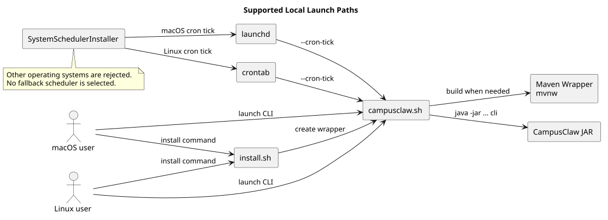

# CampusClaw 启动平台支持设计

> 文档版本：1.0.1
>
> 源码分析基线：`1f801dbb82bdda30478e3354e685e3153b179a0c`
>
> 评审修正基线：`d7c218478faf3577044352b2720f5e8d35a2d745`
>
> 状态：目标设计，随本次变更落地

## 1. Context

基线同时维护 macOS/Linux Shell 与 Windows Batch 两套本地启动、安装和构建入口：

- `campusclaw.sh` 与 `install.sh` 服务 macOS/Linux；
- `campusclaw.bat`、`install.bat` 与 `mvnw.cmd` 服务 Windows；
- `SystemSchedulerInstaller` 同时实现 macOS launchd、Linux crontab 和 Windows Task Scheduler；
- `README.md`、`CLAUDE.md` 与 Windows 网络排障文档把 Windows 描述为受支持平台。

该双平台策略要求持续维护不同的 Shell、路径、证书库和系统调度器语义。本次产品约束将本地启动与安装支持范围收敛为 macOS/Linux，不再提供或维护 Windows 启动路径。

## 2. 关键定义

- **支持平台**：项目承诺提供启动、安装入口并在变更时验证的平台。
- **启动入口**：`campusclaw.sh`、直接执行 JAR，以及由系统调度器调用 `--cron-tick` 的路径。
- **安装入口**：创建全局 `campusclaw` 命令的仓库脚本。
- **best-effort 构建**：允许使用通用构建工具已有的兼容路径，但项目不承诺适配、测试或修复对应平台问题。
- **历史兼容逻辑**：安全校验或通用进程健壮性代码中保留的跨平台防御，不代表产品继续支持对应平台。

## 3. 源码证据

| 类型 | 基线源码路径与符号 | 已观察行为 |
|---|---|---|
| Shell 启动 | `campusclaw.sh`，`detect_jdk21`、主启动流程 | 自动检测 JDK 21、按源码时间戳构建并启动 CLI |
| Shell 安装 | `install.sh`，`detect_jdk21`、`add_to_path` | 创建 macOS/Linux 全局包装命令并写入 Shell PATH |
| Windows 启动 | `campusclaw.bat`，`:build`、`:check_needs_build` | 通过 Batch/PowerShell 构建并启动 CLI |
| Windows 安装 | `install.bat` | 创建 `campusclaw.cmd` 并修改用户 PATH |
| Maven 包装 | `mvnw`、`mvnw.cmd` | 分别提供 Shell 和 Windows 命令行构建入口 |
| 外部定时触发 | `modules/coding-agent-cli/src/main/java/com/campusclaw/codingagent/cron/SystemSchedulerInstaller.java`，`install`、`uninstall`、`status`、`detectLauncherScript` | 基线按操作系统分派 launchd、crontab 或 Task Scheduler，并寻找对应启动脚本 |

上述行为是基线观察结果；下文为目标设计，不能解释为基线已经具备的行为。

PR 评审基线中，`install.sh` 自身已校验平台，但它生成的全局包装脚本复制了构建与启动流程，没有再次校验平台；`mvnw` 则继续保留上游 Cygwin/MinGW 构建兼容逻辑。前者会绕过受支持启动边界，需要修正；后者属于明确允许的 best-effort 构建能力，不作为 Windows 支持承诺。

## 4. 目标架构与启动流

[PlantUML 源码](platform-support/diagram.puml#L1)

目标状态只有一套仓库维护的 Shell 工具链：

1. `campusclaw.sh` 和 `install.sh` 先读取 `uname -s`，仅接受 `Darwin` 或 `Linux`；
2. `install.sh` 生成的全局命令只委托给 `campusclaw.sh`，不复制或绕过启动校验；
3. 构建统一使用 `./mvnw`，不再分发 `mvnw.cmd`；POSIX Wrapper 可保留上游 Cygwin/MinGW 兼容逻辑，供 Windows 用户 best-effort 构建；
4. `campusclaw.sh` 自动构建并以 `cli` 子命令启动 JAR；
5. 外部定时触发仅允许 macOS launchd 或 Linux crontab，其他系统明确抛出不支持异常；
6. `detectLauncherScript` 只解析 `campusclaw.sh`。

## 5. 设计决策

- [ADR-0016：仅维护 macOS/Linux 启动方式](../decisions/0016-macos-linux-launch-support.html)。
- 删除 Windows Batch、PowerShell、`mvnw.cmd` 和 Task Scheduler 启动、安装入口，不提供弃用期或兼容转发。
- 在正式启动、安装脚本与 Java 调度入口同时校验平台，避免通过 Git Bash 绕过启动与安装边界。
- 不在 `mvnw` 中主动拒绝 Cygwin/MinGW；Windows 构建可以 best-effort 使用，但不进入支持矩阵或持续验证范围。
- 该差异分类为**产品约束**：支持平台收敛，而非数据库、安全模型或 HTTP 架构变化。
- ZIP 路径校验、进程树终止顺序等安全或通用健壮性逻辑不因平台收敛而删除；它们不构成 Windows 支持承诺。

## 6. 边界情况

- `uname` 不可用或返回非 `Darwin`/`Linux` 时，Shell 启动和安装立即失败，不进入 JDK 检测或构建。
- 全局 `campusclaw` 命令委托给仓库内 `campusclaw.sh`，因此与直接执行脚本使用同一平台校验；旧版本已生成的包装脚本需要重新安装后才能更新。
- Windows Git Bash 用户可以自行尝试 `./mvnw` 构建；构建成功与否不改变 Windows 启动、安装不受支持的边界。
- JVM `os.name` 既非 macOS 也非 Linux 时，定时任务安装、卸载和状态查询明确失败，不再误落入 Linux crontab 分支。
- 直接执行 `java -jar` 属于 JVM 通用能力，但仓库只对 macOS/Linux 环境下的运行、文档和问题修复负责。
- 删除 Windows 文档不会自动清理由旧版本创建的全局命令或 Task Scheduler 任务；用户需要在旧环境自行处理。

## 7. DFX

- **可维护性**：启动、安装和定时触发仅保留 POSIX Shell、launchd 与 crontab 三种受维护边界。
- **可靠性**：不支持平台在启动、安装入口处快速失败，避免执行到中途才因命令或路径不兼容报错。
- **安全性**：无权限模型变化；保留跨平台归档路径校验等与输入安全相关的防御。
- **性能**：只增加一次 `uname` 检查，对启动耗时无实质影响。
- **可观测性**：脚本错误和 Java 异常都包含仅支持 macOS/Linux 的明确提示。

## 8. 契约改动

- 删除 `campusclaw.bat`、`install.bat` 和 `mvnw.cmd` 文件契约。
- 删除 Windows 安装、启动和网络排障文档契约；不禁止通过 `mvnw` 进行 best-effort 构建。
- `SystemSchedulerInstaller` 的受支持平台从三种收敛为 macOS/Linux；其他平台改为 `UnsupportedOperationException`。
- HTTP API、CLI 参数、配置 JSON、数据库表和持久化格式均无变化。

## 9. 测试与验证

- `bash -n campusclaw.sh install.sh` 校验 Shell 语法；
- 单元测试验证 `SystemSchedulerInstaller` 拒绝不支持的操作系统；
- Maven Spotless、Checkstyle 和相关模块测试验证 Java 变更；
- `scripts/sync-mate-campusclaw.sh` 同步并编译镜像；
- PlantUML 生成、SVG XML、Markdown 链接、ASCII 和 Mermaid 扫描验证设计产物；
- `git diff --check` 验证补丁格式。

## 10. 版本历史

| 版本 | 日期 | 说明 |
|---|---|---|
| 1.0.1 | 2026-08-20 | 全局启动器委托给受校验脚本，并明确 Windows best-effort 构建不属于平台支持承诺 |
| 1.0.0 | 2026-08-20 | 将本地启动、安装、构建和外部定时触发平台收敛为 macOS/Linux |
