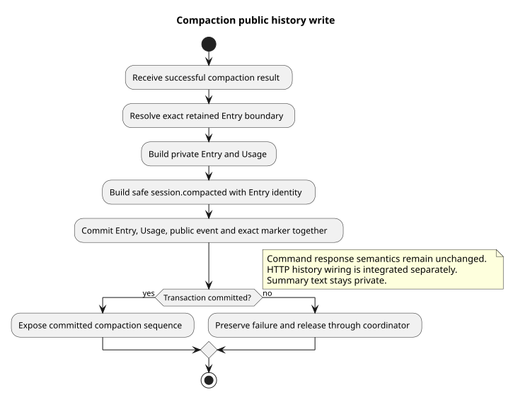

# 压缩完成与公共历史原子写入

> 版本：1.0.0 · 日期：2026-09-08 · 状态：已修复公共事件写入

## Context 与源码依据

真实 HTTP 回归发现，压缩成功后只保存了内部 Entry 与 Usage，没有对应的公共事件和完整性标记，
随后 Events v2 历史查询返回 `EVENT_LIST_FAILED`。本片让压缩完成的全部记录在同一事务提交。

变更前 Java 为 `2bdcdcb2`，主线独立修复为 `43980f51`，测试调用方补齐为 `4a53c6d5`；
最初在完整 Events 集成中修复的提交是 `74cf644d`。规范来自设计仓 `2ee2a3211da68ad87b0d9cab353e691b00bdaebd`
的 `01-总体架构/01-CampusClaw多Agent运行时/chat-events-v2-design.md`。

| 实现仓相对路径与符号 | 观察、决定与理由 |
|---|---|
| `modules/coding-agent-cli/src/main/java/com/campusclaw/codingagent/runtimeapi/event/RuntimeEventProjector.java#projectCompaction` | 原三参数 append 只持久化 Entry/Usage；现在先构造 session.compacted，再调用接收公共事件列表的组合重载。 |
| `modules/coding-agent-cli/src/main/java/com/campusclaw/codingagent/runtimeapi/event/RuntimeEventProjectorFactory.java` | 通过唯一构造器注入共享 RuntimeCommittedEventFactory，再传给转换器，避免另起一套公开字段规则。 |
| `modules/coding-agent-cli/src/main/java/com/campusclaw/codingagent/runtimeapi/persistence/MyBatisRuntimeSessionRepository.java#appendEntryWithUsage` | 既有组合事务同时保存 Entry、Record、Usage 累计、公共事件、精确 marker 和序号；任一步失败回滚。 |
| `modules/coding-agent-cli/src/test/java/com/campusclaw/codingagent/runtimeapi/persistence/RuntimeCompactionServiceOpenGaussIT.java#assertCommittedCompactionEvent` | 真实数据库核对事件 ID/锚点、manual 原因、统计和 marker=1，并验证不含 summary/sourceEventId。 |

pi 基线 `4af9d21d3b4d664e4a29fcabfec85171077248e3` 的 `packages/agent/src/agent-loop.ts#runLoop`
提供模型和工具通知，不提供本项目的数据库公共历史。组合事务属于 Java 架构变化；不公开压缩摘要是安全约束。
精确保留边界和重试候选身份沿用当前压缩算法，本片没有更改 Command 准入或压缩策略。

## 流程与边界

[PlantUML 源码](diagram.puml#L1)

公共 eventId 和 anchorEntryId 都使用压缩 Entry ID，只公开 reason、tokensBefore 和 estimatedTokensAfter。
手动 Command 压缩没有根用户消息，省略 sourceEventId；内部摘要、保留边界和重试身份仍用于模型恢复。
普通 Events 执行中的自动压缩由 RuntimeV2EventProjector 单独承载，带该执行的根事件 ID。
本片保持原有 Command 响应，历史只能在事务成功后看到完整记录；没有降低查询完整性检查。

## 验证、性能与决定

子 agent 在独立主线分支运行 46 项单元测试，以及 Skill 8 项和 Compact 9 项真实数据库测试，全部通过。
root 在独立全新数据库再次运行 Skill 8 项、Compact 9 项，共 17 项通过，零失败、零跳过。
完整 Events 集成上，5 类既有 Command/Skill HTTP 场景 20 项通过，其中 Compact 3 项验证新服务进程中的完整流程。
方法长度、Spotless、Checkstyle 与生成镜像检查通过；没有新增 Maven 依赖、线程、表或升级流程。
公司 NativeParent 26.0.0-SNAPSHOT 在本机不可解析，企业 Maven 编译未验证。

每次成功压缩增加一条公共事件和一条 marker，复用既有事务和 Session 锁；代价是少量写入，避免第二个事务失败
留下缺口。图中的公共历史读取是后续统一 Events HTTP 接线的消费者，不表示本片单独切换了 Controller。

[ADR-0095](../../decisions/0095-persist-compaction-public-history.html)

| 版本 | 日期 | 说明 |
|---|---|---|
| 1.0.0 | 2026-09-08 | 修复压缩完成缺公共事件和精确标记，保留原压缩业务行为。 |
