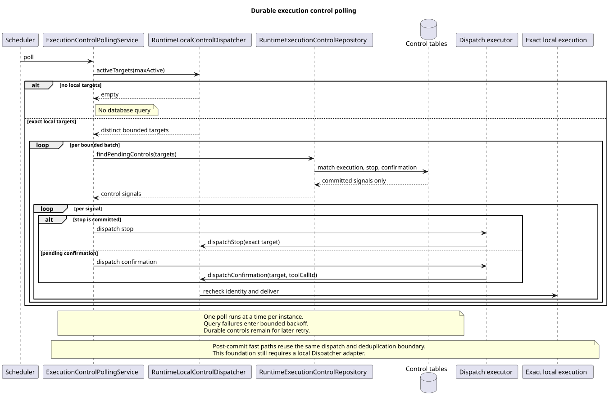

# 跨实例执行控制轮询基础

| 属性 | 值 |
|---|---|
| 版本 | 0.1.0 |
| 日期 | 2026-09-08 |
| 设计契约 | `pi-mono-java-design@2ee2a3211da68ad87b0d9cab353e691b00bdaebd`，Events v2 M5、M7、B08、B09、B11 |
| 变更前 Java | 确认、段追加与终态恢复集成基线 `043fad7cc1e63b419b7099d22b1db14500a2182f` |
| 本片实现 | `fccf1c2f`，来源净差 `bfc90fc4` |
| pi 基线 | `4af9d21d3b4d664e4a29fcabfec85171077248e3` |
| 范围 | 精确目标批量查询、每实例定时检查、停止优先、本地异步分发端口和提交后快路径 |

## Context

Events v2 允许消息执行与后续中断或工具确认由不同服务实例接收。执行对象和取消信号只存在于原
实例，共享数据库已经保存固定 `sessionId/executionId/rootEventId/segmentId`、停止请求和确认决定。
本片增加执行实例发现这些已提交控制信号所需的基础能力，同时保持数据库记录为权威来源。

本片没有实现 `RuntimeLocalControlDispatcher` 的执行对象适配器，也没有把 Events v2 Controller、
等待响应或结果补读接到轮询服务。Spring 容器未提供 Dispatcher 时，服务直接返回且不访问数据库。

## 源码证据与设计理由

| 分类 | 仓库相对路径与符号 | 观察、决定和理由 |
|---|---|---|
| 变更前 Java | `modules/coding-agent-cli/src/main/java/com/campusclaw/codingagent/runtimeapi/runtime/RuntimeSessionEngineRegistry.java#find` | 活动执行对象只保存在当前 JVM，另一个实例不能直接取消它 |
| 已有持久化 | `modules/coding-agent-cli/src/main/java/com/campusclaw/codingagent/runtimeapi/persistence/RuntimeExecutionControlRepository.java` | 固定执行、结果段、停止请求和一次确认决定已经由事务持久化 |
| 本片查询 | `modules/coding-agent-cli/src/main/resources/mapper/session/RuntimeExecutionControlMapper.xml#findPendingControls` | 查询仅接收本机活动目标；按 Session、执行和根事件匹配非终态执行，并把确认前段与当前续跑段精确关联 |
| 本片仓储 | `modules/coding-agent-cli/src/main/java/com/campusclaw/codingagent/runtimeapi/persistence/MyBatisRuntimeExecutionControlRepository.java#findPendingControls` | 输入先去重并校验，空集合不执行 SQL；只读事务设置可配置超时 |
| 本片调度 | `modules/coding-agent-cli/src/main/java/com/campusclaw/codingagent/runtimeapi/runtime/ExecutionControlPollingService.java#poll` | 每实例只允许一轮检查；数据库失败进入退避，已提交记录不删除 |
| 本片分发 | `modules/coding-agent-cli/src/main/java/com/campusclaw/codingagent/runtimeapi/runtime/RuntimeLocalControlDispatcher.java` | 适配器必须列出本机固定目标，并在取消或确认前重新核对完整身份和 Tool Call ID |
| pi 观察 | `packages/agent/src/agent-loop.ts#runAgentLoop/prepareToolCall` | pi 接收调用方的进程内 `AbortSignal`，工具准备前复查取消；没有共享数据库或跨实例路由 |

批量轮询属于 CampusClaw 多实例架构变化。它沿用 pi 的取消边界，但不把 pi 的进程内信号描述为
分布式能力。数据库查询不读取公共事件正文、凭据或工具参数，返回的 DTO 只有固定执行身份、停止标志
和待消费 Tool Call ID。

## 架构与流程

[PlantUML 源码](diagram.puml#L1)

`ExecutionControlPollingService` 先向本地 Dispatcher 请求最多 `maxActive` 个活动目标，过滤空值、
去重并保持稳定顺序。没有活动目标时不查数据库；有目标时按 `controlPollBatchSize` 分批调用
`findPendingControls`。SQL 使用输入目标组成的 CTE，只查对应非终态执行，不扫描全部控制记录。

每条结果可能同时含停止标志和待确认 Tool Call。服务固定先分发停止，使已提交中断阻止确认继续。
成功交付的信号按完整目标在本机去重，目标离开活动集合后清理；本地未命中或分发异常会移除去重标记，
后续轮询仍可重试。分发在独立虚拟线程中执行，数据库检查不等待模型、工具或取消过程结束。

停止或确认受理事务成功后，调用方可使用 `dispatchCommittedStop` 或
`dispatchCommittedConfirmation` 尝试同实例快路径。快路径与定时检查共享去重集合；失败不会撤销已提交
控制事件，数据库轮询继续兜底。事务提交结果不确定时，调用方不得触发快路径。

## 配置与故障边界

| 配置 | 当前默认值 | 作用 |
|---|---:|---|
| `controlPollIntervalMs` | 500 ms | 每实例定时检查间隔 |
| `controlPollBatchSize` | 100 | 单次 SQL 的最大目标数 |
| `controlQueryTimeoutSeconds` | 2 s | 控制查询只读事务超时 |
| `controlPollFailureBackoff` | 2 s | 一轮数据库失败后的最短重试等待 |
| `maxActive` | 100 | 从本地 Dispatcher 获取的目标上限 |

这些数值是可覆盖的实施默认值，不构成中断发现延迟、数据库吞吐或生产容量承诺。配置通过标准
Bean Validation 保证正数；定时任务使用原子标志避免同一实例内重叠积压。虚拟线程不增加连接池容量。

- 数据库失败只记录一次轮询故障并退避；没有权威终态时不能合成已停止结果。
- 本地分发失败保留数据库记录并允许后续重试；轮询不删除停止请求或确认决定。
- 停止与确认的业务竞争仍由接受事务和执行状态决定；本片只交付已提交结果。
- 本片不持久化执行凭据、不新增 Redis、实例间 HTTP 转发或 Maven 依赖。

## 验证

- `ExecutionControlPollingServiceTest` 7 项通过，覆盖空目标零查询、输入去重、停止优先、成功去重、
  本地未命中重试、数据库失败退避、提交后快路径和有界批次。
- `RuntimeSessionRepositoryOpenGaussIT` 44 项在 openGauss 7.0.0-RC3 通过且零跳过。新增回归覆盖
  确认决定的原段关联、后续停止优先，以及 100 个精确目标的单批查询。
- root 在独立隔离数据库复验 Repository 44 项与轮询 7 项，共 51 项通过，零跳过；未使用开发 agent 的数据库。
- Reactor `spotless:apply`、`checkstyle:check`、`test-compile` 已通过；企业镜像和最终差异检查见交付记录。

企业镜像生成同步；本机无法解析 NativeParent 26.0.0-SNAPSHOT，企业 Maven 编译未验证。

数据库回归证明当前 SQL 与事务映射可运行，不代表生产拓扑、延迟或连接池容量已经压测。

## 设计决策

见 [ADR-0084](../../decisions/0084-poll-durable-execution-controls.html)。固定执行和确认事务见
[ADR-0075](../../decisions/0075-persist-runtime-execution-control.html)。

## 版本历史

| 版本 | 日期 | 变更 |
|---|---|---|
| 0.1.0 | 2026-09-08 | 增加精确目标批量查询、每实例轮询、停止优先和提交后本地快路径基础 |
