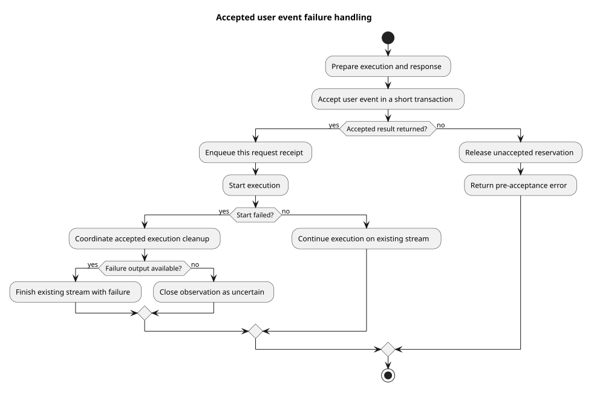

# 用户事件接受后的失败处理

| 属性 | 值 |
|---|---|
| 版本 | 0.1.0 |
| 日期 | 2026-09-08 |
| 设计契约 | `pi-mono-java-design@2ee2a3211da68ad87b0d9cab353e691b00bdaebd` |
| 变更前实现 | `5e392e7ce28a4a4a66a5e4d752e9ce5ce1ebc657` |
| 生命周期代码提交 | `77af6f5c058fc0c4e8dcc61fa068ada5c47cfbad`；追加服务入口异常回归随本片交付 |
| 范围 | Events v2 实施的接纳生命周期修复；本片不代表完整 v2 接口上线 |

## Context

用户消息已经在数据库保存并将 Session 改为 running 后，调用方不能再收到表示“未接受”的错误。
设计仓 `01-总体架构/01-CampusClaw多Agent运行时/chat-events-v2-stream-design.md` 第 5 节和
`接口契约-v2/操作/01-submit-session-event.json` 已确认这一语义。
本片先修复现有执行入口的责任边界，为后续统一完整事件、数据库终态和三输入 SSE 提供基础。

## 关键定义与源码证据

Java 路径均相对 `modules/coding-agent-cli/src/main/java/com/campusclaw/codingagent/`。

| 分类 | 路径与符号 | 观察与理由 |
|---|---|---|
| 变更前行为 | `runtimeapi/persistence/MyBatisRuntimeSessionRepository.java#acceptUserEvent` | Session 行锁内追加消息并改为 running，事务返回后消息已经接受 |
| 变更前缺陷 | `runtimeapi/event/RuntimeEventService.java#prepareAndSubmitLocked` | 同一个 catch 同时覆盖接受前和接受后；后者仍释放为未接受执行并向外抛出接收失败 |
| 变更前缺陷 | `runtimeapi/event/RuntimeEventService.java#emitConfigurationEntries` | 配置输出早于消息回执，快速失败时调用方可能看不到本次已接受消息 |
| 变更前行为 | `runtimeapi/event/RuntimeExecutionCoordinator.java#start` | 创建事件投影器发生在既有启动保护之外；创建失败可逃回接收错误路径 |
| 已确认目标 | 同上设计契约第 5 节 | 接受前失败可返回普通错误；接受后使用已建立的流，可靠终态不可得时断流并历史对账 |

pi 基线 `5cd93f688aaab89dbb6dfa4aca535f21796ae185` 的
`packages/agent/src/agent-loop.ts#runAgentLoop/runLoop` 在同一执行内先通知用户消息，后处理模型与工具，
并以 agent_end 结束内核循环。pi 不提供本项目数据库接纳事务或 HTTP 失败契约；这里的分界属于
CampusClaw 已确认的架构约束，不能把其实现归因于 pi 已有 HTTP 行为。

## 架构与数据流

接受事务返回前后的异常进入不同处理路径。执行协调器负责已接受执行的收尾，
HTTP 接受服务保留已经建立的响应流，避免把后续失败翻译成新的接收失败。

[PlantUML 源码](diagram.puml#L1)

## 设计决策

见 [ADR-0073](../../decisions/0073-reconcile-accepted-event-failure.html)。
先在本次响应排入消息回执，再处理执行输出；不跨数据库事务等待客户端写出。
接受前失败释放预留对象；接受后启动失败交给执行协调器，并防止收尾异常再次向外变成接收失败。
失败处理不得自动重新提交消息或重新启动有副作用的工具。

## 边界情况与性能

覆盖投影器创建、回执转换、模型启动和失败收尾的异常。客户端断线仍只结束观察，
不会凭断线取消或重放已经接受的执行。本片没有新增线程、轮询、表或 Maven 依赖。
后续 v2 持久化终态必须与执行身份和 idle 状态原子提交；当前旧终态输出不能当成该目标已完成。
提交结果不确定的识别仍须由后续数据库接纳协调实现，本片不把数据库异常视为已经证实回滚。

## 契约与交付边界

本片沿用当前请求、事件字段和旧 SSE 格式；客户端可观察到消息回执先于配置通知，
已接受后的启动失败留在流式响应中。完整 v2 的 event 联合请求、data-only 帧、固定 eventId、
跨实例控制、普通整数分页和旧事件公共投影由后续实施片完成。
前端当前 `frontend/src/composables/useRuntimeApi.ts` 和 `runtimeEventProjector.ts` 仍消费旧协议，
完整 v2 切换需要对应调用方对齐；本任务负责后端，不把本片描述成前端迁移完成。

## 测试与验证

聚焦验证回执顺序、接受前资源回收、接受后启动失败、失败收尾再次异常，以及既有执行输出与资源完成行为。
2026-09-08 本地 JDK 21 验证结果：

- `./mvnw -q -pl modules/coding-agent-cli -am spotless:apply checkstyle:check test
  -Dtest=RuntimeEventServiceTest,RuntimeEventOutputTest,RuntimeSessionControlServiceTest,RuntimeEventRoutesTest
  -Dsurefire.failIfNoSpecifiedTests=false`：30 项测试，0 失败、0 错误、0 跳过。
- AST 版权和方法长度检查未发现问题；两个私有 record 的布局由人工补查，未将脚本的待人工项表述为自动通过。
- 测试质量检查使用本机既有缓存脚本，0 错误、6 个既有测试命名提示；约定的原技能脚本链接目标缺失。
- `./scripts/sync-campusclaw.sh` 因无法解析 `com.huawei.hicampus:NativeParent:26.0.0-SNAPSHOT` 停止；
  已按普通本地环境流程显式运行 `--no-verify` 生成镜像，企业依赖下的编译未验证。
- PlantUML 生成成功；ASCII、SVG XML、Markdown 路径与源码行锚点已核验。

另在变更前基线上手动安装 Session DDL，真实 openGauss 7.0.0-RC3 的
`RuntimeSessionRepositoryOpenGaussIT` 27 项通过。这证明既有测试环境与事务基线可用，
不证明后续 v2 跨实例控制和新事件表已经通过验证。

## 版本历史

| 版本 | 日期 | 变更 |
|---|---|---|
| 0.1.0 | 2026-09-08 | 记录接受事务边界与已接受执行的失败处理，明确本片和完整 v2 的范围 |
