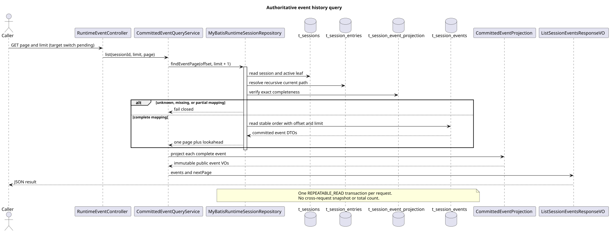
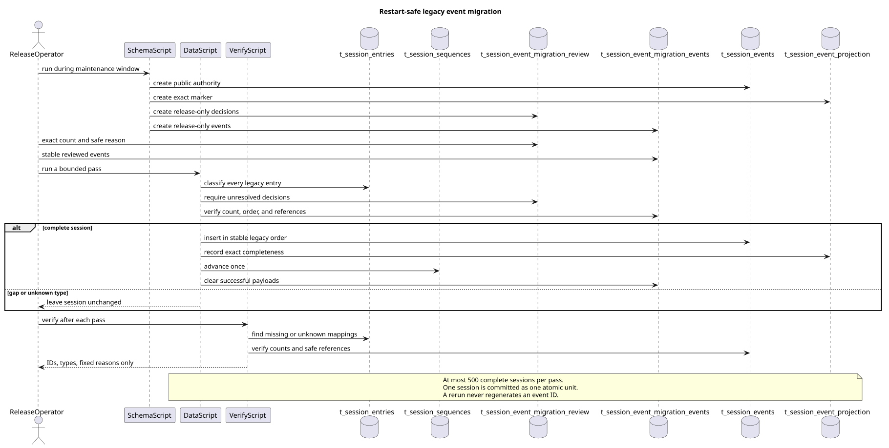

# Runtime Events v2 历史、完整性与迁移

| 属性 | 值 |
|---|---|
| 版本 | 0.1.0 |
| 日期 | 2026-09-08 |
| 契约基线 | `pi-mono-java-design@2ee2a3211da68ad87b0d9cab353e691b00bdaebd` |
| 实现基线 | `pi-mono-java@d9a20777` |
| 实现提交 | `d8276302`、`87b3dadb`、`1784a3ef`、`b15c3a75`、`b98cafbf`、`fa354fe2`、`749dc828` |
| 当前接入状态 | 公共投影、原子存储、整数分页、完整性门禁和升级脚本已实现；生产 GET 切换与全部写入点接入待最终集成 |

## Context

Events v2 要求 POST 的完整 SSE 帧与 GET 历史逐字段相同，并按服务端提交顺序从旧到新返回。
旧 `t_session_entries` 同时保存模型恢复信息和旧 HTTP 投影，无法证明 Skill 展开前正文、工具确认标记、
固定语言错误文本、原消息关联和公开 thinking 摘要。把旧 Entry 在每次 GET 中临时转换，会重新生成身份、
泄露私有内容或静默遗漏一对多事件。

本设计实现独立的权威公共事件表，并用每个 Entry 的精确投影数量证明历史完整。查询能力已经存在，
但生产 Controller 暂时保留旧链路。只有 POST、控制、配置和压缩等所有公开写入点都改用组合提交，
并完成旧数据迁移后，才能一次切换 GET，避免上线半套协议。

## 源码证据与实现边界

以下路径相对 `modules/coding-agent-cli/src/main/`。

| 分类 | 路径与符号 | 行为与理由 |
|---|---|---|
| 已观察旧行为 | `java/.../event/RuntimeEntryCodec.java#toHistoryEvent` | 从 Entry 读取旧字段并按读取语言生成工具错误文本；不能作为 v2 权威记录 |
| 已实现 | `java/.../event/CommittedEventProjection.java#project` | 从已提交 DTO 严格产生类型化只读 Response VO；GET 不重新翻译持久化文本 |
| 已实现 | `java/.../persistence/MyBatisRuntimeSessionRepository.java#appendEntryWithUsage` | Entry、Usage、公共事件与完整性标记共享一个 Spring 事务和 Session 序号 |
| 已实现 | `java/.../persistence/MyBatisRuntimeSessionRepository.java#findEventPage` | 在一个 `REPEATABLE_READ` 事务内核验当前分支完整性并读取数字页 |
| 已实现 | `resources/mapper/session/RuntimeSessionMapper.xml#countUnmappedCurrentBranchEntries` | 未知类型、缺标记、数量不符和不允许的公开/私有数量均关闭失败 |
| 已实现，独立交付 | `resources/db/gaussdb/upgrade/V1_to_V2__*.sql` | 提供可重跑的审核输入、分批转换与无敏感正文的验证输出 |
| 待最终集成 | `java/.../web/RuntimeEventController.java#list` | 仍返回旧游标模型；必须和全部 v2 写入点一起切换 |

pi 基线 `5cd93f688aaab89dbb6dfa4aca535f21796ae185` 的
`packages/agent/src/agent-loop.ts#runLoop` 产生消息和工具生命周期通知，但没有 CampusClaw 的 HTTP
公共事件表、当前分支分页或旧数据审核迁移。这些部分属于 CampusClaw 架构变更。

## 权威事件与整数分页

[PlantUML 源码](diagram.puml#L1)

`t_session_events` 保存一次稳定 `event_id`、UTC 毫秒 `created_at`、当前分支锚点和安全 JSON。
内部 `event_seq` 与 Entry、Record 共用 Session 序号，只用于提交顺序，不进入响应。
`CommittedEventProjection` 是 GET 与 POST 完整帧的唯一响应装配入口；Response VO 不嵌套 DTO。

查询 Service 将缺省 `page/limit` 归一为 1/50，限制 `limit` 为 1～200，并用精确乘法计算 offset。
Repository 在一个读取事务中固定本次 active leaf、完整性判断和事件页，多取一条决定 `nextPage`。
合法超范围返回空 events 和 null nextPage，不查询 total，也不跨请求保存快照。

`t_session_event_projection` 为每个 Entry 保存精确公共事件数量。公开类型通常至少一条，连接和
delta 等明确私有类型必须为零；`assistant.thinking.completed` 只有经可信运行时或迁移审核后，才可
明确标零为私有或标正数为公开摘要。`tool.execution.started` 必须映射完整 `agent.tool_call`，不能因
旧记录缺参数和确认标记而标零。未知内部类型即使有人写入标记也会失败。

## 旧历史迁移

[PlantUML 源码](diagram.puml#L47)

升级只在停止 Session 写入的维护窗口执行。schema 脚本增加权威表、完整性表和两张仅发布平台可写的
审核输入表；runtime role 只获得权威表与完整性表权限。data 脚本每轮最多处理 500 个 Session，
且一个 Session 的全部 Entry 都有可证明映射时才在同一事务提交。事件按旧 entry_seq 和同 Entry
审核顺序稳定排列，成功后精确推进 Session 序号并删除暂存公共 payload；重复执行不新增 ID 或记录。

合法模型/Thinking 配置和手动压缩可从已有安全字段自动映射。连接标记、delta、树控制和明确内部
生命周期自动标为私有。user.message、Assistant 一对多内容、工具调用和结果、idle、自动压缩、
公开 thinking 等需要审核输入。每份审核记录必须声明精确数量和不含正文、凭据的理由。

旧 Skill `user.message` 只保存展开后的私有正文，没有可靠的展开前 `/skill:...` 回执元数据。
迁移不得把该正文复制到公开表，也不得查询当前 Skill 内容反推旧请求。运维只能从可信的原始来源
提供安全回执；否则保留 `MIGRATION_REVIEW_REQUIRED`，应用查询返回稳定 `EVENT_LIST_FAILED`。
未知内部类型不能通过审核表绕过。verify 脚本只输出 Session ID、Entry ID、类型和固定缺口原因。

## 一致性、锁与回滚

运行时锁顺序为 Session 主行、当前 execution、Session sequence、Entry/Usage、公共事件、完整性
标记，控制层关联最后写入。组合 append 任一步失败都会回滚 Entry、Record、Usage、统计、事件、标记
和序号。迁移脚本取得对应表锁，因此必须停写，避免扫描完整性与并发追加之间出现窗口。

schema 新表对旧应用向后兼容。verify 零行前不能部署 v2 读取。v2 已开始写入后回滚应用时保留新表，
不能逆向丢弃公共事件；v2 写入前才可按发布流程归档审核输入并删除四张新增表。

## 测试与验证

单元测试覆盖 1/50 默认值、1/200 边界、数字 nextPage、空页、乘法溢出、未知公共 payload 和稳定错误。
真实 openGauss 测试覆盖当前分支过滤、缺标记、数量不符、未知类型、工具调用缺口，以及 thinking 私有
零事件、公开摘要一事件和缺审核三种结果。原子失败测试证明公共事件插入冲突时所有关联写入回滚，
并证明写入 DTO、数据库读回和公共投影使用同一个 UTC 毫秒时间。

迁移脚本在 openGauss 7.0.0-RC3 上从模拟 V1 状态执行：schema 和 data 各重复两次后，事件数、标记数
与 Session 序号保持稳定；缺少 Skill 安全回执和未知类型只返回固定 verify 缺口，处理缺口后 verify
零行。`spotless`、`checkstyle`、Java 方法长度、测试质量和 `git diff --check` 在各代码片均通过。
企业镜像和生产 Controller 切换由最终集成片统一完成。

## 决策与版本历史

见 [ADR-0078](../../decisions/0078-authoritative-event-history.html)。

| 版本 | 日期 | 变更 |
|---|---|---|
| 0.1.0 | 2026-09-08 | 记录权威公共事件、整数分页、精确完整性门禁和可重跑旧历史迁移 |
