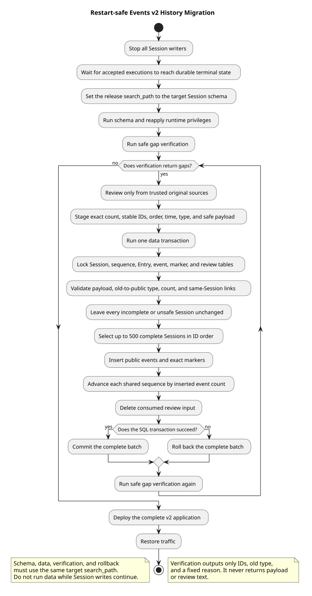

# Runtime Events v2 存量历史迁移

| 属性 | 值 |
|---|---|
| 版本 | 0.1.0 |
| 日期 | 2026-09-08 |
| 契约基线 | `pi-mono-java-design@2ee2a3211da68ad87b0d9cab353e691b00bdaebd` |
| 变更前 Java | `pi-mono-java@72f3550e` |
| 实现提交 | `a2d9c104` |
| pi 基线 | `pi-mono@5cd93f688aaab89dbb6dfa4aca535f21796ae185` |
| 当前范围 | 数据库发布平台执行的一次可重跑 Events v2 历史迁移；不增加应用启动迁移器 |

## Context

Events v2 历史必须返回稳定、完整且安全的公共事件。旧 `t_session_entries` 保存的是内部恢复数据：
一条 Assistant Entry 可能对应正文和多个工具调用，完成 Thinking 可能是公开摘要或私有推理，旧 Skill
user.message 只有展开后的私有正文。查询时临时转换不能证明完整数量、原始用户回执、工具确认标记、
固定错误文本或 sourceEventId，也不能安全生成稳定 eventId。

设计基线的 `chat-events-v2-history-design.md` §2.0 明确要求全部旧持久化类型逐类映射或说明不公开理由，
并在第 117～118 行要求提供一次可重跑迁移或兼容读取，对缺少安全映射的历史显式失败。这个升级是该
明确要求的实现，不是从普通 schema 变化推导出的通用迁移框架。

## 源码证据与实现边界

| 分类 | 仓库相对路径与符号 | 行为与理由 |
|---|---|---|
| 契约要求 | `01-总体架构/01-CampusClaw多Agent运行时/chat-events-v2-history-design.md` · §2、§2.0 | 公开历史不得包含私有 Thinking、Skill 正文或内部身份；旧类型必须完整分类，缺少安全关联时关闭失败 |
| 已实现 | `modules/coding-agent-cli/src/main/resources/db/gaussdb/upgrade/V1_to_V2__schema.sql` | 在发布目标 schema 中增加四张事件/审核表和仅供本次迁移使用的严格校验函数 |
| 已实现 | `modules/coding-agent-cli/src/main/resources/db/gaussdb/upgrade/V1_to_V2__schema.sql` · `f_validate_session_event_v2` | 校验 11 个公共类型的精确字段、嵌套结构、枚举、Java long、UTF-16 长度和条件字段，不返回 payload |
| 已实现 | `modules/coding-agent-cli/src/main/resources/db/gaussdb/upgrade/V1_to_V2__schema.sql` · `f_session_event_migration_gaps` | 复用 payload、旧类型映射和关联规则，输出 ID、内部类型和固定缺口原因 |
| 已实现 | `modules/coding-agent-cli/src/main/resources/db/gaussdb/upgrade/V1_to_V2__data.sql` | 锁定相关表，先计算完整性问题，只选择最多 500 个无缺口 Session，在一个事务中写事件、标记和序号 |
| 已实现 | `modules/coding-agent-cli/src/main/resources/db/gaussdb/upgrade/V1_to_V2__verify.sql` | 只读调用统一 gap 函数；零行才允许部署 v2 读取 |
| 已实现 | `modules/coding-agent-cli/src/main/resources/db/gaussdb/upgrade/test/V1_to_V2__payload_validation_regression.sql` | 隔离 schema 中验证全部 11 个类型及非法字段、空白、溢出和私有字段 |
| 已实现 | `modules/coding-agent-cli/src/main/resources/db/gaussdb/upgrade/test/V1_to_V2__migration_regression.sql` | 验证一对多、Thinking 双分类、失败 Session 不迁、跨 Session 关联拒绝和重跑稳定性 |
| pi 观察 | `packages/agent/src/agent-loop.ts` · `runLoop` | pi 生成消息与工具生命周期事件，没有 CampusClaw 权威历史表、旧数据审核输入或发布迁移流程 |

权威公共历史、审核迁移与数据库发布流程属于 CampusClaw 架构变化；拒绝私有内容和不可靠关联属于
安全加固。

## 关键定义

- **自动决定**：仅对能从旧安全字段完整证明的模型配置、Thinking 配置和手动压缩生成一条公共事件；
  对连接、delta、树控制和明确内部生命周期写零事件标记。
- **人工审核决定**：`t_session_event_migration_review` 声明一个旧 Entry 应有的精确公共事件数量；
  正数必须在 `t_session_event_migration_events` 提供从 1 连续排列的全部公共事件。
- **精确完整性**：每个旧 Entry 在 `t_session_event_projection` 恰好有一条 marker，event_count 必须与
  `t_session_events` 的实际锚定数量一致。一条已有事件不能掩盖同一 Assistant Entry 缺少的其他事件。
- **迁移缺口**：未知旧类型、缺审核、数量不符、payload 非法、类型映射非法、孤儿记录或同 Session
  source/target/tool 关联缺失。缺口原因是固定字面值，不包含公共 payload 或审核正文。
- **发布目标 schema**：升级 SQL 没有写死 schema 名称，表和函数属于数据库发布平台执行时选定的
  `search_path` 首个可写 schema。执行者必须先固定目标 Session schema，不能依赖个人默认 search_path。

## 架构与数据流



[PlantUML 源码](diagram.puml#L1)

### 维护窗口与执行顺序

1. 停止所有可写 Session 的 CampusClaw 实例，等待已经接受的执行进入持久化终态。记录目标 database、
   schema 和发布 owner，显式设置 `search_path`。
2. 通过数据库发布平台执行 `V1_to_V2__schema.sql`，再应用 `install/session_privileges.sql`。在本次新增
   对象中，runtime role 只能访问权威事件和投影表，两张 migration input 表只允许发布 owner 写入。
3. 执行 verify 取得缺口。输出只包含 `session_id`、`anchor_entry_id`、`entry_type`、`gap_reason`。
4. 从可信原始来源准备人工审核。review 填精确 event_count 和不含正文、凭据的理由；正数事件填稳定
   eventId、连续 event_order、UTC 毫秒 createdAt、允许的 v2 type 与完整安全 payload。
5. 重复执行 data，再执行 verify。每次 data 按 Session ID 选择最多 500 个无缺口 Session；单个 Session
   不拆批。verify 仍有行时继续审核和重跑，不能部署 v2 读取。
6. verify 返回零行后部署完整 v2 应用，再恢复流量。保留发布记录和按公司策略归档的审核证据。

data 脚本对 `t_sessions`、sequence、Entry、公共事件、projection 和两张审核输入表加表锁。锁可以阻止
并发写入，却会给在线请求制造长等待和死锁风险，因此它不能替代停写维护窗口。最大 Session 仍作为一个
事务单元，不受 500 个 Session 批次上限拆分；发布前应根据存量规模评估单次事务日志、临时表和锁时间。

### 自动映射与人工边界

只有字段完整的 `session.model.changed`、`session.thinking.changed` 和 reason=manual 的压缩可自动生成
公共事件；自动 eventId 使用旧 Entry ID，时间截断到 UTC 毫秒。明确的 started/delta/connection/tree
记录自动标零。

user.*、Assistant completed、工具调用/结果、idle、自动压缩和 completed Thinking 需要审核。公开 Thinking
必须提供已证明安全的摘要事件；已证明为私有提供商内容的 completed Thinking 可显式审核为 event_count=0。
没有审核 marker 时不能自动把它当私有。未知旧类型不接受审核绕过。

旧 Skill 的 user.message 只有展开后的正文，无法区分用户原始 `/skill:...` 请求和 Skill 私有内容。迁移
不得复制该正文，也不得查询当前 Skill 文件反推历史。只有可信原始来源能提供展开前安全回执；否则 Session
保持 `MIGRATION_REVIEW_REQUIRED`，v2 GET 关闭失败。

审核理由的“不含敏感内容”是发布流程责任；数据库只机械校验非空并确保 verify 不返回该字段。审核事件
还要通过公共 payload 精确字段、旧类型到公共类型矩阵及同 Session 关系校验。sourceEventId/targetEventId
必须引用同 Session user.message，tool result/confirmation 必须能关联同 Session tool call。

## 事务、失败和重跑

schema 脚本在一个 DDL 事务中使用 `IF NOT EXISTS` 创建表/索引，用 `CREATE OR REPLACE` 安装固定签名函数。
它支持同一版本、同一停写窗口内因发布重试而重复执行；它不会自动修复人为创建的同名不兼容表。

data 在一个事务中先汇总全部问题，再选择无问题 Session。某个 Session 有一对多缺半、非法 payload、未知
类型、缺关联或无审核时，该 Session 的 event、projection、sequence 和审核输入都不改变；其他无问题
Session 可以进入本批。SQL 执行本身发生异常时，本批所有 Session 一起回滚。

成功 Session 按旧 entry_seq、同 Entry event_order 和稳定 eventId 排序，从现有 next_seq 继续分配公共
event_seq。事务随后写精确 marker、按新增事件数推进 sequence，并删除已消费的审核 payload 与 review。
再次执行时已有 marker 作为 existing 决定，成功 Session 没有待迁记录，不会重新分配 ID、重复事件或再次
推进序号。

## SQL 函数作用域与回滚

这些函数只服务这次发布迁移，不由应用运行时调用。它们安装在执行 `V1_to_V2__schema.sql` 时
`search_path` 解析到的目标 schema；发布脚本、data、verify 和回滚必须使用同一目标 schema。测试脚本则
各自在自有临时测试 schema 中安装并最终删除，不触碰业务 schema。

如果尚无任何 v2 写入，可以按发布回滚流程先归档审核输入，再按下列依赖顺序删除函数和四张新增表。
`<session_schema>` 必须替换为本次发布固定的实际 schema；每条都不使用 `CASCADE`，让残留依赖显式阻止
破坏性删除。

```sql
DROP FUNCTION <session_schema>.f_session_event_migration_gaps();
DROP FUNCTION <session_schema>.f_validate_session_event_v2(VARCHAR, JSONB);
DROP FUNCTION <session_schema>.f_session_event_mapping_count_valid(VARCHAR, INTEGER);
DROP FUNCTION <session_schema>.f_session_event_mapping_type_valid(VARCHAR, VARCHAR);
DROP FUNCTION <session_schema>.f_session_event_validate_usage(JSONB);
DROP FUNCTION <session_schema>.f_session_event_validate_cost(JSONB);
DROP FUNCTION <session_schema>.f_session_event_validate_user_content(JSONB);
DROP FUNCTION <session_schema>.f_session_event_validate_text_content(JSONB);
DROP FUNCTION <session_schema>.f_session_event_has_string(JSONB, TEXT, BOOLEAN);
DROP FUNCTION <session_schema>.f_session_event_has_nonnegative_long(JSONB, TEXT);
DROP FUNCTION <session_schema>.f_session_event_has_nonnegative_number(JSONB, TEXT);
DROP FUNCTION <session_schema>.f_session_event_has_exact_keys(JSONB, TEXT[], TEXT[]);
DROP FUNCTION <session_schema>.f_session_event_is_java_blank(TEXT);
DROP FUNCTION <session_schema>.f_session_event_utf16_length(TEXT);
DROP TABLE <session_schema>.t_session_event_migration_events;
DROP TABLE <session_schema>.t_session_event_migration_review;
DROP TABLE <session_schema>.t_session_event_projection;
DROP TABLE <session_schema>.t_session_events;
```

一旦 v2 应用写入公共事件，应用可以回退到 v1，但必须保留新表和数据，不能逆向转换或删除。迁移完成且
审核输入不再需要校验后，可以通过新的发布变更删除仅迁移使用的输入表和函数；权威事件表与 projection
继续由 v2 历史使用。完整安装脚本具有破坏性，任何阶段都不能拿它做升级回滚。

## 设计决策

见 [ADR-0082：采用审核驱动且可重跑的存量事件迁移](../../decisions/0082-restart-safe-event-history-migration.html)。

选择“安全自动映射 + 精确人工审核 + Session 原子批处理”。它允许无需猜测的旧配置和私有记录自动处理，
同时把不可能从旧 Entry 证明的公开内容保持为显式缺口。按读取时动态兼容会反复生成身份且无法证明一对多
完整性；把所有旧字段自动公开会泄露私有内容，因此都不采用。

## 边界情况与 DFX

- 每批最多 500 个 Session，但单个超大 Session 不拆分；发布前按最大 Session 评估事务资源。
- 一条 Entry 的 event_count 正数必须与连续 event_order 数量完全一致；公开必需类型不能用零绕过。
- `assistant.thinking.completed` 只有审核后才允许零或一；delta 和 started 固定为零。
- payload 验证拒绝 JSON null、缺失/额外字段、类型错误、Java long 溢出、非法枚举、五个 file、重复 file、
  fileId 非字符串、Java 空白文本和 UTF-16 超长文本；NBSP 按 Java 语义不是空白。
- CallMateTool 参数必须是 `{tool,args}`，args 是对象；普通工具仍允许通用对象参数。
- validator 和 gap 函数只返回 boolean 或固定原因，不记录、抛回或打印 payload。
- 无新增 Maven 依赖、后台线程或应用定时任务。迁移由数据库发布平台显式执行。

## 契约与交付范围

迁移产生的 `t_session_events` 与运行时新写事件使用同一 11 类型公共契约，`t_session_event_projection`
使用 mapping_source=migration 记录完整性。verify 零行只是部署 v2 读取的必要条件；还需完整 v2 写入点和
Events HTTP 集成测试通过。本片不修改 Controller、Response VO、SSE 或应用启动行为。

## 测试与验证

2026-09-08 在 openGauss 7.0.0-RC3 的隔离 `events_history` 数据库实际执行两份 SQL 回归，均启用
`ON_ERROR_STOP` 并通过：

- payload 回归执行 43 个用例，覆盖全部 11 类型，以及空对象/null、额外字段、phase、Usage/Cost、
  Java long、UTF-16、Java 空白、fileId、CallMateTool、错误条件和压缩 source 规则；
- 端到端回归重复执行 schema 两次、data 三次，覆盖一对多缺半、未知类型、旧 Skill 缺原回执、私有
  Thinking 零事件、公开 Thinking 一事件、稳定 ID/序号、非法 payload、禁止零计数、类型映射错误和跨
  Session sourceEventId。

两份测试只创建并删除自己的隔离 schema。端到端 verify 输出 11 行故意保留的合成缺口，只含合成 ID、
类型和固定原因；断言确认这些 Session 没有被迁移。另需验证 PlantUML 生成、ASCII、SVG XML、Markdown
链接/锚点和 `git diff --check`。SQL 升级文件不进入企业镜像，本独立文档提交也不修改镜像。

## 版本历史

| 版本 | 日期 | 变更 |
|---|---|---|
| 0.1.0 | 2026-09-08 | 记录维护窗口、安全审核、Session 原子批处理、重跑与函数回滚边界 |
