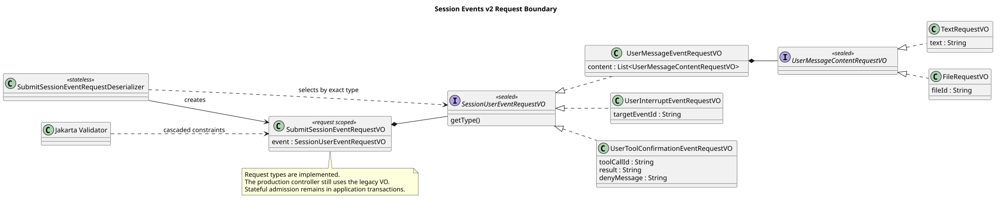

# Session Events v2 联合请求边界

| 属性 | 值 |
|---|---|
| 版本 | 1.0.1 |
| 日期 | 2026-09-08 |
| 状态 | 请求类型与校验已实现，尚未切换生产 Controller |
| 设计契约 | `pi-mono-java-design@2ee2a3211da68ad87b0d9cab353e691b00bdaebd` |
| Java 变更前基线 | `fd556dce3cfa12e5e834b6e9b8f835f10e7d67c8` |
| 请求代码提交 | `8dc32b2e`；边界校验修复 `bdf03c84`，集成提交 `cf2e40d6` |

## Context

目标 `POST /campusclaw-service/v1/sessions/{sessionId}/events` 每次接收一个 `event`，
由 `type` 在 `user.message`、`user.interrupt` 和 `user.tool_confirmation` 中选择一种。
变更前 `RuntimeEventController.submit` 直接接收扁平的 `UserEventRequestVO`，只表达旧
`message/fileIds`，不能安全承载三种目标结构。本片先实现请求 VO、严格 JSON 选择和
Jakarta 校验，供后续 Handler 与完整 SSE 生命周期一次接入；生产 Controller 仍使用旧请求，
因此本片不宣称 v2 HTTP 已上线。

## 源码证据与设计依据

Java 路径均相对 `modules/coding-agent-cli/src/main/java/com/campusclaw/codingagent/`。

| 分类 | 路径与符号 | 观察与决定 |
|---|---|---|
| 变更前行为 | `runtimeapi/web/RuntimeEventController.java#submit` | 生产入口绑定旧 `UserEventRequestVO`，本片保持不变，避免发布半套响应协议 |
| 变更前行为 | `runtimeapi/vo/UserEventRequestVO.java` | 只接受 `message/fileIds`，没有 `event` 外壳、type 判别或控制事件字段 |
| 已实现目标 | `runtimeapi/vo/SubmitSessionEventRequestVO.java`、`SessionUserEventRequestVO.java` | 顶层只含一个 `event`；封闭联合类型固定三种用户事件 |
| 已实现目标 | `runtimeapi/web/json/SubmitSessionEventRequestDeserializer.java` | 先验证对象形态、唯一顶层字段和显式 null，再按准确 type 选择具体 RequestVO |
| 已实现目标 | `runtimeapi/vo/UserMessageContentRequestVO.java` | 文本与文件是封闭内容块联合；每个子类型拒绝另一类型字段和未知字段 |
| 已确认契约 | 设计仓 `接口契约-v2/操作/01-submit-session-event.json` | content 顺序、数量、文件格式、控制目标及确认字段均已定稿 |

pi 固定证据为 `pi@5cd93f688aaab89dbb6dfa4aca535f21796ae185` 的
`packages/coding-agent/src/core/agent-session.ts#prompt`：内核入口接收文本并处理 Agent 执行，
不定义本项目的 HTTP event 联合结构。三类结构化请求、显式 null 拒绝和数据库控制目标是
CampusClaw 的产品约束与安全加固，不能表述成 pi 已有 HTTP 行为。

## 请求结构与校验流程

[PlantUML 源码](diagram.puml#L1)

Jackson 只负责结构和 JSON 类型：请求必须是对象且顶层字段集合准确等于 `event`；
任何显式 null、非对象 event、未知 type、未知字段或字符串字段的宽松类型转换都会失败。
固定错误文本不复制用户正文、文件 ID、工具 ID 或凭据。

Jakarta Validator 负责可声明的请求边界：

- `user.message.content` 为 1 至 5 个块；文本非空白且最多 262144 个 UTF-16 单元；
  文本最多一个并位于首项；文件为 32 位十六进制 ID、最多 4 个且不重复。
- `user.interrupt.targetEventId` 必填且非空白；是否匹配当前未完成根消息由后续数据库事务复核。
- `user.tool_confirmation` 的 `toolCallId/result` 必填；result 只能为 `allow/deny`；
  allow 禁止 `denyMessage`，deny 可省略或携带非空白且最多 4096 个 UTF-16 单元的说明。

VO 不裁剪、补默认值或静默去重。Session 状态、固定执行身份、停止/确认竞争和工具是否待确认
仍由应用服务在事务内判断。解析成功不表示用户事件已经接受。

## 决策、性能与交付边界

决策见 [ADR-0076](../../decisions/0076-runtime-event-request-contract.html)。封闭联合类型使 Handler
不需要从松散 Map 重猜事件类别；结构错误在进入持久化前失败。反序列化暂存一个请求 JSON 树，
空间复杂度与请求大小线性相关，没有新增缓存、线程、数据库对象或 Maven 依赖。

后续切换生产 Controller 时，必须与三类 Handler、完整公共事件、data-only SSE、对应 idle 关闭
和 access-token 边界一起启用。Skill 调用还必须把公开 `/skill:<name> 原参数` 与内部展开正文分开，
不能将私有展开文本放入 user.message 回执；本片没有修改 command 语义。

## 测试与验证

`SubmitSessionEventRequestVOTest` 使用真实 Jackson 和 Jakarta Validator，覆盖三种类型选择、
字段原值、非对象、显式 null、非法 type、未知字段、内容块错配、文本顺序与 UTF-16 上限、
文件格式/去重/数量，以及确认决定与 denyMessage 条件，共 18 项测试；另验证直接构造 VO 的非法 result 与 JSON 入口一致拒绝。

- `./mvnw -pl modules/coding-agent-cli -am -DskipITs -Dtest=SubmitSessionEventRequestVOTest -Dsurefire.failIfNoSpecifiedTests=false test`：18 项通过，Checkstyle 0 违规。
- 根独立运行请求测试 18 项和共享常量测试 17 项，共 35 项通过，无失败、错误或跳过。
- 测试质量脚本：0 错误、0 警告。
- 未新增 Maven 依赖；`campusclaw` 镜像已生成同步。企业 `NativeParent:26.0.0-SNAPSHOT` 本地不可解析，企业镜像编译未验证。
- PlantUML 生成、ASCII、SVG XML、Markdown 路径和 `git diff --check` 在交付前验证。

## 版本历史

| 版本 | 日期 | 变更 |
|---|---|---|
| 1.0.0 | 2026-09-08 | 实现三类 Session 用户事件联合请求及严格 JSON/Jakarta 边界，保留生产入口后续原子切换 |
| 1.0.1 | 2026-09-08 | 用共享正则和标准 Jakarta 注解统一 JSON 与直接构造 VO 的结果枚举校验，补充独立审查验证 |
