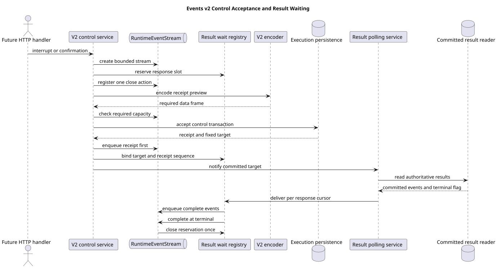

# Events v2 控制事件受理与结果等待

| 属性 | 值 |
|---|---|
| 版本 | 1.0.0 |
| 日期 | 2026-09-08 |
| 契约基线 | `pi-mono-java-design@2ee2a3211da68ad87b0d9cab353e691b00bdaebd` |
| Java 变更前基线 | `pi-mono-java@808b5a1535316352fbf9c5644c02f717c1be5c2c` |
| 实现提交 | `c70cc57fb34dafe2acddfd8559a6c90c7a4edf90`；依赖合并 `ffab13a69127e5e605df3b0319bf19f55f0e1d3f` |
| pi 源码基线 | `pi-mono@4af9d21d3b4d664e4a29fcabfec85171077248e3` |
| 单片 HTTP 状态 | 未启用；本片返回内部响应流和固定受理结果，Controller 与本机快路径由后续统一接入片连接 |

## Context

`user.interrupt` 和 `user.tool_confirmation` 是新的独立 HTTP 请求。请求必须先得到完整受理回执，然后继续等待
原执行的权威结果：interrupt 等根执行真实终态，confirmation 等新结果段的完整事件和首个 idle。接受请求的实例
可能不是执行实例，因此不能直接订阅本地 Agent 或把 Session 当前状态当作结果。

等待名额必须在数据库受理前预留；否则事务已经提交后才发现服务没有响应容量，客户端既拿不到回执，也不能安全
重放副作用。断线、超时、容量溢出和受理失败还必须立即释放名额。

## 源码证据与分类

| 分类 | 仓库相对路径与符号 | 观察、决定和理由 |
|---|---|---|
| 已确认契约 | `01-总体架构/01-CampusClaw多Agent运行时/chat-events-v2-design.md` §4.4～§4.5、`chat-events-v2-stream-design.md` | 控制请求返回自身回执，再按固定根执行或确认续跑段补读结果 |
| 本片实现 | `modules/coding-agent-cli/src/main/java/com/campusclaw/codingagent/runtimeapi/event/RuntimeV2ControlEventService.java#acceptInterrupt/acceptToolConfirmation` | 在一个受理模板中组合等待预留、回执预编码、控制事务、首帧入队、结果绑定和提交后快通知 |
| 本片实现 | `modules/coding-agent-cli/src/main/java/com/campusclaw/codingagent/runtimeapi/event/RuntimeEventStream.java#onClose/canAcceptRequired` | complete、detach 和容量溢出只执行一次关闭动作；必需帧可淘汰 preview 后再判断容量 |
| 前置等待 | `modules/coding-agent-cli/src/main/java/com/campusclaw/codingagent/runtimeapi/event/RuntimeResultWaitRegistry.java#reserve/bind/deliver` | 按真实响应数限流；接受前预留，回执后绑定固定 target 和已投递序号，同 target 查询去重但逐响应维护游标 |
| 前置补读 | `modules/coding-agent-cli/src/main/java/com/campusclaw/codingagent/runtimeapi/event/RuntimeResultPollingService.java#notifyCommitted/poll` | 事务成功后异步快速补读，周期轮询兜底；查询失败设置退避并保留等待 |
| 前置事务 | `modules/coding-agent-cli/src/main/java/com/campusclaw/codingagent/runtimeapi/persistence/RuntimeExecutionPersistenceService.java#acceptInterrupt/acceptToolConfirmation` | 中断锁定根事件；确认创建新结果段和一次消费决定，回执与公共事件同事务写入 |
| pi 观察 | `packages/server/src/sessions.ts#LiveSessionManager.executeCommand`、`packages/agent/src/agent-loop.ts#runAgentLoop` | pi 的 abort 是已连接本地 Session 命令，Agent 循环依赖本地 AbortSignal；没有 CampusClaw 的跨实例控制受理流或数据库结果段 |

固定身份补读属于 CampusClaw 架构变化。服务只交付已提交公共事件，不复制进程内消息或私有 prompt；等待对象只保存
target、模式、序号和窄投递回调，不持有 Holder 或凭据。这一边界属于安全加固。

## 受理与补读流程

[PlantUML 源码](diagram.puml#L1)

两类控制使用相同顺序：

1. 创建有界 `RuntimeEventStream` 并按响应数量预留 waiter；注册一次性 `reservation.close`。
2. 把尚未分配序号的完整回执编码，验证单帧和当前流容量；失败时不调用数据库。
3. 执行控制事务。中断返回原固定 target；确认返回新 segment target。
4. 使用事务回填后的事件序号重新编码并把回执作为首帧入队。
5. waiter 绑定 target 和回执 `eventSeq`，再调用 `notifyCommitted` 立即走权威补读。

interrupt 使用 `EXECUTION_TERMINAL`，只交付根执行最终 `session.status_idle`；confirmation 使用
`SEGMENT_EVENTS`，按新段顺序交付回执之后的完整事件并在该段首个 idle 结束。投递返回 false、流断开或超时都会
注销该响应。超时只断开观察，不生成虚假的 idle。

本片不触发本机 stop 或 confirmation future。后续 Handler 在控制事务提交后调用 Dispatcher；无论本机快路径还是
跨实例轮询，完整响应都从同一个权威结果读取路径交付，避免直推与 waiter 重复 completed/idle。

## 设计决策

见 [ADR-0098](../../decisions/0098-reserve-control-response-before-acceptance.html)。选择“先预留响应、再受理控制、
回执后绑定固定结果”的生命周期。没有选择事务后登记，因为会留下无法观察的已提交副作用；没有选择把本地 Agent
事件直接写入控制响应，因为跨实例行为不同且可能重复完整事件。

## 边界、DFX 与契约影响

- waiter 已满、回执编码失败或必需帧超限时，在控制事务前返回服务不可用或接纳失败。
- 受理事务返回业务冲突时保留精确错误码；未知投影或事务异常统一为 `EVENT_ACCEPTANCE_FAILED`。
- 回执事务已提交但入队失败时只断开当前响应，不回滚已接受控制，也不重复写入。
- 同 target 的多个响应共享一次查询领取，仍按各自 `afterSeq` 去重投递。
- 结果快速通知使用有界单线程虚拟线程执行器；队列满时由周期轮询补偿。
- 查询失败统一退避，已排队通知也尊重退避，避免失败风暴。
- 本片不新增 Maven 依赖、数据库表或公开 HTTP 字段。

## 测试与验证

聚焦命令选择 6 个测试类，共 38 项：`RuntimeV2ControlEventServiceTest` 5 项、`RuntimeEventStreamTest` 10 项、
`RuntimeCommittedEventFactoryTest` 7 项、`RuntimeResultWaitRegistryTest` 4 项、
`RuntimeResultPollingServiceTest` 4 项和 Message 流回归 8 项。覆盖：

- waiter 容量、预编码异常和事务失败均立即释放预留且不产生旁路写入；
- 回执先行、事务后绑定、提交后通知和断线一次清理；
- interrupt 根终态与 confirmation 结果段采用不同补读模式；
- data-only 必需帧可以淘汰 preview，完整帧超限时关闭响应；
- 同目标等待去重、逐响应游标、超时、失败退避和异步快通知。

38 项是 Control 与直接依赖的单元验证，不是 Controller 或跨 JVM HTTP 验收。Maven 测试同时执行 Checkstyle；
`spotless:check` 和 `git diff --check` 通过。企业镜像由发布集成统一生成，本片没有独立验证企业
`NativeParent` 编译。

## 版本历史

| 版本 | 日期 | 变更 |
|---|---|---|
| 1.0.0 | 2026-09-08 | 实现控制回执受理、流关闭清理和固定结果等待绑定 |
