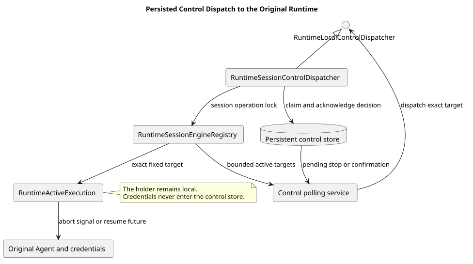

# Events v2 本机控制分发

| 属性 | 值 |
|---|---|
| 版本 | 1.0.0 |
| 日期 | 2026-09-08 |
| 契约基线 | `pi-mono-java-design@2ee2a3211da68ad87b0d9cab353e691b00bdaebd` |
| Java 变更前基线 | `pi-mono-java@1af21fd574817a7c18a48d05cc8975b4d3a98766` |
| 实现提交 | `6a66f5b8c65e1cd112f790f79817a4ac381391c3`；测试夹具 `af0f69cc2c01c882ffd25b0b2ca420ba71c87414`；权限回归 `347ee34a` |
| pi 源码基线 | `pi-mono@4af9d21d3b4d664e4a29fcabfec85171077248e3` |
| 单片 HTTP 状态 | 未启用；本片只实现持久控制信号到原进程 Holder 的分发适配器 |

## Context

Events v2 的 interrupt 或 tool confirmation 可以由任一服务实例受理，而实际 Agent、原始 Mate 凭据和等待中的
工具调用只存在于最初执行实例。持久控制表提供跨实例交接点，批量轮询提供发现机制；仍需一个本机适配器按固定
执行身份找到 Holder，并把停止或确认决定交给唯一活动执行。

本片实现 `RuntimeLocalControlDispatcher` 的生产适配器，并让本机注册表列出仍需终态提交的固定目标。它不接收
HTTP 请求，也不创建控制记录。控制事务、轮询和 HTTP 接入分别属于前置与后续切片。

## 源码证据与分类

| 分类 | 仓库相对路径与符号 | 观察、决定和理由 |
|---|---|---|
| 已确认契约 | `01-总体架构/01-CampusClaw多Agent运行时/chat-events-v2-design.md` §4.4～§4.5 | 控制请求绑定根执行与结果段，确认由原执行实例使用原凭据续跑 |
| 前置基础 | `modules/coding-agent-cli/src/main/java/com/campusclaw/codingagent/runtimeapi/runtime/ExecutionControlPollingService.java#poll` | 批量读取本机活动目标的持久控制信号，并只依赖窄 `RuntimeLocalControlDispatcher` 接口 |
| 本片实现 | `modules/coding-agent-cli/src/main/java/com/campusclaw/codingagent/runtimeapi/runtime/RuntimeSessionControlDispatcher.java#dispatchStop` | 在 Session 操作锁内校验完整 target，先设置取消状态，再中止 Agent 并解除确认等待 |
| 本片实现 | `modules/coding-agent-cli/src/main/java/com/campusclaw/codingagent/runtimeapi/runtime/RuntimeSessionControlDispatcher.java#stageConfirmation/dispatchConfirmation` | 先把新结果段输出绑定到同一执行，再使用旧 confirming target 原子 claim 并恢复等待中的工具调用 |
| 本片实现 | `modules/coding-agent-cli/src/main/java/com/campusclaw/codingagent/runtimeapi/runtime/RuntimeSessionEngineRegistry.java#activeTargets/createHolder` | 暴露有界固定目标快照；Holder 创建时从可信运行快照安装工具权限策略 |
| 状态所有者 | `modules/coding-agent-cli/src/main/java/com/campusclaw/codingagent/runtimeapi/runtime/RuntimeActiveExecution.java#claimAndResumeToolConfirmation/cancelToolConfirmation` | pending future、原 target、续跑 target 和输出都由原活动执行持有，不把凭据写入数据库 |
| pi 观察 | `packages/agent/src/agent-loop.ts#runAgentLoop/prepareToolCall` | pi 使用调用方的 `AbortSignal` 在模型与工具边界检查取消，没有共享数据库、固定 target 或跨 JVM 分发器 |

跨实例发现与固定身份校验是 CampusClaw 架构变化。只有受管 Agent/Skill 快照中的可信工具绑定可以产生 ASK；
未知或不一致的权限默认拒绝。凭据留在 Holder 内存中，不进入控制 DTO、数据库或日志，这属于安全加固。

## 架构与数据流

[PlantUML 源码](diagram.puml#L1)

轮询器从 Dispatcher 获取不超过 `maxActive` 的固定目标，再批量读取数据库信号。停止信号优先于同一目标的确认，
并按完整 `sessionId/executionId/rootEventId/segmentId` 定位执行。Dispatcher 返回 `false` 或抛出异常时，轮询器
清除成功去重标记，后续轮询可以重试；返回 `true` 后保持去重，直到目标不再活动。

同进程确认的 HTTP 接入会先调用 `stageConfirmation`：它允许 segment 变化，但要求 Session、execution 和 root
完全一致，并要求 pending Tool Call 相同。随后 `dispatchConfirmation` 使用旧 confirming target claim 一次决定，
把续跑 target 和输出切换到新段，然后完成 pending future。ack 失败只记录并由持久状态保留诊断，不重复执行工具。

停止分发先调用 `execution.requestAbort()`，再调用 `holder.abort()` 设置 Agent 取消信号，最后以取消异常完成可能存在的
确认 future。这样被唤醒的工具路径先观察到取消状态。自然完成、自然失败和实际取消的终态分类仍由执行协调器负责。

## 设计决策

见 [ADR-0097](../../decisions/0097-dispatch-persisted-controls-to-original-runtime.html)。选择窄 Dispatcher 接口，
使轮询器不依赖 Holder、凭据、输出或 Agent 类型；原进程适配器负责操作锁和实际执行状态。没有选择把凭据随确认
请求重建，因为确认必须续跑原实例，且持久化凭据会扩大泄露面。

## 边界、DFX 与契约影响

- target 不完整匹配或 Holder 已释放时返回 `false`，不降级为“当前 Session 执行”。
- 活动目标包含 Agent future 已结束但唯一终态仍在重试的 Holder，避免控制和资源释放竞态。
- `activeTargets` 返回有界、确定排序的快照；数据库轮询负责批量、退避和异步虚拟线程分发。
- 同一目标的 stop 优先，确认 claim 必须在持久事务中仍为 PENDING 且执行未 STOPPING。
- 本片复用既有控制 claim/ack 事务，不新增数据库表、SQL、HTTP 字段或 Maven 依赖；生产 HTTP 路由保持不变。

## 测试与验证

Dispatcher 单片的直接测试为 `RuntimeSessionControlDispatcherTest` 2 项和
`RuntimeSessionEngineRegistryTest` 3 项，共 5 项，覆盖固定目标、停止顺序、确认 claim/ack、结果段绑定和活动目标枚举。

注册表开始安装可信权限 before hook 后，另运行 `RuntimeCompactionCoordinatorTest` 24 项与
`RuntimeCompactionServiceTest` 17 项，共 41 项回归。测试夹具提交 `af0f69cc` 只补完整
`PreparedAgentRuntime`，证明 Compaction 不因空 mock 产生假失败；这 41 项不是 Dispatcher 行为用例。
`AgentRuntimeManagerTest` 46 项也全部通过，其中权限断言精确验证发布和重启缓存恢复后的两个受管工具仍为 ASK，
未知工具为 DENY。三个层次合计 92 项通过。Maven 测试同时执行 Checkstyle；`spotless:check` 和 `git diff --check` 通过。
企业镜像由发布集成统一生成，本片没有独立验证企业 `NativeParent` 编译。

## 版本历史

| 版本 | 日期 | 变更 |
|---|---|---|
| 1.0.0 | 2026-09-08 | 实现固定目标的本机停止与工具确认分发，并补齐权限策略引入后的 Compaction 夹具 |
