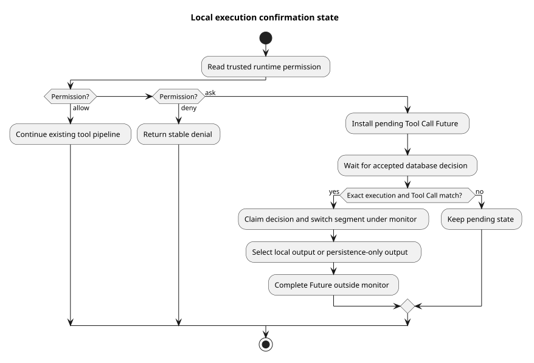

# Events 执行对象与工具确认基础

> 版本：1.0.0 · 日期：2026-09-08 · 状态：基础已实现，HTTP 与协调器分别接入

## Context 与源码依据

Events v2 的一次执行可以经过多个工具确认段，但必须保留原执行身份和凭据。
本片为本地活动执行增加固定目标、待确认状态和终态重试标志，并从可信 Agent/Skill 快照解析工具权限。

变更前 Java 为 `2bdcdcb2`，实现 `b9075a90` 来自子任务最终提交 `46ad4d89`。
以下路径均相对于实现仓；规范设计为 `pi-mono-java-design@2ee2a3211da68ad87b0d9cab353e691b00bdaebd`
的 `01-总体架构/01-CampusClaw多Agent运行时/chat-events-v2-design.md`。

| 源码 | 观察、决定与理由 |
|---|---|
| `modules/coding-agent-cli/src/main/java/com/campusclaw/codingagent/runtimeapi/runtime/RuntimeActiveExecution.java#claimAndResumeToolConfirmation` | 本地 monitor 内核对完整目标和 Tool Call、认领数据库决定并切换结果段；离开 monitor 后完成 Future，避免运行确认回调时继续持有 monitor。 |
| 同类 `#stageContinuationOutput/#cancelToolConfirmation/#beginTerminalFinalization` | 只绑定同一执行的输出；取消清理待确认 Future；终态入口只开始一次，重试由独立协调器负责。 |
| `modules/coding-agent-cli/src/main/java/com/campusclaw/codingagent/runtimeapi/runtime/RuntimeToolPermissionPolicy.java#from/#decide` | 只读可信快照的 bindingTools；CallMateTool 的内部工具名未知、权限未知或来源冲突都拒绝，ask 交给确认处理器，其他内建工具沿用既有校验。 |
| `modules/coding-agent-cli/src/main/java/com/campusclaw/codingagent/runtimeapi/runtime/RuntimeToolCallDeniedException.java` | 使用稳定 TOOL_CALL_DENIED，避免把内部权限诊断作为公开工具结果。 |
| `modules/coding-agent-cli/src/main/java/com/campusclaw/codingagent/runtimeapi/event/RuntimeEntryCodec.java` | 增加中断、确认、工具调用和 idle 的内部 Entry 组装；公共事件编码仍由独立转换器负责。 |
| `modules/common/src/main/java/com/campusclaw/common/constant/ClawConstants.java` | ask/deny 和稳定拒绝码集中在已有 Mate/RuntimeApi 分组，不新增常量转发层。 |

pi 基线 `4af9d21d3b4d664e4a29fcabfec85171077248e3` 的
`packages/agent/src/agent-loop.ts#prepareToolCall` 在 before hook 前后检查取消。
本地固定执行身份、数据库确认交接和可信 Mate 权限是 CampusClaw 架构变化，pi 没有这些持久化状态。
未知权限拒绝属于安全约束；首版只使用当前安装结构，不提供旧版本升级。

## 状态与边界

[PlantUML 源码](diagram.puml#L1)

确认决定必须匹配 Session、执行、原结果段和待确认 Tool Call。切换后使用新段；如果响应由另一个
实例接收，本地没有对应输出对象，则使用仅持久化输出，接收实例再从数据库补读。
数据库认领回调在 monitor 内执行，以串行化本地取消与认领，须使用已有受限数据库事务；这里不调用模型或工具。

终态重试标志只保存本地协调状态，不证明数据库已提交，也不释放执行对象或凭据。
此片尚未安装确认处理器、执行新的 HTTP 路由或启动重试调度器；这些由后续完整协调流程接入。
已有旧控制消费者在切换前仍可编译，其 HTTP 删除在独立提交完成，不构成首版兼容入口承诺。

## 验证与取舍

root 在最新主线上运行 `RuntimeActiveExecutionTest`、`RuntimeToolPermissionPolicyTest` 和
`RuntimeEventServiceTest` 共 13 项通过，零失败、零跳过；验证未知工具不进入确认、续跑输出切换、
错误 Tool Call 不消费确认、可信权限及冲突拒绝，并验证尚未切换的运行入口。
Spotless、Checkstyle 通过；Java 方法长度检查通过，ClawConstants 的既有 Unicode 正则单独人工核验。
七组公司镜像由脚本生成并核对。无新 Maven 依赖、数据库对象、部署配置或线程。
企业 NativeParent 26.0.0-SNAPSHOT 本机不可解析，公司 Maven 编译未验证。

权限快照在执行内固定，避免把控制请求中的值当成新权限；代价是执行中不会动态刷新权限。
并发 HTTP 接纳、跨实例确认和终态写入的端到端验证属于后续接入范围，本片不声称它们已经上线。

## 设计决策与版本历史

[ADR-0091](../../decisions/0091-prepare-runtime-execution-confirmation.html)

| 版本 | 日期 | 说明 |
|---|---|---|
| 1.0.0 | 2026-09-08 | 记录固定执行、确认段切换、可信权限与后续接入边界。 |
