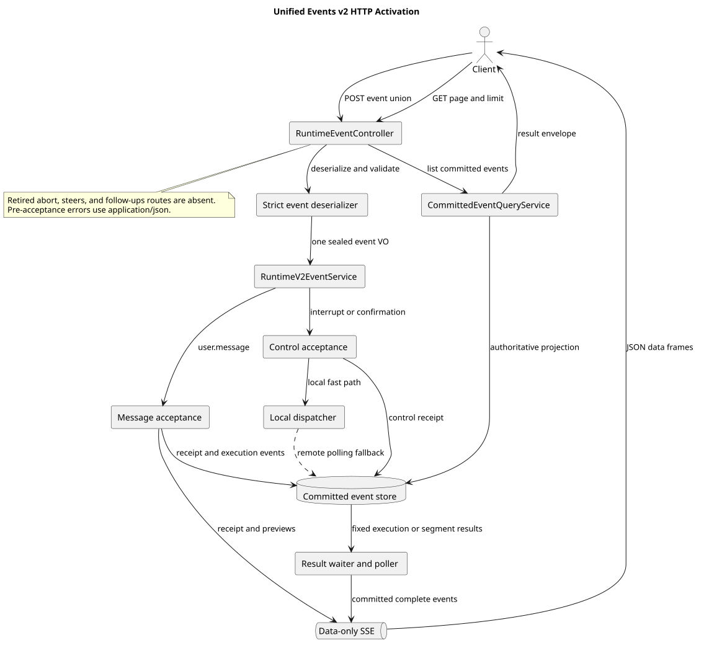

# Events v2 统一 HTTP 接入

| 属性 | 值 |
|---|---|
| 版本 | 1.0.0 |
| 日期 | 2026-09-08 |
| 契约基线 | `pi-mono-java-design@2ee2a3211da68ad87b0d9cab353e691b00bdaebd` |
| Java 变更前基线 | `pi-mono-java@ffab13a69127e5e605df3b0319bf19f55f0e1d3f` |
| 实现提交 | `84a3ffcb`、`21103298`、`8ea0ba9f`、`0490f036`、`465dd631`、`bf41dad8`、`6ab231d7`、`c2fed32e`；主线合并 `77348ee9` |
| pi 源码基线 | `pi-mono@4af9d21d3b4d664e4a29fcabfec85171077248e3` |
| 单片 HTTP 状态 | 已启用；依赖 Message、Dispatcher、Control、公共投影与执行协调基础后，本片切换生产 Controller |

## Context

前置切片已经实现 Events v2 的严格请求 VO、完整公共事件、固定执行、消息受理、控制等待和本机分发，但均未
切换生产 HTTP。统一接入必须一次完成三个用户事件的 POST 分派、data-only SSE、权威 GET 分页和旧控制路由退役，
避免客户端面对一半旧字段、一半新字段的中间协议。

本产品为首次发布。本片只依赖全量安装 Schema 和当前运行时完整性校验，不保留 V1 到 V2 的升级脚本、迁移分支或
兼容输出。

## 源码证据与分类

| 分类 | 仓库相对路径与符号 | 观察、决定和理由 |
|---|---|---|
| 已确认契约 | `01-总体架构/01-CampusClaw多Agent运行时/chat-events-v2-design.md`、`chat-events-v2-stream-design.md` 和 `接口契约-v2/操作/01-submit-session-event.json` | POST 接收严格联合事件，SSE 每帧只有公共事件 JSON，GET 与完整 SSE 同形 |
| HTTP 接入 | `modules/coding-agent-cli/src/main/java/com/campusclaw/codingagent/runtimeapi/web/RuntimeEventController.java#submit/list` | 同一路径承载 POST 与 GET；POST 使用 data-only subscriber，GET 使用数字 page/limit 查询公共投影 |
| 联合分派 | `modules/coding-agent-cli/src/main/java/com/campusclaw/codingagent/runtimeapi/event/RuntimeV2EventService.java#submit` | 密封请求只分派 `user.message`、`user.interrupt` 和 `user.tool_confirmation`，控制事务后触发本机快路径 |
| 控制结果输出 | `modules/coding-agent-cli/src/main/java/com/campusclaw/codingagent/runtimeapi/event/RuntimeResultBackedEventOutput.java#emit/emitBestEffort` | 已提交的控制回执先入流，confirmation preview 可直推；后续完整结果只通过已提交结果补读交付，避免本机重复 completed/idle |
| HTTP 错误 | `modules/coding-agent-cli/src/main/java/com/campusclaw/codingagent/runtimeapi/web/RuntimeExceptionHandler.java#response` | 首帧前错误显式返回 `application/json`，不受请求 `Accept: text/event-stream` 的内容协商影响 |
| Skill 边界 | `modules/coding-agent-cli/src/main/java/com/campusclaw/codingagent/runtimeapi/service/command/skill/SkillCommandExecutionService.java#execute` | 公共回执只保存 `/skill:name arguments`，实际展开 Skill 正文仅进入内部 prompt |
| Compaction 保留 | `modules/coding-agent-cli/src/main/java/com/campusclaw/codingagent/runtimeapi/event/RuntimeEventProjectorFactory.java#createForCompaction` | 旧普通 Agent 投影分支已删除；Compaction 专用路径仍原子写 Entry、Usage、`session.compacted` 和完整性标记 |
| pi 观察 | `packages/server/src/sessions.ts#LiveSessionManager.executeCommand`、`packages/agent/src/agent-loop.ts#runAgentLoop` | pi 在已连接的本地 Session 上执行命令和事件，没有公共 HTTP 事件表、跨 JVM 控制结果等待或 data-only SSE 契约 |

统一 HTTP、权威公共历史和跨实例控制是 CampusClaw 架构变化。严格反序列化、Skill 公开正文隔离、可信工具权限和
错误前置 JSON 响应属于安全加固。

## 请求、响应与执行路由

POST 请求必须是 `{ "event": { ... } }`，且 `event.type` 只允许三种已知值。反序列化器拒绝未知字段、重复字段、
缺失 discriminator、错误字段类型和不属于当前事件的字段；嵌套 VO 继续使用 Jakarta Validation 校验长度、标识符
和 confirmation 的 `allow|deny` 结果。

[PlantUML 源码](diagram.puml#L1)

`user.message` 直接进入 Message 受理链。`user.interrupt` 事务成功后尝试本机 stop；若执行在其他实例，控制轮询器
交付相同信号。`user.tool_confirmation` 先以新结果段绑定响应，再使用旧 confirming target 恢复原 Holder；工具仍
使用原执行凭据。普通消息回执由受理事务提交后入流，后续完整事件由 `RuntimeV2EventProjector` 原子提交后直推当前
响应。控制回执同样在事务提交后入流，后续完整结果按固定执行或结果段从数据库 waiter 读取。preview/delta 可由
执行进程直推，但不写入公共历史。

SSE 不输出 legacy `id:`、`event:` 或内部包装字段，每个完整事件 data frame 的 JSON 与 GET 中相同公共事件逐字段
一致；
keep-alive 字面为 `: ping`。请求被接受前的校验、冲突和容量错误返回普通 JSON 错误。首个完整回执入流后，后续
执行错误使用完整 `session.status_idle` 收束或断开已经建立的流。

## 退役与保留边界

本片删除旧 `/abort`、`/steers`、`/follow-ups` Controller、Service、专属 VO、错误码、队列配置和 Java Runtime
排队实现，并保留三条路由返回 404 的回归。还删除旧游标分页、Entry 历史投影、旧用户事件 VO、旧普通
`RuntimeEventService`、执行协调器和终态工厂。

Agent core 的实际 abort、Agent 消息队列和取消检查仍有运行消费者，继续保留。旧 `RuntimeEventProjector` 只保留
Compaction 生产调用；无生产消费者的普通 Agent 事件分支和公开 `create` 已删除。当前前端仍调用旧控制和旧历史
字段，后端首次发布契约切换后需要由独立前端任务改接 Events v2。

## 设计决策

见 [ADR-0099](../../decisions/0099-activate-unified-runtime-events-http.html)。选择在所有前置能力可用后原子切换一个
生产入口，并立即删除旧接口。若先只切 data-only SSE 或只切联合请求，客户端会收到无法按任一完整契约解释的响应；
若保留旧写路径，可能生成没有公共事件完整性标记的 Entry，导致 fail-closed GET 拒绝整段历史。

## 边界、DFX 与依赖

- POST 和 GET 都使用 Session 标识符边界校验；GET 只接受 `page >= 1` 和 `1 <= limit <= 200`。
- 接受前错误固定 JSON Content-Type、无缓存和稳定错误码；已建立 SSE 不再尝试切换响应媒体类型。
- confirmation 的完整事件只走 waiter，事务提交后的本机 notify 与周期轮询按事件序号去重。
- Compaction 结果必须写 `session.compacted` 及 exact marker；私有 summary 仅保留在内部 Entry。
- 新安装 Schema 是唯一数据库基线；运行时继续 fail-closed 校验公共事件投影完整性。
- 本片不新增 Maven 依赖。

## 测试与验证

在合入首次发布主线并收敛 Compaction 投影器后，聚焦命令执行 11 个测试类共 141 项，覆盖 Controller 路由、严格
联合分派、data-only 输出、首帧前 JSON 错误、Skill 安全公开文本、旧路由 404、GET 查询和 Compaction 生产链；
141 项全部通过。已有集成验证基线 `d9466919` 的完整 Reactor 共运行 2130 项单元测试：common 17 项、ai 505 项、agent 140 项、
cron 70 项、coding-agent 1398 项，0 失败、0 错误、0 跳过；coding-agent 的 1398 项已经包含 5 项进程夹具。
这些结果证明同 JVM HTTP 接线和共享模块回归，没有替代跨 JVM 或真实数据库验收。

真实进程层另在等价产品集成 `ac19a892` 上使用全新 openGauss Schema 和最新实际 JAR 验证 29 项 Events v2 HTTP
场景，全部通过且无跳过。场景覆盖普通消息与 GET 同形、跨 JVM interrupt 与 allow、deny、重复确认 409 JSON、
确认中断、硬超时、旧三路由 404、Session 重启、配置、删除生命周期以及 Skill、Command、Compact。5 项进程夹具
分别覆盖缓存完整恢复、缓存损坏拒绝、HTTP 响应时机、关闭时阻塞响应和非 Chat 路径拒绝；它们属于上述 Reactor
统计，不与 29 项真实 HTTP 验收相加为一组跨 JVM 场景。

最终依赖合并 `b6d490a1` 另通过 274 项聚焦单元测试、49 项真实 Repository openGauss 测试和 20 项实际 JAR 的
Command、Skill、Compact HTTP 测试，全部无失败、错误或跳过。Maven 测试同时执行 Checkstyle；`spotless:check` 和
`git diff --check` 通过。企业镜像已同步；公司 Maven 因企业 `NativeParent` 当前不可获得，未完成编译验证。

## 版本历史

| 版本 | 日期 | 变更 |
|---|---|---|
| 1.0.0 | 2026-09-08 | 启用统一 Events v2 POST、GET 和 data-only SSE，退役旧控制与历史入口 |
