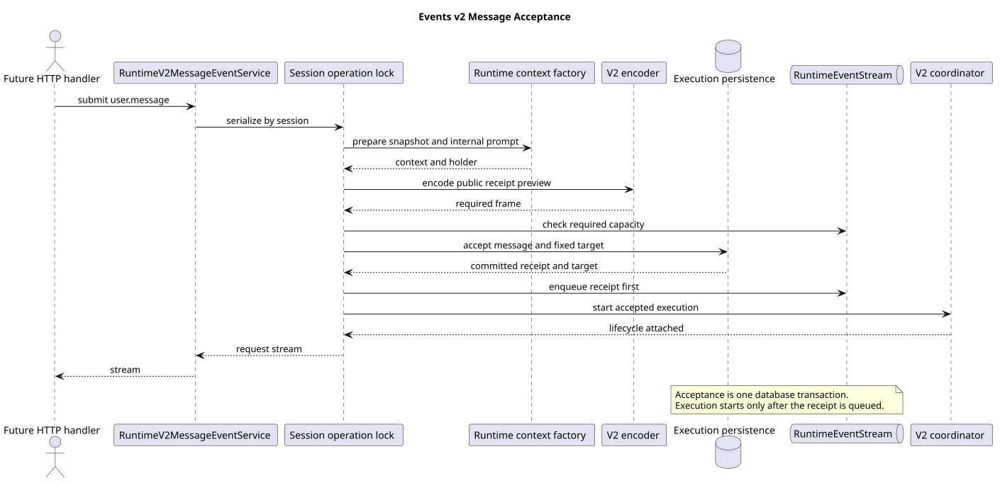

# Events v2 普通消息受理

| 属性 | 值 |
|---|---|
| 版本 | 1.0.0 |
| 日期 | 2026-09-08 |
| 契约基线 | `pi-mono-java-design@2ee2a3211da68ad87b0d9cab353e691b00bdaebd` |
| Java 变更前基线 | `pi-mono-java@ba9e497cd608fade88c97825bbd1d4b71a1c9e0e` |
| 实现提交 | `346d7f8fb16b4202e12dc6331b585d3921bec0c4`；回归补齐 `ea202d17`；夹具适配 `0bfd24a5` |
| pi 源码基线 | `pi-mono@4af9d21d3b4d664e4a29fcabfec85171077248e3` |
| 单片 HTTP 状态 | 未启用；本片新增应用 Service，生产 Controller 仍由后续统一接入片切换 |

## Context

Events v2 要求 `user.message` 完整回执成为请求流首帧，并以该回执的 `eventId` 固定根执行身份。
运行前还要完成 Session 空闲校验、Agent/模型快照准备、附件恢复和响应容量预检。回执一旦提交，后续启动失败
必须按已接受执行收尾，不能再映射为普通接纳失败或释放成未接受状态。

本片实现普通消息应用受理链，但不单独改变 HTTP 路由。这样可以先验证事务、流顺序和失败边界，再由统一
Events 接入片同时切换严格联合请求、data-only SSE、GET 历史和旧控制路由。

## 源码证据与分类

| 分类 | 仓库相对路径与符号 | 观察、决定和理由 |
|---|---|---|
| 已确认契约 | `01-总体架构/01-CampusClaw多Agent运行时/chat-events-v2-design.md`、`chat-events-v2-stream-design.md`，以及 `接口契约-v2/操作/01-submit-session-event.json` | `user.message` 回执先行，`sourceEventId` 使用根消息事件身份，完整事件进入权威历史 |
| 变更前 Java | `modules/coding-agent-cli/src/main/java/com/campusclaw/codingagent/runtimeapi/event/RuntimeEventService.java#prepareAndSubmitLocked` | 旧链先输出配置事件，且接纳与启动异常边界不能可靠区分 |
| 本片实现 | `modules/coding-agent-cli/src/main/java/com/campusclaw/codingagent/runtimeapi/event/RuntimeV2MessageEventService.java#submit/submitPreparedMessage` | 普通请求与预准备消息共用一个受理顺序；公开文本和内部展开正文使用不同参数 |
| 本片实现 | `modules/coding-agent-cli/src/main/java/com/campusclaw/codingagent/runtimeapi/persistence/RuntimeExecutionPersistenceService.java#acceptMessage` | Entry、公共 `user.message`、完整性标记、根执行和初始结果段在同一事务形成 |
| 本片实现 | `modules/coding-agent-cli/src/main/java/com/campusclaw/codingagent/runtimeapi/event/RuntimeEventStream.java#canAcceptRequired` | 在数据库受理前预检完整回执能否进入有界响应队列 |
| 后续依赖 | `modules/coding-agent-cli/src/main/java/com/campusclaw/codingagent/runtimeapi/event/RuntimeV2ExecutionCoordinator.java#start` | 回执成功排队后才启动 Agent；已接受启动失败由固定终态链提交 failed idle |
| pi 观察 | `packages/agent/src/agent-loop.ts#agentLoop/runAgentLoop` | pi 从调用方给出的 prompt 启动内存事件循环，没有 CampusClaw 的 HTTP 回执、公共事件事务或固定执行表 |

Java 的先回执事务和固定执行身份属于 CampusClaw 架构变化。普通用户文本可以直接公开；Skill 展开正文可能包含
受管内容，因此只把原始调用文本传入公共回执，展开后的正文仅进入内部执行上下文。这一差异属于安全加固。

## 关键定义与数据流

- `RuntimeUserMessageDTO.publicText` 是可进入公共 `user.message.content` 的安全文本。
- `RuntimeExecutionContextDTO.message` 是实际送入模型的正文，可以由可信 `messageFactory` 展开。
- `UserMessageAcceptanceDTO.target` 固定 `sessionId/executionId/rootEventId/segmentId`；其中
  `rootEventId` 等于已提交回执的 `eventId`。
- 完整回执先由 `RuntimeV2EventEncoder` 编码和容量预检，再由事务写入并使用数据库回填的序号入队。

[PlantUML 源码](diagram.puml#L1)

只有回执成功排队后才调用协调器。准备或事务受理失败会关闭尚未接受的 Holder 和响应；事务已经成功后，启动、
监听器或调度异常进入已接受失败收尾，不重新调用接纳失败映射。响应断开只移除请求输出，不取消已经接受的 Agent
工作；完整输出仍由执行投影与权威持久化链处理。

## 设计决策

见 [ADR-0096](../../decisions/0096-accept-runtime-message-before-execution.html)。采用“准备快照、预编码回执、
原子受理、回执入队、启动执行”的顺序。若先启动再回执，模型输出可能抢在回执之前；若准备前就写 running，
无可用 Agent 或模型也会留下已接受执行；若公开正文直接复用内部展开正文，Skill 调用会泄露受管内容。

## 边界、DFX 与契约影响

- Session 不存在、非 idle、附件或运行快照不合法时，在受理事务前失败。
- 回执超过单事件或当前响应队列上限时不写数据库；容量使用实际 data JSON 的 UTF-8 字节数。
- 事务接受后生成的 `rootEventId` 不重用，后续中断必须显式引用该身份。
- 配置校准事件只进入权威历史，不插入本请求回执之前。
- 操作锁按 Session 串行受理，执行容量仍由 `RuntimeSessionEngineRegistry` 统一限制。
- 本片不新增线程、数据库表或 Maven 依赖，也不启用新的 HTTP 请求结构。

## 测试与验证

本片独立执行 `RuntimeV2MessageEventServiceTest` 8 项和 `RuntimeV2ExecutionCoordinatorTest` 12 项，
共 20 项通过。前者覆盖消息受理，后者作为已接受失败与执行启动边界的联合回归。覆盖：

- 回执在协调器启动前进入响应队列，配置校准不会抢占首帧；
- 公开文本与内部展开正文分离；
- 文本块与多个附件保持请求顺序，斜杠前缀文本仍按普通消息处理；
- 执行容量已满或模型校准失败时，受理事务和协调器均不启动；
- 回执预检失败时数据库零调用并释放未接受资源；
- 事务提交后流意外关闭时仍进入已接受失败收尾，不重复接纳或按未接受路径释放；
- 启动失败的中英文公共错误文本固定且不包含私有异常详情，结构化日志保留诊断异常。

该 20 项是 Message 与其直接执行边界的单片验证，不包含 Controller、跨实例中断或工具确认。完整 HTTP 进程验证属于后续统一接入片。
Maven 测试同时执行 Checkstyle；`spotless:check` 和 `git diff --check` 通过。企业镜像由发布集成统一生成，
本片没有独立验证企业 `NativeParent` 编译。

## 版本历史

| 版本 | 日期 | 变更 |
|---|---|---|
| 1.0.0 | 2026-09-08 | 实现普通消息原子受理、首回执顺序和公开/内部文本隔离 |
